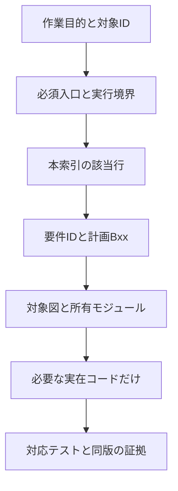

# 2D / 3D 構成と最小読取の入口

版: 0.1.0 / 2026-10-03 JST。監査基準 main: `eabbeff3062c24a0d72d23df63d45433274af717`（要件 #294・計画 #295 merge 後）。状態: **第三段階の関係図案。B01のnative基盤を追加中。画面・renderer・GLB・実機合格の証拠ではない。**

## 入口と正本

[要件](../../THREE_D_PRODUCT_REQUIREMENTS_2026-10-03.md) → [実装計画](../../THREE_D_IMPLEMENTATION_PLAN_2026-10-03.md) → 本索引 → 対象図 → [要件からファイルへの対応](traceability.md) の順に必要部分を読む。要件の受入条件と計画のBxx/DEC/Fxx/Txxを複製して別仕様にしない。

文字版: 作業目的 → 指示・実行境界 → 本索引 → 該当要件と計画工程 → 関係図 → 所有コード → 対応検査。これは文書の読取経路であり、runtimeのimport graphではない。

初回の必須入口は [AGENTS](../../../AGENTS.md)、[README](../../../README.md)、[開発モード](../../DEVELOPMENT_MODES.md)、[既存要件](../../REQUIREMENTS_SPECIFICATION.md)、[既存計画](../../IMPLEMENTATION_PLAN.md)。変更がない同一revisionの再読を機械的に繰り返す必要はない。新3Dの現在の方向は新要件と計画を優先し、旧文書の「検品だけ」を制作完成条件へ戻さない。

## 作業別の必要読取

| 作業 | まず読む図 | 要件と計画の範囲 | 条件付き追加 |
| --- | --- | --- | --- |
| トップ・別タブ・配信 | [入口とbundle](entries.md) | NAV/COMPAT、B02、DEC-08 | 2D App、Vite、Pages assemble、T00/T04/T11 |
| ファイル配置・依存方向 | [所有と階層](ownership.md) | DOC、B00〜B10の対象工程 | 対象モジュールの直接依存とcontract |
| 正本・Undo・保存・復旧 | [データ経路](dataflow.md) | SAVE/EDIT、B01、DEC-02/03 | F08〜10、T01/T02/T08、2Dは比較対象のみ |
| import・権利・拒否境界 | [データ経路](dataflow.md) | IMP/SEC、B03/B08、DEC-06 | 原本とprofile、F07、T03/T12 |
| mesh・material・rig・key | [所有と階層](ownership.md) と [データ経路](dataflow.md) | MODEL/MAT/RIG/ANIM、B04〜06 | 座標/属性契約、F01〜05/F12、T01/T05/T07 |
| GLB・metadata・consumer | [データ経路](dataflow.md) | EXP/GAME、B07/B08、DEC-06/07 | F01〜07/F10、T08/T09、保持/損失表 |
| 背景・GPU・mobile | [資源寿命](lifecycle.md) | LIFE/PERF/UX、B03/B09、DEC-05/09 | F08/F09/F12/F13、T06/T07/T10 |
| 更新・rollback・診断 | [資源寿命](lifecycle.md) | OPS、B10 | F10/F11、T11/T12、[R01検査](../../R01_DEVELOPMENT_WORKFLOW.md) |
| 要件漏れ・提出判定 | [全169要件の配置対応](traceability.md) | 該当ID→Bxx→Fxx/Txx→AC | [レビュー記録](review.md)、現SHA検査証拠 |

対象範囲を広げる条件: shared contract変更、保存schema/参照変更、entry境界変更、外部入力decode、fixture期待値変更、未知の依存。これらは呼出元・利用先と関連要件へ一段ずつ広げる。語句が似ているだけで全旧Phaseや全3D文書を読まない。名称D3の既存2D consumerを3D runtimeと混同しない。

## 表記と変更規則

- E = 基準mainに実在するpath。P = 今回提案する将来path。D = 本PRで追加する文書。Pには存在しないファイルへのリンクを付けない
- Mermaidは小さい縦図に分割し、各図に同じ意味の文字版を置く。色だけでE/P・状態・失敗を区別しない。iPhoneでは本文の文字版から追える
- node IDは図ごとに `EN_ / OW_ / DF_ / LC_ / RD_` を使う。labelやpathを変えても意味が同じならIDを維持。意味を変える場合は旧ID→新IDをレビュー記録に残す
- 実装でPが実在になったら、同じPRでE化、リンク、要件→所有、import graphと実network、検査証拠を更新。予定図を放置して「実装済み」と扱わない
- 技術選択は計画DEC、要件は要件本文、配置と依存は本図、合否は対象SHAの証拠が正本。矛盾は上位へ戻し、図だけで要件を縮小しない
- ハーネス `50229ded69378ed6392453e73856482eb78b7354` はbatch検査の固定参考。Studio採用版は未確認。全体upgrade・他作品pinの流用は行わない
- 計画G01はmerge済み。本図受理がG02。G00の実行境界確認、G03a/b/cの候補評価・採用、実機と出力検証は別gate。文書mergeで実行制限を解除しない

改訂0.1.0: 現状と予定を分け、入口・所有・データ・資源・読取・169ID対応を追加。レビュー履歴は [review](review.md)。

B01の実在fileと検査範囲は [所有台帳の実装状況](ownership.md#b01で実在になった配置) と [B01記録](../../evidence/3d/B01.md) を参照。

B02実装: [独立入口・保存shellの証拠と残項目](../../evidence/3d/B02.md)。入口の実装と、未完成の3D制作機能を区別する。

B03 native表示の[限定採用・受入証拠](../../evidence/3d/B03_NATIVE_VIEWPORT.md)。GLB・skin・clipなどの未確認gateを同時に完了扱いしない。

B03の[数値camera・投影・観察表示](../../evidence/3d/B03_NATIVE_INSPECTION.md)は同じnative限定gateで検査する。gizmo・GLB・制作全体の完了とは扱わない。

B04の[native造形・材質の部分実装と受入境界](../../evidence/3d/B04_NATIVE_AUTHORING.md)。triangle meshの数値編集と既存factorを扱い、GLB・texture・保存contract拡張は別の未完gateとして残す。
