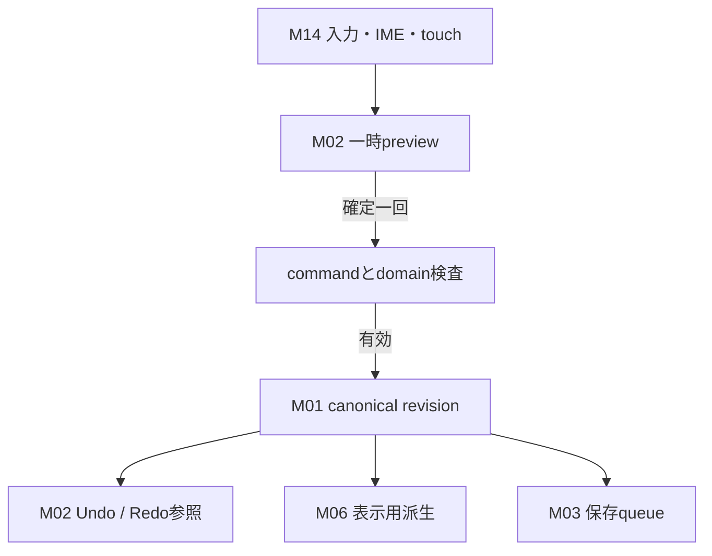
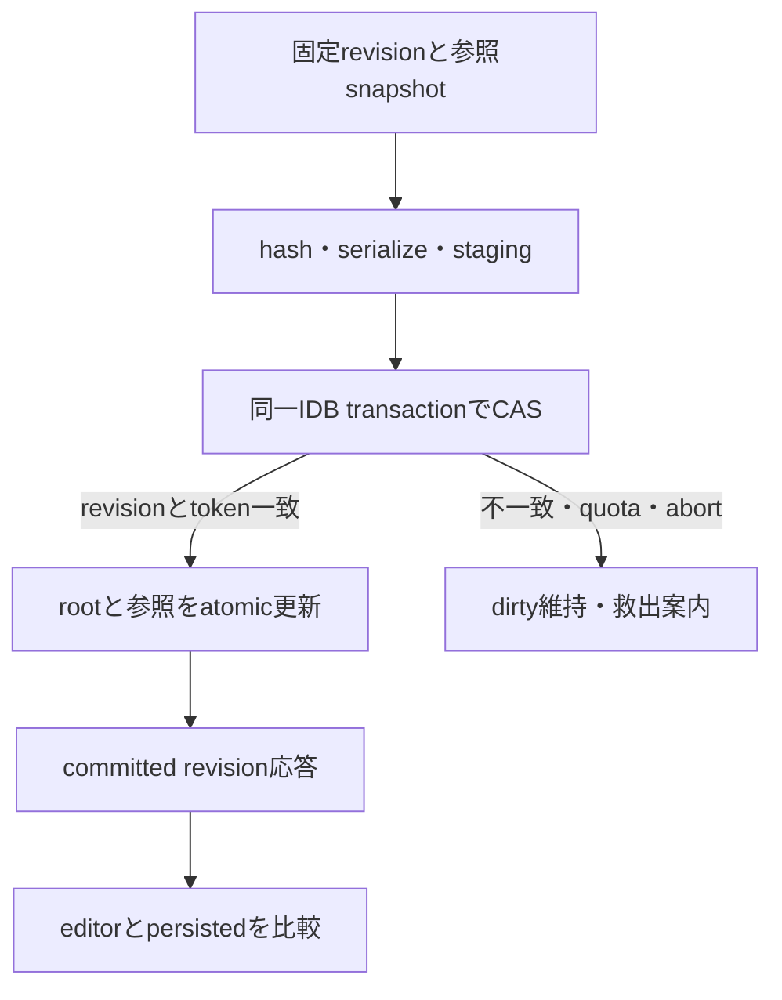
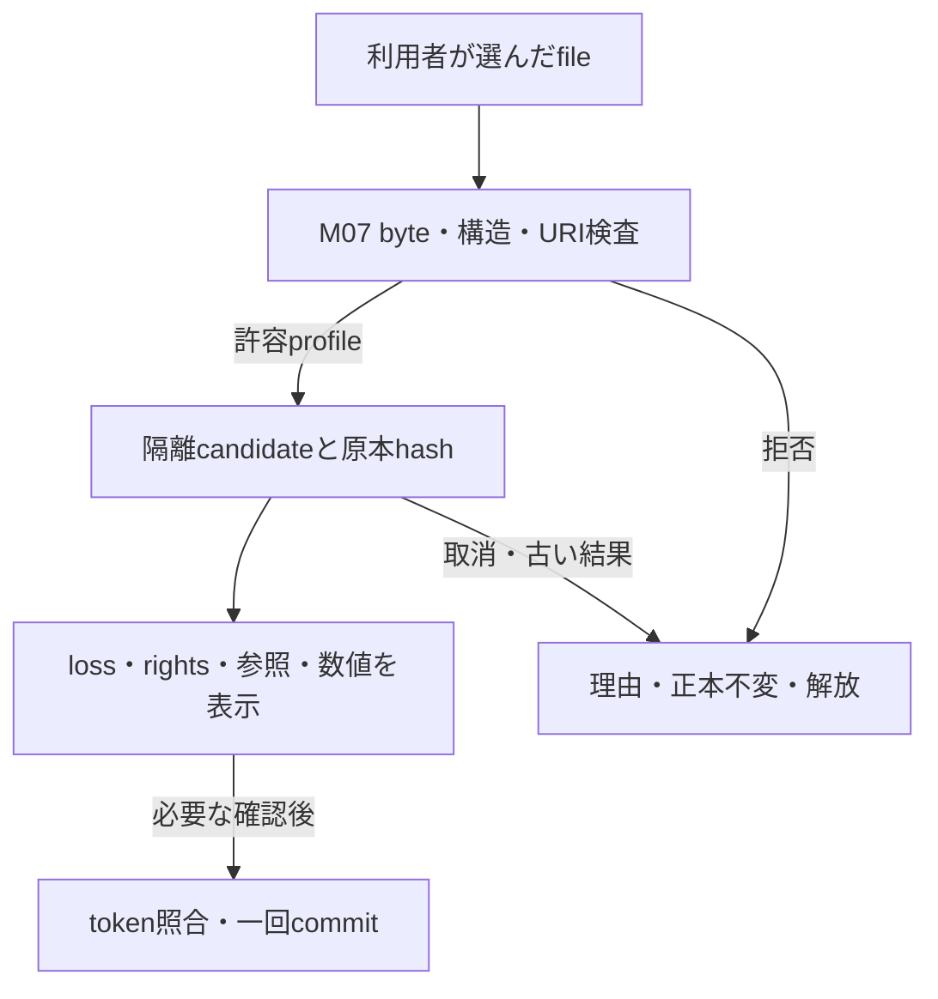
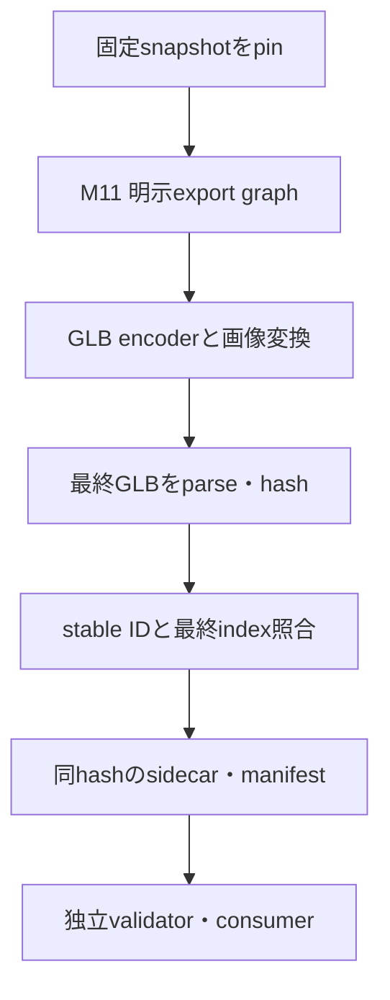

# 正本・保存・入出力の関係

[索引へ](README.md)。全図はP設計。group所有は [所有台帳](ownership.md)、要件詳細は [169ID対応](traceability.md)。矢印はデータ/処理の順序であり、静的importを許可する図ではない。

## DF-01 制作とUndo

文字版: 入力→preview→検査→一回の正本commit→history/表示/保存。取消・pointercancel・IME未確定は正本へcommitしない。dragの毎frameやscrubを勝手にUndo/keyへ追加しない。Undo/Redoも新しいeditor revisionとなり、保存済みrevisionの単純な巻戻しにしない。

M08 meshの頂点/面/corner属性、M09 rest/bind/weight、M10 clip/keyは正本内で参照整合を保つ。bind済みtopology変更は拒否または元skin/clipを保持した明示派生unbind。rig削除・reparent・pivotでskin/clip/anchorを孤立させない。各失敗はcandidateを破棄し元revisionを維持する。

## DF-02 durable saveと参照保護

文字版: 正本snapshot→transaction外で重い準備→staging完備→同一transactionでexpected revision/fencing照合とroot/参照更新。失敗時は旧rootを維持。応答Aが遅れても編集Bをsavedにしない。別tabのstale writerは上書きせず別IDの救出へ進む。lease期限・時計だけを正しさの根拠にしない。

GCは M03 が所有し、root / recovery / trash / Undo / Redo / backup / export / read snapshotのpinを生存集合に含める。mark後再参照を防ぐため、delete transaction内で参照とepochを再検証する。実行中pinを時刻だけで失効させず、crash後整理にはfencingと再照合が必要。stagingの孤立回収と利用者project削除は別操作。既存2D DBへGC/flushを波及させない。

## DF-03 importと復元

文字版: 外部file→raw preflight→隔離candidate→保持/損失/権利検査→正本へ採用。GLTFLoaderに渡す前にrequired extension、URI、accessor範囲、有限/非負weightsを検査する。libraryのwarningや自動正規化を検査合格にしない。外部URI・任意script・shaderを実行せず、禁止入力をCDN取得で回避しない。

backup復元はM04が別入口で同じbounded原則を使う。manifest/version/hash/全blob/参照を確認し、未来schemaや誤domainは変更前に拒否。ID衝突は上書きせず明示別IDまたは取消。network・元path・元storageなしで再編集できる全素材を含む。保存backupはGLBやsidecarだけで代用しない。source-only素材の埋込rightsと利用者申告は別々に保持し、VRM等の権利条件を申告で上書きしない。

## DF-04 実GLBとsidecarの確定

文字版: snapshotをpin→helperを除いたexport graph→自己完結GLB→最終バイトをparse/hash→最終index mapping→同じhashを持つsidecar→独立検証。見た目だけ変更して原本GLBをコピーした出力は不合格。表示非表示、clips、TRS、maxTextureSize等を暗黙のexporter既定値へ委ねず、予期したchannel/個数と最終出力を照合する。

生成中の編集は新revisionで継続できるが、出力対象revisionを表示する。原本不変、GLB実変化、key/skin数値、texture色/alpha、二重transformなしをF01〜06と計画§8.3で測る。A GLBとB sidecarの取り違えはhash/mapping照合で拒否。duration/loop等のproject方針とbare GLBの表現差をsidecarへ明示する。

取消・失敗・stale結果はcandidate/outputを採用せず、worker/URL/temporary bufferとpinを解放する。worker export/画像encoding/取消はS04未実証であり、図の存在で成立済みにしない。独立consumerも候補版/license/配布物の採用gateを経る。

## DF-05 データ種別を混ぜない

| 種別 | 所有 / 寿命 | 保存・出力 |
| --- | --- | --- |
| 原本source | M01/M03 immutable hash | backupでbyte保持、GLBは編集後派生 |
| canonical geometry/rig/key | M01と各domain、revision | backupで再編集可能。GLBは対応subset |
| UI selection/camera/preview | M14 session | 任意session復元。確定前previewを正本へ混入しない |
| Undo/Redo | M02、GC参照保護 | 初版backupの履歴保持保証外。復元後編集機能は保持 |
| GPU/bitmap/render geometry | M06再生成可能cache | 保存正本にしない。owner解放 |
| export snapshot・pin | M11 job | 出力確定/失敗/取消まで保持 |
| 検品結果 | M12、入力revision/hashに従属 | staleなら再検査、古いverifiedを使わない |

空→primitive→mesh編集→smooth skin混合weight→key/clip→backup→独立復元→GLB/sidecar→独立consumerがFLOW-01〜04の実証経路。各工程のviewer表示だけを完了証拠にしない。
