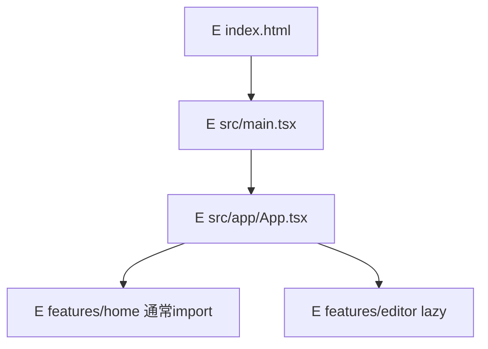
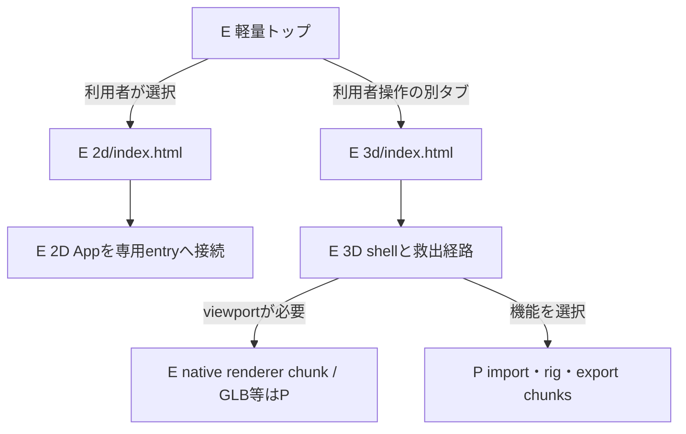
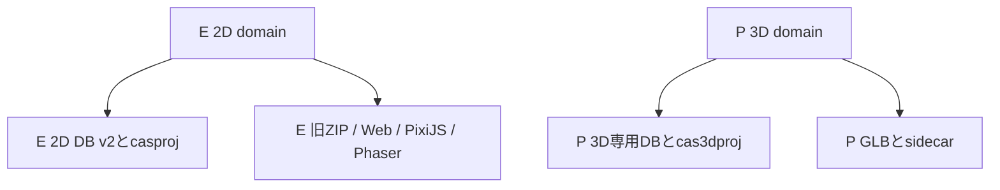

# 入口・bundle・2D互換の関係

[索引へ](README.md)。E/P表記は索引を参照。関連: NAV-01〜08、COMPAT-01〜06、B02、DEC-08、T00/T04/T11。

## EN-01 B02以前の単一entry（履歴）

文字版: index → main → App → home、editorはlazy。AppはuseStateでhome/editorを切り替え、調査したentryにquery/hash routerはない。既存rootを架空のdeep-link契約へ置き換えない。実在: [main](../../../src/main.tsx)、[App](../../../src/app/App.tsx)、[Vite](../../../vite.config.ts)。

## EN-02 B02の独立entryと後続runtime

文字版: トップは2Dと3Dへの実リンクだけを持つ。2Dは現行Appを独立entryで利用。3Dはshellとnetwork不要backupを先に準備し、viewport・import・export等を必要時に取得する。矢印の「選択」はbrowser navigationでありhubの静的importを許可しない。3Dリンクは利用者gestureとnoopener相当、popup拒否は再操作/URL案内。同タブへの無断切替をしない。

### build所有表

| 状態/path | 所有 | 許可する依存 | 検証 |
| --- | --- | --- | --- |
| E `index.html`、E `src/entries/hub.tsx` | B02 hub | 小さな入口UI、純粋なURL/表示契約 | 2D/3D editorとworker、sample、decoder取得0 |
| E `2d/index.html`、E `src/entries/2d.tsx` | B02 2D entry | E `src/app/App.tsx` と2D domain | 3D chunk/preload/prefetch/init 0 |
| E `3d/index.html`、E `src/entries/3d.tsx` | B02 3D entry | E shell、ready済みbackup | 2D editor/image worker取得0 |
| E `vite.config.ts` | B02 build | entry別output、base、revision | manifestの静的/動的推移依存と実networkを両確認 |
| E `tools/pages/assemble.mjs` | B02 配信組立 | hub/2d/3d/guide/h3成果物 | base配下direct/reload/戻る/進む、404検査 |
| E `src/workers/imageOps.worker.ts` 等 | 2D owner | 2Dのみ | 3D shellから起動しない |
| P `src/core3d/workers/` | 3D job owner | 3D job契約、限定変換 | 不使用時取得0、cancel時terminate/解放 |

React等の小shared chunkは内容と到達元を説明する。共有barrelから両editorをexportしない。CSS・asset URL・modulepreloadも依存監査に含む。code splittingという名前だけでは合格しない。

## EN-03 互換境界

文字版: 2Dと3Dは保存・出力を独立所有する。共通origin quotaは共有し得るがDB全体を共通flush/clearしない。2D DB名/version・casproj・旧ZIP・Asset0.2.0は変更せず、3Dのproject版と混同しない。3Dから2D素材を選ぶ将来連携も明示copy/rights契約が必要で、同じmutable objectを共有しない。

別タブは合計memoryの削減を保証しない。両tabがactiveの場合の合計、背景停止、手動休止、復帰peakは [資源図](lifecycle.md) で別に管理する。

B02の実装・検査範囲は[証拠記録](../../evidence/3d/B02.md)を参照。B03のnative rendererは[限定評価・採用記録](../../evidence/3d/B03_NATIVE_VIEWPORT.md)を参照。GLB/rig等の未採用chunkはPのままであり、図の接続だけで完成扱いにしない。
