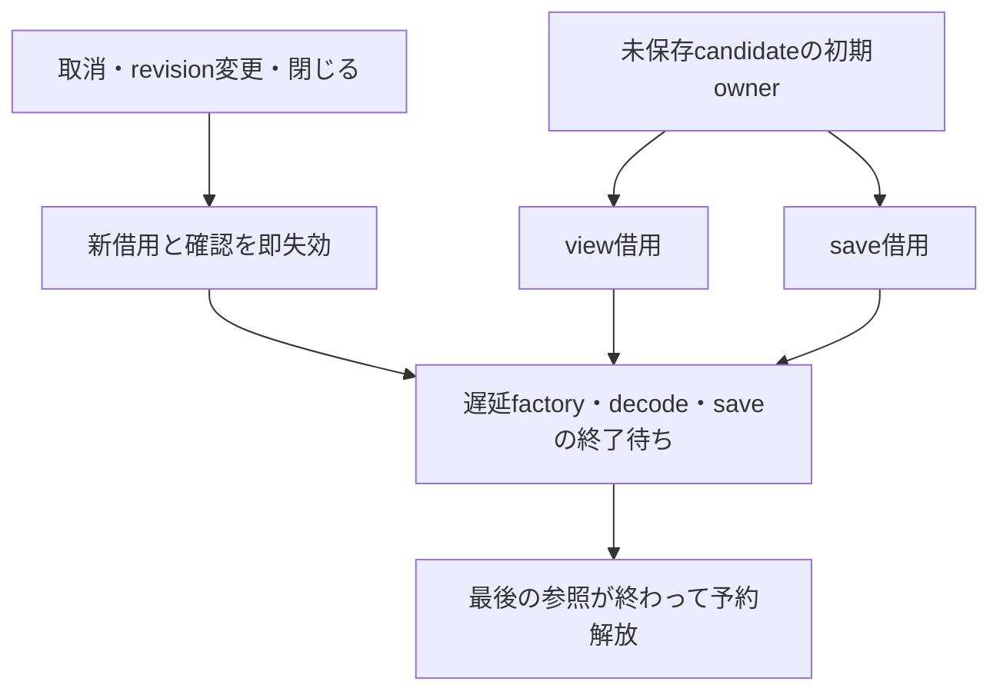
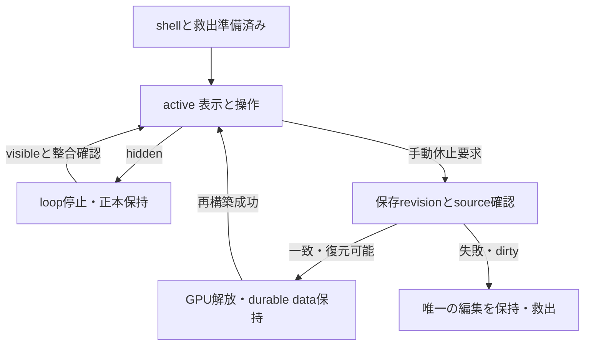
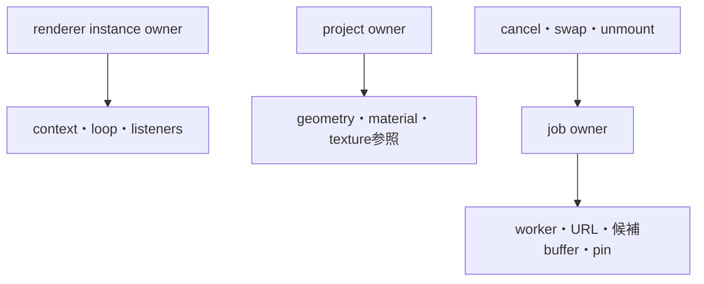
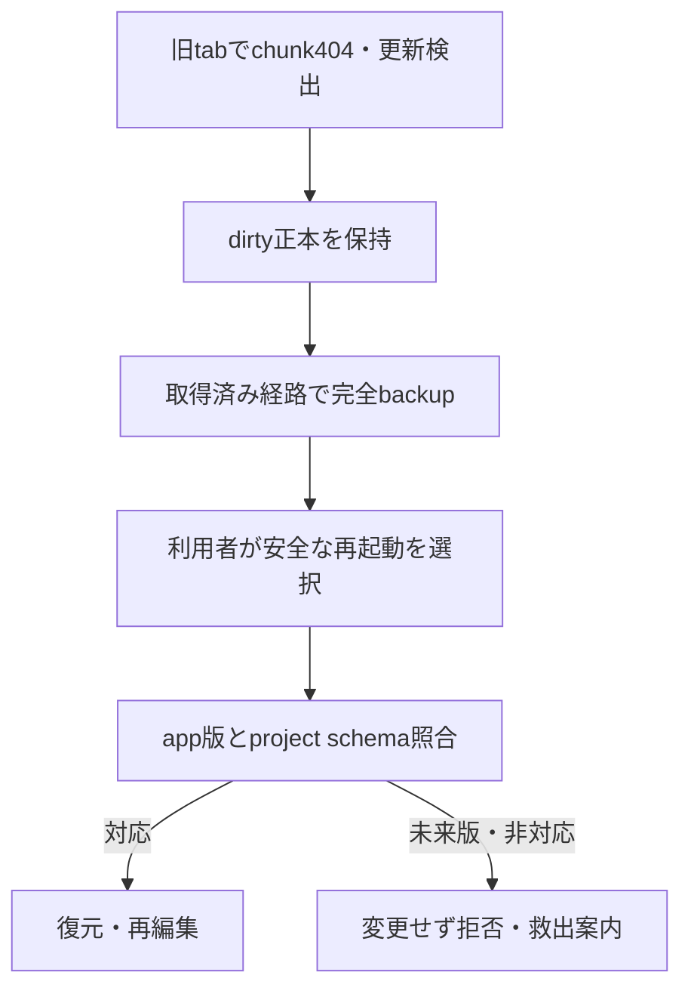

# 資源寿命・背景・更新復旧

## 現在の資源所有 local candidate

以下の現在表は索引のローカル基点を対象とする。LC-01〜03と旧設計表は履歴として残す。特に旧表の「snapshot exportは継続可能」は許容案であり、現在のNativeAssetIoPanelはhidden/freeze/pagehideで処理・未保存候補を取り消す。

| owner | 実在する主担当 | 保持と解放の境界 |
| --- | --- | --- |
| canonical/history/current binary | [ProjectSession](../../../src/features/editor3d/projectSession.ts)、[history](../../../src/core3d/commands/history.ts)、[sessionLifetime](../../../src/features/editor3d/sessionLifetime.ts) | child view例外で唯一のCPU原本を捨てず救出へ。保存失敗ではdirtyを保持 |
| durable roots/recovery/trash/pins/staging/history refs | [repository](../../../src/core3d/storage/repository.ts) | GCはwrite transaction内で再照合。自動的な旧版/ごみ箱永久消去ではない |
| GPU/framebuffer/geometry/helper | [renderer](../../../src/adapters3d/three/renderer.ts)、[render profile](../../../src/core3d/profile/renderProfile.ts) | project/context/view寿命を分離。groundは表示専用でexport対象外 |
| encoded input/decoded texture cache | [nativeImage](../../../src/features/editor3d/nativeImage.ts)、[textureSnapshot](../../../src/features/editor3d/textureSnapshot.ts) | abort要求だけで解放済みとせず、遅延decodeの実終了までowner保持 |
| asset worker/output/download URL | [assetIoClient](../../../src/adapters3d/gltf/assetIoClient.ts)、[NativeAssetIoPanel](../../../src/features/editor3d/NativeAssetIoPanel.tsx) | worker取消とowner解放、URL期限/閉じる/pagehideでrevoke。download開始は外部保存完了でない |
| 未保存GLB候補/preview/save borrow | [importReview](../../../src/features/editor3d/importReview.ts)、[importPreview](../../../src/features/editor3d/importPreview.ts) | disposeは新借用を即拒否し、最後のdecoder/view/save borrowerの終了まで予約保持 |
| 同一realm内の共通見積り | [resourceLedger](../../../src/core3d/profile/resourceLedger.ts) | 6categoryの256MiB見積り上限。別tab/workerの合算、実heap、GPU空き容量を測定した値ではない |
| motion/更新/診断 | [motionPreference](../../../src/features/editor3d/motionPreference.ts)、[updateInformation](../../../src/features/editor3d/updateInformation.ts)、[診断UI](../../../src/features/editor3d/NativeDiagnosticsPanel.tsx) | OS reduced-motion変更で再生停止、勝手に再開しない。更新は明示確認、診断は自動送信しない |

文字版: 未保存候補の初期ownerから表示と保存が借用する。取消で新借用と同期確認gateを即失効させるが、実際に終わっていないdecoderや保存が使う元bufferは保持する。renderer readinessのReact表示更新だけに保存権限を委ねない。遅れて完成したfactoryは破棄し、新しい候補のhostを乗っ取らない。

原本保持/履歴予算/候補borrowのunit成功は物理RAMやGPU解放の実測ではない。[受入境界](../../evidence/3d/ACCEPTANCE_GAPS_2026-10-10.md)と[固定台帳](../../evidence/3d/ACCEPTANCE_STATUS_2026-10-10.md)を読み、OS kill/実BFCache/同時tab/実機計測の未確認を残す。

[索引へ](README.md)。以下のLC-01〜03は初期P状態設計の履歴。M06/M13/M15/M16所有。LIFE/PERF/SAVE/UX/OPSとB03/B09/B10、DEC-05/09を接続する。browserのfreeze/OS kill通知は保証されない。

## LC-01 表示状態とdurable dataを分ける

文字版: shellは編集を受け付ける前にnetwork不要の完全backup経路を準備。hiddenではrender/animationを止めるが正本は保持。初版の休止は手動要求→最新保存成功とsource保持確認→GPU等を解放。dirty/保存失敗なら唯一の編集を保持し救出を案内。休止からの復帰はcanonical snapshotから再構築し、失敗時はshell+backupに留まる。

hidden、GPU休止、component/project破棄、ユーザーdata削除は別概念。時間経過だけの自動data破棄はしない。projectを閉じる場合も未保存の処置を明示し、保存完了を推測して破棄しない。context lossは描画停止→正本/保存保護→再構築または救出。context restoreで新たなinput commandを勝手に発火しない。

## LC-02 owner別の解放

文字版: renderer instanceがcontext/loop/listener、projectが描画資源参照、jobがworker/temporary URL/buffer/pinを所有。shared texture等だけref countし最後のownerが解放。shared資源を一meshのunmountで先にdisposeしない。pin解放はGCの参照再検証と組にする。

| 事象 | render/input | save・job | 復帰/検査 |
| --- | --- | --- | --- |
| hidden | render/animation停止、drag取消 | saveは実行可能なら継続。import/rigはcheckpointまたはcancel | visible時token/revision確認、二重loop禁止。再生clockをリセットし背景時間分を一度に進めない |
| export中にhidden | renderとは独立したsnapshot処理 | snapshot上のexportは継続可能だがfreeze中の完了を保証しない。取消では部分出力を完成file扱いしない | 完成後も利用者の再gestureでdownloadを案内し、自動popup再試行をしない |
| file picker / download中断 | 編集stateを保持 | picker取消と保存完了を区別。download開始だけでdurable save成功や外部保存完了を宣言しない | 利用者が再操作可能。失敗・取消後もbackup/sourceを保持 |
| freeze / BFCache | callback実行を期待しない | 完了期限を保証しない | pageshow等でdurable revision再照合、listener重複なし |
| context loss | GPU参照の有効性を無効化 | CPU正本とbackup保持、job採用を再検査 | snapshot再構築、失敗は救出shell |
| project swap | 前projectの入力/loop停止 | 古job結果をproject/revision/job/tokenで拒否 | 未保存処置後にowner解放、次projectへ漏れなし |
| cancel | 表示をcancelledへ | job停止、staging未採用、pin/URL解放 | 正本/旧root不変、freeze時間と取消時間を区別 |
| OS kill / tab discard | 最終callbackなしの場合あり | 最終未保存分の復旧を保証しない | 起動時durable snapshotと復旧候補を提示、無言の空project禁止 |

## LC-03 更新とrollback

文字版: 更新失敗→dirty保持→network不要backup→利用者の再起動選択→schema照合。旧appへ配信rollbackしてもDB/schemaを無断downgradeしない。旧appが新版projectを読めない場合は拒否と救出を案内。本番rollback操作は別判断。設定リセットやcache purgeでprojectを消さない。

## memory・mobile受入の観察点

- tab別だけでなく2D+3Dの合計を計測。別タブ化だけで総memory低下と報告しない
- source、decode、GPU推定、Undo、candidate、export copyと復帰peakを分ける。観測不能なGPU/free RAM値はunknown、0にしない
- M15の同一profileをUI/validator/worker/export/testで参照。通常・境界・超過・combined peakをF13で検査し、性能予算は計画§7の実測前提案として維持
- phoneでもlist/数値入力から造形・manual weight・keyへ到達。touchcancel/IME/向き変更/focus復帰をM14で扱う。表示を小さくしただけでmobile完了にしない
- 20回交換/開閉のowner数、同origin quota、初回offline backup、OS中断、再構築時peakをB03以降累積確認。物理端末未検証はblocked、headless結果で代替しない
- 同一SHAのfixture hash・環境・raw値・画像・出力hash・未観測を証拠に残す。診断に素材や個人pathを自動添付しない
