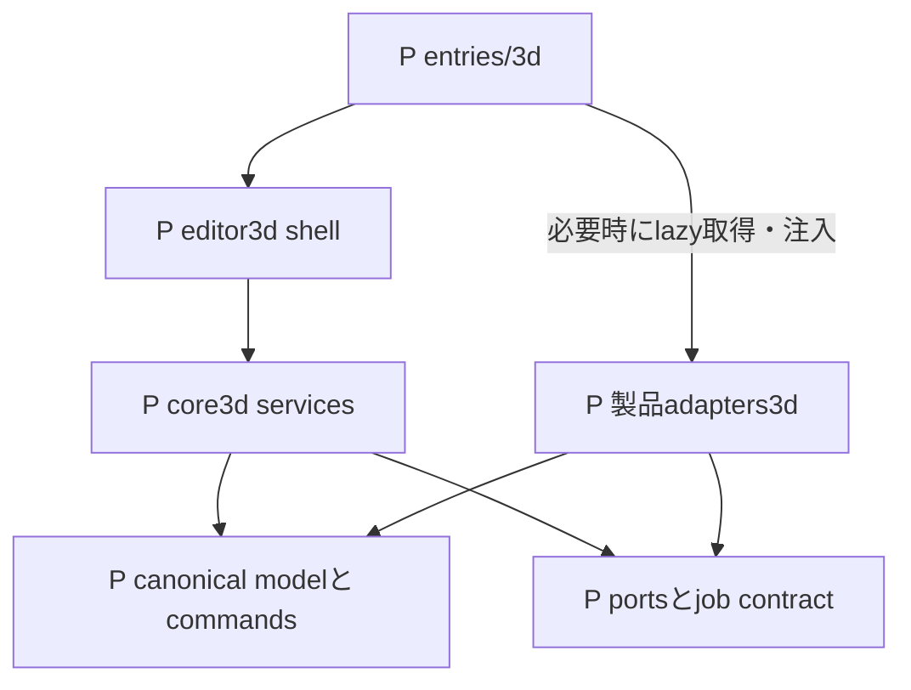

# ファイル階層と責務の所有

## 現在の実在対応 local candidate

対象は索引のローカル基点。初期M00〜M17の責務IDは維持し、予定どおりに分割しなかったfile名を存在するかのように扱わない。以下のLはmain統合済みを意味しない。

| group | L 実在する主ownerと最小読取                                                                                                                                                                                                                                                                                         | 初期Pとの差分                                                |
| ----- | ------------------------------------------------------------------------------------------------------------------------------------------------------------------------------------------------------------------------------------------------------------------------------------------------------------------- | ------------------------------------------------------------ |
| M00   | [GLB採用](../../evidence/3d/S04_GLTF_ADOPTION.md)、[独立consumer採用](../../evidence/3d/B08_BABYLON_ADOPTION.md)                                                                                                                                                                                                    | 単一adoption.mdへ集約していない。実機受入とは別              |
| M01   | [project](../../../src/core3d/model/project.ts)、[coordinates](../../../src/core3d/model/coordinates.ts)、[editability](../../../src/core3d/model/editability.ts)                                                                                                                                                   | schema.ts予定の検査はproject等が所有                         |
| M02   | [history](../../../src/core3d/commands/history.ts)、[commands](../../../src/core3d/commands)、[階層複製](../../../src/core3d/commands/hierarchyClone.ts)                                                                                                                                                            | command.ts単一dispatchではなくcommand別module                |
| M03   | [repository](../../../src/core3d/storage/repository.ts)、[db](../../../src/core3d/storage/db.ts)、[saveQueue](../../../src/core3d/storage/saveQueue.ts)、[autosave](../../../src/core3d/commands/autosave.ts)                                                                                                       | staging/pins/gcはrepository内。新しい同名fileを前提にしない  |
| M04   | [backup](../../../src/core3d/backup/backup.ts)、[保存版のbackup](../../../src/core3d/backup/repositoryBackup.ts)、[旧版copy](../../../src/core3d/storage/legacyMigration.ts)                                                                                                                                        | restore.tsを別途作っていない                                 |
| M05   | [3D entry](../../../src/entries/3d.tsx)、[shell](../../../src/features/editor3d/Editor3DShell.tsx)、[sessionLifetime](../../../src/features/editor3d/sessionLifetime.ts)                                                                                                                                            | fallbackとCPU素材保全を表示ownerから分離                     |
| M06   | [renderPort](../../../src/core3d/ports/renderPort.ts)、[renderer](../../../src/adapters3d/three/renderer.ts)、[viewport UI](../../../src/features/editor3d/NativeViewportPanel.tsx)、[画像準備](../../../src/features/editor3d/textureSnapshot.ts)                                                                  | renderer resourceはrendererと共通ledgerで管理                |
| M07   | [preflight](../../../src/core3d/import/preflight.ts)、[GLB import](../../../src/adapters3d/gltf/import.ts)、[候補owner](../../../src/features/editor3d/importReview.ts)、[保存前view](../../../src/features/editor3d/importPreview.ts)                                                                              | 製品は独自bounded decoder。GLTFLoaderを前提にしない          |
| M08   | [primitives](../../../src/core3d/commands/primitives.ts)、[mesh](../../../src/core3d/commands/meshEditing.ts)、[material](../../../src/core3d/commands/materialEditing.ts)、[texture](../../../src/core3d/commands/textureEditing.ts)                                                                               | mesh/material予定directoryではなくcommands配下               |
| M09   | [rig authoring](../../../src/core3d/rig/authoring.ts)、[pose](../../../src/core3d/rig/pose.ts)、[rig UI](../../../src/features/editor3d/NativeRigPanel.tsx)                                                                                                                                                         | mixed weightとrigid割当は異なる明示操作                      |
| M10   | [animation authoring](../../../src/core3d/animation/authoring.ts)、[evaluation](../../../src/core3d/animation/evaluation.ts)、[transaction](../../../src/features/editor3d/animationTransaction.ts)                                                                                                                 | 再生は非保存overlay                                          |
| M11   | [game](../../../src/core3d/game/authoring.ts)、[snapshot](../../../src/core3d/export/snapshot.ts)、[事前確認](../../../src/core3d/export/review.ts)、[GLB export](../../../src/adapters3d/gltf/export.ts)、[mapping](../../../src/core3d/export/mapping.ts)                                                         | 原本GLB保持と編集後GLB出力を区別                             |
| M12   | [inspection](../../../src/core3d/inspection)、[quality UI](../../../src/features/editor3d/NativeQualityPanel.tsx)、[独立consumer](../../../tools/3d-consumer/index.html)                                                                                                                                            | consumer-support予定先とは異なりtools内の検査entry           |
| M13   | [projectSession](../../../src/features/editor3d/projectSession.ts)、[assetIoClient](../../../src/adapters3d/gltf/assetIoClient.ts)、[asset worker](../../../src/adapters3d/gltf/assetIo.worker.ts)、[texture準備](../../../src/features/editor3d/textureSnapshot.ts)                                                | lifecycle/jobs/workersの空directoryは作っていない            |
| M14   | [editor3d](../../../src/features/editor3d)、[共有selection](../../../src/features/editor3d/useNativeEditState.ts)、[transform transaction](../../../src/features/editor3d/transformTransaction.ts)                                                                                                                  | input/panels予定directoryではなく直接配置                    |
| M15   | [resource ledger](../../../src/core3d/profile/resourceLedger.ts)、[見積り](../../../src/core3d/profile/resourceEstimates.ts)、[render profile](../../../src/core3d/profile/renderProfile.ts)、[asset I/O profile](../../../src/core3d/profile/assetIoProfile.ts)、[rig profile](../../../src/core3d/rig/profile.ts) | 単一limits.tsではない。realm共通上限と用途別上限を併用       |
| M16   | [diagnostics](../../../src/core3d/diagnostics/report.ts)、[版照合](../../../src/features/editor3d/updateInformation.ts)、[3D guide](../../../public/guide/3d/index.html)                                                                                                                                            | service予定directoryではなく小module。自動更新・自動送信なし |
| M17   | [本索引](README.md)、[静的監査](../../../tools/build/nativeArchitecture.ts)、[監査回帰](../../../tools/build/nativeArchitecture.test.ts)                                                                                                                                                                            | 図の存在だけで製品受入を完了しない                           |

現在の依存方向は core3d内の正本・services/ports、adapter→core、feature→coreおよび必要なadapter組立。coreからReact/Three/Babylon/adapter/UI/2Dへの逆依存を認めない。IndexedDBやDOMException等の既存platform利用まで存在しないと主張する検査ではない。UIの組立factoryとworker生成、静的import、実際の処理順は別に読む。

現在の反復操作・履歴・読み取りsnapshot・候補borrowerは[資源図](lifecycle.md)へ、元の予定表と横断contractは以下の履歴へ進む。

[索引へ](README.md)。初期配置はP（予定）として記録し、下のB01実在状況でE化した範囲を区別する。既存2Dを大移動して3Dの前提にしない。

## OW-01 現状と追加先

```text
E index.html / src/main.tsx / src/app/App.tsx   現行2D起動
E src/features/home/                          2D project入口
E src/features/editor/                        2D editor
E src/core/{model,history,storage,export}/      2D固有契約
E src/workers/                                2D画像worker
P 2d/index.html / 3d/index.html                独立HTML entry
P src/entries/{hub,2d,3d}.tsx                  起動だけを所有
P src/shared/contracts/                      domain非依存の小contractのみ
P src/features/editor3d/                     画面・入力・表示state
P src/core3d/                                3D正本とservices
P src/adapters3d/                            renderer / format / consumer境界
P e2e/three-d/                               browser横断検査
P src/core3d/fixtures/                        自作・権利確認済み数値fixture
P docs/evidence/3d/                          同版の採用・検査証拠
D docs/architecture/3d/                      本索引と関係図
```

Eのdirectoryは実在し、表記中braceは説明用の省略である。Pは実在しないpathへのリンクを作らない。既存に似た名前の保存・history・workerを見つけても、3Dでそのまま共有できる意味ではない。

## OW-02 依存方向



文字版: entryがUIを準備し、必要機能を選んだ時だけ製品adapterをlazy取得して組み立て、UI→service→正本/portへ依存する。adapterがportを実装する。coreはReact/Three/DOM/2D storageをimportしない。serviceからadapterの具体classへ逆importしない。runtime呼出は注入されたportを通るので、静的importの矢印と呼出順は区別する。

## 所有台帳

各group IDは [全要件対応](traceability.md) から参照する。`*.test.ts` は同居unit/integration予定、既存Viteの `src/**/*.test.ts` に入る設計。実装時にglobとCI分類を実証し、図だけで収集済みとしない。

| group | P path候補と責務                                                                                                          | 所有B / 検査予定                                                                   |
| ----- | ------------------------------------------------------------------------------------------------------------------------- | ---------------------------------------------------------------------------------- |
| M00   | `docs/evidence/3d/adoption.md`：版・license・integrity・採否                                                              | B00、T00/T12。dependency実配布物と候補調査を区別                                   |
| M01   | `src/core3d/model/project.ts`、`coordinates.ts`、`schema.ts`：安定ID・単位・TRS・source/derived・rights                   | B01、同居 `project.test.ts` / `coordinates.test.ts` / `schema.test.ts`             |
| M02   | `src/core3d/commands/command.ts`、`history.ts`：validate/preview/commit/Undo/Redo                                         | B01/B04〜06、同居 `command.test.ts` / `history.test.ts`                            |
| M03   | `src/core3d/storage/repository.ts`、`saveQueue.ts`、`staging.ts`、`pins.ts`、`gc.ts`：CAS・fencing・参照保護              | B01、同居 `repository.test.ts` / `saveQueue.test.ts` / `gc.test.ts`                |
| M04   | `src/core3d/backup/backup.ts`、`restore.ts`：完全backup・bounded復元・別ID救出                                            | B01、同居 `backup.test.ts` / `restore.test.ts`                                     |
| M05   | `src/entries/`、`src/features/editor3d/Editor3DShell.tsx`：entry・準備済み救出・error UI                                  | B02、`e2e/three-d/entries.spec.ts` / `compatibility.spec.ts`                       |
| M06   | `src/core3d/ports/renderPort.ts`、`src/adapters3d/three/renderer.ts`、`resources.ts`：表示変換・owner・dispose            | B03、同居adapter tests、`e2e/three-d/lifecycle.spec.ts`                            |
| M07   | `src/core3d/import/preflight.ts`、`profile.ts`、`src/adapters3d/gltf/import.ts`：raw検査→候補変換                         | B03、同居 `preflight.test.ts`、`e2e/three-d/import.spec.ts`                        |
| M08   | `src/core3d/mesh/`、`material/`：primitive、corner属性、topology、texture派生                                             | B04、同居 `mesh.test.ts` / `material.test.ts`、`e2e/three-d/model.spec.ts`         |
| M09   | `src/core3d/rig/`：rest/bind/pose、manual mixed weights、参照依存                                                         | B05、同居 `rig.test.ts`、`e2e/three-d/rig.spec.ts`                                 |
| M10   | `src/core3d/animation/`：TRS key/clip/loop、preview pose                                                                  | B06、同居 `animation.test.ts`、`e2e/three-d/animation.spec.ts`                     |
| M11   | `src/core3d/game/`、`export/snapshot.ts`、`export/mapping.ts`、`src/adapters3d/gltf/export.ts`：GLB/sidecar境界           | B07、同居 `mapping.test.ts`、`e2e/three-d/export.spec.ts`                          |
| M12   | `src/core3d/inspection/`、`e2e/three-d/consumer-support/`：stale判定とtests-only独立consumer。後者はproduct entryの依存外 | B08、同居 `inspection.test.ts`、`e2e/three-d/consumer.spec.ts`                     |
| M13   | `src/core3d/lifecycle/`、`jobs/`、`workers/`：状態遷移・token・cancel                                                     | B03/B09、同居 `lifecycle.test.ts` / `jobs.test.ts`、`e2e/three-d/recovery.spec.ts` |
| M14   | `src/features/editor3d/input/`、`panels/`：touch/list/numeric/IME/a11y                                                    | B04〜06/B09、同居UI tests、`e2e/three-d/accessibility.spec.ts` / `device.spec.ts`  |
| M15   | `src/core3d/profile/limits.ts`：版付き入力・peak予算                                                                      | B03/B09、同居 `limits.test.ts`、`e2e/three-d/performance.spec.ts`                  |
| M16   | `src/features/editor3d/service/`、`docs/evidence/3d/`：更新・診断・ガイド・証拠                                           | B10、`e2e/three-d/update.spec.ts`、T11/T12                                         |
| M17   | `docs/architecture/3d/`：配置・読取・追跡更新                                                                             | G02/B10、文書ID/path/graph検査                                                     |

`src/shared/contracts/` の候補はdomainタグ、build情報、errorの表示形、base URL純関数だけ。使用実績がなければ空の共有moduleを先に増やさない。2D/3D project型、DB、global save queue、renderer、mutable cache、feature barrelは入れない。sharedからdomainへのimportは禁止方向としてbuild graphで検査する。

## 横断contractと変更時の影響

| contract                                     | 正本owner | 変更時に読む利用先                       |
| -------------------------------------------- | --------- | ---------------------------------------- |
| canonical ID/TRS/unit/time/lineage           | M01       | M02/M07〜12、schema・数値fixture・backup |
| command revisionとhistory参照                | M02       | M03/M04/M08〜10、GC・dirty表示           |
| durable revision / fencing / pins            | M03       | M02/M04/M11/M13、複数tabと救出           |
| job ID / project ID / input revision / token | M13       | M07/M11/M12、取消と古い結果の拒否        |
| versioned input/peak profile                 | M15       | M07/M08/M09/M11/M13、UI警告と境界fixture |
| final GLB hashとstable ID mapping            | M11       | M12、sidecar consumerと独立照合          |
| render resource ownership                    | M06       | M13/M14、context restoreとPNG            |

描画adapterだけの改善で正本schemaを変更しない。最終GLB node indexを内部の恒久IDへ逆流させない。read-only検品結果はrevision/hashが変わればstaleとなり、正本を直接修正しない。

独立consumer（DEC-07）は `e2e/three-d/consumer-support/` と検査用entryだけが所有するP配置。製品のM12 inspectionと分離し、product entry・core・renderer adapterからimportしない。Babylon等を評価用に採用しても製品bundleへ同梱しない。独立validatorもtests-onlyの採用判断とし、製品側profile validatorと役割を混同しない。

## B01で実在になった配置

[B01証拠と未完範囲](../../evidence/3d/B01.md) を現在の実装状況とする。上の初期台帳のうち以下はEへ進み、それ以外はPのままである。

- M01: [project.ts](../../../src/core3d/model/project.ts)、[coordinates.ts](../../../src/core3d/model/coordinates.ts)。schema検査はproject.ts内。独立schema.tsは未分離
- M02: [history.ts](../../../src/core3d/commands/history.ts)。command preview/commitもこのmoduleに所有。command.tsは未分離
- M03: [repository.ts](../../../src/core3d/storage/repository.ts)、[saveQueue.ts](../../../src/core3d/storage/saveQueue.ts)、[db.ts](../../../src/core3d/storage/db.ts)。staging/pin/GCはrepository内。初期の個別file案へ形式的に分割しない
- M04: [backup.ts](../../../src/core3d/backup/backup.ts)、[repositoryBackup.ts](../../../src/core3d/backup/repositoryBackup.ts)。restore機能はこの2moduleに所有
- 自作fixture: [project.ts](../../../src/core3d/fixtures/project.ts)。各責務のtest.tsを同居

E化はファイルの存在を表す。未接続の画面・描画・GLB・実機対応を意味しない。entryからcore3dへのproduct importはまだない。

## B03 native表示の現在の配置

- E [renderer-free render port](../../../src/core3d/ports/renderPort.ts): UI/adapterの状態・camera操作・保存revision休止契約
- E [Three adapter](../../../src/adapters3d/three/renderer.ts) / [同居tests](../../../src/adapters3d/three/renderer.test.ts): native表示、派生geometry/resource、camera、context寿命。GLB等は未採用
- E [NativeViewportPanel](../../../src/features/editor3d/NativeViewportPanel.tsx): 非同期factory、表示revision、休止/再開、PNG。Threeを直接importしない
- E [NativeInspectionControls](../../../src/features/editor3d/NativeInspectionControls.tsx): M14の数値camera下書き・IME・対象リスト・観察設定。render portだけを通じて一時表示を変更し、作品のcommandを実行しない
- E [box command](../../../src/core3d/commands/box.ts): 保存正本へ最小shapeを追加する一操作。B04全造形編集の完了を意味しない
- E [browser受入](../../../e2e/native-viewport-product.spec.ts) / [UI非同期契約](../../../e2e/native-panel.spec.ts) / [限定評価entry](../../../tools/3d-evaluation/main.ts)

M06の所有境界は維持する。今回の小さなnative subsetではresource ownerはadapter内に同居し、別resources.tsへの未使用分割は行わない。core/model/commands/storageはThreeへ依存しない。

### B04 native制作で実在になった配置

- `src/core3d/commands/primitives.ts`: 五種類の直接editable triangle mesh生成、corner UV/normal
- `src/core3d/commands/meshEditing.ts`: 安定IDの移動・単一三角面押出し/削除・法線
- `src/core3d/commands/objectEditing.ts`: local TRS・独立部品複製・既存material factor
- `src/features/editor3d/NativeAuthoringPanel.tsx`: 制作対象list、数値draft、明示Apply。camera観察selectionとは別
- `ProjectSession.executeAuthoring`: candidateから一回history commit、既存autosave/backupへ接続

正本schemaは既存0.1.0のまま。要件対応・未完範囲・同版検査は[B04証拠](../../evidence/3d/B04_NATIVE_AUTHORING.md)を読む。

### B04 部品組立で実在になった配置

- `src/core3d/commands/sceneAssembly.ts`: group/reparent/ungroup、原点移動、独立mirror。world/localと失敗原子性の所有
- `src/core3d/commands/materialEditing.ts`: 未割当material作成・複製とfaceへの割当
- `src/features/editor3d/NativeAssemblyControls.tsx`: transient複数選択とID/revision確認、明示Apply
- `NativeAuthoringPanel`: 既存材質factorに加えて新規・複製・割当を接続

[工程証拠](../../evidence/3d/B04_NATIVE_ASSEMBLY.md)と対象commandの検査を必要な範囲だけ読む。GPU representation、既存2D、保存versionの所有は移さない。

## B04の共有選択・変形接続（本PRの実在配置）

- [editPort](../../../src/core3d/ports/editPort.ts): plain ID/TRS、token、preview envelope、capture guard。Three/DOM/historyを外へ公開しない
- [session transaction](../../../src/features/editor3d/transformTransaction.ts) と [ProjectSession](../../../src/features/editor3d/projectSession.ts): ephemeral選択と一回の正本確定、autosave/競合/救出境界
- [transformMath](../../../src/adapters3d/three/transformMath.ts)、[picking](../../../src/adapters3d/three/picking.ts)、[input controller](../../../src/adapters3d/three/editController.ts): 評価済み数学とrenderer側の入力所有。coreへThreeを逆流させない
- [数値操作](../../../src/features/editor3d/NativeTransformControls.tsx) と [選択購読](../../../src/features/editor3d/useNativeEditState.ts): renderer生成を伴わないlazy数値操作、選択だけを読む重いpanelと軽いpreview statusを分離
- [製品受入](../../../e2e/native-editing-product.spec.ts) と [panel境界受入](../../../e2e/native-panel.spec.ts): pointer/数値/保存復元、非同期PNG/休止、React再描画、binding交換

状態・対応要件・採用根拠・未確認条件は [B04接続記録](../../evidence/3d/B04_NATIVE_EDITING.md) を正本とする。pathの実在を、実機・全3D完成の証拠にしない。

## B04画像制作で実在になった配置

- `src/core3d/commands/textureEditing.ts`: 既存schemaの原本・派生・画像参照command
- `src/core3d/model/nativeImageMetadata.ts`, `textureProfile.ts`, `textureResources.ts`: 画像metadata、初期profile、同realmの見積り所有
- `src/features/editor3d/nativeImage.ts`: browser codec、色調派生、取消とdecode queue
- `NativeTexturePanel.tsx`: 共有材質/権利/来歴/UV確認、phone数値入力
- `textureSnapshot.ts` → `NativeViewportPanel.tsx` → `src/adapters3d/three/renderer.ts`: revision固定の準備と表示資源の所有
- `e2e/native-texture-product.spec.ts`: 両browserの画像・保存/復元・取消・read-only受入

要件対応・失敗境界・残制約は[画像制作記録](../../evidence/3d/B04_NATIVE_TEXTURES.md)。この追記はGLBやB04全体の完了を意味しない。

## B05 手動rigとposeの製品接続

- `src/core3d/rig/authoring.ts`: joint/rest/reparent、manual bind/weight/rebind、少数自作template、参照付きjoint削除の拒否。一回のhistory commandへ接続
- `src/core3d/rig/pose.ts`: canonical restを変更しないpose候補と、固定GPU shader順のFloat32境界検査
- `src/core3d/ports/rigPosePort.ts` → `src/features/editor3d/rigPoseTransaction.ts`: 非保存TRS、世代token、取消、PNG capture guard。ProjectSessionが所有し、保存・編集権・終了境界を共有
- `src/features/editor3d/NativeRigPanel.tsx`: list/数値/IME、restとposeの明示区別、手動weight、独立Undo/保存導線
- `src/adapters3d/three/renderer.ts`: corner skin属性、Bone/Skeleton/SkinnedMesh、複数instanceのbind、pose後boundsと資源解放。Threeはadapter内に限定
- `e2e/native-rig-product.spec.ts`: 制作・mixed pose・native backupの別context復元、phone操作を同版で受入

証拠・未検証範囲は [B05記録](../../evidence/3d/B05_NATIVE_RIG.md) を参照。保存0.2.0の項目は追加せず、poseをnodesへ保存しない。配置の実在は、GLB/consumer/実機・全工程完了の証拠ではない。

## B06 native animation ownership

| Owner                            | Lifetime / contract                                                                                                                                                                                                            |
| -------------------------------- | ------------------------------------------------------------------------------------------------------------------------------------------------------------------------------------------------------------------------------ |
| `core3d/animation/authoring.ts`  | Detached atomic clip/key candidates; caller owns one history transaction. Duplicate times and destructive duration truncation reject. Lock checks cover affected descendants and bound meshes.                                 |
| `core3d/animation/evaluation.ts` | Seconds-based STEP/LINEAR and shortest-arc quaternion sampling from canonical rest. Revision-owned immutable prepared sources; no renderer or persisted preview.                                                               |
| `core3d/rig/pose.ts`             | Shared display numeric safety without relaxing manual rig authorization. Prepared animation uses stage-wise absolute bounds with large Float32 headroom; near limits fall back to ordered per-vertex checks.                   |
| `animationTransaction.ts`        | Session owns selected clip/time/play state, lazy evaluation, observer isolation, capture leases and cancellation. Read-only playback is allowed; implicit auto-key is not. Unsupported native data can still open/save/backup. |
| Three adapter                    | Owns the single RAF chain, renderer availability, shared transform overlay, skeleton/bounds refresh and disposal. Hidden/frozen/lost/suspended display cannot keep advancing or catch up background time.                      |
| `NativeAnimationPanel.tsx`       | Numeric/key-list and bounded zoomed timeline UI, IME boundary, explicit key operations and revision-bound key drafts. Full keys remain reachable through pagination.                                                           |
| Native viewport panel            | Binding replacement and outer PNG capture lease; PNG always returns canonical rest, not a scrub/play pose.                                                                                                                     |

Preview order is canonical rest, then one current-revision overlay. Transform gestures, manual rig preview and animation preview are mutually exclusive. Animation and rig bindings are not persisted and cannot add history records. Save/backup/copy/Undo/Redo/ownership/close cancel previews. GLB clip bytes and consumer loop policy remain B07/B08.

## B07 native asset I/O ownership

- core3d/model/project.ts owns strict 0.3 game data and frozen old parsers; storage/legacyMigration.ts owns read-only old snapshots and separate-identity copies.
- core3d/game/authoring.ts owns atomic metadata commands. NativeGamePanel owns numeric drafts; Three owns temporary game helpers and disposal, never export data.
- core3d/profile/assetIoProfile.ts and model/textureResources.ts share estimated peak reservations. Expanded import geometry, source bytes and images are distinct budgets.
- core3d/import/preflight.ts rejects unsafe GLB before constructing an editable candidate. adapters3d/gltf owns the direct profile parser/encoder, bounded image conversion and a separately terminated worker.
- core3d/export/snapshot.ts fixes canonical revision/bytes; mapping.ts checks final encoded IDs/hash and emits sidecar/manifest/ZIP. Prior source claims remain unverified provenance.
- NativeAssetIoPanel owns file reads, operation generation, progress, cancellation, result storage and temporary download URLs. Shell owns atomic new-copy persistence; explicit list opening avoids an asynchronous import replacing the current session.
- Product acceptance is e2e/native-asset-io-product.spec.ts; independent validator adoption is S04_GLTF_ADOPTION.md. Runtime and physical-device claims remain B08/B09.

## B08 candidate: consumer and inspection

Renderer-free inspection is owned by core3d/inspection; the editor quality panel owns only temporary report/cancellation/navigation state. The shared asset worker owns bounded execution. tools/3d-consumer is a development-only independent Babylon entry excluded from app bundles. See [B08 evidence](../../evidence/3d/B08_CONSUMER_INSPECTION.md). Browser and physical acceptance remain separately recorded.

## B09 resource ownership and rescue

`core3d/profile/resourceLedger.ts` owns in-realm, category-based admission; each allocation owner retains and releases its own ticket. It does not read device free memory or arbitrate other realms. `renderProfile.ts` separates display admission and drawing-buffer quality from GLB source admission. `resourceEstimates.ts` performs bounded structural estimates without serializing first.

History owns canonical snapshots; autosave owns pending/failed copies; SaveQueue owns queued detached writes; backup owns transient encoding/decoding copies. Renderer owns expanded graph and framebuffer estimates. Session close releases only after durable save or an explicit same-revision preserved copy and a current-owner check. The surviving shell owns rescue sources across a fallible child view; closed-session render reads are guarded.

See [B09 resource evidence](../../evidence/3d/B09_RESOURCE_BUDGETS.md) and [native recovery correction](../../evidence/3d/B09_NATIVE_RECOVERY.md). These guards do not certify physical-device tiers or complete B09.

## B10 delivery information and safe diagnostics

`core3d/diagnostics/report.ts` owns a bounded allowlist of version/error-category/feature/coarse-browser information. It never takes a project, source blob or raw Error. `NativeDiagnosticsPanel` owns an editable, ephemeral preview and explicit copy/download; no telemetry sender exists. User edits, collapse, hidden state and unmount invalidate a pending clipboard operation.

`buildInfo.ts` validates the separate `native-build-info.json` contract; the original hub/2D/3D `build-info.json` contracts remain unchanged. Vite emits immutable build identity and exposes the same native metadata in development. `updateInformation.ts` bounds a same-origin, no-redirect read. `NativeBuildStatus` owns explicit checking, 15-second timeout and cancellation. Shell owns save/current-owner checks before explicit reload. Neither a different revision nor a failed read triggers navigation.

The 3D entry owns a lightweight local diagnostic fallback before the lazy Shell loads. The shared EntryBoundary accepts generic recovery content without importing 3D into 2D. See [B10 delivery evidence](../../evidence/3d/B10_SAFE_DELIVERY.md). These implementation checks do not replace final physical-device or complete-release acceptance.

## Retained-version library and explicit object deletion

Repository owns optional root/snapshot save timestamps, bounded ten-entry recovery pages, and atomic closed-writer trash changes with GC epoch fencing. Missing historical timestamps remain unknown. Metadata comparisons are not full integrity validation; recovery capture and restoreCopy validate canonical content and original bytes before creating a new identity. The additive metadata does not change database version or native backup schema. There is no permanent-delete or expiry operation.

NativeProjectLibraryPanel owns ephemeral confirmation and repository-generation guards; Shell owns current-session save, transition and list refresh. openRecoveryCopy releases only the exact newly-created writer token if subsequent opening fails, while retaining durable copy root/snapshot/blob records. Originals are never replaced. A total persistent storage failure may also prevent best-effort lease release; the preserved copy remains available for recovery.

ObjectDeletion preview is canonical-revision/selection bound. Its command lists removed and retained dependencies, rejects effective locks and joints used by retained skins, and swaps only a fully validated detached candidate. History owns revision, Undo/Redo and resource lifetime; source blobs and materials remain retained. NativeObjectDeletionPanel owns explicit scope/impact/restore confirmation. See the [library evidence](../../evidence/3d/NATIVE_LIBRARY_RECOVERY.md).

## Independent ground inspection

Optional `NativeViewOptions.ground` is ephemeral and defaults to false for old callers. The renderer owns a bounded Y=0 helper outside its canonical graph and disposes its geometry/material through the same inspection lifecycle. It is included in explicitly requested PNG inspection display, never in canonical backup or GLB geometry. UI describes the difference between a view plane and game-origin/physics behavior. See [ground inspection evidence](../../evidence/3d/NATIVE_GROUND_INSPECTION.md).

## Rigid part assignment

`rig/authoring.assignRigidPartToJoint` owns one atomic leaf-node parent/TRS change; exact decomposition is shared with assembly through renderer-free model utilities. It preserves all skin/clip/source records and refuses unsupported retargeting. `rig/pose.rigPoseTargetIds` is the common evaluator/UI eligibility set for palette joints and meshless ancestors of unskinned rigid parts. Existing pose validation and session preview lifetime remain authoritative.

NativeRigidAttachmentPanel owns temporary, resource-admitted preflight and explicit project/revision/selection-bound confirmation; History/session owns commit and Undo/Redo/autosave. Ordinary Mesh children under existing Three Group/Bone and glTF node hierarchies carry rigid motion without skin fabrication. The isolated Babylon CPU delivery test is independent runtime evidence, not a product browser/physical-device pass. See [rigid evidence](../../evidence/3d/NATIVE_RIGID_ASSIGNMENT.md).

## Export pre-review ownership

`core3d/export/review.ts` owns a bounded, deterministic metadata-only preservation/loss report and explicit unverified limitations. It never reads original bytes or changes encoder/profile decisions. NativeAssetIoPanel memoizes that report for the open session/revision and owns transient acknowledgement. The synchronous export admission guard checks the same identity and blockers before the existing captured-revision worker path begins. A report is not hash validation, successful encoding or consumer acceptance. See [export pre-review evidence](../../evidence/3d/NATIVE_EXPORT_PREREVIEW.md).

## Hierarchy clone ownership

`commands/hierarchyClone.ts` owns bounded non-mutating dependency analysis and atomic exact-baseline application. Node, mesh, face, vertex, material, skin, anchor and collider identities are remapped; copied-node tracks are appended to their existing clips. Original dependencies and source/blob records stay unchanged. External joints required by copied skin cause rejection rather than partial skin conversion. Existing effective-lock and final lock-preservation guards remain authoritative.

NativeHierarchyClonePanel owns explicit revision/selection-bound confirmation and a conservative resource reservation for candidate preparation and the retained exact snapshot. Cancellation, closing, selection/revision/owner changes, completion, errors and unmount release that owner. ProjectHistory owns the single canonical commit, revision, Undo/Redo and autosave; the panel never writes storage or copies source bytes. See [hierarchy clone evidence](../../evidence/3d/NATIVE_HIERARCHY_CLONE.md).

## Import candidate preview ownership

`features/editor3d/importReview.ts` adopts a successful imported candidate under bounded asset-I/O admission. The initial review owner, view initialization/decoder and copy-save operation share explicit borrowed lifetimes; invalidation blocks new borrows immediately, while retained bytes and reservation remain until the last existing borrower releases. Summary metadata stays readable after disposal without exposing retired binary data.

`importPreview.ts` owns one view-only viewport/texture-preparation lifetime. It publishes readiness only for the accepted candidate while its viewport is active, disposes partial and late factories, and retains the candidate until asynchronous decode cleanup actually settles. It has no editing, persistence or autosave binding. NativeImportPreview adds rest-only camera inspection controls.

NativeAssetIoPanel owns current-session/revision permission, selected-file generation and acknowledgement. A successful worker result only creates the unsaved review; a separate current, ready, acknowledged action borrows it through the existing atomic new-copy save callback. Cancel/close/new input/background/session or revision change invalidates both confirmation and pending work. A committed copy remains durable after late cancellation. See [import preview evidence](../../evidence/3d/NATIVE_IMPORT_PREVIEW.md).

## Composition key ownership

`features/editor3d/keyboardSafety.ts` is a renderer-free event boundary for the tracked composition session, native `isComposing`, and legacy IME key code 229. Local panel capture handlers stop IME Enter/Escape propagation; Enter default activation is prevented only on action buttons. The new-project form explicitly opts into implicit-submit prevention and also rejects submit while its tracked composition is active. Text-entry defaults outside that form and IME Escape defaults remain untouched. This boundary does not own model mutation, history, storage or IME implementation. Existing session/revision/permission checks remain authoritative. See [composition evidence](../../evidence/3d/NATIVE_KEYBOARD_COMPOSITION.md).

## Bundled release-note ownership

`features/editor3d/releaseNotes.ts` owns fixed developer-authored notes for the bundled 3D candidate. NativeReleaseNotes renders them under the current tab's build identity supplied by NativeBuildStatus. It performs no fetch, project read, storage write, clipboard action or HTML interpretation. Separately fetched deployed-build metadata remains a separate display; it cannot replace the identity attached to bundled notes. The static guide is an explanatory checkpoint, not a live deployment or main-status probe. See [release-note evidence](../../evidence/3d/NATIVE_RELEASE_NOTES.md).

## Derived thumbnail ownership

`core3d/storage/thumbnailCache.ts` opens only its fixed derived-thumbnail database, separate from every canonical/legacy/2D namespace. Metadata and PNG binary stores are separate; bounded metadata reads do not load every image. Generation/token CAS protects writes and explicit cleanup, including synchronous caller cancellation checks at the final mutation boundary. There is no automatic eviction or canonical-store cleanup.

`thumbnailImage.ts` owns bounded PNG decode/resize/encode estimates until asynchronous browser work actually settles. Its returned detached bytes keep a storage ticket until disposal. `thumbnailPreview.ts` borrows one cache read through Blob copying, then retains Blob/decoded-display estimates and its local URL until disposal. NativeThumbnailCachePanel limits visible owners to ten, validates decoded dimensions and removes failed image sources before disposal; close/page changes retire those owners.

NativeViewportPanel saves the project before rest capture, checks current identity/edit state/display, and exposes a cancellable capture request. Editor3DShell reads the cache token before rendering and rechecks session/revision/durable state at the final cache commit boundary. Late completed cache writes are retained rather than deleting a potentially newer record. The cache is excluded from project snapshots, original blobs and backup export. See [thumbnail evidence](../../evidence/3d/NATIVE_THUMBNAIL_CACHE.md).

## Explicit 2D image handoff

COMPAT-06 crosses the domain boundary only through a user-selected exported PNG file. Existing 2D export owns image creation and download; NativeTexturePanel owns material selection, rights declaration and explicit application through the native texture command. No 2D model, repository, session, runtime or live synchronization is imported into 3D. The bridge regression starts from actual 2D UI drawing/export and uses an independent browser context for 3D, retaining downloaded source bytes/hash and proving later 2D edits do not silently change the copied 3D image. Its execution status and uniform-fixture limits are recorded in [bridge evidence](../../evidence/3d/NATIVE_EXPLICIT_PNG_BRIDGE.md).

## Asset I/O failure guidance

`features/editor3d/assetIoFailure.ts` recognizes bounded exception text and maps it to fixed Japanese target/reason/action/retry guidance. Unknown messages, stack traces, paths and filenames are not forwarded; diagnostic transmission is not introduced. NativeAssetIoPanel keeps explicit loss acknowledgement separate from failure guidance. The bounded loss-request reader refuses oversized/invalid lists instead of truncating them into approved conversion.

`core3d/import/preflight.ts` validates extensionsUsed/Required before loss collection, using engineering caps in assetIoProfile. Khronos array/string/uniqueness requirements remain distinct from this product's declaration-count/name-length limits. Unknown required extensions are still refused, and admitted optional names remain original data. See [I/O failure evidence](../../evidence/3d/NATIVE_IO_FAILURE_GUIDANCE.md).

### 配布物のライセンス原文追補（local candidate）

`public/licenses/runtime-notices.txt`はlock内production依存の原文、`tools/3d-consumer/public/licenses/babylon-notices.txt`は独立consumer側の原文を所有する。双方のpublicコピーはそれぞれのVite出力へ同梱される。`tools/build/thirdPartyNotices.ts`と回帰が固定版・原文・coverage・出力一致を読取検査する。製品runtimeへ検品dependencyを追加せず、原文表示から外部CDNやdecoderを起動しない。既存`docs/licenses`の評価時原文は履歴として保持する。脆弱性評価とは別の検査。

### 保存前確認の初回描画追補（local candidate）

`NativeViewportPort.renderInspectionFrame`は任意の同期描画結果portで、native rendererは描画前後のruntime世代とrender可能状態を確認する。一般表示portの既存利用は変えず、`importPreview`だけがこの機能を必須として全体表示後・ready通知前に確認する。active状態だけを初回描画の成功とみなさない。失敗・取消・context loss後も元のborrow/decoder/GPU ownerの解放境界を維持する。GPU提示や物理画面の受入証拠ではない。

### 非I/Oの失敗案内追補（local candidate）

`editingFailure.ts`は造形・組立・画像パネルのbounded exception recognitionを所有し、固定日本語の対象・理由・対処・codeへ変換する。`editingFailureMessages.ts`は既存の静的日本語validation理由だけを完全一致で許可するcatalog。未知の例外本文・任意toString・getter・stackを表示しない。core例外型や保存仕様は変更しない。GLB入出力の`assetIoFailure`とは操作範囲を分け、他パネルの全文翻訳完了とは扱わない。

### 骨・アニメーションの失敗案内追補（local candidate）

`editingFailure`の対象にrig/animationを追加し、`NativeRigPanel`と`NativeAnimationPanel`の例外表示へ接続する。骨/skin/weightとclip/key/補間のcore条件を変更せず、既存日本語理由の完全一致catalogと実producer回帰を拡張する。pose・再生状態の計算や保存schemaは変更しない。未知の例外を再転記せず、確認・修正後の明示操作を促す。

pose/再生の状態理由は`formatNativeMotionStatusReason`で通常停止と失敗を分ける。未知の状態理由をraw転記せず、通常の停止へ例外用の失敗案内全文を付けない。

#### Object-operation failure presentation

`editingFailure.ts` additionally owns bounded Japanese presentation for hierarchy cloning, deletion confirmation, rigid attachment and game metadata. The four panels delegate only caught-exception presentation. Confirmation tickets, resource reservations, mutation authority and canonical validators remain owned by their existing command/session paths. Fixed catalog messages and reviewed finite template expansions may be displayed; caller-provided exception text and arbitrary Japanese strings may not. See `../../evidence/3d/NATIVE_OBJECT_FAILURE_GUIDANCE.md` for local verification scope.

#### Safe display, storage and inspection reasons

The shell and display/storage/inspection controls use `editingFailure.ts` for bounded caught-error presentation. `formatNativeDisplayReason` handles status detail separately, recognizes only fixed authored messages or known fixed classifier reasons, and substitutes a neutral message for an unknown status. Renderer/worker/storage exception suffixes are never reflected into details. Mutation, worker cancellation, database transactions, recovery ownership and GPU lifetime remain in their existing services. `../../evidence/3d/NATIVE_STATE_FAILURE_GUIDANCE.md` distinguishes source checks and collected browser tests from actual browser verification.

#### Numeric-camera composition boundary

`NativeInspectionControls` uses the existing `guardNativeCompositionKey` at the numeric-camera fieldset capture boundary, including native composition/key-code-229 signals after the tracked interval. Camera operations still belong to the viewport port and never gain canonical-edit authority. See `../../evidence/3d/NATIVE_CAMERA_COMPOSITION.md`; synthetic key contracts do not establish physical IME acceptance.
