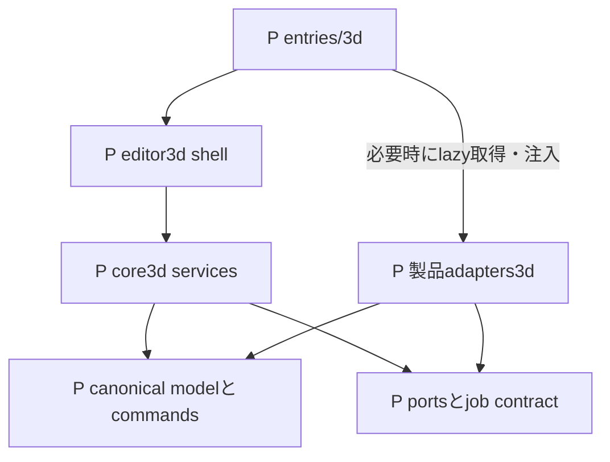

# ファイル階層と責務の所有

[索引へ](README.md)。初期配置はP（予定）として記録し、下のB01実在状況でE化した範囲を区別する。既存2Dを大移動して3Dの前提にしない。

## OW-01 現状と追加先

```text
E index.html / src/main.tsx / src/app/App.tsx   現行2D起動
E src/features/home/                          2D project入口
E src/features/editor/                        2D editor
E src/core/{model,history,storage,export}/      2D固有契約
E src/workers/                                2D画像worker
P 2d/index.html / 3d/index.html                独立HTML entry
P src/entries/{hub,2d,3d}.tsx                  起動だけを所有
P src/shared/contracts/                      domain非依存の小contractのみ
P src/features/editor3d/                     画面・入力・表示state
P src/core3d/                                3D正本とservices
P src/adapters3d/                            renderer / format / consumer境界
P e2e/three-d/                               browser横断検査
P src/core3d/fixtures/                        自作・権利確認済み数値fixture
P docs/evidence/3d/                          同版の採用・検査証拠
D docs/architecture/3d/                      本索引と関係図
```

Eのdirectoryは実在し、表記中braceは説明用の省略である。Pは実在しないpathへのリンクを作らない。既存に似た名前の保存・history・workerを見つけても、3Dでそのまま共有できる意味ではない。

## OW-02 依存方向



文字版: entryがUIを準備し、必要機能を選んだ時だけ製品adapterをlazy取得して組み立て、UI→service→正本/portへ依存する。adapterがportを実装する。coreはReact/Three/DOM/2D storageをimportしない。serviceからadapterの具体classへ逆importしない。runtime呼出は注入されたportを通るので、静的importの矢印と呼出順は区別する。

## 所有台帳

各group IDは [全要件対応](traceability.md) から参照する。`*.test.ts` は同居unit/integration予定、既存Viteの `src/**/*.test.ts` に入る設計。実装時にglobとCI分類を実証し、図だけで収集済みとしない。

| group | P path候補と責務 | 所有B / 検査予定 |
| --- | --- | --- |
| M00 | `docs/evidence/3d/adoption.md`：版・license・integrity・採否 | B00、T00/T12。dependency実配布物と候補調査を区別 |
| M01 | `src/core3d/model/project.ts`、`coordinates.ts`、`schema.ts`：安定ID・単位・TRS・source/derived・rights | B01、同居 `project.test.ts` / `coordinates.test.ts` / `schema.test.ts` |
| M02 | `src/core3d/commands/command.ts`、`history.ts`：validate/preview/commit/Undo/Redo | B01/B04〜06、同居 `command.test.ts` / `history.test.ts` |
| M03 | `src/core3d/storage/repository.ts`、`saveQueue.ts`、`staging.ts`、`pins.ts`、`gc.ts`：CAS・fencing・参照保護 | B01、同居 `repository.test.ts` / `saveQueue.test.ts` / `gc.test.ts` |
| M04 | `src/core3d/backup/backup.ts`、`restore.ts`：完全backup・bounded復元・別ID救出 | B01、同居 `backup.test.ts` / `restore.test.ts` |
| M05 | `src/entries/`、`src/features/editor3d/Editor3DShell.tsx`：entry・準備済み救出・error UI | B02、`e2e/three-d/entries.spec.ts` / `compatibility.spec.ts` |
| M06 | `src/core3d/ports/renderPort.ts`、`src/adapters3d/three/renderer.ts`、`resources.ts`：表示変換・owner・dispose | B03、同居adapter tests、`e2e/three-d/lifecycle.spec.ts` |
| M07 | `src/core3d/import/preflight.ts`、`profile.ts`、`src/adapters3d/gltf/import.ts`：raw検査→候補変換 | B03、同居 `preflight.test.ts`、`e2e/three-d/import.spec.ts` |
| M08 | `src/core3d/mesh/`、`material/`：primitive、corner属性、topology、texture派生 | B04、同居 `mesh.test.ts` / `material.test.ts`、`e2e/three-d/model.spec.ts` |
| M09 | `src/core3d/rig/`：rest/bind/pose、manual mixed weights、参照依存 | B05、同居 `rig.test.ts`、`e2e/three-d/rig.spec.ts` |
| M10 | `src/core3d/animation/`：TRS key/clip/loop、preview pose | B06、同居 `animation.test.ts`、`e2e/three-d/animation.spec.ts` |
| M11 | `src/core3d/game/`、`export/snapshot.ts`、`export/mapping.ts`、`src/adapters3d/gltf/export.ts`：GLB/sidecar境界 | B07、同居 `mapping.test.ts`、`e2e/three-d/export.spec.ts` |
| M12 | `src/core3d/inspection/`、`e2e/three-d/consumer-support/`：stale判定とtests-only独立consumer。後者はproduct entryの依存外 | B08、同居 `inspection.test.ts`、`e2e/three-d/consumer.spec.ts` |
| M13 | `src/core3d/lifecycle/`、`jobs/`、`workers/`：状態遷移・token・cancel | B03/B09、同居 `lifecycle.test.ts` / `jobs.test.ts`、`e2e/three-d/recovery.spec.ts` |
| M14 | `src/features/editor3d/input/`、`panels/`：touch/list/numeric/IME/a11y | B04〜06/B09、同居UI tests、`e2e/three-d/accessibility.spec.ts` / `device.spec.ts` |
| M15 | `src/core3d/profile/limits.ts`：版付き入力・peak予算 | B03/B09、同居 `limits.test.ts`、`e2e/three-d/performance.spec.ts` |
| M16 | `src/features/editor3d/service/`、`docs/evidence/3d/`：更新・診断・ガイド・証拠 | B10、`e2e/three-d/update.spec.ts`、T11/T12 |
| M17 | `docs/architecture/3d/`：配置・読取・追跡更新 | G02/B10、文書ID/path/graph検査 |

`src/shared/contracts/` の候補はdomainタグ、build情報、errorの表示形、base URL純関数だけ。使用実績がなければ空の共有moduleを先に増やさない。2D/3D project型、DB、global save queue、renderer、mutable cache、feature barrelは入れない。sharedからdomainへのimportは禁止方向としてbuild graphで検査する。

## 横断contractと変更時の影響

| contract | 正本owner | 変更時に読む利用先 |
| --- | --- | --- |
| canonical ID/TRS/unit/time/lineage | M01 | M02/M07〜12、schema・数値fixture・backup |
| command revisionとhistory参照 | M02 | M03/M04/M08〜10、GC・dirty表示 |
| durable revision / fencing / pins | M03 | M02/M04/M11/M13、複数tabと救出 |
| job ID / project ID / input revision / token | M13 | M07/M11/M12、取消と古い結果の拒否 |
| versioned input/peak profile | M15 | M07/M08/M09/M11/M13、UI警告と境界fixture |
| final GLB hashとstable ID mapping | M11 | M12、sidecar consumerと独立照合 |
| render resource ownership | M06 | M13/M14、context restoreとPNG |

描画adapterだけの改善で正本schemaを変更しない。最終GLB node indexを内部の恒久IDへ逆流させない。read-only検品結果はrevision/hashが変わればstaleとなり、正本を直接修正しない。

独立consumer（DEC-07）は `e2e/three-d/consumer-support/` と検査用entryだけが所有するP配置。製品のM12 inspectionと分離し、product entry・core・renderer adapterからimportしない。Babylon等を評価用に採用しても製品bundleへ同梱しない。独立validatorもtests-onlyの採用判断とし、製品側profile validatorと役割を混同しない。

## B01で実在になった配置

[B01証拠と未完範囲](../../evidence/3d/B01.md) を現在の実装状況とする。上の初期台帳のうち以下はEへ進み、それ以外はPのままである。

- M01: [project.ts](../../../src/core3d/model/project.ts)、[coordinates.ts](../../../src/core3d/model/coordinates.ts)。schema検査はproject.ts内。独立schema.tsは未分離
- M02: [history.ts](../../../src/core3d/commands/history.ts)。command preview/commitもこのmoduleに所有。command.tsは未分離
- M03: [repository.ts](../../../src/core3d/storage/repository.ts)、[saveQueue.ts](../../../src/core3d/storage/saveQueue.ts)、[db.ts](../../../src/core3d/storage/db.ts)。staging/pin/GCはrepository内。初期の個別file案へ形式的に分割しない
- M04: [backup.ts](../../../src/core3d/backup/backup.ts)、[repositoryBackup.ts](../../../src/core3d/backup/repositoryBackup.ts)。restore機能はこの2moduleに所有
- 自作fixture: [project.ts](../../../src/core3d/fixtures/project.ts)。各責務のtest.tsを同居

E化はファイルの存在を表す。未接続の画面・描画・GLB・実機対応を意味しない。entryからcore3dへのproduct importはまだない。


## B03 native表示の現在の配置

- E [renderer-free render port](../../../src/core3d/ports/renderPort.ts): UI/adapterの状態・camera操作・保存revision休止契約
- E [Three adapter](../../../src/adapters3d/three/renderer.ts) / [同居tests](../../../src/adapters3d/three/renderer.test.ts): native表示、派生geometry/resource、camera、context寿命。GLB等は未採用
- E [NativeViewportPanel](../../../src/features/editor3d/NativeViewportPanel.tsx): 非同期factory、表示revision、休止/再開、PNG。Threeを直接importしない
- E [NativeInspectionControls](../../../src/features/editor3d/NativeInspectionControls.tsx): M14の数値camera下書き・IME・対象リスト・観察設定。render portだけを通じて一時表示を変更し、作品のcommandを実行しない
- E [box command](../../../src/core3d/commands/box.ts): 保存正本へ最小shapeを追加する一操作。B04全造形編集の完了を意味しない
- E [browser受入](../../../e2e/native-viewport-product.spec.ts) / [UI非同期契約](../../../e2e/native-panel.spec.ts) / [限定評価entry](../../../tools/3d-evaluation/main.ts)

M06の所有境界は維持する。今回の小さなnative subsetではresource ownerはadapter内に同居し、別resources.tsへの未使用分割は行わない。core/model/commands/storageはThreeへ依存しない。

### B04 native制作で実在になった配置

- `src/core3d/commands/primitives.ts`: 五種類の直接editable triangle mesh生成、corner UV/normal
- `src/core3d/commands/meshEditing.ts`: 安定IDの移動・単一三角面押出し/削除・法線
- `src/core3d/commands/objectEditing.ts`: local TRS・独立部品複製・既存material factor
- `src/features/editor3d/NativeAuthoringPanel.tsx`: 制作対象list、数値draft、明示Apply。camera観察selectionとは別
- `ProjectSession.executeAuthoring`: candidateから一回history commit、既存autosave/backupへ接続

正本schemaは既存0.1.0のまま。要件対応・未完範囲・同版検査は[B04証拠](../../evidence/3d/B04_NATIVE_AUTHORING.md)を読む。

### B04 部品組立で実在になった配置

- `src/core3d/commands/sceneAssembly.ts`: group/reparent/ungroup、原点移動、独立mirror。world/localと失敗原子性の所有
- `src/core3d/commands/materialEditing.ts`: 未割当material作成・複製とfaceへの割当
- `src/features/editor3d/NativeAssemblyControls.tsx`: transient複数選択とID/revision確認、明示Apply
- `NativeAuthoringPanel`: 既存材質factorに加えて新規・複製・割当を接続

[工程証拠](../../evidence/3d/B04_NATIVE_ASSEMBLY.md)と対象commandの検査を必要な範囲だけ読む。GPU representation、既存2D、保存versionの所有は移さない。


## B04の共有選択・変形接続（本PRの実在配置）

- [editPort](../../../src/core3d/ports/editPort.ts): plain ID/TRS、token、preview envelope、capture guard。Three/DOM/historyを外へ公開しない
- [session transaction](../../../src/features/editor3d/transformTransaction.ts) と [ProjectSession](../../../src/features/editor3d/projectSession.ts): ephemeral選択と一回の正本確定、autosave/競合/救出境界
- [transformMath](../../../src/adapters3d/three/transformMath.ts)、[picking](../../../src/adapters3d/three/picking.ts)、[input controller](../../../src/adapters3d/three/editController.ts): 評価済み数学とrenderer側の入力所有。coreへThreeを逆流させない
- [数値操作](../../../src/features/editor3d/NativeTransformControls.tsx) と [選択購読](../../../src/features/editor3d/useNativeEditState.ts): renderer生成を伴わないlazy数値操作、選択だけを読む重いpanelと軽いpreview statusを分離
- [製品受入](../../../e2e/native-editing-product.spec.ts) と [panel境界受入](../../../e2e/native-panel.spec.ts): pointer/数値/保存復元、非同期PNG/休止、React再描画、binding交換

状態・対応要件・採用根拠・未確認条件は [B04接続記録](../../evidence/3d/B04_NATIVE_EDITING.md) を正本とする。pathの実在を、実機・全3D完成の証拠にしない。

## B04画像制作で実在になった配置

- `src/core3d/commands/textureEditing.ts`: 既存schemaの原本・派生・画像参照command
- `src/core3d/model/nativeImageMetadata.ts`, `textureProfile.ts`, `textureResources.ts`: 画像metadata、初期profile、同realmの見積り所有
- `src/features/editor3d/nativeImage.ts`: browser codec、色調派生、取消とdecode queue
- `NativeTexturePanel.tsx`: 共有材質/権利/来歴/UV確認、phone数値入力
- `textureSnapshot.ts` → `NativeViewportPanel.tsx` → `src/adapters3d/three/renderer.ts`: revision固定の準備と表示資源の所有
- `e2e/native-texture-product.spec.ts`: 両browserの画像・保存/復元・取消・read-only受入

要件対応・失敗境界・残制約は[画像制作記録](../../evidence/3d/B04_NATIVE_TEXTURES.md)。この追記はGLBやB04全体の完了を意味しない。

## B05 手動rigとposeの製品接続

- `src/core3d/rig/authoring.ts`: joint/rest/reparent、manual bind/weight/rebind、少数自作template、参照付きjoint削除の拒否。一回のhistory commandへ接続
- `src/core3d/rig/pose.ts`: canonical restを変更しないpose候補と、固定GPU shader順のFloat32境界検査
- `src/core3d/ports/rigPosePort.ts` → `src/features/editor3d/rigPoseTransaction.ts`: 非保存TRS、世代token、取消、PNG capture guard。ProjectSessionが所有し、保存・編集権・終了境界を共有
- `src/features/editor3d/NativeRigPanel.tsx`: list/数値/IME、restとposeの明示区別、手動weight、独立Undo/保存導線
- `src/adapters3d/three/renderer.ts`: corner skin属性、Bone/Skeleton/SkinnedMesh、複数instanceのbind、pose後boundsと資源解放。Threeはadapter内に限定
- `e2e/native-rig-product.spec.ts`: 制作・mixed pose・native backupの別context復元、phone操作を同版で受入

証拠・未検証範囲は [B05記録](../../evidence/3d/B05_NATIVE_RIG.md) を参照。保存0.2.0の項目は追加せず、poseをnodesへ保存しない。配置の実在は、GLB/consumer/実機・全工程完了の証拠ではない。
