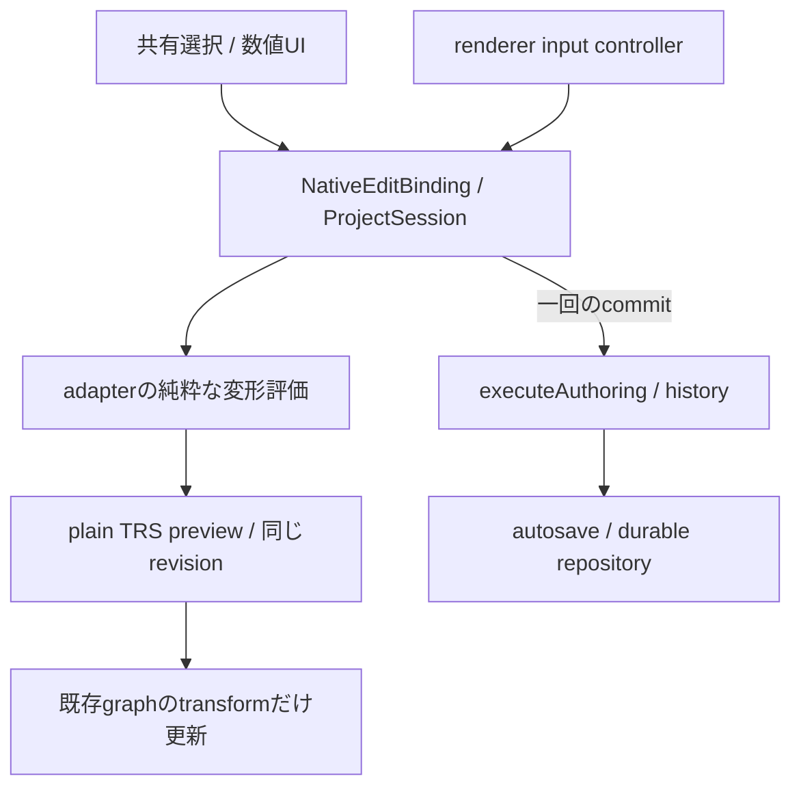

# B04 native選択・変形の製品接続

状態: 実装・統合検査中。B04全体・全3D制作・physical iPhone合格ではない。
対象: EDIT-02/03/05、VIEW-04/05、保存/PNG/資源寿命との接続。

## G03cの限定採用根拠

隔離評価 [PR303](https://github.com/chameleonjp-lab/chameleonassetstudio/pull/303) の固定head `20c31ea820d1909ef621651dead1569c7c82d0a8`、tree `3232952da8e345b1151e42e1a1c1d74740d7dc8d` を参照する。
[CI37180968264](https://github.com/chameleonjp-lab/chameleonassetstudio/actions/runs/37180968264) は全job成功。実test merge `b3cbf9b17d093d63477f284f2f4d201b095d4c36` も同一tree。

- 単体1451件、focused125件の独立再レビュー
- 隔離操作26件、既存native WebKit8件、production takeover1件
- Chromium322件+既存skip1、WebKit135件+既存skip1、production34件、H3/Pages/closed route各1件
- 画像artifact `11295860919`（808050bytes）から両投影/両browserの4画像、375px操作画面/両browserの2画像を目視確認。model/gizmo・入力欄に欠落や横はみ出しなし
- 固定Three 0.186.1 / types0.186.0、LICENSE/integrity/source hashは[評価記録](G03_NATIVE_INTERACTION_EVALUATION.md)を維持し、version/依存の追加を伴わない

採用対象はnativeのpick・変形数学・入力所有の限定contract。Threeはadapterに留める。candidateのProjectHistory直接更新、in-memory save、render停止だけのsuspendを製品の耐久保存/競合/救出/GPU解放へ流用しない。

## 接続で追加する証拠

ProjectSessionを唯一の確定主体とし、同revisionのpreviewは保存正本から分離する。object selection/active IDをpanelとviewportで共有し、pointer/numericを同じdelta評価へ通す。別編集・Undo/Redo・明示保存/backup/copy・競合判明・project変更・PNG・休止・context loss・破棄の境界を同期的に検査する。

製品bundle増分、renderer再構築/破棄、save/fencing、独立backup復元、375px/IME、非同期PNG/休止、既存2Dの受入はこの製品接続の同一候補で別途確認する。候補評価の成功だけでこれらを完了扱いしない。

native保存schemaは0.1.0を維持する。persisted visibility/lock、GLB、実機メモリ予算、rig/animation・制作全体は未完の別範囲として保持する。

## 確定とpreviewの実装関係

文字版: panelとviewportは同じsession bindingへ要求する。純粋な評価結果は保存しないTRS overlayとしてrendererへ渡す。確定時だけ既存command/history/autosaveへ一回流す。previewでgraph/Orbitを再作成せず、PNG/保存/休止/競合/破棄ではそれぞれの境界を確認する。

| 要件 | この接続で検査すること | 残る範囲 |
| --- | --- | --- |
| EDIT-02 | canonical object selection/active IDを制作・組立・観察・canvasで共有 | persisted visibility/lock・削除を含む全EDIT-02は未完 |
| EDIT-03 | pointerと数値delta、world/local、snap、度→radian一回変換、scale factor | 実機touch・最終性能budget |
| EDIT-05 / SAVE | preview非保存、一回確定、Undo/Redo、取消、既知の競合と救出、独立backup復元 | 他のrig/animation操作を含む全制作transaction |
| VIEW-04/05 / UX | 状態とactive対象、IME/keyboard、375px、preview中PNG拒否 | physical iPhoneと最終UI受入 |
| LIFE/PERF | capture epoch/runtime guard、再構築/破棄、GPU休止中の数値編集 | OSによる実タブ破棄、実GPU/heap予算 |

## レビューで修正した境界

- PROD-01: 同revisionのgraph交換、camera/表示設定/resizeの間に遅延PNGが旧状態を返せた。runtime generation/capture guardで拒否し、既存project/revision確認も保持した
- PROD-02: document全体のcompositionstartが、controllerの所有でない数値入力tokenまで取り消していた。controller-owned pointerだけを取り消し、外部numeric tokenとIME中Escapeを保護した。同期的なbinding通知でaddon objectが外れる順序も回帰検査へ追加した
- PROD-03: pointer sampleのinvalid→valid通知で重い制作panelのsnapshot identityが変化していた。選択購読をproject/revision/IDだけのcacheへ分離し、React Profiler fixtureで同じ選択の反復previewによる再描画を検査する
- PROD-04: 新製品E2EをWebKit・production・早期native受入へ登録。既存expectation/skipを緩和せず、両browserで同じ操作を検査する

数値で開始した変形はWebGLなしでも使える。GPU停止/非対応はpointer ownerだけを閉じ、documentの背景/凍結と別のglobal blockがなければ数値編集を継続できる。PNGは編集helper/選択overlayを含めない。未知の別タブ所有権はdurable commitで判明するため、先回りした完全lockとは主張しない。

## 確認方法

新しい製品E2Eは実画面の赤いX handleのpixel位置からpointerを操作する。製品へtest用global APIは追加しない。数値操作との同じ保存TRS、revision、Undo、独立backup復元を比較する。緑のfixtureのcanonical PNGでは赤/黄色の編集overlayがないことも確認する。

panel fixtureはview providerの遅延/失敗を注入し、active previewのPNG拒否、同revisionのepoch変化、同projectのbinding交換、save待ちの休止と再開、数値編集の継続を検査する。実GPUを持たないfixtureと、実製品browserの結果を分けて記録する。

検査結果・最終head・bundle増分・画像は同じ提出候補で追記する。ここまでの実装だけでreleaseや実機合格とはしない。

### 表示通知の失敗境界

PROD-05: fallibleなsubscriberが例外を投げると、開始に失敗と返しながらtokenが残る、previewに失敗と返しながらoverlayが残る、確定後なのに失敗と返す3例を再現した。通知はlistenerごとに隔離し、健全なlistenerへの配信を継続する。診断は外部送信せず、primitive stringへ変換後512文字以内に保持する。任意の例外objectを保持せず、診断の変換自体が失敗しても確定結果を壊さない。独立再レビューで修正と非string messageの境界を確認した。

## ローカル検査とbundleの比較

提出前のまとめ検査はlint・format・型・app/H3 build・CI分類7件・全体1,583件/123filesに成功。その後の診断string補正と追加1件は関連transaction20件・型・app buildで確認した。最終headの全体件数と実browser結果はCIで確認する。product5ケースとpanel12ケースをChromium/WebKitへ登録し、productionにはproduct5ケースを含める。test discoveryを実browser合格に数えない。

以下は同じ固定依存のlocal buildで、manifestのstatic importを重複なく合計したJS bytes。gzipは各chunkをlevel9で圧縮した合計。CSS・worker・モデルdata・heap/GPUは含まない。基準は`f455595`相当の製品source（`20c31ea`までのsrc/package/Vite/build inputs差分なし）。両buildはlocal変更識別ありで、commit識別子/圧縮の微差を含む。端末予算の保証値ではない。

| 読込範囲 | 基準raw / gzip bytes | この候補raw / gzip bytes |
| --- | --- | --- |
| top | 1,156 / 751 | 1,156 / 751 |
| 2D editorまで | 1,076,141 / 317,364 | 1,076,141 / 317,361 |
| 3D shellまで | 307,147 / 99,239 | 326,972 / 104,787 |
| 3D viewportまで | 892,254 / 246,834 | 968,128 / 267,198 |

viewportまでの差はraw75,874 / gzip20,364bytes。数値変形の初回利用はshared Three/math chunkをlazy取得し、shell込み862,604 / 238,871bytesになる。WebGLを生成しないことと、数学用JSの取得が小さいことは別である。math chunk約535.63kBの既定size警告は残し、実測性能・分割改善・mobile予算はB09で評価する。

## 互換性と戻し方

2D source、従来ZIP/Web/Pixi/Phaserと0.2出力、native schema/package lockは変更しない。新しい選択/preview/診断はsession内だけで、backupへ保存しない。rollbackは本接続のUI/port/adapter/session追加を戻し、既存native作品をそのまま読む。保存済みdataのmigrationや削除は伴わない。
