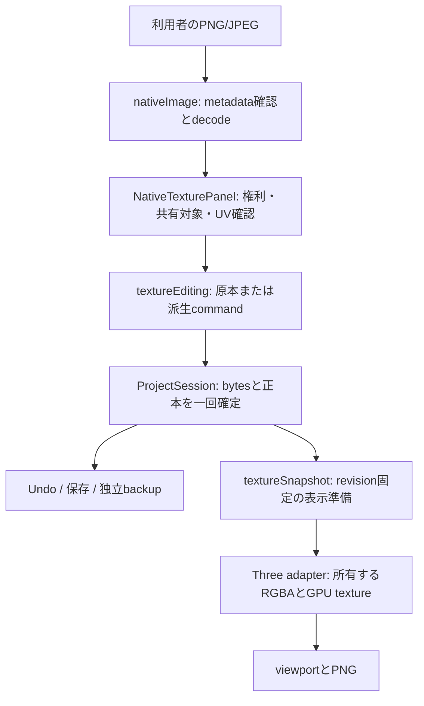

# B04 native baseColor画像・UV確認・派生色調

対象は[計画B04](../../THREE_D_IMPLEMENTATION_PLAN_2026-10-03.md#b04-空から造形し材質を仕上げる)のMAT-02/03/04、DATA-02、SAVE、LIFEの部分実装。共有編集接続[PR304](https://github.com/chameleonjp-lab/chameleonassetstudio/pull/304)の`6b4f81c8`を技術的な基点とする。作業開始時mainは`ff928370`で、PR304は未mergeだった。現在のmerge状態はGitHubを確認する。

## 保存契約と対象

- native schema/backupは既存0.1.0。material.textureBlobId、corner UV、Source3D.derivedFromと権利欄を使用する。schema、DB、依存package、2D形式/出力は変更しない
- ローカル静止PNG/JPEGをbaseColorへ取込・差替え・除去。元bytesをcontent hashで保持し、色調変更は別PNG・別Source3Dへ保存する
- PNG/JPEG以外、APNG、非標準JPEGの採用範囲外、回転/反転EXIFは明示拒否。向きを確定したPNG/JPEGへの変換を案内する。対応subsetを全画像形式対応と表示しない
- UV set0・transform identityのみ。既定UVは新規primitiveと簡易箱に持たせる。旧作品のUVなしmeshを黙って書き換えない。UV不足の材質割当は拒否し、backupは維持する
- emissive/alpha mode/cutoff/double-sided、永続visibility/lockはstrict0.1.0に無い。今回追加しない。後続の契約拡張・旧版拒否/移行設計として判断する
- GLB loader/入出力と以前停止した資源レビューは対象外。ネイティブの有限画像fixtureと既存browser codecを検証する

## 読取・確定・描画の経路

画像は同じschemaのimmutable blobとして保存する。ProjectSession.captureBinaryContextはfile読取/decode前に取得し、revisionだけでなく操作世代を固定する。非同期hash中や準備中のsave、backup、Undo/Redo、別command、close、所有権競合、選択変更などで古い完了を適用しない。bytesの不足/hash不一致・予算超過・history拒否では正本・revision・Undo・blob集合を変えない。

materialはsource IDでなくhashを参照する。複数の来歴が同じhashを持つ場合、最初のsourceを推定せず利用者に対象の来歴を選ばせる。派生は明示parent sourceを指し権利を継承する。「元画像へ戻す」はparent chainの原本へ戻る。画像を外しても原本/派生を削除しない。保存形式にUI選択を追加しない。

## 色とUV

decode結果は上からの行順のstraight RGBA8/sRGB。明示imageOrientation/premultiplyAlphaを設定し、寸法をdecode前後で照合する。Three側はCPUで行順を反転し、DataTexture.flipY=false、SRGBColorSpace、clamp-to-edge、bilinear filter、mipmapなしでUV0の左下原点へ対応する。原本の向きと見かけを暗黙補正しない。

色調はlinear RGBへ変換し、RGB各倍率・明るさ・彩度を適用してsRGBへ戻す。alphaとUVは維持する。neutral値は倍率1・明るさ0・彩度1。2D editor全体を起動しない。UV確認canvasは現在の画像とcorner UVの面境界を示し、再unwrap/別UV set/texture transformを実装済みとしない。

出典: 固定Three 0.186.1のDataTexture.js/Texture.js/WebGLTextures.js/map_fragmentを読取確認。[DataTexture公式](https://threejs.org/docs/pages/DataTexture.html)、[createImageBitmap](https://developer.mozilla.org/en-US/docs/Web/API/Window/createImageBitmap)。browser codecの存在だけで色空間・向き・実機挙動の合格とせず、有限の四色画像を実browser/PNGで比較する。

## 資源・取消・復旧

`src/core3d/model/textureProfile.ts`の`native-texture-compact-evaluation-0`は初期の工学的guardで、端末対応保証ではない。辺2,048、unique decoded8,000,000pixels、単一file16MiB、原本/派生/Undoを含むencoded保持16MiB、operation推定128MiBを別々に検査する。小さい圧縮画像だけを根拠にdecodeを許可しない。大容量の実割当fixtureは使わない。

共通の`textureResources.ts`が同じrealm内のimage codec、UV preview、prepared cache、renderer source/upload/GPU見積りを所有ticketで合算する。ticketは確保前に取得し、実際の解放後に戻す。codecは一件ずつ実行し、待機中のbytesも上限付きで保持する。保存pipelineは実encoded保持のhigh-water×7を保守的に予約し、binary入力copy/hashは別ticketとする。

128MiBはこの画像処理・表示・保存pipelineの見積りguardであり、browser全体の実RAMではない。backup ZIP encoder、download Blob/ObjectURL、IDB内部copyやGCのpeakは既存の別制限と未測定項目として残る。予約値以下なら物理iPhoneで必ず動作するという意味ではない。

codecの未完了decodeはabort後も実際の終了まで資源予約を保持し、遅着bitmapをcloseする。canvas/ObjectURL等は所有者が解放する。viewport準備はrevisionとsessionを固定し、古いdecode結果で新しい作品を上書きしない。画像不足/失敗時は色だけの表示へ落として成功にしない。candidateのhard pixel合計は確定前に確認するが、後続の表示準備が他のownerとの同時peakで拒否される場合はあり得る。その場合も確定した画像とbackupを保持し、3D表示を閉じてから画像操作を再試行できる。PNGは表示中revisionとの一致を要求する。

Three graphは使用hashごとにtextureを共有し、graph破棄時に一回disposeする。GPU休止は表示用資源を解放し、保存正本と救出bytesを保持する。再開/文脈復旧では保存契約・current revision・prepared sourceを確認する。未知の実RAM/GPU値は0や合格値として記録しない。

## 受入と証拠

| 対象 | 必須確認 | 主な検査 |
| --- | --- | --- |
| MAT-02 | import/replace/remove、原本hash、権利、UV不足拒否 | textureEditing / projectSession / 製品E2E |
| MAT-03 | 新規primitiveのUV、UV0画像確認、上下方向 | box / nativeImage / renderer / 四色PNG E2E |
| MAT-04 | 派生PNG、原本復帰、alpha/UV維持、曖昧な来歴の選択 | command/codec単体、独立backup復元 |
| SAVE/EDIT | 一回commit/Undo、失敗で完全不変、世代による取消 | session単体、取消E2E |
| LIFE/PERF | 共有画像dispose、decode/capture遅着、休止/復帰 | codec/snapshot/renderer/panel、製品E2E |
| 2D互換 | 形式とsource不変更、既存全体browser/出力継続 | 通常CIの既存Chromium/WebKit/production/H3/Pages |

### 独立レビューで修正した事項

- TEX-01: UV previewとviewportの同時decodeが単独で有効な画像を拒否した。codecを上限付きqueueへ変更し、同revisionのReact再描画で再decodeしない
- TEX-02: 同一bytesを新しい権利で再取込した後も古いsource選択が残った。成功した新source IDを明示選択し、派生の権利継承を検査する
- TEX-03: Undo後に別操作して捨てたredo画像がsession上限を消費した。current/Undo/Redoの参照集合を基に、autosaveのowned copy取得後に到達不能bytesだけを整理する
- TEX-04: unique合計pixelsの拒否が表示時だけだった。未割当材質も含めcandidate全体のmetadataを確定前に確認する。既存の材質割当にもUV不足拒否を追加する
- TEX-05: decode単体だけの見積りでは既存cache/GPUと合算されなかった。共有所有ticketとpre-copy admission、取消後の実解放、失敗時ticketの完全復帰を追加する
- TEX-06: 新規簡易箱の背面UVだけ鏡映していた。パラメータ箱と同じ外側向きへ合わせ、全faceのUV determinantと継ぎ目を検査する
- TEX-07: previewの別AbortControllerが背景/凍結で閉じなかった。hidden/frozen/pageHiddenを独立管理し、同時条件が全て解除された時だけ再開する
- TEX-08: 画像UIへIMEガード、375pxでの実編集/復元、別tab読み取り専用、backup中断、同一hash/異なる出典のbrowser受入を追加する

ローカル区切り検査: lint・format・型・app/H3 build・CI分類7件・全体1,690件/127filesが成功した。独立再レビューで重大な未解決指摘は残っていない。最後にprofileの冗長なdynamic importを静的importへ整理し、関連lintと型を再確認する。最終headの全体/実browser結果と画像はCIとPRへ記録する。Nodeだけでbrowserや実機の合格を主張しない。

## 残る制約と戻し方

物理iPhone、OSによるtab破棄、実GPU/heap予算、全B04、rig/animation、GLB本出力は未完。native backupは自己完結したbytes/来歴を保持するがゲーム用配布形式ではない。

この画像UI/描画接続を戻してもschema0.1.0の作品/backupは読み取れる。旧rendererはtextureを明示未対応として扱い、画像bytesを削除しない。新規箱のUVは既存schemaのoptional属性なので旧版で保持可能。破壊的migrationやデータ削除は行わない。

## 初回browser受入の手順修正

[CI37190170286](https://github.com/chameleonjp-lab/chameleonassetstudio/actions/runs/37190170286) head`ed4c713e`では単体/build成功、早期WebKit17件中15件成功。新しい画像ケースのうちJPEG/取消とIME/backup中断/他tab読み取り専用は成功した。残る2件は検査手順で停止したため、後続の全体browser/productionは未実行として扱う。

- TEX-09: 来歴selectはartifactのaccessibility treeで正しいcombobox名と選択source IDを確認した。implicit label文字列の検索を、exactなcomboboxのaccessible nameでの検索へ変更。権利/ID/hashの期待値は維持する
- TEX-10: 正面camera操作の前に「カメラ・表示の詳細設定」を開く手順が欠けていた。既存camera受入と同じ利用者操作を加え、PNGの色位置・UV方向・休止/復帰検査を続行する。timeout延長・skip・pixel期待値緩和は行わない
