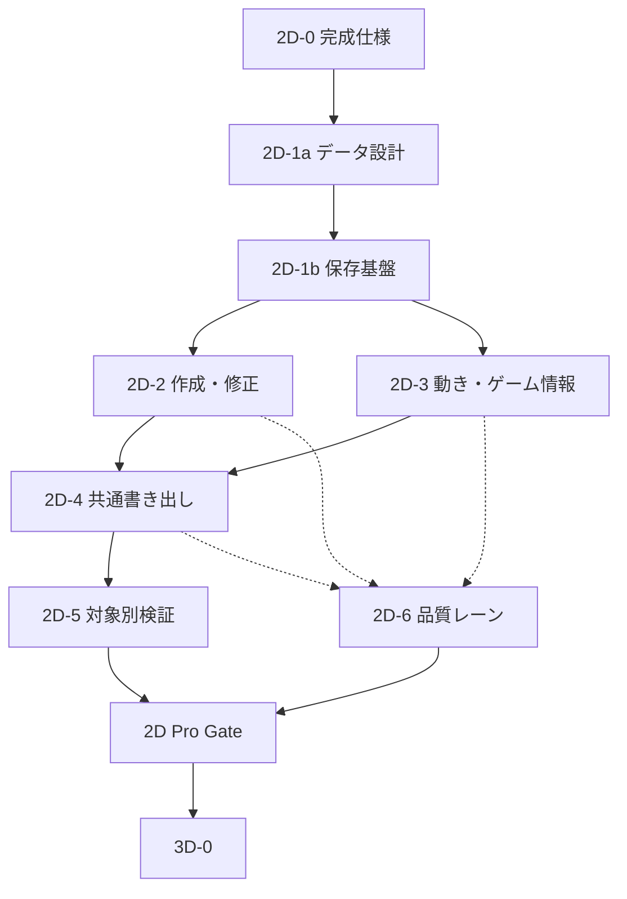

# Chameleon Asset Studio 2D Completion Roadmap

最終更新日: 2026-07-10
対象リポジトリ: `chameleonjp-lab/chameleonassetstudio`
文書種別: 2D 完成までの実装順と品質 gate
状態: accepted（今後の優先順。docs-only）
上位文書: `2D_COMPLETE_PRODUCT_SPEC.md`
関連文書: `2D_ASSET_DATA_CONTRACT.md`, `2D_EXPORT_COMPATIBILITY_MATRIX.md`, `2D_DEVICE_RELIABILITY_SPEC.md`, `docs/future/POST_PHASE17_IMPLEMENTATION_PLAN.md`, `docs/future/THREE_D_ASSET_PREPARATION_REQUIREMENTS.md`

---

> **この文書の決定:** 既存の Phase 22〜28 にある 3D 実装は、2D Pro Gate を通るまで開始しない。
> **今回の変更範囲:** これは順番と完了条件を定める docs-only の更新であり、3D、schema、`.casproj`、export ZIP、dependencies、アプリ本体を変更しない。

## 1. 目的

今の Phase 19〜21 を終えた時点で、2D が完成したように見える状態を避ける。

2D 完成は、画像を取り込む、少し編集する、PNG を出すことではない。次を一続きで通せることとする。

```txt
空から作る / 素材を取り込む
→ 元を残して修正する
→ 動き・原点・判定などを付ける
→ ゲーム内に近い画面で確認する
→ 対象別に書き出す
→ 後日、別端末でも再編集する
```

この文書は、その順番、PR の分け方、品質 gate、3D を再開してよい条件を決める。

## 2. 基本判断

1. 2D Pro Gate を通るまで、3D の library 評価、依存関係追加、画面、schema、実装を始めない。
2. 既存 Phase 18〜28 を削除しない。実装済み範囲と過去の判断として残す。
3. 今後の着手順は、既存の `POST_PHASE17_IMPLEMENTATION_PLAN.md` より本書を優先する。
4. 画像編集ソフト、ゲームエンジン、Spine / Rive / Live2D の完全な代替を一度に作ろうとしない。
5. 共通データの意味を固めてから、対象別の export preset を増やす。
6. 1 PR 1 目的を守る。同じ目的を完成させる実装、tests、docs、CI 安定化は1つにまとめてよい。
7. schema、`.casproj`、export ZIP、dependencies、3D、外部ツール向け出力に触る変更は、設計と review を分ける。
8. 本ロードマップの標準運用は `docs/DEVELOPMENT_MODES.md` の **Hybrid Roadmap Mode** とし、Fable5 は段階開始時の判断、Codex は実装、Opus 4.8 は CI 成功後のレビューに分ける。

## 3. 既存 Phase との対応

| 既存 Phase | 現在の扱い | 2D 完成計画での位置 |
|---:|---|---|
| 18 | docs / 実装 / tests の整合確認として完了済み。 | `2D-0` で新しい文書との参照関係だけを整える。 |
| 19-A | grid / snap は実装済み。 | `2D-2` の精密編集の土台として維持する。 |
| 19-B | 通常反転と反転コピーは実装済み。リグ編集データの反転は未完。 | `2D-3` でデータ契約と焼き込み確認後に扱う。 |
| 19-C | rect / circle の表示、選択、移動、リサイズは実装済み。polygon と frame 別判定は未着手。 | `2D-3` の別設計・別 PR とする。 |
| 20 | padding / extrude、解像度別出力、helper 選択は未完。 | `2D-4` の書き出し基盤へ統合する。 |
| 21 | effect の最小強化は未完。 | `2D-3` と `2D-4` で、再生・検査・出力をまとめて扱う。 |
| 22〜28 | 3D 調査〜外部3D生成連携の旧計画。 | `2D Pro Gate` 後に `3D-0`〜`3D-6` として再開する。 |

## 4. 2D 完成までの段階

### 2D-0: 完成形と判断材料を固定する

目的: 実装を広げる前に、何を完成と呼ぶか、何をまだ実装しないかを文書でそろえる。

成果物:

- `2D_COMPLETE_PRODUCT_SPEC.md`。
- `2D_ASSET_DATA_CONTRACT.md`。
- `2D_EXPORT_COMPATIBILITY_MATRIX.md`。
- `2D_DEVICE_RELIABILITY_SPEC.md`。
- 本書。
- 既存 future docs、README、決定記録の参照関係。

完了条件:

- 「画像取り込み中心の v1.0」と「2D Pro の完成条件」が混同されない。
- 3D を開始しない条件が明文化される。
- 未決定項目が、実装済みのように書かれていない。

### 2D-1a: 安全なデータと保存の土台を設計する

目的: 作成・派生・出力を増やしても、既存の `.casproj` とゲーム用データを壊さないようにする。

`2D-1A-BASELINE` は PR #50 で完了・mainへマージ済みであり、成果物は [`2D_1A_BASELINE_REPORT.md`](2D_1A_BASELINE_REPORT.md) とする。ここで確認された現行 version、型、schema、保存、`.casproj`、export ZIP、migration、fixture/test coverage は、以降の詳細契約 work package の比較基準である。

詳細 work package:

| ID | 分類 | 内容 | 状態 / 次の扱い |
|---|---|---|---|
| `2D-1A-BASELINE` | 必須 | 現行実装の baseline report を固定する。 | PR #50で完了・mainへマージ済み。 |
| `2D-1A-LAYERS` | 判断必須 | source / edit / derived / export / verification、Project / Asset Family / Variant、ID・名前・参照の層を固定する。 | PR #52 accepted。 |
| `2D-1A-COORD` | 判断必須 | 座標、transform、pivot、trim、atlas、flip、scale、丸めの意味を固定する。 | PR #52 accepted。 |
| `2D-1A-MOTION` | 判断必須 | animation event、可変時間、rig bake、frame別上書き、polygonの境界を決める。 | `2D-1A-LAYERS` + `2D-1A-COORD` 後。 |
| `2D-1A-TARGET` | 判断必須 | target固有 extension と unknown data の扱いを決める。 | `2D-1A-MOTION` 後。 |
| `2D-1A-PROVENANCE` | 判断必須 | provenance、利用条件、AI送信記録の保存境界を決める。 | `2D-1A-MOTION` 後。 |
| `2D-1A-VALIDATION` | 判断必須 | 構造・意味・出力の検証を schema / runtime / preflight へ分解する。 | `2D-1A-MOTION` 後。 |
| `2D-1A-MIGRATION` | 判断必須 | version、旧形式、rollback、fixtureの扱いを固定する。 | ADR-0006 のみ partial。詳細契約全体は未完了。 |

次の契約作業順は、PR #52 で accepted になった `2D-1A-LAYERS` + `2D-1A-COORD` の次として、`2D-1A-MOTION`、`2D-1A-TARGET` + `2D-1A-PROVENANCE` + `2D-1A-VALIDATION` + `2D-1A-MIGRATION` の順とする。すべての `2D-1A-*` が accepted になる前に、`2D-1B-*` の本実装を開始しない。

主な仕事:

- source、編集元、preview、export、検査記録の分離を設計する。
- ID、名前、参照、派生素材、操作履歴、migration の必要条件を決める。
- 保存失敗、容量不足、画像欠落、途中終了、削除復元、端末移動の設計をする。
- coordinate、trim、atlas、flip、scale、frame 別データの意味を fixture で固定する。

完了条件:

- 大きな形式変更が必要な項目は、schema / migration の別 PR として切り出せる。
- 旧 `.casproj` を読む・保存し直す・書き出す時に守る意味が決まる。
- `2D_ASSET_DATA_CONTRACT.md` の未決定項目を、実装対象ごとに ADR へ落とせる。

### 2D-1b: 保存・migration・復旧を実装して固定する

目的: 新規作成、派生素材、出力形式を増やす前に、保存途中の不整合や旧形式の読み込み失敗から戻れる実装を作る。

詳細 work package:

| ID | 分類 | 内容 | 開始条件 |
|---|---|---|---|
| `2D-1B-REVISION` | 必須 | 改訂単位の整合保存、autosave状態を固定する。 | すべての `2D-1A-*` accepted 後。 |
| `2D-1B-LAYERS` | 必須 | source / edit / cache / export record の保存境界を実装する。 | すべての `2D-1A-*` accepted 後。 |
| `2D-1B-RECOVERY` | 必須 | snapshot、trash、rollback、復元を実装する。 | すべての `2D-1A-*` accepted 後。 |
| `2D-1B-CAPACITY` | 必須 | storage estimate、quota、退避導線を実装する。 | すべての `2D-1A-*` accepted 後。 |
| `2D-1B-CASPROJ` | 必須 | `.casproj` の段階的検査と migration を実装する。 | すべての `2D-1A-*` accepted 後。 |
| `2D-1B-INPUT-SAFETY` | 必須 | ZIP、JSON、画像など不正入力の隔離と拒否を実装する。 | すべての `2D-1A-*` accepted 後。 |
| `2D-1B-GATE` | 必須 | fixtureと保存回帰テストを通し、2D-2 / 2D-3本実装を解禁する。 | `2D-1B-*` 実装後。 |

PR #53（`2D-1B-STORAGE`）は、詳細契約 Gate より先に main へマージされた先行実装である。revert せず provisional / ahead-of-gate として保持し、残る 2D-1A 契約の通過後に互換性・保存・migration・UI 境界を再監査する。対応付けは次の通り。

| PR #53 の成果 | 詳細 work package | 現在の状態 | 未完了 / 再監査項目 |
|---|---|---|---|
| `saveProjectBundle`、transaction abort、原子的保存 | `2D-1B-REVISION` | provisional implemented | 2D-1A 契約後に revision 単位と autosave 境界を再監査する。 |
| source / edit / preview 等の保存境界への対応 | `2D-1B-LAYERS` | partial | source / edit / cache / export record の境界を詳細契約と照合する。 |
| trash、snapshot、復元 | `2D-1B-RECOVERY` | provisional implemented | rollback、復旧点、UI 境界、migration との整合を再監査する。 |
| `QuotaExceededError` 案内 | `2D-1B-CAPACITY` | partial | storage estimate、persistent storage 取得結果、容量不足時の退避導線が未完了。 |
| v0.1.0 fixture、roundtrip、quarantine | `2D-1B-CASPROJ` | partial | staged import の上限、ZIP 展開サイズ・ファイル数・圧縮率上限、JSON 深さ、MIME・画像寸法上限が未完了。 |
| 壊れた import 隔離 | `2D-1B-INPUT-SAFETY` | partial | ZIP / JSON / 画像を信頼しない入力として扱う全上限と quarantine 後の扱いが未完了。 |
| 全保存回帰 Gate | `2D-1B-GATE` | 未完了 | detailed `2D-1A-MIGRATION` 契約との再監査、残る全保存回帰 Gate 証拠が未完了。 |

`2D-1B-GATE` が merge されるまで、`2D-2-*` と `2D-3-*` は調査、prototype、test設計に限定する。

主な仕事:

- プロジェクト、アセット、画像 Blob、参照関係を、改訂単位または同等の原子的な確定方法で保存する。
- 編集確定時の安全な保存点、破壊的変更前の復旧点、削除からの復元、容量不足と保存失敗の導線を実装する。
- 旧 `.casproj` fixture の migration、読み込み後の再保存・再書き出し、壊れた入力を一時領域で拒否する経路を実装する。
- `.casproj` を可搬バックアップとして出し、クリーンなブラウザ状態で再読み込みする回帰確認を加える。

完了条件:

- 代表プロジェクトで、保存、編集途中の中断後の再開、旧形式 migration、保存失敗、画像欠落、容量不足を、既存の整合した状態を壊さずに扱える。
- 新しい作成・派生・書き出し機能は、この保存基盤を通すまで `2D-2` 以降へ追加しない。
- 保存・migration に触れる PR は、旧データ fixture、unit test、読み込み後の書き出し確認を含む。

### 2D-2: 素材を新しく作り、取り込み、直せるようにする

目的: 「画像を取り込むだけ」の状態を終え、作り始める入口と修正を完成させる。

主な仕事:

- 空キャンバス、型別テンプレート、図形、パーツ、基本的なピクセル / ラスター編集。
- 選択、塗りつぶし、変形、整列、グリッド、スナップ、パレット、色違い、非破壊に近い修正。
- sprite sheet、tileset、連番などの取り込み方針と、対応範囲の表示。
- 元画像を残したまま、透明な縁、余白、サイズ、命名、frame ずれを検査・修正する。
- linked variant と独立コピーの設計・実装を、必要な順番で進める。

完了条件:

- キャラクター、タイル / 背景、UI または effect のいずれも、空から作る経路と既存画像を直す経路を通せる。
- 新規形式を扱う場合、`editable-import`、`rasterized-import`、`reference-only` の区別が UI と docs に出る。
- 元データ、手動調整、Undo / Redo、保存の安全性が保たれる。

PR #55（`2D-2-CREATE-01`）は、`2D-1B-GATE` より先に main へマージされた先行実装である。revert せず provisional / ahead-of-gate として保持するが、`2D-2-CREATE` 全体完了ではない。対応付けは次の通り。

| PR #55 の成果 | 詳細 work package | 現在の状態 | 未完了 / 再監査項目 |
|---|---|---|---|
| 空キャンバス作成、型・サイズ選択、透明アセット生成 | `2D-2-CREATE` | partial / provisional implemented | 図形、パーツからの作成、文字、全型の完成テンプレート、矩形・自由サイズが未完了。 |
| アセット削除 | `2D-2-CREATE` に付随する操作 | partial | project + asset 削除の完全な単一 transaction が未完了。 |
| 複数 Asset / Family / Variant 管理 | `2D-2-PROJECT` | 未完了 | 1つの Project 内で複数 Asset、Asset Family、Variant、source / edit / preview / export の関係を管理する要件は未完了。クラウド型の複数 project 管理拡張ではない。 |

### 2D-3: 動きとゲーム用情報を完成させる

目的: 画像をゲーム内で意味を持つ素材へ変える。

主な仕事:

- onion skin、フレーム複製、可変時間、animation event、方向・反転の扱い。
- origin、anchors、rect / circle、frame 別 collider、必要なら polygon の設計と実装。
- リグ編集データの反転、焼き込み結果、パーツ差し替え、状態候補。
- character、item、background、tile、gimmick、effect、UI / icon の型別検査画面。
- tile collision、背景ループ / parallax、gimmick の動き、effect の duration / blend / anchor の確認。

完了条件:

- アセット種別ごとに、ゲームに必要な情報が足りない時に理由を表示できる。
- 反転、trim、frame、判定、anchor、animation の組み合わせが fixture で一致する。
- polygon や frame 別判定は、schema / export / migration / helper への影響を設計してから追加する。

### 2D-4: 書き出しと検査を完成させる

目的: 作った素材を、手作業のやり直しを最小にしてゲームへ持ち込めるようにする。

詳細 work package:

| ID | 分類 | 内容 |
|---|---|---|
| `2D-4-CORE` | 必須 | 共通 export core と決定的な再出力を固定する。 |
| `2D-4-SHEET` | 必須 | fixed grid sheet、packed atlas、multi-pageを扱う。 |
| `2D-4-SCALE` | 必須 | 1x / 2x / 3x、scale、trim、padding、extrudeを扱う。 |
| `2D-4-PACKAGE` | 必須 | generic manifest、対象別 sidecar、README、import notes、verification recordを扱う。 |
| `2D-4-PREFLIGHT` | 必須 | 名前、画像サイズ、透明、origin、anchor、collider、tile、frame、target制約を検査する。 |
| `2D-4-GENERIC-WEB` | 必須 | Generic Web / Canvas 2D の fixture と実行確認を扱う。 |
| `2D-4-PIXIJS` | 必須 | PixiJS の fixture と実行確認を扱う。 |
| `2D-4-PHASER` | 必須 | Phaser の fixture と実行確認を扱う。 |
| `2D-4-DOCS` | 必須 | export手順、import notes、既知制限、検証記録を docs に反映する。 |

主な仕事:

- fixed grid sheet、packed atlas、trim、padding、extrude、multi-page、1x / 2x / 3x の設計と実装。
- generic manifest、対象別 sidecar、README、import notes、verification record。
- Generic Web / Canvas 2D / PixiJS / Phaser の fixture と実行確認。
- 出力前に、名前、画像サイズ、透明、origin、anchor、collider、tile、frame、target 制約を検査する。
- 同じ編集元と preset から意味の同じ結果を再生成できることを確認する。

完了条件:

- 現在の export ZIP と新しい形式の互換性方針が明確である。
- `2D_EXPORT_COMPATIBILITY_MATRIX.md` の P0 対象を、対象バージョン付きで `verified` にできる。
- 失敗した export は、壊れた配布物を残さず理由を表示する。

### 2D-5: 対象別の持ち込みを検証済みにする

目的: 対象名だけの対応ではなく、実際に読み込める preset を一つずつ増やす。

主な仕事:

- Unity 2D、Godot 2D、RPG Maker MZ を、対象バージョン・素材種別ごとに fixture で確認する。
- 必要に応じて RPG Maker MV、Tiled、Construct 3、GameMaker、GDevelop、Blender texture prep を増やす。
- 手動 import で情報を安全に再現できない対象だけ、固定版の helper / addon / plugin を検討する。

完了条件:

- `verified` には対象バージョン、手順、fixture、期待結果、証拠、既知の制限がある。
- `candidate`、`import-notes`、`verified`、`unsupported` を混同しない。
- 対象別出力が、共通データの意味を変えない。

### 2D-6: 端末・復旧・品質を通す

目的: 作業中の安心と実際の使いやすさを、最後の品質 gate まで引き上げる。

主な仕事:

- iPhone 17 Pro、iPhone 11 Pro、iPad Pro 2018、iPhone SE 級、Android Chrome、PC ブラウザでの実機確認。
- Files 経由の `.casproj` 移動、保存容量、保存失敗、削除復元、オフライン、更新、壊れた入力の確認。
- 性能 budget、worker、メモリ、アクセシビリティ、キーボード、読み上げ、色以外の識別。
- unit test、migration test、描画比較、E2E、対象別 fixture、手動証跡の整理。

完了条件:

- `2D_DEVICE_RELIABILITY_SPEC.md` の品質 gate を通る。
- 代表プロジェクトが、開始から `.casproj` 再読み込みまで全端末で完走する。
- 未解決の制限を機能内・README・ユーザーガイドで説明できる。

## 5. 実装の依存関係と並行実行

### 5.1 merge の依存関係



実線は、本実装を merge する前に通過が必要な依存関係である。点線の `2D-6` は最後だけにまとめず、各段階と並行して端末、保存、性能、アクセシビリティ、E2E の確認を積み上げる。ただし `2D-6` 自体の完了判定は、`2D-2`〜`2D-5` の完了後に行う。

この順番を逆にして、Unity / Godot / RPG Maker 向けの個別出力を先に増やしてはいけない。trim、origin、flip、frame 別判定、scale の意味が未確定なまま対象を増やすと、後から互換性を壊す。

### 5.2 段階間で並行してよい範囲

| 組み合わせ | 並行可否 | 並行してよい仕事 | merge 前の条件 |
|---|---|---|---|
| `2D-1a` + `2D-6` | 準備のみ可 | 現状性能の基準計測、端末確認表、既存保存障害の fixture 整理。 | 保存方式や schema を先回りして実装しない。 |
| `2D-1b` + `2D-2` / `2D-3` | 準備のみ可 | UI prototype、test case、fixture、対象ファイル調査。 | `2D-1b` 完了前に、新しい永続データを使う本実装を merge しない。 |
| `2D-2` + `2D-3` | 条件付きで可 | 作成・画像編集と、既存形式内の animation / game data 改善を別 PR で進める。 | 同じ型、保存処理、editor state、schema を同時に変更しない。 |
| `2D-2` / `2D-3` + `2D-4` | 設計準備のみ可 | 出力 fixture、期待値、target profile、検査項目の docs 作成。 | 対象データの意味が固まる前に exporter 本体を merge しない。 |
| `2D-4` + `2D-5` | 原則不可 | `2D-5` の外部ツール用検証手順と fixture 候補の準備だけ可。 | common manifest、座標、trim、scale、atlas 契約を `2D-4` で固定する。 |
| `2D-5` の対象別 PR 同士 | 可 | Unity、Godot、RPG Maker MZ などを対象別の branch / fixture / PR に分ける。 | 共通 exporter を変更せず、同時実装は最大2対象にする。 |
| `2D-2`〜`2D-5` + `2D-6` | 可 | 対応画面の accessibility、端末 E2E、性能計測、失敗経路のテスト。 | 機能 PR と品質 PR が同じ UI / storage file を同時変更しない。 |

### 5.3 並行化してはいけない境界

次を変更する PR は**契約レーン**と呼び、同時に1本だけ進める。

- JSON Schema、format version、migration。
- `.casproj` の構造、保存 transaction、復旧点。
- `asset.json` の意味、座標、ID、参照、variant。
- export ZIP、common manifest、atlas の共通契約。
- 共通の依存関係または外部 parser。

契約レーンが open の間、別 PR はその変更後の形式を推測して実装してはいけない。契約レーンを先に merge し、後続 branch を最新の `main` へ合わせてから本実装を続ける。

### 5.4 同時進行数

open にする実装 PR は原則として最大3本とする。

| レーン | 上限 | 例 |
|---|---:|---|
| 契約レーン | 1 | schema / migration / `.casproj` / common export contract |
| 機能レーン | 1 | 空キャンバス、animation event、atlas など1つの完成体験 |
| 品質・検証レーン | 1 | accessibility、端末 E2E、外部ツール fixture、性能計測 |

契約レーンがない期間は、変更ファイルと保存データが重ならない場合に限り、機能レーンを2本までにしてよい。CI 失敗や merge conflict が続いた場合は並行数を1本減らし、原因を解消してから戻す。

## 6. PR の分け方と責務

### 6.1 PR の分け方

| 変更 | PR の扱い |
|---|---|
| 方針、対象、座標、出力の設計 | docs-only PR。実装前に人間確認を通す。 |
| 既存型の範囲内の UI / 修正 / tests | 1つの完成体験として実装・tests・docsを同じ PR にまとめる。 |
| schema / version / migration | 独立した危険 PR。旧データ fixture と review を必須にする。 |
| `.casproj` / export ZIP / atlas | 独立した危険 PR。対象別の回帰確認を含める。 |
| 外部 parser / dependency | ライセンス、商用利用、bundle size、安全性を評価してから別 PR。 |
| target 固有 helper / addon | 対象・対象バージョンごとに fixture と手動検証を付ける。 |
| 3D | 2D Pro Gate 後に、2D と別境界で扱う。 |

### 6.2 本ロードマップの標準モデル運用

開発モードの詳細は `docs/DEVELOPMENT_MODES.md` を正本にする。本ロードマップでは、3つの担当を次のように固定する。

| 担当 | 役割 | 使う時 | しないこと |
|---|---|---|---|
| Claude Code / Fable5 | Director | 段階開始時の仕様、優先順位、UX、データ境界、複雑な trade-off の決定。 | ファイル探索、長い差分確認、コード実装、CI 修正。 |
| Codex | Implementation Owner | 決定済み work package のコード、tests、docs、PR、CI 修正。 | 未確定仕様の推測、契約変更の独断、最終 merge。 |
| Claude Code / Opus 4.8 | Quality Reviewer | CI 成功後の仕様違反、UI / UX、互換性、test gap、将来リスクのレビュー。 | 通常のコード実装、CI 失敗中の反復レビュー、独断 merge。 |

Fable5 が利用できない場合、Fable5 の判断を Codex や Opus 4.8 が代行して確定してはいけない。未決定事項を人間確認へ戻し、確定済みの work package だけ Codex が進める。

Opus 4.8 の `BLOCKER` / `MUST` が残る PR は merge しない。修正は Codex が同じ PR へ追加し、CI を再実行してから Opus 4.8 が該当点を再確認する。最終 merge は人間が判断する。

Claude Code だけで完結させる必要がある場合は、`docs/DEVELOPMENT_MODES.md` の Claude Code Primary Mode を選び、Sonnet5 を実装担当にしてよい。ただし本ロードマップの既定は、Fable5 + Codex + Opus 4.8 の Hybrid Roadmap Mode とする。

### 6.3 段階別の担当と並行レーン

| 段階 | 段階開始時の判断 | 実装・成果物の主担当 | CI 成功後のレビュー | 並行してよい段階 |
|---|---|---|---|---|
| `2D-0` | Fable5 または人間 | Codex が docs を整備 | Opus 4.8 が文書矛盾を確認 | 完了済み。 |
| `2D-1a` | **Fable5 必須級**。座標、ID、variant、migration、復旧境界を決める。 | Codex は決定を ADR、fixture、設計 docs へ反映する。 | Opus 4.8 が互換性と移行リスクを確認する。 | `2D-6` の基準計測・fixture 整理だけ。 |
| `2D-1b` | Fable5 は未決定事項が残る時だけ。 | **Codex** が保存、migration、復旧、tests を実装する。 | **Opus 4.8 必須**。保存破損、旧形式、失敗経路を確認する。 | `2D-2` / `2D-3` の prototype と test 設計、`2D-6` の基準作り。 |
| `2D-2` | Fable5 が作成体験と work package の優先順位を段階開始時に決める。 | **Codex** が作成・取り込み・修正を完成体験単位で実装する。 | Opus 4.8 が非破壊性、Undo / Redo、mobile UX、test gap を確認する。 | 契約が重ならない `2D-3`、対象画面の `2D-6`。 |
| `2D-3` | 新しいデータ意味、polygon、frame 別判定、rig の判断時だけ Fable5。 | **Codex** が確定済みの animation / game data slice を実装する。 | **Opus 4.8 必須**。座標、反転、判定、export 影響を確認する。 | 契約が重ならない `2D-2`、`2D-4` の fixture 設計、`2D-6`。 |
| `2D-4` | **Fable5 必須級**。common manifest、target 優先度、直接生成しない範囲を固定する。 | **Codex** が packer、exporter、検査、generic profile を実装する。 | **Opus 4.8 必須**。互換性、再生成性、既存 ZIP への影響を確認する。 | `2D-5` の手順準備と `2D-6`。target 実装はまだ始めない。 |
| `2D-5` | Fable5 は対象順または plugin 採否の判断時だけ。 | **Codex** が対象別に1 target 1 PRで preset、fixture、docs を作る。 | **Opus 4.8 必須**。対象バージョンと証拠を確認する。 | target PR を最大2本、加えて `2D-6`。 |
| `2D-6` | Fable5 は品質と範囲の trade-off が必要な時だけ。 | **Codex** が自動検証・修正・docs を担当し、人間が実機を確認する。 | Opus 4.8 が全体品質と未解決リスクを監査する。 | `2D-2`〜`2D-5` と継続並行。最終完了は最後。 |
| `2D Pro Gate` | Fable5 が証拠の要約と未解決判断を整理する。 | 新規実装を行わない。 | Opus 4.8 が gate 証拠を最終レビューする。 | 人間承認後だけ `3D-0`。 |

`Fable5 必須級` は、Fable5 が利用できない時に作業全体を停止する意味ではない。判断済みの調査、fixture、テスト準備は続けてよいが、未確定の契約や UX を Codex が推測して本実装へ進めてはいけない。

### 6.4 work package の開始条件

Codex へ渡す前に、Fable5 または人間が次を1枚の handoff として固定する。

1. work package ID と対象段階。
2. 今回完成させる利用者体験を1つ。
3. 変更してよいデータ、変更してはいけないデータ。
4. 変更予定ファイルと、競合する open PR。
5. acceptance criteria、必要な unit / E2E / fixture / 実機確認。
6. `asset.json`、`.casproj`、export ZIP、JSON Schema、version への影響。
7. 並行してよいレーンと、先に merge が必要な PR。
8. 今回やらないこと。

未決定項目が残る場合は、Codex が実装を始めず質問として返す。Fable5 はこの handoff と判断点だけを読み、リポジトリ全体や長い差分を毎回読み直さない。

### 6.5 判断必須 / Gate 後の分類

次の分類は、Fable5 または人間判断なしに必須・Gate 後へ移動しない。

| 分類 | work package | 理由 |
|---|---|---|
| 判断必須 | `2D-1A-MOTION`, `2D-1A-TARGET`, `2D-1A-PROVENANCE`, `2D-1A-VALIDATION`, `2D-1A-MIGRATION` | animation、target extension、provenance、validation、migration は保存形式・互換性・fixture に影響する。 |
| 判断必須 | `2D-2-IMPORT-OPTIONAL` | SVG / GIF / APNG / Aseprite / PSD / OpenRaster / Krita は一律 Gate 後ではなく、`editable-import` / `rasterized-import` / `reference-only` / `unsupported` を ADR で判断する。 |
| 判断必須 | `2D-2-AI-BOUNDARY` | 外部送信、利用条件、provenance、費用、プライバシーを判断してから扱う。 |
| 判断必須 | `2D-3-COLLIDER-OVERRIDE` | frame / animation 別 collider override は、保存形式・migration・反転・export への影響を判断してから採用する。 |
| 判断必須 | `2D-3-POLYGON` | polygon は編集 UI、fixture、export、互換性への影響が大きい。 |
| 判断必須 | `2D-5-HELPER-GATE` | helper / addon / plugin は対象ツールごとの検証と配布境界が必要。 |
| Gate 後 | `2D-3-ADVANCED-RIG`, `2D-5-P2-TARGETS`, `2D-5-NATIVE-RIG` | 2D Pro Gate または共通契約の固定後に扱う。 |

`2D-6-INPUT` は Files / D&D / ZIP / 壊れた入力中心ではなく、touch、pan、pinch、Apple Pencil、mouse、keyboard、数値入力、software keyboard、safe area、orientation、hover に依存しない操作、誤操作・入力競合を主対象にする。Files、D&D、ZIP、壊れた入力は `2D-1B-INPUT-SAFETY`、`2D-6-SECURITY`、必要に応じて `2D-6-DEVICE-FLOW` へ分離する。

### 6.6 1 work package の完了ループ

```txt
Fable5 または人間が判断を固定
        ↓
Codex が code + tests + docs を1つの draft PRへ実装
        ↓
CI 成功
        ↓
Opus 4.8 が review-only で確認
        ↓
BLOCKER / MUST があれば Codex が同じ PRで修正
        ↓
CI 再成功 + Opus 4.8 再確認
        ↓
人間が merge
```

細かな関数やファイルごとに PR を分けない。1つの利用者体験または1つの危険な契約変更を work package とし、それを完成させる実装、tests、docs、CI 修正は同じ PR に含める。

### 6.7 直近の実行キュー

本ロードマップ承認後は、次の順で着手する。work package ID は、依頼文、branch、PR、handoff で共通に使う。

| 順番 | work package | 計画状態 | 実際の状態 | 次の扱い |
|---:|---|---|---|---|
| 0 | `2D-0-DOCS` | completed | 完了済み | 維持。 |
| 1 | `2D-1A-BASELINE` | completed | PR #50 completed | baseline report を比較基準にする。 |
| 2A | `2D-1A-LAYERS` + `2D-1A-COORD` | completed | PR #52 accepted | 2B へ進む。 |
| 2B | `2D-1A-MOTION` | next | 未着手 | 次の正式作業。animation event、可変時間、rig bake、frame 別上書き、polygon 境界を判断する。 |
| 2C | `2D-1A-TARGET` + `2D-1A-PROVENANCE` + `2D-1A-VALIDATION` + `2D-1A-MIGRATION` | pending | 未着手 / `2D-1A-MIGRATION` は ADR-0006 のみ partial | 2B accepted 後。 |
| 3 | `2D-6-PERFORMANCE` / `2D-6-A11Y` baseline | 準備のみ可 | 未完了 | product code と保存形式を変えない準備だけ可。 |
| 4 | `2D-2-CREATE` / `2D-2-RASTER` prep | 準備のみ可 | PR #55 が `2D-2-CREATE` の一部を先行実装 | 追加の 2D-2 本実装は再監査まで停止。 |
| 5 | `2D-1B-REVISION` | 2C 後 | PR #53 が一部先行実装 | provisional として保持し、2D-1A 契約後に再監査。 |
| 6 | `2D-1B-LAYERS` / `2D-1B-RECOVERY` / `2D-1B-CAPACITY` | 2C 後 | PR #53 が partial / provisional implemented | 不足項目を 2D-1A 契約後に再監査。 |
| 7 | `2D-1B-CASPROJ` / `2D-1B-INPUT-SAFETY` / `2D-1B-GATE` | 2C 後 | PR #53 が partial、`2D-1B-GATE` は未完了 | Gate 証拠が揃うまで 2D-2 / 2D-3 本実装を解禁しない。 |
| 8A | `2D-2-PROJECT` + `2D-2-CREATE` | `2D-1B-GATE` 後 | PR #55 が `2D-2-CREATE` の一部を先行実装、`2D-2-PROJECT` は未完了 | `2D-2-CREATE` 全体を完了扱いにしない。 |
| 8B | `2D-2-RASTER` / `2D-2-REPAIR` / `2D-2-IMPORT-OPTIONAL` / `2D-2-AI-BOUNDARY` | `2D-1B-GATE` 後 | 未着手 | 判断必須項目は ADR 後。 |
| 9 | `2D-3-*` | `2D-1B-GATE` 後 | 未着手 | `2D-3-COLLIDER-OVERRIDE` / `2D-3-POLYGON` は判断必須。 |
| 10 | `2D-4-*` | 2D-2 / 2D-3 の契約後 | 未着手 | 共通 export / preflight / Generic Web / PixiJS / Phaser を順に固定。 |
| 11 | `2D-5-*` | 2D-4 後 | 未着手 | Unity 2D / Godot 2D / RPG Maker MZ は対象バージョン付き verified へ。 |
| 12 | `2D-6-*` | 継続並行、完了判定は最後 | 未着手 / 一部既存仕様あり | 入力、端末、復旧、性能、A11Y、安全性、最終証拠を通す。 |

PR #53・PR #55 は先行 merge 済みのため revert しないが、すべての `2D-1A-*` が accepted になり再監査が終わるまで追加の `2D-1B-*` 本実装を開始しない。`2D-1B-GATE` が merge されるまで、追加の `2D-2-*` と `2D-3-*` 本実装は停止し、調査、prototype、test設計に限定する。product code を変更しない準備作業として、`2D-6-PERFORMANCE` / `2D-6-A11Y` の baseline だけを並行可能にする。

本書に新しいアイデアがあっても、実装担当が独断で `asset.json`、`.casproj`、export ZIP、dependencies、3D、外部 API を変えてはいけない。

## 7. 上位 4 仕様とのトレーサビリティ

上位 4 仕様の章・節単位要件は、次の work package へ対応付ける。対応先が不足する場合は、該当 work package の未完了項目として扱い、実装済みとはみなさない。

### 7.1 `2D_COMPLETE_PRODUCT_SPEC.md`

| 章・節 | 要件 | 対応 work package | 状態 |
|---|---|---|---|
| §1〜§3 | 2D Pro の目的、対象ユーザー、作成から再編集までの一連の体験 | `2D-0-DOCS`, `2D-2-*`, `2D-3-*`, `2D-4-*`, `2D-6-*` | `2D-0` 完了。体験実装は未完了。 |
| §4 Create / Import / Edit / Repair | 空キャンバス、template、画像 import、修正、非破壊境界 | `2D-2-PROJECT`, `2D-2-CREATE`, `2D-2-RASTER`, `2D-2-REPAIR`, `2D-2-IMPORT-OPTIONAL` | PR #55 は `2D-2-CREATE` partial。 |
| §5 Game Data | animation、origin、anchor、collider、asset profile | `2D-1A-MOTION`, `2D-3-TIMELINE`, `2D-3-GAME-DATA`, `2D-3-COLLIDER-OVERRIDE`, `2D-3-POLYGON` | 未完了。 |
| §6 Validate / Preview | preflight、理由付き検査、ゲーム風 preview | `2D-1A-VALIDATION`, `2D-3-PREVIEW`, `2D-4-PREFLIGHT`, `2D-6-A11Y` | 未完了。 |
| §7 Export / Reopen | PNG / WebP / JSON / ZIP、manifest、import notes、再編集 | `2D-1B-CASPROJ`, `2D-1B-GATE`, `2D-4-*`, `2D-5-*` | PR #53 は partial。Gate 未完了。 |
| §8〜§10 | 端末、優先順位、2D Pro Gate | `2D-6-*`, `2D Pro Gate` | 未完了。 |

### 7.2 `2D_ASSET_DATA_CONTRACT.md`

| 章・節 | 要件 | 対応 work package | 状態 |
|---|---|---|---|
| §2〜§3 | source / edit / derived / distribution / verification の層分離 | `2D-1A-LAYERS`, `2D-1B-LAYERS`, `2D-4-PACKAGE` | PR #52 accepted、PR #53 partial。 |
| §4〜§5 | Project / Asset / Family / Variant、ID・名前・参照 | `2D-1A-LAYERS`, `2D-2-PROJECT` | `2D-2-PROJECT` 未完了。 |
| §6 | 座標、transform、trim、atlas、flip、scale | `2D-1A-COORD`, `2D-4-SHEET`, `2D-4-SCALE` | PR #52 accepted。export 側は未完了。 |
| §7〜§9 | animation、collider、target extension、unknown data | `2D-1A-MOTION`, `2D-1A-TARGET`, `2D-3-*`, `2D-4-*` | 未完了。 |
| §10〜§12 | provenance、AI 境界、validation | `2D-1A-PROVENANCE`, `2D-2-AI-BOUNDARY`, `2D-1A-VALIDATION`, `2D-4-PREFLIGHT` | 未完了。 |
| §13 | version、migration、rollback、fixture | `2D-1A-MIGRATION`, `2D-1B-CASPROJ`, `2D-1B-GATE` | ADR-0006 / PR #53 は partial。Gate 未完了。 |

### 7.3 `2D_EXPORT_COMPATIBILITY_MATRIX.md`

| 章・節 | 要件 | 対応 work package | 状態 |
|---|---|---|---|
| §1〜§3 | 対応ラベル、candidate / import-notes / verified / unsupported の区別 | `2D-4-PACKAGE`, `2D-5-*` | 未完了。 |
| §4 Generic Web / Canvas 2D / PixiJS / Phaser | P0 出力と fixture 実行確認 | `2D-4-GENERIC-WEB`, `2D-4-PIXIJS`, `2D-4-PHASER` | 未完了。 |
| §5 Unity 2D / Godot 2D / RPG Maker MZ | 対象バージョン付き検証 | `2D-5-UNITY`, `2D-5-GODOT`, `2D-5-RPG-MAKER-MZ` | 未完了。 |
| §6 optional / future targets | Tiled、Construct、GameMaker、GDevelop、Blender texture など | `2D-5-P2-TARGETS` | Gate 後。 |
| §7〜§9 | export gate、fixture、証拠、helper 採否 | `2D-4-PREFLIGHT`, `2D-5-HELPER-GATE`, `2D-5-NATIVE-RIG` | helper は判断必須、native rig は Gate 後。 |

### 7.4 `2D_DEVICE_RELIABILITY_SPEC.md`

| 章・節 | 要件 | 対応 work package | 状態 |
|---|---|---|---|
| §2〜§3 | PC / iPad / スマホの共通データ・異なる画面、全工程到達 | `2D-6-DEVICE-FLOW`, `2D-6-A11Y` | 未完了。 |
| §4 | touch、pan、pinch、Apple Pencil、mouse、keyboard、数値入力、software keyboard、safe area、orientation、hover 非依存、誤操作・入力競合 | `2D-6-INPUT` | 未完了。Files / D&D / ZIP は別 package。 |
| §5 | IndexedDB、`.casproj`、保存状態、復旧、容量不足、壊れた入力 | `2D-1B-REVISION`, `2D-1B-RECOVERY`, `2D-1B-CAPACITY`, `2D-1B-CASPROJ`, `2D-1B-INPUT-SAFETY`, `2D-6-DEVICE-FLOW` | PR #53 は partial / provisional。Gate 未完了。 |
| §6 | 性能 budget、大きな画像、offline / update | `2D-6-PERFORMANCE`, `2D-6-OFFLINE` | 未完了。 |
| §7 | accessibility | `2D-6-A11Y` | 未完了。 |
| §8 | privacy / security、信頼しない入力、外部 AI 境界 | `2D-6-SECURITY`, `2D-1B-INPUT-SAFETY`, `2D-2-AI-BOUNDARY` | 未完了。 |
| §9〜§10 | 端末・保存・性能の品質 gate と実装分割 | `2D-6-GATE`, `2D Pro Gate` | 未完了。 |

## 8. 2D Pro Gate

次のすべてを満たすまで、3D を始めない。

### 8.1 制作体験

- キャラクター、タイル / 背景、UI または effect の代表素材で、空から作る経路と既存画像を直す経路を通せる。
- 元データを残し、派生素材、動き、origin、anchor、collider、検査、書き出し、再編集を一貫して扱える。
- 変更の影響、未設定のゲーム用情報、未検証の対象を説明できる。

### 8.2 互換性

- Generic Web、Canvas 2D、PixiJS、Phaser を、対象バージョン付きの fixture で実行確認している。
- Unity 2D、Godot 2D、RPG Maker MZ は、直接連携なしでよいが、指定した素材種別を実際に持ち込んで確認している。
- `candidate` や説明だけの対象を、互換対応の数に入れない。

### 8.3 信頼性

- PC、iPad、スマホで、作成、編集、検査、書き出し、`.casproj` 再読み込みを終えられる。
- 旧 `.casproj`、画像欠落、保存失敗、容量不足、壊れた読み込み、削除復元、オフラインの動作が説明・確認されている。
- 性能、アクセシビリティ、ライセンス、安全性の記録がある。

### 8.4 文書と承認

- README、ユーザーガイド、データ形式、出力形式、互換性表、release checklist に矛盾がない。
- 実装済み、候補、未対応、既知の制限が区別されている。
- 人間が gate の証拠を確認し、3D を始めることを明示的に承認する。

## 9. 3D の再開位置

2D Pro Gate の承認後にだけ、既存の3D計画を次の名称で再開する。

| 再開後の段階 | 旧 Phase | 内容 |
|---|---:|---|
| `3D-0` | 22 | GLB / glTF library、ライセンス、bundle、2D との境界を調査する。 |
| `3D-1` | 23 | GLB / glTF の読み込みと別画面の表示。 |
| `3D-2` | 24 | 3D のファイルサイズ、polygon、texture、bounds の検品。 |
| `3D-3` | 25 | 3D の原点、足元、anchor、collider の metadata。 |
| `3D-4` | 26 | GLB / metadata / report の書き出し。 |
| `3D-5` | 27 | 軽量化の採用可否。 |
| `3D-6` | 28 | 外部3D生成との接続設計。 |

3D を始めても、2D の初期 bundle に重い3D依存を混ぜない。2D の `asset.json`、`.casproj`、export ZIP、E2E、操作画面を3D都合で変更しない。

## 10. この文書の更新条件

次の場合に本書を更新する。

- 2D 段階の完了・延期・分割が決まった時。
- schema / migration / export / external target の設計 PR を承認した時。
- 2D Pro Gate の証拠や対象端末が変わった時。
- 3D を開始する人間承認が出た時。

個別機能の実装 PR では、必要な段階、品質 gate、未解決項目へのリンクを追加する。段階名だけを完了扱いにして、実際の fixture・実機・互換性の確認を省略してはいけない。
