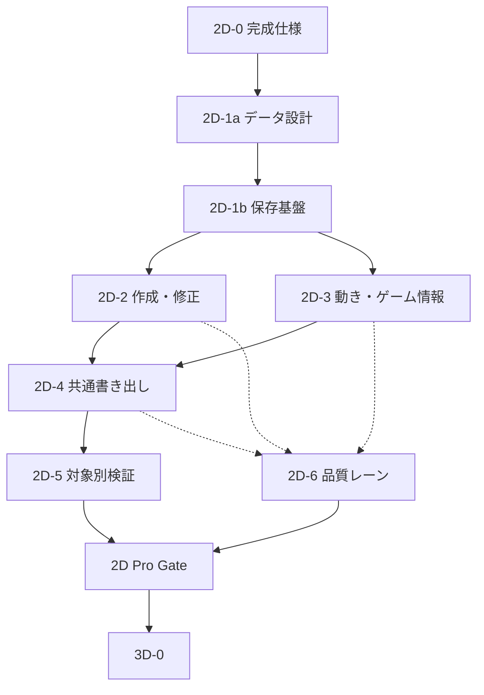

# Chameleon Asset Studio 2D Completion Roadmap

最終更新日: 2026-07-10
対象リポジトリ: `chameleonjp-lab/chameleonassetstudio`
文書種別: 2D 完成までの実装順と品質 gate
状態: accepted（今後の優先順。docs-only）
上位文書: `2D_COMPLETE_PRODUCT_SPEC.md`
関連文書: `2D_ASSET_DATA_CONTRACT.md`, `2D_EXPORT_COMPATIBILITY_MATRIX.md`, `2D_DEVICE_RELIABILITY_SPEC.md`, `docs/future/POST_PHASE17_IMPLEMENTATION_PLAN.md`, `docs/future/THREE_D_ASSET_PREPARATION_REQUIREMENTS.md`

---

> **この文書の決定:** 既存の Phase 22〜28 にある 3D 実装は、2D Pro Gate を通るまで開始しない。
> **今回の変更範囲:** これは順番と完了条件を定める docs-only の更新であり、3D、schema、`.casproj`、export ZIP、dependencies、アプリ本体を変更しない。

## 1. 目的

今の Phase 19〜21 を終えた時点で、2D が完成したように見える状態を避ける。

2D 完成は、画像を取り込む、少し編集する、PNG を出すことではない。次を一続きで通せることとする。

```txt
空から作る / 素材を取り込む
→ 元を残して修正する
→ 動き・原点・判定などを付ける
→ ゲーム内に近い画面で確認する
→ 対象別に書き出す
→ 後日、別端末でも再編集する
```

この文書は、その順番、PR の分け方、品質 gate、3D を再開してよい条件を決める。

## 2. 基本判断

1. 2D Pro Gate を通るまで、3D の library 評価、依存関係追加、画面、schema、実装を始めない。
2. 既存 Phase 18〜28 を削除しない。実装済み範囲と過去の判断として残す。
3. 今後の着手順は、既存の `POST_PHASE17_IMPLEMENTATION_PLAN.md` より本書を優先する。
4. 画像編集ソフト、ゲームエンジン、Spine / Rive / Live2D の完全な代替を一度に作ろうとしない。
5. 共通データの意味を固めてから、対象別の export preset を増やす。
6. 1 PR 1 目的を守る。同じ目的を完成させる実装、tests、docs、CI 安定化は1つにまとめてよい。
7. schema、`.casproj`、export ZIP、dependencies、3D、外部ツール向け出力に触る変更は、設計と review を分ける。
8. 本ロードマップの標準運用は `docs/DEVELOPMENT_MODES.md` の **Hybrid Roadmap Mode** とし、Fable5 は段階開始時の判断、Codex は実装、Opus 4.8 は CI 成功後のレビューに分ける。

## 3. 既存 Phase との対応

| 既存 Phase | 現在の扱い | 2D 完成計画での位置 |
|---:|---|---|
| 18 | docs / 実装 / tests の整合確認として完了済み。 | `2D-0` で新しい文書との参照関係だけを整える。 |
| 19-A | grid / snap は実装済み。 | `2D-2` の精密編集の土台として維持する。 |
| 19-B | 通常反転と反転コピーは実装済み。リグ編集データの反転は未完。 | `2D-3` でデータ契約と焼き込み確認後に扱う。 |
| 19-C | rect / circle の表示、選択、移動、リサイズは実装済み。polygon と frame 別判定は未着手。 | `2D-3` の別設計・別 PR とする。 |
| 20 | padding / extrude、解像度別出力、helper 選択は未完。 | `2D-4` の書き出し基盤へ統合する。 |
| 21 | effect の最小強化は未完。 | `2D-3` と `2D-4` で、再生・検査・出力をまとめて扱う。 |
| 22〜28 | 3D 調査〜外部3D生成連携の旧計画。 | `2D Pro Gate` 後に `3D-0`〜`3D-6` として再開する。 |

## 4. 2D 完成までの段階

各 work package の `2D Pro` 欄は、次の意味で使う。

| 表記 | 意味 |
|---|---|
| `必須` | 2D Pro Gate 前に実装、検証、文書化まで完了する。 |
| `判断必須` | Fable5 または人間が、Gate に含めるか、明示的に未対応 / Gate 後へ送るかを ADR で決める。判断なしに消さない。 |
| `Gate後` | 2D Pro Gate の必須条件ではない。共通契約を壊さず、必要性が確認された後に進める。 |

`判断必須` は「実装しなくてよい」という意味ではない。採用可否、未対応表示、元データ保持、代替手順まで決めて初めて完了とする。

### 2D-0: 完成形と判断材料を固定する

目的: 実装を広げる前に、何を完成と呼ぶか、何をまだ実装しないかを文書でそろえる。

成果物:

- `2D_COMPLETE_PRODUCT_SPEC.md`。
- `2D_ASSET_DATA_CONTRACT.md`。
- `2D_EXPORT_COMPATIBILITY_MATRIX.md`。
- `2D_DEVICE_RELIABILITY_SPEC.md`。
- 本書。
- 既存 future docs、README、決定記録の参照関係。

完了条件:

- 「画像取り込み中心の v1.0」と「2D Pro の完成条件」が混同されない。
- 3D を開始しない条件が明文化される。
- 未決定項目が、実装済みのように書かれていない。

work packages:

| ID | 完成させる内容 | 2D Pro |
|---|---|---|
| `2D-0-DOCS` | 2D 完成形、データ契約、互換性、端末信頼性、ロードマップの5正本を作る。 | 必須 |
| `2D-0-PLAN` | 上位仕様の全項目を work package へ割り当て、担当モデル、依存関係、並行可否、PR gate を固定する。 | 必須 |
| `2D-0-ENTRY` | README、`docs/IMPLEMENTATION_PLAN.md`、`CLAUDE.md`、`AGENTS.md`、運用書、決定記録から現在の計画へ到達できるようにする。 | 必須 |

### 2D-1a: 安全なデータと保存の土台を設計する

目的: 作成・派生・出力を増やしても、既存の `.casproj` とゲーム用データを壊さないようにする。

主な仕事:

- source、編集元、preview、export、検査記録の分離を設計する。
- ID、名前、参照、派生素材、操作履歴、migration の必要条件を決める。
- 保存失敗、容量不足、画像欠落、途中終了、削除復元、端末移動の設計をする。
- coordinate、trim、atlas、flip、scale、frame 別データの意味を fixture で固定する。

完了条件:

- 大きな形式変更が必要な項目は、schema / migration の別 PR として切り出せる。
- 旧 `.casproj` を読む・保存し直す・書き出す時に守る意味が決まる。
- `2D_ASSET_DATA_CONTRACT.md` の未決定項目を、実装対象ごとに ADR へ落とせる。

work packages:

| ID | 完成させる内容 | 主な成果物 | 2D Pro |
|---|---|---|---|
| `2D-1A-BASELINE` | 現行 `0.1.0`、schema、型、`.casproj`、export ZIP、保存処理、旧 fixture の不変条件と不足を固定する。 | baseline report、旧データ fixture、変更影響表 | 必須 |
| `2D-1A-LAYERS` | 元データ、編集元、派生 preview、配布物、検査記録の5層と、Project / Asset Family / Variant、安定 ID、名前、参照、UI 一時状態の境界を決める。 | data ADR、概念 schema、旧 Asset の解釈 | 必須 |
| `2D-1A-COORD` | 左上原点、layer / part transform、pivot、trim、atlas、flip、1x / 2x / 3x、丸めの変換式を fixture で固定する。 | coordinate ADR、変換 fixture、期待値 | 必須 |
| `2D-1A-MOTION` | 可変 frame 時間、event、rig bake、frame / animation 別 collider override、polygon の採否と上書き規則を決める。 | animation / collider ADR、旧 fps / rect / circle 互換表 | 判断必須 |
| `2D-1A-TARGET` | common data と target 固有 extension、unknown data、version、秘密情報禁止、未対応時の無視規則を決める。 | extension ADR、namespace 規則 | 必須 |
| `2D-1A-PROVENANCE` | 元ファイル、ハッシュ、取得元、利用条件、AI 送信先・承認状態を保持する範囲と、保存禁止情報を決める。 | provenance / privacy ADR | 必須 |
| `2D-1A-VALIDATION` | 構造、意味、出力の3段階検証と Asset Contract profile の必須項目、警告 / 停止条件を決める。 | validation contract、error code 一覧 | 必須 |
| `2D-1A-MIGRATION` | version、旧形式移行、未知の新形式、失敗時 rollback、fixture、docs 同時更新の gate を固定する。 | migration plan、互換 matrix、PR template | 必須 |

### 2D-1b: 保存・migration・復旧を実装して固定する

目的: 新規作成、派生素材、出力形式を増やす前に、保存途中の不整合や旧形式の読み込み失敗から戻れる実装を作る。

主な仕事:

- プロジェクト、アセット、画像 Blob、参照関係を、改訂単位または同等の原子的な確定方法で保存する。
- 編集確定時の安全な保存点、破壊的変更前の復旧点、削除からの復元、容量不足と保存失敗の導線を実装する。
- 旧 `.casproj` fixture の migration、読み込み後の再保存・再書き出し、壊れた入力を一時領域で拒否する経路を実装する。
- `.casproj` を可搬バックアップとして出し、クリーンなブラウザ状態で再読み込みする回帰確認を加える。

完了条件:

- 代表プロジェクトで、保存、編集途中の中断後の再開、旧形式 migration、保存失敗、画像欠落、容量不足を、既存の整合した状態を壊さずに扱える。
- 新しい作成・派生・書き出し機能は、この保存基盤を通すまで `2D-2` 以降へ追加しない。
- 保存・migration に触れる PR は、旧データ fixture、unit test、読み込み後の書き出し確認を含む。

work packages:

| ID | 完成させる内容 | 必須確認 | 2D Pro |
|---|---|---|---|
| `2D-1B-REVISION` | Project、Asset、画像 Blob、参照関係を1改訂として確定し、autosave の保存待ち / 中 / 成功 / 失敗を正しく表示する。 | 書込途中中断、同時更新、再起動、最後の整合版 | 必須 |
| `2D-1B-RECOVERY` | 安全な復旧点、破壊的操作前 snapshot、論理削除 / ゴミ箱、復元、保持期間、唯一の復旧点を消さない規則を実装する。 | 削除復元、一括変更 rollback、容量不足 | 必須 |
| `2D-1B-CAPACITY` | storage estimate、永続保存要求の結果、予防警告、整理、`.casproj` 退避導線を実装する。数値を取得できない端末では推測表示しない。 | estimate 有 / 無、quota 超過、保存失敗文言 | 必須 |
| `2D-1B-CASPROJ` | `.casproj` を一時領域で完全検査し、旧形式 migration、欠損 Blob、壊れた ZIP、未知 version を既存 project と分離して扱う。 | old / current / future / corrupt / missing fixture | 必須 |
| `2D-1B-LAYERS` | 元データ、編集元、再生成可能 cache、export record、検査記録を保存上で区別し、正本を誤削除しない。 | cache 再生成、source 保持、export 再生成 | 必須 |
| `2D-1B-INPUT-SAFETY` | ZIP 展開サイズ、件数、圧縮率、相対パス、MIME、画像寸法、JSON 深さなど不正入力の上限を実装する。 | zip bomb、path traversal、巨大画像、壊れた JSON | 必須 |
| `2D-1B-GATE` | 保存・復旧・移行の fixture と回帰 suite を gate 化し、後続 work package が同じ保存経路を使うようにする。 | unit、migration、import / export round-trip | 必須 |

### 2D-2: 素材を新しく作り、取り込み、直せるようにする

目的: 「画像を取り込むだけ」の状態を終え、作り始める入口と修正を完成させる。

主な仕事:

- 空キャンバス、型別テンプレート、図形、パーツ、基本的なピクセル / ラスター編集。
- 選択、塗りつぶし、変形、整列、グリッド、スナップ、パレット、色違い、非破壊に近い修正。
- sprite sheet、tileset、連番などの取り込み方針と、対応範囲の表示。
- 元画像を残したまま、透明な縁、余白、サイズ、命名、frame ずれを検査・修正する。
- linked variant と独立コピーの設計・実装を、必要な順番で進める。

完了条件:

- キャラクター、タイル / 背景、UI または effect のいずれも、空から作る経路と既存画像を直す経路を通せる。
- 新規形式を扱う場合、`editable-import`、`rasterized-import`、`reference-only` の区別が UI と docs に出る。
- 元データ、手動調整、Undo / Redo、保存の安全性が保たれる。

work packages:

| ID | 完成させる内容 | 完成条件 | 2D Pro |
|---|---|---|---|
| `2D-2-PROJECT` | 1 project 内の複数 Asset、Family / Variant、source / edit / preview / export の関係、変更影響と再生成対象を管理する。 | 色違い、左右向き、装備違いを関係付きで開き直せる。 | 必須 |
| `2D-2-CREATE` | 空キャンバス、asset type template、複製、図形、パーツ、文字から作成を開始する。 | character、tile / background、UI または effect を画像なしで開始できる。 | 必須 |
| `2D-2-RASTER` | brush、eraser、fill、selection、shape、text、transform、align、grid、snap のゲーム素材向け基本編集を完成させる。 | mouse / touch / keyboard と Undo / Redo で同じ結果に到達できる。 | 必須 |
| `2D-2-REPAIR` | 透明化、透明縁、trim、余白統一、resize、palette 置換、色違い、flip、outline、frame ずれ修正を提供する。 | 元画像と比較でき、修正を取り消して再適用できる。 | 必須 |
| `2D-2-VARIANT` | linked variant と独立 copy、反転軸、palette、装備差分、解像度差分、手動調整保護、再生成前後比較を実装する。 | 元の変更を反映する範囲を利用者が選べ、手修正を黙って上書きしない。 | 必須 |
| `2D-2-BATCH` | 複数 Asset への安全な一括修正を、対象 preview、除外、実行結果、Undo とともに実装する。 | 対象確認なしに一括変更せず、一部失敗を説明できる。 | 必須 |
| `2D-2-IMPORT-GATE` | PNG / JPEG / WebP、連番、sprite sheet、tileset、既知 atlas bundle を、元データ保持と loss preview 付きで取り込む。 | 形式ごとに保持・変換・失われる情報を表示する。 | 必須 |
| `2D-2-IMPORT-OPTIONAL` | SVG、GIF、APNG、Aseprite、PSD、OpenRaster、Krita の扱いを `editable-import` / `rasterized-import` / `reference-only` / `unsupported` から決める。 | 安全な parser / rasterize 経路か、未対応理由と代替手順がある。 | 判断必須 |
| `2D-2-AI-BOUNDARY` | 背景除去、frame 分割、判定、命名、色違いなど AI 候補を追加する場合の consent、provenance、new layer / variant、Undo を共通化する。 | AI が失敗しても手動作業で完成でき、外部送信を隠さない。 | 判断必須 |

### 2D-3: 動きとゲーム用情報を完成させる

目的: 画像をゲーム内で意味を持つ素材へ変える。

主な仕事:

- onion skin、フレーム複製、可変時間、animation event、方向・反転の扱い。
- origin、anchors、rect / circle、frame 別 collider、必要なら polygon の設計と実装。
- リグ編集データの反転、焼き込み結果、パーツ差し替え、状態候補。
- character、item、background、tile、gimmick、effect、UI / icon の型別検査画面。
- tile collision、背景ループ / parallax、gimmick の動き、effect の duration / blend / anchor の確認。

完了条件:

- アセット種別ごとに、ゲームに必要な情報が足りない時に理由を表示できる。
- 反転、trim、frame、判定、anchor、animation の組み合わせが fixture で一致する。
- polygon や frame 別判定は、schema / export / migration / helper への影響を設計してから追加する。

work packages:

| ID | 完成させる内容 | 完成条件 | 2D Pro |
|---|---|---|---|
| `2D-3-TIMELINE` | frame animation、onion skin、複製、反転、可変時間、loop、名前付き event と安全な JSON payload を実装する。 | 旧 fps animation を保ち、保存・複製・反転・再読込で時間と event が一致する。 | 必須 |
| `2D-3-RIG` | part parent、pivot、bind pose、rotation / scale、part replace、簡易 rig、frame bake、rig data flip を完成させる。 | preview と bake 結果を同じ fixture で比較できる。 | 必須 |
| `2D-3-GAME-DATA` | origin、anchors、rect / circle、tile collision、background loop / parallax、gimmick movement、effect duration / blend / spawn anchor を型別に編集する。 | 各 asset type の必須 game data を保存・再読込・反転できる。 | 必須 |
| `2D-3-COLLIDER-OVERRIDE` | asset 共通 collider を基準に、animation / frame の位置・形・有効状態・追加 / 削除を上書きする規則と UI を実装する。 | 共通 rect / circle と旧 `.casproj` を壊さず、frame 再生中の判定が一致する。 | 判断必須 |
| `2D-3-POLYGON` | 点座標、自己交差、凸凹、頂点順、flip、schema、migration、helper、target 変換を決めた後だけ polygon を追加する。 | ADR と対象別 fixture がない限り `unsupported` のままにする。 | 判断必須 |
| `2D-3-TYPE-PROFILES` | character、item、background、tile、gimmick、effect、UI / icon の Asset Contract profile と、`ui / icon` を正式 type にするかを決める。 | type ごとの必須 / 推奨 / 未対応データと完成状態を表示する。 | 必須 |
| `2D-3-PREVIEW` | 接地、origin、anchor、attack / damage collider、tile 接続・衝突、背景継ぎ目・parallax、gimmick、effect をゲーム内に近い画面で再生する。 | 実 game engine でない範囲を明示し、debug overlay と数値を一致させる。 | 必須 |
| `2D-3-INSPECT` | 画像寸法、透明縁、名前、参照、frame、判定、anchor、tileSize、atlas 余白、type / target 制約を理由と修正方法付きで検査する。 | 自動修正は preview 後に人が確定し、Undo できる。 | 必須 |
| `2D-3-IMPACT` | source を直した時に、影響する variant、animation、preview、export preset、verification record を列挙する。 | 再検査・再書き出しが必要な対象を見落とさない。 | 必須 |
| `2D-3-ADVANCED-RIG` | IK、mesh deform、physics、state machine、専用 runtime を評価する。 | ライセンス、対象版、保存・出力契約を決めるまで実装しない。 | Gate後 |

### 2D-4: 書き出しと検査を完成させる

目的: 作った素材を、手作業のやり直しを最小にしてゲームへ持ち込めるようにする。

主な仕事:

- fixed grid sheet、packed atlas、trim、padding、extrude、multi-page、1x / 2x / 3x の設計と実装。
- generic manifest、対象別 sidecar、README、import notes、verification record。
- Generic Web / Canvas 2D / PixiJS / Phaser の fixture と実行確認。
- 出力前に、名前、画像サイズ、透明、origin、anchor、collider、tile、frame、target 制約を検査する。
- 同じ編集元と preset から意味の同じ結果を再生成できることを確認する。

完了条件:

- 現在の export ZIP と新しい形式の互換性方針が明確である。
- `2D_EXPORT_COMPATIBILITY_MATRIX.md` の P0 対象を、対象バージョン付きで `verified` にできる。
- 失敗した export は、壊れた配布物を残さず理由を表示する。

work packages:

| ID | 完成させる内容 | 完成条件 | 2D Pro |
|---|---|---|---|
| `2D-4-CORE` | 同じ編集元、preset、version から意味の同じ出力を再生成し、途中失敗時に不完全な配布物を確定しない export pipeline を作る。 | file list、hash、warning、失敗理由を再現できる。 | 必須 |
| `2D-4-SHEET` | 連番 PNG、fixed grid sheet、packed atlas、trim、padding、extrude、multi-page を実装し、atlas rotation は検証済み target だけ opt-in にする。 | source size、trim rect、atlas rect、frame order を fixture で確認する。 | 必須 |
| `2D-4-SCALE` | 1x / 2x / 3x、補間、丸め、画像寸法、座標換算を adapter と manifest に記録する。 | 元の共通座標を変えず、origin / anchor / collider が各 scale で一致する。 | 必須 |
| `2D-4-PACKAGE` | PNG、WebP、連番、sheet、atlas、tile package、generic manifest、game JSON、README、import notes、inspection / verification record を構成する。 | 必要ファイル、version、制限、対応表、hash が package 内で一致する。 | 必須 |
| `2D-4-PREFLIGHT` | 構造・意味・target 制約を export 前に検査し、warning と blocking error、未検査範囲を表示する。 | 壊れた参照、名前衝突、Blob 欠落、寸法・atlas 制約を検出する。 | 必須 |
| `2D-4-GENERIC-WEB` | `generic-web-v1` と Canvas 2D profile、最小 HTML、loader、debug overlay を完成させる。 | 対象 browser / version で origin、anchor、rect / circle、animation を確認する。 | 必須 |
| `2D-4-PIXIJS` | 対象 PixiJS 版の texture / atlas JSON、animation / metadata、loader snippet を実装する。 | Chameleon 独自 atlas と PixiJS 用形式を混同せず、実行 fixture が通る。 | 必須 |
| `2D-4-PHASER` | 対象 Phaser 版の sheet / atlas、animation / metadata、loader snippet、必要な tile 情報を実装する。 | frame、animation、origin、tile 制約を実行 fixture で確認する。 | 必須 |
| `2D-4-DOCS` | 出力形式、directory、座標変換、preset version、既知の制限、再検証条件を更新する。 | `docs/EXPORT_FORMATS.md`、matrix、sample、package README が一致する。 | 必須 |

### 2D-5: 対象別の持ち込みを検証済みにする

目的: 対象名だけの対応ではなく、実際に読み込める preset を一つずつ増やす。

主な仕事:

- Unity 2D、Godot 2D、RPG Maker MZ を、対象バージョン・素材種別ごとに fixture で確認する。
- 必要に応じて RPG Maker MV、Tiled、Construct 3、GameMaker、GDevelop、Blender texture prep を増やす。
- 手動 import で情報を安全に再現できない対象だけ、固定版の helper / addon / plugin を検討する。

完了条件:

- `verified` には対象バージョン、手順、fixture、期待結果、証拠、既知の制限がある。
- `candidate`、`import-notes`、`verified`、`unsupported` を混同しない。
- 対象別出力が、共通データの意味を変えない。

work packages:

| ID | 完成させる内容 | verified の証拠 | 2D Pro |
|---|---|---|---|
| `2D-5-EVIDENCE` | preset ID、target / version、OS、検証日、入力 `.casproj`、期待出力、手順、hash、結果、制限、再検証条件を共通形式で保存する。 | repository 内の fixture、verification record、最小 project または再現手順 | 必須 |
| `2D-5-LABELS` | `generic` / `import-notes` / `candidate` / `verified` / `unsupported` と import 側の編集可能性を UI、docs、package で同じ表示にする。 | 現状ラベルと実装状態の照合 test | 必須 |
| `2D-5-UNITY` | 対象 Unity 2D 版で PNG / sheet、slice、pivot、animation、必要な collider を手動手順または固定 helper で再現する。 | target version 付き最小 project、手順、結果、制限 | 必須 |
| `2D-5-GODOT` | 対象 Godot 2D 版で SpriteFrames / AnimatedSprite2D、offset、animation、必要な判定を再現する。 | target version 付き最小 project、手順、結果、制限 | 必須 |
| `2D-5-RPGMZ` | RPG Maker MZ の歩行 character、face、icon、tileset、side-view battler から Gate 対象種別を固定し、寸法、並び、名前、配置先を検証する。 | 種別ごとの fixture、game 内表示、対象版、制限 | 必須 |
| `2D-5-HELPER-GATE` | 手動 import で origin、animation、collider などを安全に再現できない場合だけ helper / addon / plugin の採否を決める。 | library / license / bundle / maintenance 評価と人間承認 | 判断必須 |
| `2D-5-P2-TARGETS` | RPG Maker MV、Tiled、Construct 3、GameMaker、GDevelop、Blender texture prep を対象ごとに追加する。 | 対象版ごとの独立 fixture と手動確認 | Gate後 |
| `2D-5-NATIVE-RIG` | Spine / Rive / Live2D 専用形式の原本参照・変換・再出力を検討する。 | native version、license、runtime、loss 項目を別設計するまで `unsupported` | Gate後 |

### 2D-6: 端末・復旧・品質を通す

目的: 作業中の安心と実際の使いやすさを、最後の品質 gate まで引き上げる。

主な仕事:

- iPhone 17 Pro、iPhone 11 Pro、iPad Pro 2018、iPhone SE 級、Android Chrome、PC ブラウザでの実機確認。
- Files 経由の `.casproj` 移動、保存容量、保存失敗、削除復元、オフライン、更新、壊れた入力の確認。
- 性能 budget、worker、メモリ、アクセシビリティ、キーボード、読み上げ、色以外の識別。
- unit test、migration test、描画比較、E2E、対象別 fixture、手動証跡の整理。

完了条件:

- `2D_DEVICE_RELIABILITY_SPEC.md` の品質 gate を通る。
- 代表プロジェクトが、開始から `.casproj` 再読み込みまで全端末で完走する。
- 未解決の制限を機能内・README・ユーザーガイドで説明できる。

work packages:

| ID | 完成させる内容 | 対象・証拠 | 2D Pro |
|---|---|---|---|
| `2D-6-DEVICE-FLOW` | PC、iPad、スマホで、home、作成 / 取り込み、編集、動き、game data、検査、export、backup、再読込を task 単位で完走できる UI にする。 | iPhone 17 Pro / 11 Pro、iPad Pro 2018、iPhone SE 級、Android Chrome、PC Chrome / Edge / Firefox | 必須 |
| `2D-6-INPUT` | touch、pan、pinch、Apple Pencil、mouse、keyboard、数値入力、software keyboard、safe area、orientation を共存させる。 | 実機手順、E2E、誤操作・入力衝突の記録 | 必須 |
| `2D-6-RECOVERY` | IndexedDB 消去、容量不足、Blob 欠落、save / import 中断、クラッシュ、削除復元、Files / share 経由 `.casproj` を端末横断で確認する。 | failure matrix、復旧結果、失われる範囲、代替手順 | 必須 |
| `2D-6-OFFLINE` | 一度読み込んだ後の offline 起動・編集・保存・export と、安全な app update、外部通信機能の分離を実装・確認する。 | browser / version 別 offline / update fixture | 必須 |
| `2D-6-PERFORMANCE` | `PERFORMANCE_BUDGET`、4096 x 4096、25MB、多 layer / frame / tile、worker、cancel、memory release、軽量 preview を計測する。 | 対象端末、条件、結果、閾値、既知の制限 | 必須 |
| `2D-6-A11Y` | 読み上げ名、status 通知、keyboard 到達、focus、contrast、色以外の識別、tap target、motion reduction を完成させる。 | keyboard、VoiceOver、TalkBack、対象画面チェック | 必須 |
| `2D-6-SECURITY` | SVG / ZIP / JSON / 画像 / `.casproj` を不正入力として検査し、外部送信、API key、token、個人情報、telemetry の境界を確認する。 | security fixture、CSP / HTTPS 方針、秘密情報 scan | 必須 |
| `2D-6-REFERENCE` | character、tile / background、UI または effect で、空から作る経路と既存画像を直す経路の代表 project を完成させる。 | clean browser / 別端末で `.casproj` 再読込、target export、画面録画または手順記録 | 必須 |
| `2D-6-DOCS` | user guide、data / export format、compatibility matrix、release checklist、制限表示、検証日を実装と一致させる。 | docs link check、実装状態との照合、未対応一覧 | 必須 |
| `2D-6-GATE-AUDIT` | unit、migration、描画比較、E2E、実機、外部 target、license、安全性の証拠をまとめ、未解決を隠さず判定する。 | Opus 4.8 review と人間承認記録 | 必須 |

## 5. 実装の依存関係と並行実行

### 5.1 merge の依存関係



実線は、本実装を merge する前に通過が必要な依存関係である。点線の `2D-6` は最後だけにまとめず、各段階と並行して端末、保存、性能、アクセシビリティ、E2E の確認を積み上げる。ただし `2D-6` 自体の完了判定は、`2D-2`〜`2D-5` の完了後に行う。

この順番を逆にして、Unity / Godot / RPG Maker 向けの個別出力を先に増やしてはいけない。trim、origin、flip、frame 別判定、scale の意味が未確定なまま対象を増やすと、後から互換性を壊す。

### 5.2 段階間で並行してよい範囲

| 組み合わせ | 並行可否 | 並行してよい仕事 | merge 前の条件 |
|---|---|---|---|
| `2D-1a` + `2D-6` | 準備のみ可 | 現状性能の基準計測、端末確認表、既存保存障害の fixture 整理。 | 保存方式や schema を先回りして実装しない。 |
| `2D-1b` + `2D-2` / `2D-3` | 準備のみ可 | UI prototype、test case、fixture、対象ファイル調査。 | `2D-1b` 完了前に、新しい永続データを使う本実装を merge しない。 |
| `2D-2` + `2D-3` | 条件付きで可 | 作成・画像編集と、既存形式内の animation / game data 改善を別 PR で進める。 | 同じ型、保存処理、editor state、schema を同時に変更しない。 |
| `2D-2` / `2D-3` + `2D-4` | 設計準備のみ可 | 出力 fixture、期待値、target profile、検査項目の docs 作成。 | 対象データの意味が固まる前に exporter 本体を merge しない。 |
| `2D-4` + `2D-5` | 原則不可 | `2D-5` の外部ツール用検証手順と fixture 候補の準備だけ可。 | common manifest、座標、trim、scale、atlas 契約を `2D-4` で固定する。 |
| `2D-5` の対象別 PR 同士 | 可 | Unity、Godot、RPG Maker MZ などを対象別の branch / fixture / PR に分ける。 | 共通 exporter を変更せず、同時実装は最大2対象にする。 |
| `2D-2`〜`2D-5` + `2D-6` | 可 | 対応画面の accessibility、端末 E2E、性能計測、失敗経路のテスト。 | 機能 PR と品質 PR が同じ UI / storage file を同時変更しない。 |

### 5.3 並行化してはいけない境界

次を変更する PR は**契約レーン**と呼び、同時に1本だけ進める。

- JSON Schema、format version、migration。
- `.casproj` の構造、保存 transaction、復旧点。
- `asset.json` の意味、座標、ID、参照、variant。
- export ZIP、common manifest、atlas の共通契約。
- 共通の依存関係または外部 parser。

契約レーンが open の間、別 PR はその変更後の形式を推測して実装してはいけない。契約レーンを先に merge し、後続 branch を最新の `main` へ合わせてから本実装を続ける。

### 5.4 同時進行数

open にする実装 PR は原則として最大3本とする。

| レーン | 上限 | 例 |
|---|---:|---|
| 契約レーン | 1 | schema / migration / `.casproj` / common export contract |
| 機能レーン | 1 | 空キャンバス、animation event、atlas など1つの完成体験 |
| 品質・検証レーン | 1 | accessibility、端末 E2E、外部ツール fixture、性能計測 |

契約レーンがない期間は、変更ファイルと保存データが重ならない場合に限り、機能レーンを2本までにしてよい。CI 失敗や merge conflict が続いた場合は並行数を1本減らし、原因を解消してから戻す。

## 6. PR の分け方と責務

### 6.1 PR の分け方

| 変更 | PR の扱い |
|---|---|
| 方針、対象、座標、出力の設計 | docs-only PR。実装前に人間確認を通す。 |
| 既存型の範囲内の UI / 修正 / tests | 1つの完成体験として実装・tests・docsを同じ PR にまとめる。 |
| schema / version / migration | 独立した危険 PR。旧データ fixture と review を必須にする。 |
| `.casproj` / export ZIP / atlas | 独立した危険 PR。対象別の回帰確認を含める。 |
| 外部 parser / dependency | ライセンス、商用利用、bundle size、安全性を評価してから別 PR。 |
| target 固有 helper / addon | 対象・対象バージョンごとに fixture と手動検証を付ける。 |
| 3D | 2D Pro Gate 後に、2D と別境界で扱う。 |

### 6.2 本ロードマップの標準モデル運用

開発モードの詳細は `docs/DEVELOPMENT_MODES.md` を正本にする。本ロードマップでは、3つの担当を次のように固定する。

| 担当 | 役割 | 使う時 | しないこと |
|---|---|---|---|
| Claude Code / Fable5 | Director | 段階開始時の仕様、優先順位、UX、データ境界、複雑な trade-off の決定。 | ファイル探索、長い差分確認、コード実装、CI 修正。 |
| Codex | Implementation Owner | 決定済み work package のコード、tests、docs、PR、CI 修正。 | 未確定仕様の推測、契約変更の独断、最終 merge。 |
| Claude Code / Opus 4.8 | Quality Reviewer | CI 成功後の仕様違反、UI / UX、互換性、test gap、将来リスクのレビュー。 | 通常のコード実装、CI 失敗中の反復レビュー、独断 merge。 |

Fable5 が利用できない場合、Fable5 の判断を Codex や Opus 4.8 が代行して確定してはいけない。未決定事項を人間確認へ戻し、確定済みの work package だけ Codex が進める。

Opus 4.8 の `BLOCKER` / `MUST` が残る PR は merge しない。修正は Codex が同じ PR へ追加し、CI を再実行してから Opus 4.8 が該当点を再確認する。最終 merge は人間が判断する。

Claude Code だけで完結させる必要がある場合は、`docs/DEVELOPMENT_MODES.md` の Claude Code Primary Mode を選び、Sonnet5 を実装担当にしてよい。ただし本ロードマップの既定は、Fable5 + Codex + Opus 4.8 の Hybrid Roadmap Mode とする。

### 6.3 段階別の担当と並行レーン

| 段階 | 段階開始時の判断 | 実装・成果物の主担当 | CI 成功後のレビュー | 並行してよい段階 |
|---|---|---|---|---|
| `2D-0` | Fable5 または人間 | Codex が docs を整備 | Opus 4.8 が文書矛盾を確認 | 完了済み。 |
| `2D-1a` | **Fable5 必須級**。座標、ID、variant、migration、復旧境界を決める。 | Codex は決定を ADR、fixture、設計 docs へ反映する。 | Opus 4.8 が互換性と移行リスクを確認する。 | `2D-6` の基準計測・fixture 整理だけ。 |
| `2D-1b` | Fable5 は未決定事項が残る時だけ。 | **Codex** が保存、migration、復旧、tests を実装する。 | **Opus 4.8 必須**。保存破損、旧形式、失敗経路を確認する。 | `2D-2` / `2D-3` の prototype と test 設計、`2D-6` の基準作り。 |
| `2D-2` | Fable5 が作成体験と work package の優先順位を段階開始時に決める。 | **Codex** が作成・取り込み・修正を完成体験単位で実装する。 | Opus 4.8 が非破壊性、Undo / Redo、mobile UX、test gap を確認する。 | 契約が重ならない `2D-3`、対象画面の `2D-6`。 |
| `2D-3` | 新しいデータ意味、polygon、frame 別判定、rig の判断時だけ Fable5。 | **Codex** が確定済みの animation / game data slice を実装する。 | **Opus 4.8 必須**。座標、反転、判定、export 影響を確認する。 | 契約が重ならない `2D-2`、`2D-4` の fixture 設計、`2D-6`。 |
| `2D-4` | **Fable5 必須級**。common manifest、target 優先度、直接生成しない範囲を固定する。 | **Codex** が packer、exporter、検査、generic profile を実装する。 | **Opus 4.8 必須**。互換性、再生成性、既存 ZIP への影響を確認する。 | `2D-5` の手順準備と `2D-6`。target 実装はまだ始めない。 |
| `2D-5` | Fable5 は対象順または plugin 採否の判断時だけ。 | **Codex** が対象別に1 target 1 PRで preset、fixture、docs を作る。 | **Opus 4.8 必須**。対象バージョンと証拠を確認する。 | target PR を最大2本、加えて `2D-6`。 |
| `2D-6` | Fable5 は品質と範囲の trade-off が必要な時だけ。 | **Codex** が自動検証・修正・docs を担当し、人間が実機を確認する。 | Opus 4.8 が全体品質と未解決リスクを監査する。 | `2D-2`〜`2D-5` と継続並行。最終完了は最後。 |
| `2D Pro Gate` | Fable5 が証拠の要約と未解決判断を整理する。 | 新規実装を行わない。 | Opus 4.8 が gate 証拠を最終レビューする。 | 人間承認後だけ `3D-0`。 |

`Fable5 必須級` は、Fable5 が利用できない時に作業全体を停止する意味ではない。判断済みの調査、fixture、テスト準備は続けてよいが、未確定の契約や UX を Codex が推測して本実装へ進めてはいけない。

### 6.4 work package の開始条件

Codex へ渡す前に、Fable5 または人間が次を1枚の handoff として固定する。

1. work package ID と対象段階。
2. 今回完成させる利用者体験を1つ。
3. 変更してよいデータ、変更してはいけないデータ。
4. 変更予定ファイルと、競合する open PR。
5. acceptance criteria、必要な unit / E2E / fixture / 実機確認。
6. `asset.json`、`.casproj`、export ZIP、JSON Schema、version への影響。
7. 並行してよいレーンと、先に merge が必要な PR。
8. 今回やらないこと。

未決定項目が残る場合は、Codex が実装を始めず質問として返す。Fable5 はこの handoff と判断点だけを読み、リポジトリ全体や長い差分を毎回読み直さない。

### 6.5 1 work package の完了ループ

```txt
Fable5 または人間が判断を固定
        ↓
Codex が code + tests + docs を1つの draft PRへ実装
        ↓
CI 成功
        ↓
Opus 4.8 が review-only で確認
        ↓
BLOCKER / MUST があれば Codex が同じ PRで修正
        ↓
CI 再成功 + Opus 4.8 再確認
        ↓
人間が merge
```

細かな関数やファイルごとに PR を分けない。1つの利用者体験または1つの危険な契約変更を work package とし、それを完成させる実装、tests、docs、CI 修正は同じ PR に含める。

### 6.6 直近の実行キュー

本ロードマップ承認後は、次の順で着手する。表の ID は、依頼文、branch、PR、handoff で共通に使う。複数 ID を1 PRへまとめるのは、同じ契約または同じ利用者体験を完成させ、別々に merge すると中間状態が壊れる場合だけとする。

| 順番 | work package / PR group | 内容 | 担当 | 並行可否 |
|---:|---|---|---|---|
| 0 | `2D-0-DOCS` + `2D-0-PLAN` + `2D-0-ENTRY` | 上位4仕様、要件割当、担当、並行条件、入口 docs、決定記録を merge し、`2D-0` を完了する。 | Codex 更新、Opus 4.8 review、人間 merge | 他の本実装を merge しない。 |
| 1 | `2D-1A-BASELINE` | 現行 `0.1.0`、型、schema、storage、export、旧 fixture の事実と不変条件を調査・固定する。 | Codex 調査、Fable5 判断対象を抽出、Opus 4.8 review | 基準計測と UI / test 準備だけ可。 |
| 2 | `2D-1A-LAYERS` + `2D-1A-COORD` | 正本・派生・Family / Variant と、座標・trim・flip・scale 契約を docs / ADR / fixture で固定する。 | Fable5 判断、Codex docs / fixture、Opus 4.8 review | 契約レーンはこの1本だけ。 |
| 3 | `2D-1A-MOTION` | animation event、rig bake、collider override、polygon の採否と互換規則を固定する。 | Fable5 判断、Codex docs / fixture、Opus 4.8 review | `2D-1A-TARGET` と同時に進めない。 |
| 4 | `2D-1A-TARGET` + `2D-1A-PROVENANCE` + `2D-1A-VALIDATION` + `2D-1A-MIGRATION` | target extension、来歴・秘密情報、Asset Contract 検証、version / migration gate を確定する。 | Fable5 判断、Codex docs / fixture、Opus 4.8 review | 契約レーンはこの1本だけ。 |
| P | `2D-6-PERFORMANCE` / `2D-6-A11Y` の baseline | 現状性能、端末、keyboard / reader、保存失敗の再現値を記録する。 | Codex + 人間実機確認 | product code、schema、storage を変えない準備だけ可。 |
| P | `2D-2-CREATE` / `2D-2-RASTER` の準備 | 既存コード調査、UI prototype、acceptance test、変更ファイル候補を作る。 | Codex | 永続データを増やす本実装は `2D-1b` 後。 |
| 5 | `2D-1B-REVISION` + `2D-1B-LAYERS` | 改訂単位の整合保存と、source / edit / cache / export record の保存境界を実装する。 | Codex 実装、Opus 4.8 必須 review | baseline / prototype 準備だけ並行可。 |
| 6 | `2D-1B-RECOVERY` + `2D-1B-CAPACITY` | 復旧点、trash、rollback、容量警告、永続保存結果、`.casproj` 退避導線を実装する。 | Codex 実装、Opus 4.8 必須 review | 契約・storage を触らない品質準備だけ。 |
| 7 | `2D-1B-CASPROJ` + `2D-1B-INPUT-SAFETY` + `2D-1B-GATE` | staged import、migration、不正 ZIP / JSON / 画像上限と保存回帰 gate を完成させる。 | Codex 実装、Opus 4.8 必須 review | merge 後に初めて `2D-2` / `2D-3` 本実装へ進む。 |
| 8A | `2D-2-PROJECT` + `2D-2-CREATE` | 複数 Asset / Family / Variant の入口と、空キャンバス・最初の template を保存・再読込まで完成させる。 | Codex、Opus 4.8 review | 変更ファイルが分離できれば 8B と品質レーンを並行可。 |
| 8B | `2D-3-TYPE-PROFILES` + `2D-3-INSPECT` | 最初の type profile と、既存 game data の理由付き検査体験を完成させる。 | Codex、Opus 4.8 review | 8A と同じ型・storage・editor fileを変更しない時だけ本実装可。 |
| 9 | `2D-2-RASTER` + `2D-2-REPAIR` | 描画・選択・変形・整列と、背景除去、crop / trim、色、輪郭、隙間などの非破壊修正を、Undo / Redo と比較を含めて完成させる。 | Codex、Opus 4.8 review | `2D-3-TIMELINE` と変更ファイル・editor state が分離できる時だけ並行可。 |
| 10 | `2D-2-VARIANT` + `2D-2-BATCH` | 色、向き、装備、解像度、animation の派生と、安全な一括変更、手動調整保護、影響 preview を完成させる。 | Codex、仕様判断時だけ Fable5、Opus 4.8 review | schema / variant 契約を変える場合は契約レーン1本に戻す。 |
| 11 | `2D-2-IMPORT-GATE` + `2D-2-IMPORT-OPTIONAL` + `2D-2-AI-BOUNDARY` | PNG / JPEG / WebP と `.casproj` を完成させ、任意形式と AI 候補は採否、loss、consent、provenance、手動代替を明示する。 | Fable5 が判断、Codex 実装・docs、Opus 4.8 review | 外部 parser / API は独立PR。人間承認なしに dependency や外部送信を追加しない。 |
| 12 | `2D-3-TIMELINE` + `2D-3-RIG` | timeline、onion skin、可変 frame 時間、event、part / bone / state と bake を完成させる。 | Codex、契約変更時だけ Fable5、Opus 4.8 review | `2D-2` と同じ保存型を変えない時だけ並行可。 |
| 13 | `2D-3-GAME-DATA` + `2D-3-COLLIDER-OVERRIDE` + `2D-3-POLYGON` | origin、anchor、rect / circle、frame 別上書きを完成させ、polygon は ADR の採否どおり実装または明示的未対応にする。 | Fable5 が判断、Codex 実装、Opus 4.8 必須 review | collider schema を変える期間は契約レーン1本。 |
| 14 | `2D-3-PREVIEW` + `2D-3-IMPACT` | 8B の型別検査を character、tile / background、UI / effect のゲーム風 preview へ統合し、修正影響と再検証を完成させる。 | Codex、Opus 4.8 review | 対象画面の `2D-6` 品質PRを1本並行可。 |
| 15 | `2D-4-CORE` + `2D-4-SHEET` + `2D-4-SCALE` | 同じ入力・設定から同じ出力を作る core、sheet / atlas、trim / spacing / duplicate、scale と rounding を固定する。 | Fable5 が契約確認、Codex 実装、Opus 4.8 必須 review | common export 契約レーンのみ。target 実装は開始しない。 |
| 16 | `2D-4-PACKAGE` + `2D-4-PREFLIGHT` + `2D-4-GENERIC-WEB` | manifest、report、verification record、package README、理由付き preflight、Generic Web / Canvas 2D fixture を完成させる。 | Codex、Opus 4.8 必須 review | `2D-5-EVIDENCE` の文書・fixture準備だけ可。 |
| 17 | `2D-4-PIXIJS` + `2D-4-PHASER` + `2D-4-DOCS` | 対象バージョン付き PixiJS / Phaser package と実行 fixture を完成させ、形式・制限・再検証条件を文書化する。 | Codex、Opus 4.8 必須 review | PixiJS と Phaser は common exporter を変更しない時だけ最大2本並行可。 |
| 18 | `2D-5-EVIDENCE` + `2D-5-LABELS` | target 検証証拠の形式と `generic` / `candidate` / `verified` / `unsupported` 等の表示を UI・docs・package で統一する。 | Codex、Opus 4.8 review | target PR の前提。実ツール手順の準備は可。 |
| 19 | `2D-5-UNITY` + `2D-5-GODOT` | Unity 2D と Godot 2D へ実際に持ち込み、origin、animation、必要な collider を対象版付きで検証する。 | Codex + 人間実ツール確認 + Opus 4.8 review | target別PRを最大2本。common exporter は変更しない。 |
| 20 | `2D-5-RPGMZ` + `2D-5-HELPER-GATE` | Gate 対象の RPG Maker MZ 素材種別を実機能で検証し、helper が必要かを証拠に基づいて決める。 | Fable5 / 人間が判断、Codex、Opus 4.8 review | Unity / Godot の未解決で共通契約を変える間は開始しない。 |
| 21A | `2D-6-DEVICE-FLOW` + `2D-6-INPUT` | PC / iPad / スマホの全工程と touch / Pencil / mouse / keyboard / orientation を対象端末で完走する。 | Codex + 人間実機確認 + Opus 4.8 review | 同じ画面を変更しない範囲で21Bまたは21Cの計測を並行可。 |
| 21B | `2D-6-RECOVERY` + `2D-6-OFFLINE` | 保存中断、容量不足、欠落、trash、staged import、別端末移動、offline 起動・保存・export、安全な update を通す。 | Codex + 人間実機確認 + Opus 4.8 必須 review | storage / service worker を変更するPRは契約レーン1本。 |
| 21C | `2D-6-PERFORMANCE` + `2D-6-A11Y` + `2D-6-SECURITY` | 4096px / 25MB、多layer / frame、worker / memory、読み上げ・keyboard、不正入力・秘密情報の試験を通す。 | Codex + 人間実機確認 + Opus 4.8 review | product codeを変えない計測は21A / 21Bと並行可。修正時はレーン上限に従う。 |
| 22 | `2D-6-REFERENCE` + `2D-6-DOCS` + `2D-6-GATE-AUDIT` | 代表 project、別端末再読込、target export、全証拠、docs整合、既知の制限をまとめて Gate 判定可能にする。 | Codex 集約、Opus 4.8 最終audit | 新機能を追加せず、MUST / BLOCKER の解消に集中する。 |
| 23 | `2D Pro Gate` | 必須 package、判断必須 ADR、CI、実機・target証拠、文書を確認し、人間が2D完成と3D開始可否を判断する。 | Opus 4.8 review + 人間承認 | 承認後だけ `3D-0`。 |

すべての `2D-1A-*` が accepted になる前に `2D-1B-*` を開始しない。`2D-1B-GATE` が merge されるまで、`2D-2-*` と `2D-3-*` は調査、prototype、test 設計に留め、本実装 PR を open しない。

`2D-3-ADVANCED-RIG`、`2D-5-P2-TARGETS`、`2D-5-NATIVE-RIG` は `Gate後` backlog であり、上の完成キューには含めない。2D Pro Gate 承認後、人間が2D拡張と `3D-0` の優先順位を改めて決める。

本書に新しいアイデアがあっても、実装担当が独断で `asset.json`、`.casproj`、export ZIP、dependencies、3D、外部 API を変えてはいけない。

## 7. 上位仕様とのトレーサビリティ

上位仕様の要件は、次の work package で実装・判断・検証する。`必須` work package を削除・延期する場合、先に該当する上位仕様と本表を変更し、人間確認を通す。

| 上位仕様 | 要件範囲 | 対応 work package |
|---|---|---|
| Complete Product §§1〜4 | ローカル中心の完成形、品質目標、対象外、対象利用者、正本から再生成する一連の制作フロー | `2D-0-DOCS`, `2D-0-PLAN`, `2D-1A-LAYERS`, `2D-2-PROJECT`, `2D-6-REFERENCE` |
| Complete Product §5.1 | 複数 Asset、Family / Variant、正本と派生、保存・backup・復元 | `2D-1A-LAYERS`, `2D-1B-LAYERS`, `2D-2-PROJECT`, `2D-2-VARIANT`, `2D-6-RECOVERY` |
| Complete Product §5.2 | 空作成、template、図形・文字・parts、画像・連番・sheet・tileset・外部形式 | `2D-2-CREATE`, `2D-2-RASTER`, `2D-2-IMPORT-GATE`, `2D-2-IMPORT-OPTIONAL` |
| Complete Product §5.3 | 編集、修正、一括変更、非破壊、比較、Undo / Redo | `2D-2-RASTER`, `2D-2-REPAIR`, `2D-2-BATCH`, `2D-2-VARIANT` |
| Complete Product §5.4 | animation、rig、origin、anchor、collider、tile / background / gimmick / effect | `2D-1A-MOTION`, `2D-3-TIMELINE`, `2D-3-RIG`, `2D-3-GAME-DATA`, `2D-3-COLLIDER-OVERRIDE`, `2D-3-POLYGON` |
| Complete Product §5.5 | ゲーム内に近い preview、型別検品、理由付き修正案 | `2D-3-TYPE-PROFILES`, `2D-3-PREVIEW`, `2D-3-INSPECT`, `2D-3-IMPACT` |
| Complete Product §5.6 | 汎用 / 対象別 export、再生成、manual import 優先 | `2D-4-CORE`〜`2D-4-DOCS`, `2D-5-EVIDENCE`〜`2D-5-HELPER-GATE` |
| Complete Product §6 | Asset Contract、変更影響、target / version / warning / verification | `2D-1A-VALIDATION`, `2D-3-TYPE-PROFILES`, `2D-3-IMPACT`, `2D-4-PREFLIGHT`, `2D-5-EVIDENCE` |
| Complete Product §7 | AI を候補に限定、consent、provenance、秘密情報禁止、手動復帰 | `2D-1A-PROVENANCE`, `2D-2-AI-BOUNDARY`, `2D-6-SECURITY` |
| Complete Product §8 | 代表制作、game data 保持、target、全端末、復旧、品質確認 | `2D-6-REFERENCE`, `2D-5-UNITY`, `2D-5-GODOT`, `2D-5-RPGMZ`, `2D-6-GATE-AUDIT` |
| Complete Product §§9〜10 | 3D 凍結、2D と3Dの境界、文書の優先関係、段階別PR | `2D-0-ENTRY`, `2D-1A-BASELINE`, `2D-6-GATE-AUDIT`, 本書 §5〜10 |
| Data Contract §§1〜2 | 編集元を正本にする、元データ保持、意味の固定、target 分離、旧形式互換、UI 一時状態の分離 | `2D-1A-BASELINE`, `2D-1A-LAYERS`, `2D-1A-TARGET`, `2D-1A-MIGRATION`, `2D-1B-LAYERS` |
| Data Contract §§3〜5 | 5層、Family / Variant、現行 `0.1.0`、ID・名前・参照 | `2D-1A-BASELINE`, `2D-1A-LAYERS`, `2D-1B-LAYERS`, `2D-2-PROJECT` |
| Data Contract §6 | 座標、transform、trim、atlas、flip、rounding、scale | `2D-1A-COORD`, `2D-2-REPAIR`, `2D-4-SHEET`, `2D-4-SCALE` |
| Data Contract §7 | 色・向き・装備・解像度・animation 派生と手動調整保護 | `2D-2-VARIANT`, `2D-2-BATCH`, `2D-3-IMPACT` |
| Data Contract §8 | frame / animation、可変時間、event、part / rig / state | `2D-1A-MOTION`, `2D-3-TIMELINE`, `2D-3-RIG`, `2D-3-ADVANCED-RIG` |
| Data Contract §9 | rect / circle、frame override、polygon、target collider | `2D-3-GAME-DATA`, `2D-3-COLLIDER-OVERRIDE`, `2D-3-POLYGON`, `2D-5-UNITY`, `2D-5-GODOT` |
| Data Contract §10 | target extension、namespace、unknown data、secret 禁止 | `2D-1A-TARGET`, `2D-4-PACKAGE`, `2D-5-LABELS` |
| Data Contract §11 | provenance、AI 利用記録、不正入力 | `2D-1A-PROVENANCE`, `2D-1B-INPUT-SAFETY`, `2D-6-SECURITY` |
| Data Contract §12 | 構造・意味・出力検証 | `2D-1A-VALIDATION`, `2D-3-INSPECT`, `2D-4-PREFLIGHT` |
| Data Contract §13 | version、migration、旧 fixture、rollback、docs 同期 | `2D-1A-MIGRATION`, `2D-1B-CASPROJ`, `2D-1B-GATE`, `2D-6-RECOVERY` |
| Compatibility §1 | 入力、再編集可能性、出力、対象版、保証外を分離し、直接連携より安全な file + docs を優先 | `2D-2-IMPORT-GATE`, `2D-4-PACKAGE`, `2D-4-DOCS`, `2D-5-LABELS` |
| Compatibility §§2〜4 | capability labels、verified 条件、入力形式と loss 表示 | `2D-2-IMPORT-GATE`, `2D-2-IMPORT-OPTIONAL`, `2D-5-EVIDENCE`, `2D-5-LABELS` |
| Compatibility §5 | PNG / WebP / sequence / sheet / atlas / tile / manifest / docs / record | `2D-4-CORE`, `2D-4-SHEET`, `2D-4-SCALE`, `2D-4-PACKAGE`, `2D-4-DOCS` |
| Compatibility §6 P0 | Generic Web / Canvas 2D / PixiJS / Phaser | `2D-4-GENERIC-WEB`, `2D-4-PIXIJS`, `2D-4-PHASER` |
| Compatibility §6 P1 | Unity 2D / Godot 2D / RPG Maker MZ | `2D-5-UNITY`, `2D-5-GODOT`, `2D-5-RPGMZ`, `2D-5-HELPER-GATE` |
| Compatibility §6 P2 / 対象外 | MV / Tiled / Construct / GameMaker / GDevelop / Blender、Spine / Rive / Live2D | `2D-5-P2-TARGETS`, `2D-5-NATIVE-RIG` |
| Compatibility §§7〜9 | 公式版固定、順番、target 別 PR、再検証 | `2D-1A-TARGET`, `2D-4-DOCS`, `2D-5-EVIDENCE`, `2D-5-LABELS` |
| Device §§1〜2 | ローカル中心、端末別UIと共通データ、状態表示、元解像度保持、必ず戻れる操作 | `2D-1B-REVISION`, `2D-1B-LAYERS`, `2D-2-REPAIR`, `2D-2-BATCH`, `2D-6-DEVICE-FLOW` |
| Device §§3〜4 | PC / iPad / smartphone、touch / pointer / keyboard | `2D-6-DEVICE-FLOW`, `2D-6-INPUT`, `2D-6-A11Y` |
| Device §5 | 保存状態、backup、復旧、trash、capacity、staged import | `2D-1B-REVISION`〜`2D-1B-CASPROJ`, `2D-6-RECOVERY` |
| Device §§6.1〜6.3 | 4096px / 25MB、worker、memory、性能 budget | `2D-6-PERFORMANCE` |
| Device §6.4 | offline 基本経路と安全な update | `2D-6-OFFLINE` |
| Device §7 | accessibility | `2D-6-A11Y` |
| Device §8 | privacy、不正入力、秘密情報、外部送信 | `2D-1B-INPUT-SAFETY`, `2D-6-SECURITY` |
| Device §§9〜10 | 実機 gate、証拠、PR 分割 | `2D-6-REFERENCE`, `2D-6-DOCS`, `2D-6-GATE-AUDIT`, 本書 §5〜6 |

この表に対応 work package がない要件を見つけた場合、その要件を実装対象外と解釈してはいけない。先に本ロードマップへ work package、依存関係、担当、完了条件を追加する。

## 8. 2D Pro Gate

次のすべてを満たすまで、3D を始めない。

### 8.1 制作体験

- キャラクター、タイル / 背景、UI または effect の代表素材で、空から作る経路と既存画像を直す経路を通せる。
- 元データを残し、派生素材、動き、origin、anchor、collider、検査、書き出し、再編集を一貫して扱える。
- 変更の影響、未設定のゲーム用情報、未検証の対象を説明できる。

### 8.2 互換性

- Generic Web、Canvas 2D、PixiJS、Phaser を、対象バージョン付きの fixture で実行確認している。
- Unity 2D、Godot 2D、RPG Maker MZ は、直接連携なしでよいが、指定した素材種別を実際に持ち込んで確認している。
- `candidate` や説明だけの対象を、互換対応の数に入れない。

### 8.3 信頼性

- PC、iPad、スマホで、作成、編集、検査、書き出し、`.casproj` 再読み込みを終えられる。
- 旧 `.casproj`、画像欠落、保存失敗、容量不足、壊れた読み込み、削除復元、オフラインの動作が説明・確認されている。
- 性能、アクセシビリティ、ライセンス、安全性の記録がある。

### 8.4 文書と承認

- 本書のすべての `必須` work package が、実装、tests、証拠、docsを含めて accepted / merged になっている。
- すべての `判断必須` work package に承認済み ADR があり、採用、`unsupported`、または Gate 後のいずれかと、その理由・代替手順・元データ保持方針が UI と docs に反映されている。
- `Gate後` の package を未実装のままでもよいが、2D Pro の対応数や完成証拠へ含めない。
- README、ユーザーガイド、データ形式、出力形式、互換性表、release checklist に矛盾がない。
- 実装済み、候補、未対応、既知の制限が区別されている。
- 必須 CI、unit、migration、描画比較、E2E、実機、target fixture が成功し、Opus 4.8 の `BLOCKER` / `MUST` が残っていない。
- 人間が gate の証拠を確認し、3D を始めることを明示的に承認する。

## 9. 3D の再開位置

2D Pro Gate の承認後にだけ、既存の3D計画を次の名称で再開する。

| 再開後の段階 | 旧 Phase | 内容 |
|---|---:|---|
| `3D-0` | 22 | GLB / glTF library、ライセンス、bundle、2D との境界を調査する。 |
| `3D-1` | 23 | GLB / glTF の読み込みと別画面の表示。 |
| `3D-2` | 24 | 3D のファイルサイズ、polygon、texture、bounds の検品。 |
| `3D-3` | 25 | 3D の原点、足元、anchor、collider の metadata。 |
| `3D-4` | 26 | GLB / metadata / report の書き出し。 |
| `3D-5` | 27 | 軽量化の採用可否。 |
| `3D-6` | 28 | 外部3D生成との接続設計。 |

3D を始めても、2D の初期 bundle に重い3D依存を混ぜない。2D の `asset.json`、`.casproj`、export ZIP、E2E、操作画面を3D都合で変更しない。

## 10. この文書の更新条件

次の場合に本書を更新する。

- 2D 段階の完了・延期・分割が決まった時。
- schema / migration / export / external target の設計 PR を承認した時。
- 2D Pro Gate の証拠や対象端末が変わった時。
- 3D を開始する人間承認が出た時。

個別機能の実装 PR では、必要な段階、品質 gate、未解決項目へのリンクを追加する。段階名だけを完了扱いにして、実際の fixture・実機・互換性の確認を省略してはいけない。
