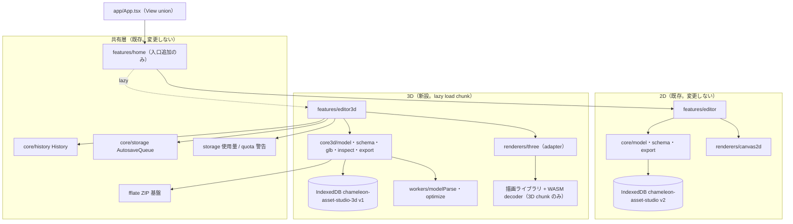

# 3D Architecture and Boundaries（2D/3D 境界と 3D 構成）

状態: **draft / human review required**
最終更新日: 2026-07-19
調査基準commit: `7018984ba9e6867c6fab12fb313308218a35c22b`
上位文書: `README.md`（本ディレクトリ）
関連文書: `3D_ASSET_DATA_CONTRACT.md`, `3D_PERFORMANCE_DEVICE_SECURITY_LICENSE_SPEC.md`, `3D_FOUR_STAGE_IMPLEMENTATION_PLAN.md`

> **この文書は 3D 実装開始の承認ではない。** 2D Pro Gate の人間承認前に、ここに書いた module・route・renderer を実装してはいけない。

---

## 1. 目的

3D 機能を「どこに、どう置くか」を決める。最重要の目標は次の 2 つである。

1. 2D 機能を一切壊さない（コード・データ・bundle・テストのすべてで）。
2. 3D の重い依存（描画ライブラリ、WASM decoder）を、3D 画面を開くまで読み込まない。

---

## 2. 現行構成の事実（調査結果）

2026-07-19 の調査（基準commit `7018984`）で確認した現行実装:

- ルーティングは React Router ではなく、`src/app/App.tsx` の独自 `View` union（`home` / `editor` の 2 画面）。画面の遅延読み込み（lazy load）は**未実装**（すべて直接 import）。
- 状態管理は React state + `History` クラス（`src/core/history/history.ts`。async undo/redo エントリ、`useSyncExternalStore` で購読）。
- 保存は IndexedDB `chameleon-asset-studio` DB_VERSION 2（`src/core/storage/db.ts`。projects / assets / blobs / trash / snapshots / quarantine の 6 store）+ `AutosaveQueue`（debounce 800ms、直列実行）。
- `.casproj` は fflate による ZIP（`src/core/storage/casproj.ts`。`CasprojError` の code に `input-limit` / `unsafe-input` を持つ段階的検証）。
- 画像取り込みは 25MB / 4096px 上限 + magic number 検証（`src/core/images/importImage.ts`, `imageInputSafety.ts`）。
- renderer は Canvas 2D のみ（`src/renderers/canvas2d/`。PixiJS は dependencies に無い）。
- Worker は 2 本（`src/workers/imageOps.worker.ts`, `imageAnalysis.worker.ts`。progress / done / error のメッセージ形式、Transferable 転送）。
- テストは unit 61+ ファイル（Vitest + fake-indexeddb）、E2E 28 ファイル（Playwright）。CI は `.github/workflows/ci.yml` で md のみの変更なら build/test をスキップ。
- src 内に 3D 関連コード・型・入口は存在しない。

---

## 3. 2D と 3D の境界（全体方針）

`../PRODUCT_DIRECTION_2D_TO_3D.md`（ADR-2026-07-07-004）の決定を維持する。

| 項目 | 方針 |
|---|---|
| 入口 | 同じ Home / Project Dashboard から入る（2D プロジェクトと 3D プロジェクトを 1 つの一覧で見せる） |
| 編集画面 | 完全分離。2D editor に 3D を混ぜない。3D 専用画面群を別 route として追加 |
| データ | 完全分離（`3D_ASSET_DATA_CONTRACT.md` 2 章）。型は `src/core3d/` 名前空間、schema は新規ファイル、DB は別 DB、プロジェクトファイルは `.cas3dproj` |
| bundle | 3D chunk を分離。2D 初期 bundle に 3D 依存を含めない（6 章） |
| renderer | 分離。Canvas 2D 層に 3D の知識を追加しない。3D は WebGL renderer adapter（7 章） |
| リポジトリ | 当面同一（ADR-2026-07-07-005 の分離条件を維持。12 章） |

### 共有してよいもの / 分離するもの

| 共有する（再利用） | 分離する（新設） |
|---|---|
| Home 画面の一覧・作成 UI の骨格 | 編集画面すべて |
| UI 部品の見た目・言葉遣い（ボタン、パネル、warning 表示規則） | 型・schema・validation の中身 |
| fflate による ZIP 読み書きの基盤関数 | `.cas3dproj` の parser / writer 本体 |
| `AutosaveQueue`・`History` クラス（汎用クラスとして） | それらに渡すタスクの中身 |
| storage 使用量・quota 警告・persistent storage の仕組み | IndexedDB の DB / store 定義 |
| migration の方式（`Migration` interface の型） | migration 配列と version 定数 |
| エラー分類の考え方（input-limit / unsafe-input / quarantine） | 3D 入力検証の実装 |
| CI・E2E・fixture の運用ルール | 3D の test / fixture 本体 |

再利用の原則: **2D のファイルを 3D のために変更しない**。汎用クラス（`History` / `AutosaveQueue` / fflate ラッパー）は import して使うだけにし、変更が必要になったら 3D 側にコピーまたはラップして解決する。既存ファイルの変更が避けられない場合は、その work package を「2D 接点あり」と明示し、Opus レビューと 2D 回帰 E2E を必須にする（`3D_FOUR_STAGE_IMPLEMENTATION_PLAN.md` の共通規則）。

2026-07-20 改訂の追加規則（⚠️ 整合注意 `3D-RISK-04`）: `src/core/images` の**純関数（画像 ops・解析）も読み取り専用 import で再利用してよい**（テクスチャ編集ブリッジ `3D-STAGE3-12` が使用。interop 仕様 7 章）。再利用する関数は「互換 API リスト」として文書化し、2D 側の変更で 3D が静かに壊れない体制（CI 全件実行）を保つ。2D 側関数のシグネチャ・挙動の変更が必要になった場合は 2D を変更せず、core3d 側にラップまたはコピーする。ESLint の import 制限は「2D → 3D の import 禁止」のままとし、逆方向（3D → 2D の純関数 import）は許可リストで管理する。VRM 用ライブラリ（three-vrm。採用時）と WebXR 関連コードは 3D chunk 内に置き、通常の 3D 利用でも未使用時は動的ロードしない。

---

## 4. module 構成（候補）

```txt
src/
├─ app/App.tsx              … View union に { name: 'editor3d'; projectId: string } を追加（数行の接点。2D 接点あり）
├─ features/home/           … Home に「3D プロジェクトを作る」「.cas3dproj を読み込む」入口を追加（2D 接点あり）
├─ core3d/                  … 3D 専用の非UI層（新設。core/ と対称の構造）
│  ├─ model/                … Asset3D / Project3D 型、factory、migrate3d
│  ├─ schema/               … asset3d.schema.json ほか + validate3d.ts（ajv は共用）
│  ├─ samples/              … schema 検証を通る 3D サンプルデータ
│  ├─ glb/                  … GLB / glTF の安全 parser（依存ライブラリ非依存の header/chunk 検証）
│  ├─ inspect/              … 検品ロジック（純関数）
│  ├─ storage/              … db3d.ts / projectStore3d.ts / cas3dproj.ts
│  └─ export/               … export ZIP / manifest / README / import notes 生成（純関数中心）
├─ features/editor3d/       … 3D 画面群（Import / Inspect / Setup / GameData / Export …）
├─ renderers/three/         … 描画ライブラリ adapter（7 章。ライブラリ名が確定するまで仮名）
└─ workers/                 … model parse / optimize worker を追加（3D 専用 worker。既存 2 worker は変更しない)
```

- `core3d` を `core` の下に混ぜない理由: `core/` は 2D 契約の正本であり、レビューで「2D に触れていないこと」をディレクトリ単位で機械的に確認できるようにするため。
- 2D 接点は原則 2 ファイル（`App.tsx` と `HomeScreen.tsx`）に限定する。この 2 ファイルの変更を含む PR は必ず 2D E2E を全部通す。

---

## 5. route と画面遷移

```txt
View union（候補）:
  { name: 'home' }
  { name: 'editor'; projectId }            … 既存 2D
  { name: 'editor3d'; projectId: string }  … 新設 3D
```

- React Router は導入しない（既存方式を踏襲。dependency 追加を増やさない）。
- Home の一覧はプロジェクト種別（2D / 3D）をラベルで区別する。3D プロジェクトを開くと `editor3d` へ遷移する。
- `editor3d` 画面の内部タブ（Import / Inspect / Setup / Game Data / Export …）は 2D editor と同じ「画面内 state のタブ」方式とする（`3D_UI_UX_SPEC.md`）。

---

## 6. lazy load（動的読み込み）と bundle 分離

3D 画面を開くまで重いプログラムを読み込まない仕組み。動的読み込み（dynamic import + `React.lazy`）を使用する。

- `App.tsx` では `const Editor3DScreen = React.lazy(() => import('../features/editor3d/Editor3DScreen'))` の形にし、`editor3d` view の時だけ Suspense 配下で描画する。
- 描画ライブラリ（Three.js 等）と WASM decoder は `features/editor3d` / `renderers/three` からのみ import する。`src/app`、`src/features/home`、`src/core/`、`src/core3d/model|schema` からは import 禁止（ESLint の `no-restricted-imports` で機械的に強制する。導入は `3D-STAGE1-01`）。
- Vite の `build.rollupOptions.output.manualChunks`（または自動 chunk 分割）で 3D chunk が分離されることを、`vite build` の出力ファイル一覧で証拠化する。
- 受け入れ基準（bundle）: 3D 導入前後で、2D だけを開いた場合に読み込まれる JS の合計（gzip）が **増えない**こと（許容誤差は Home 入口ボタン等の +2KB 以内。実測は `3D-GATE-05` で基準値を固定する）。
- 判定方法: Playwright で Home → 2D editor を開き、読み込まれた `.js` リクエスト一覧に 3D chunk が含まれないことを assert する E2E を追加する（`3D-STAGE1-01`）。

---

## 7. renderer adapter（描画層の分離）

描画ライブラリ（Three.js / Babylon.js。比較は `3D_PERFORMANCE_DEVICE_SECURITY_LICENSE_SPEC.md` 4 章、確定は `3D-GATE-02`）を UI から直接触らせず、adapter interface の背後に置く。

```ts
// renderers/three/viewerAdapter.ts（候補。実装は Gate 後）
interface ThreeDViewerAdapter {
  mount(canvas: HTMLCanvasElement): void;
  loadModel(bytes: ArrayBuffer, opts: LoadOptions): Promise<LoadedModelInfo>;  // 解析結果（stats/bounds/node一覧）を返す
  setCamera(state: CameraState): void;
  setOverlay(overlay: OverlayState): void;   // grid / axis / bounds / anchor / collider の表示
  playAnimation(index: number, opts: PlayOptions): void;   // 第二段階
  captureScreenshot(): Promise<Blob>;         // thumbnail / visual test 用
  dispose(): void;                            // GPU リソースと Object URL の全解放
  onContextLost(cb: () => void): void;        // GPU context loss 通知
}
```

理由:

- ライブラリ確定前に UI・テスト設計を進められる。
- visual regression テストが adapter 単位で書ける。
- 万一ライブラリを替える場合の影響範囲を `renderers/three/` に閉じ込める。
- `dispose()` を契約にすることで「3D 画面を離れたら GPU メモリと Blob URL を解放する」を테スト可能にする。

GPU context loss / メモリ解放の要件は `3D_PERFORMANCE_DEVICE_SECURITY_LICENSE_SPEC.md` 6 章に定義する。

---

## 8. Worker と WASM の境界

| 処理 | 実行場所 | 理由 |
|---|---|---|
| GLB header / chunk / 上限検証 | main（軽量、同期的） | 数 ms で終わる。早期拒否が目的 |
| glTF JSON の構造解析・stats 集計 | Worker（`modelParse.worker.ts` 新設） | 大きな JSON / accessor 走査で UI を固めない |
| 描画ライブラリのモデル構築 | main（WebGL は main のみ。OffscreenCanvas は初期採用しない） | Safari の OffscreenCanvas + WebGL は Gate 後に実測してから判断（`3D-OPEN-06`） |
| 最適化（glTF-Transform、第三段階） | Worker（`optimize.worker.ts` 新設） | 秒単位の処理。進捗・中断に対応 |
| 自動ウェイト計算・モーション retarget（第2改訂。`3D-STAGE3-14/-16`） | Worker（optimize.worker または `rig.worker.ts`） | 頂点数×ボーン数の計算量。⚠️ `3D-RISK-08`: 秒単位処理は必ず Worker 共通基盤（進捗・中断）に乗せる |
| Meshopt / Draco / KTX2 decoder（WASM） | Worker 内でロード | main の初期 bundle に入れない。読み込みは該当形式に遭遇した時だけ |

- Worker メッセージは既存 2 worker と同じ `progress / done / error` + Transferable 方式に揃える。
- 中断（cancellation）は「リクエスト ID + abort メッセージ + Worker 側での協調的中断」を共通規約にする（第三段階で必須。`3D-STAGE3-10`）。

---

## 9. storage / import / export の配置

- storage: `core3d/storage/`。別 DB `chameleon-asset-studio-3d`（`3D_ASSET_DATA_CONTRACT.md` 11 章）。
- import: `core3d/glb/` の安全 parser → `core3d/storage` への保存。検証順序は `3D_IMPORT_INSPECTION_SETUP_EXPORT_SPEC.md` 3 章。
- export: `core3d/export/`。2D と同じく「純関数でバイト列を組み立て、UI は Blob URL でダウンロード」の分担。

---

## 10. 構成図（Mermaid）



## 11. データの流れ（Mermaid）

```mermaid
flowchart LR
  F["利用者のファイル<br/>GLB / glTF bundle"] --> V1["安全検証<br/>core3d/glb（拡張子・magic・chunk・上限）"]
  V1 -->|不合格| Q[("quarantine3d<br/>隔離 + 理由表示")]
  V1 -->|合格| S[("blobs3d: source<br/>不変バイト列 + sha256")]
  S --> P["解析 Worker<br/>stats / bounds / node 一覧"]
  P --> I["Inspect 画面<br/>検品・警告"]
  S --> R3["viewer adapter<br/>表示・カメラ・overlay"]
  I --> M["asset3d.json<br/>settings / anchors / colliders"]
  M --> DB[("assets3d / projects3d")]
  DB --> CP["`.cas3dproj` 書き出し / 読み込み"]
  S --> OPT["最適化 Worker（第三段階）"]
  OPT --> D[("blobs3d: derived<br/>別バイト列 + recipe")]
  S --> EX["export ZIP<br/>model + asset3d.json + report + README + manifest"]
  M --> EX
  D -.第三段階.-> EX
```

---

## 12. package 分離・repository 分離の条件

ADR-2026-07-07-005 の条件を 3D 計画側から再確認する。**現時点の推奨は「同一リポジトリ・同一 package のまま、ディレクトリと chunk で分離」**である。

| 条件（発生したら検討） | 対応 |
|---|---|
| 3D 依存が 2D 初期 bundle を悪化させ、chunk 分離で解決できない | monorepo package 分離（workspaces）を検討 |
| 3D の CI（E2E・visual test・WASM ビルド）が 2D の CI 時間を恒常的に 2 倍以上にする | workflow 分離 → package 分離の順で検討 |
| Python / GPU の外部処理（第四段階の外部 generator 実行系）を持つ | 本体に入れず、最初から別 repo（3D external processor）にする |
| 2D と 3D のリリース周期が分かれる | package 分離または別 repo |
| モデル重み・大容量 fixture の管理が必要になる | Git LFS または別 repo。本 repo には入れない |

- 判断時期: 各段階終了 Gate で上表を確認し、該当があれば `3D_DECISION_LOG_AND_OPEN_ITEMS.md` に決定記録を作って人間承認を得る。
- 分離を先取りしない理由: `../PRODUCT_DIRECTION_2D_TO_3D.md` 7 章の「repo 分離を目的化しない」を維持する。

---

## 13. 2D 回帰を防ぐ仕組み（機械的な防衛線）

1. ESLint `no-restricted-imports`: 2D コード（`src/core`, `src/features/editor`, `src/renderers/canvas2d`）から `core3d` / `renderers/three` / 描画ライブラリの import を禁止。逆方向（3D → 2D の契約ファイル直接変更）はレビュー規則で禁止。
2. bundle E2E: 2D だけを開いた時に 3D chunk が読み込まれないことを assert（6 章）。
3. 2D E2E 全件を 3D PR でも実行: CI の変更分類（`ci.yml` の classify-changes）は src 変更で e2e=true になるため、既存の仕組みのまま満たされる。設定変更は不要。
4. 2D fixture round-trip テスト: 既存 `.casproj` fixture が 3D 導入後も読めることを、既存テストの継続成功で担保（3D 側から 2D ファイルを触らない限り自動的に成立する)。
5. 変更禁止ファイル一覧: 各 work package に「変更してはいけないファイル」を明記（`3D_FOUR_STAGE_IMPLEMENTATION_PLAN.md` の各 WP 17〜19 項目）。

---

## 14. 未決定事項（この文書の範囲)

- `3D-DEC-LIB-01`: 描画ライブラリの確定（Gate 実測後）。
- `3D-OPEN-06`: OffscreenCanvas + Worker レンダリングの採否（初期は不採用。Safari 実測後に再判断）。
- `3D-OPEN-07`: `core3d` ディレクトリ名の最終確定（代替: `src/three-d/`。既定は `core3d`）。
- package 分離・repo 分離は 12 章の条件発生時のみ（既定: 分離しない）。
