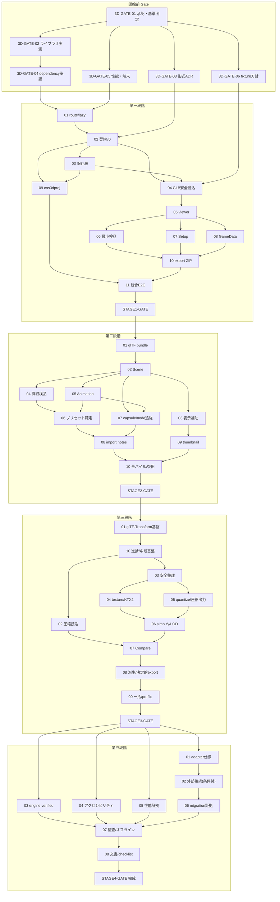

# 3D Four Stage Implementation Plan（3D 四段階実装計画書）

状態: **draft / human review required**
最終更新日: 2026-07-19
調査基準commit: `7018984ba9e6867c6fab12fb313308218a35c22b`
上位文書: `README.md`（本ディレクトリ）
関連文書: 本ディレクトリの全仕様文書（各 work package の「根拠」列から参照）

> **この計画書の存在は 3D 実装開始の承認ではない。** 実装・dependency 追加・試作は、0 章の開始前 Gate（先頭は 2D Pro Gate の人間承認）を通過するまで開始しない。この文書は「承認後に、迷わず順番に実装依頼できる形」へ作業を分割したものである。

---

## 目次

- 0章: 開始前 Gate（`3D-GATE-*`）
- 1章: 第一段階（`3D-STAGE1-*`）最低限の機能
- 2章: 第二段階（`3D-STAGE2-*`）追加機能
- 3章: 第三段階（`3D-STAGE3-*`）高度な機能
- 4章: 第四段階（`3D-STAGE4-*`）完成
- 5章: 依存関係・critical path・並行レーン・PR group
- 6章: 旧計画（`3D-0`〜`3D-6`）との対応
- 7章: 実装担当の役割と運用
- 8章: 最終完成判定

---

## A. 全 work package 共通の既定（重複記載を避けるための共通規則）

各 work package（以下 WP）の記載は 53 項目の必須書式に従うが、全 WP で同一の項目は以下の共通既定を正とし、各 WP には**差分だけ**を書く。各 WP の項目番号は「17.各作業単位の必須書式」（依頼書）の番号に対応する。

- **（10）前提条件・共通**: 依存 WP の PR が merge 済みで CI が成功していること。段階の開始条件を満たしていること。
- **（14）先に必要な決定記録・共通**: 各 WP の個別記載が無い限り追加决定は不要。
- **（19）変更してはいけないファイル・共通**: `src/core/**`、`src/features/editor/**`、`src/features/home/**`（明示した WP を除く）、`src/renderers/canvas2d/**`、`src/workers/imageOps.worker.ts`、`src/workers/imageAnalysis.worker.ts`、既存 `*.schema.json`、既存テストと fixture（期待値の緩和・削除・skip の禁止）、`docs/` の既存 2D 文書。`package.json` / `package-lock.json` は `3D-GATE-04` で承認された dependency PR でのみ変更可。
- **（20〜22）データ形式 / Schema / migration への影響・共通**: 2D の形式・schema・migration への影響は**常に無し**（有る場合はその WP を停止し人間確認）。3D 側への影響のみ各 WP に記載。
- **（26〜28）PC / iPad / iPhone 操作・共通**: `3D_UI_UX_SPEC.md` 4〜5 章の端末別規則に従う。各 WP には画面固有の差分のみ記載。
- **（31）性能予算・共通**: `3D_PERFORMANCE_DEVICE_SECURITY_LICENSE_SPEC.md` 1〜2 章の暫定予算に従う。
- **（33）セキュリティ・共通**: `3D_IMPORT_INSPECTION_SETUP_EXPORT_SPEC.md` 3 章の検証パイプラインと 7 章の方針に従う。
- **（34）ライセンス・共通**: 新規依存・新規 fixture は承認済みのもの以外導入しない。
- **（36〜38）テスト・共通**: `3D_TEST_EVIDENCE_AND_RELEASE_SPEC.md` 1 章の該当層を実装・追加する。2D unit + E2E 全件成功は全 WP の完了条件。
- **（43）rollback・共通**: 保存データの migration を含まない WP は PR revert で完全に戻せる。migration を含む WP は個別に rollback 手順を記載。
- **（45）PR 分割・共通**: 原則 1 WP = 1 PR（draft から開始）。分割する場合のみ個別記載。
- **（46）CI 条件・共通**: lint / format:check / build / unit / E2E（2D 全件 + 3D 追加分）成功。
- **（47）Opus レビュー観点・共通**: 2D 契約への非干渉、source 不変条件、座標系の一貫性、安全検証の抜け、dispose 漏れ、テスト gap（`3D_TEST_EVIDENCE_AND_RELEASE_SPEC.md` 5 章）。各 WP には追加観点のみ記載。
- **（53 に関わる担当・共通）**: 段階開始判断 = Fable 5（または人間）、実装 = Codex（Hybrid Roadmap Mode）または Sonnet5（Primary Mode）、CI 成功後レビュー = Opus 4.8、merge = 人間。個別の事前判断が必要な WP は（48）に明記。
- **複雑度**: S（半日〜1 日級）/ M（数日級）/ L（1 週級）/ XL（分割を検討すべき）— カレンダー日程の約束ではなく相対量。**不確実性**: 低 / 中 / 高。**危険度**: 低 / 中 / 高 / 重大（2D 互換・データ喪失に触れる可能性）。

---

## 0章: 開始前 Gate（`3D-GATE-*`）

四段階の前に置く Gate。ここは「実装」ではなく、判断・実測・記録の作業である。**`3D-GATE-01` の人間承認だけが 2D Pro Gate 承認後に可能になり、他の GATE 作業はそれ以降にのみ実行できる。** 本計画書の作成・レビューは Gate 前でも可能（現在行っている作業）。

### Gate 全体の完了条件

1. 2D Pro Gate が人間承認済み（ADR-2026-07-10-007 の解除）。
2. 3D 開始の基準 commit が固定され、2D 回帰試験（unit + E2E 全件）がその commit で成功している。
3. 描画ライブラリが実測比較の証拠付きで決定されている（`3D-DEC-LIB-01`）。
4. 3D プロジェクト形式・保存境界の ADR が承認されている（`3D-DEC-FORMAT-01` / `3D-DEC-STORAGE-01`）。
5. dependency 追加が人間承認されている（ライセンス記録付き）。
6. 性能計測の対象端末・基準値が確定している。
7. fixture の利用条件（自作方針 + 第三者素材の個別確認）が承認されている。

---

#### 3D-GATE-01 2D Pro Gate 承認確認と 3D 基準の固定

- （1〜3）ID / 名称 / 所属: `3D-GATE-01` / Gate 承認確認と基準固定 / 開始前 Gate
- （4）利用者価値: 2D の品質を壊さずに 3D を始められる状態を確定する。
- （5〜6）現状と根拠: 2D Pro Gate は未承認（`../2D_COMPLETION_ROADMAP.md` 8 章）。3D 開始条件は ADR-2026-07-10-007。
- （7〜9）目的 / 範囲 / 非範囲: 2D Pro Gate の承認記録を確認し、3D 開始の基準 commit を決め、その commit で 2D unit + E2E 全件を実行して成功記録を残す。コード変更は行わない。
- （10〜13）前提 / 依存 / 後続 / 並行: 前提 = 2D Pro Gate 人間承認。依存 WP = なし。後続 = すべての GATE / STAGE WP。並行 = なし（最初に単独実行）。
- （14〜16）決定 / 推奨 / 代替: 決定 = 3D 開始承認そのもの（人間）。推奨 = 基準 commit は承認時点の main 先端。代替 = 特定タグを切る（推奨: `3d-baseline` タグを作成）。
- （17〜19）変更ファイル: なし（記録文書 `docs/future/3d/reports/3D_GATE_BASELINE.md` を新規作成のみ）。
- （20〜30）データ / UI / エラー: 影響なし。
- （35）実装手順: 1. 承認記録の確認 → 2. commit 固定とタグ → 3. `npm run lint / build / test / e2e` 実行 → 4. 結果を baseline 報告として記録。
- （36〜40）テスト / 証拠: 既存テスト全件の成功ログ。baseline 報告文書。
- （41〜42）受け入れ / 完了条件: 前提 = 2D Pro Gate 承認済み。操作 = 基準 commit で全テスト実行。期待結果 = 全件成功し、commit SHA・実行日・結果が報告に記録されている。
- （43〜44）rollback / 文書更新: 対象なし / baseline 報告の新規作成。
- （48）人間確認: **必須**（3D 開始承認そのもの）。
- （49〜52）複雑度 S / 不確実性 低 / 危険 低 / 対処: E2E が不安定な場合は原因を 2D 側の課題として先に解消する（3D を開始しない）。
- （53）依頼要約: 「2D Pro Gate 承認を確認し、基準 commit を固定して 2D 全テストの成功証拠を `docs/future/3d/reports/3D_GATE_BASELINE.md` に記録してください。コードは変更しないでください。」

#### 3D-GATE-02 描画ライブラリ実測比較（Three.js vs Babylon.js）

- （1〜3）: `3D-GATE-02` / 描画ライブラリ実測比較 / 開始前 Gate
- （4）価値: 3D 表示の土台を、根拠のある実測で選ぶ（旧 `3D-0` の中心作業）。
- （5〜6）現状と根拠: 事前整理は `3D_PERFORMANCE_DEVICE_SECURITY_LICENSE_SPEC.md` 4 章（ライセンスのみ一次確認済み。bundle・Safari 挙動は未実測）。
- （7〜9）目的 / 範囲 / 非範囲: 同一 fixture・同一シナリオ（GLB 読み込み→表示→カメラ→dispose）で、gzip 後 bundle・初回表示時間・fps・メモリ・context loss 復帰・screenshot 取得・TypeScript/React との親和性を実測し、評価記録を作る。実験は**リポジトリ外の使い捨て作業場**（別ディレクトリの試作プロジェクト）で行い、本体リポジトリへ試作コードや dependency を入れない。
- （10〜13）依存: `3D-GATE-01`。後続: `3D-GATE-04`。並行: `3D-GATE-03` / `-05` / `-06`。
- （14〜16）決定 / 推奨 / 代替: 決定 = `3D-DEC-LIB-01`（人間承認）。事前推奨 = Three.js。代替 = Babylon.js（実測が優位なら変更）。
- （17〜19）変更ファイル: 本体リポジトリは評価記録 `docs/future/3d/reports/3D_LIB_EVALUATION.md` のみ。
- （35）手順: 1. 評価シナリオと fixture 確定 → 2. 両ライブラリで最小 viewer 試作（外部作業場） → 3. 実測（PC Chrome / iPhone Safari / iPad Safari） → 4. 表形式の評価記録 → 5. 人間承認。
- （41〜42）受け入れ: 前提 = GATE-01 完了。操作 = 両候補の同一シナリオ実測。期待結果 = 全比較項目が数値または再現手順つき所見で埋まり、推奨と理由が書かれ、人間が承認した。
- （48）人間確認: **必須**（ライブラリ確定）。
- （49〜52）: 複雑度 M / 不確実性 中（Safari 実測に依存）/ 危険 低 / 対処: 実測で両者に決定的差が無い場合は bundle の小ささと保守性で Three.js を選ぶ（評価記録に明記）。
- （53）依頼要約: 「リポジトリ外の作業場で Three.js と Babylon.js の最小 viewer を作り、指定 fixture・指定端末で実測比較し、評価記録を作成してください。本体リポジトリへは評価記録の追加以外の変更をしないでください。」

#### 3D-GATE-03 3D プロジェクト形式・保存境界の ADR 承認

- （1〜3）: `3D-GATE-03` / 形式・保存境界の決定 / 開始前 Gate
- （4）価値: データの入れ物を先に固定し、後戻りの高い作り直しを防ぐ。
- （5〜6）現状と根拠: 候補比較は `3D_ASSET_DATA_CONTRACT.md` 11〜12 章（`.cas3dproj` + 別 DB を推奨）。
- （7〜9）範囲: 推奨案の再確認と ADR 文書化（`3D-DEC-FORMAT-01` / `3D-DEC-STORAGE-01`）。schema 実装は含まない（Stage1-02 で行う）。
- （10〜13）依存: `3D-GATE-01`。後続: `3D-STAGE1-02` / `-03`。並行: GATE-02 / -05 / -06。
- （41〜42）受け入れ: 前提 = 契約文書 draft を人間がレビュー。操作 = 4 案比較と推奨の承認。期待結果 = ADR 2 件が accepted で `../DECISION_LOG.md` に登録され、`3D_ASSET_DATA_CONTRACT.md` の状態が draft → reviewed に更新されている。
- （48）人間確認: **必須**。（49〜52）: S / 低 / 中（契約の誤りは後段全体に波及）/ 対処: 承認前に Opus 4.8 の契約レビューを挟む。
- （53）依頼要約: 「`3D_ASSET_DATA_CONTRACT.md` 11〜12 章の推奨案を ADR 2 件として起案し、人間承認を得て DECISION_LOG に登録してください。」

#### 3D-GATE-04 dependency 追加承認とライセンス記録

- （1〜3）: `3D-GATE-04` / dependency 承認 / 開始前 Gate
- （4）価値: ライセンス・供給網の事故を採用前に止める。
- （5〜6）現状と根拠: 候補表とライセンス一次確認（2026-07-19 時点）は `3D_PERFORMANCE_DEVICE_SECURITY_LICENSE_SPEC.md` 8 章。未確認項目が残っている。
- （7〜9）範囲: GATE-02 で決めたライブラリについて、install する版を確定し、その版の LICENSE・配布物構成・NOTICE 要否を確認して評価記録を作り、人間承認を得る。**install 自体は Stage1-01 の PR で行う**（承認と実施を分離）。Stage3 の候補（glTF-Transform 等）は Stage3 開始時に同じ手順を繰り返す。
- （10〜13）依存: `3D-GATE-02`。後続: `3D-STAGE1-01`。
- （41〜42）受け入れ: 前提 = ライブラリ確定済み。操作 = 版固定でのライセンス確認。期待結果 = 候補表の「未確認」が解消され、承認記録（版・ライセンス・確認日・確認 URL）が残る。
- （48）人間確認: **必須**。（49〜52）: S / 低 / 中 / 対処: 確認できない項目が残る場合は採用を保留し代替を検討。
- （53）依頼要約: 「確定した描画ライブラリの採用版のライセンス・配布物・NOTICE を一次情報で確認し、評価記録を作って人間承認を得てください。install はまだ行わないでください。」

#### 3D-GATE-05 性能基準・対象端末・2D bundle 基準値の確定

- （1〜3）: `3D-GATE-05` / 性能・端末基準の確定 / 開始前 Gate
- （4）価値: 「軽い・速い」を測れる約束に変える。
- （5〜6）現状と根拠: 暫定予算は `3D_PERFORMANCE_DEVICE_SECURITY_LICENSE_SPEC.md` 1〜3 章。2D の現行 bundle 実測値が未記録。
- （7〜9）範囲: 対象実機の確定（人間）、現行 2D bundle（gzip）の実測基準値の記録、暫定予算の初回レビュー。予算の最終確定は fixture が揃う `3D-STAGE2-06` まで暫定のまま。
- （10〜13）依存: `3D-GATE-01`。後続: `3D-STAGE1-01`（bundle assert の基準値として使用）。
- （41〜42）受け入れ: 前提 = GATE-01 完了。操作 = `vite build` 出力と Playwright ネットワーク記録の計測。期待結果 = 基準値報告（端末一覧・2D bundle 実測・暫定予算表）が reports に追加され、人間が端末一覧を承認した。
- （48）人間確認: **必須**（端末一覧）。（49〜52）: S / 低 / 低。
- （53）依頼要約: 「現行 2D の bundle 実測基準値を記録し、性能計測の対象端末一覧を人間承認で確定してください。」

#### 3D-GATE-06 fixture 方針の承認と生成基盤の準備

- （1〜3）: `3D-GATE-06` / fixture 方針承認 / 開始前 Gate
- （4）価値: 利用条件が明確な試験素材だけで開発を回せるようにする。
- （5〜6）現状と根拠: fixture 計画は `3D_TEST_EVIDENCE_AND_RELEASE_SPEC.md` 3 章（原則自作）。
- （7〜9）範囲: 自作 fixture 生成スクリプトの設計（GLB を依存ライブラリなしでバイト列組み立て、または承認済みツールで生成）、第三者素材を使う場合の個別確認手順の承認、fixture 台帳の書式確定。スクリプト実装と fixture 追加は `3D-STAGE1-11` で行う。
- （10〜13）依存: `3D-GATE-01`。後続: `3D-STAGE1-04` 以降の全テスト WP。
- （41〜42）受け入れ: 前提 = GATE-01 完了。操作 = 方針文書のレビュー。期待結果 = fixture 台帳書式と自作方針が承認され、第三者素材の採用手順（出所・ライセンス・確認日の記録必須）が決まっている。
- （48）人間確認: 必須（第三者素材を使う場合の手順承認）。（49〜52）: S / 低 / 低。
- （53）依頼要約: 「3D fixture の自作方針・台帳書式・第三者素材の確認手順をまとめ、人間承認を得てください。」

---

## 1章: 第一段階（`3D-STAGE1-*`）最低限の機能

### 1.1 段階の目的

単なる 3D Viewer ではなく、**「3D プロジェクトを作る → GLB を安全に読み込む → 表示して確かめる → 最低限検品する → 原点・足元・向き・大きさを設定する → anchor / collider を付ける → 保存して開き直す → metadata と検査結果つきで書き出す」という一続きの作業を完了できる**最小の製品にする。

### 1.2 段階開始条件

- 開始前 Gate（0 章）の完了条件 1〜7 がすべて満たされている。
- Fable 5（または人間）が本段階の WP 優先順を確認した。

### 1.3 利用者ができるようになること / 対象

- 対象アセット: GLB 単一ファイル（静止モデル中心。animation 付きも読み込め、クリップ数の検出まで行う。再生は第二段階）。
- 対応入力: GLB / `.cas3dproj`。対応出力: 3D アセット ZIP（source + metadata + report + README + manifest）/ `.cas3dproj`。
- 画面: Home 拡張、3D Project 作成、Import、Inspect、Setup、Game Data、Export（`3D_UI_UX_SPEC.md`）。
- データ形式: `chameleon-3d-project` / `chameleon-3d-asset` / `chameleon-3d-inspection` / `chameleon-3d-export-manifest` 各 0.1.0。
- 保存: 別 DB への autosave / trash3d / quarantine3d / snapshots3d(metadata)。
- 検品: 最小 10 項目（3D-CHK-SIZE/TRI/VTX/MAT/TEX/ANIM/BND/ORG）。
- ゲーム用情報: anchor（model space）+ box / sphere collider。
- 性能: 暫定予算内（25MB 級 fixture で PC 5 秒 / iPhone 10 秒以内の読み込み等）。
- 対象端末: PC Chrome / iPad Safari / iPhone Safari（iPhone は数値設定中心）。
- アクセシビリティ: 一覧・数値による代替情報、キーボード操作、色以外の状態表示、motion reduction（自動回転なし）。
- セキュリティ: GLB 検証パイプライン（受付前〜構造チェック〜隔離）。
- ライセンス: 承認済み描画ライブラリのみ。fixture は自作のみ。

### 1.4 やらないこと（第一段階）

glTF bundle 入力、scene graph、animation 再生、材質詳細検査、プリセット確定値、capsule / node 追従、最適化、外部生成連携、thumbnail、焼き込み書き出し。

### 1.5 work package 一覧と作業順

作業順（依存順）: 01 → 02 → 03 → 04 → 05 → 06 → 07 → 08 → 09 → 10 → 11 → GATE。02〜03 と 04 は一部並行可、06〜08 は 05 完了後に並行可（5 章のレーン規則に従い同時 open PR は最大 3）。

#### 3D-STAGE1-01 3D route 骨組みと lazy load 境界

- （1〜3）: `3D-STAGE1-01` / route・chunk 分離・依存導入 / 第一段階
- （4）価値: 3D の入口ができ、かつ 2D が重くならないことが機械的に保証される。
- （5〜6）現状と根拠: lazy load は未実装（`3D_ARCHITECTURE_AND_BOUNDARIES.md` 2・6 章）。dependency は GATE-04 承認済み。
- （7〜9)目的 / 範囲 / 非範囲: View union へ `editor3d` 追加、`React.lazy` + Suspense、空の Editor3DScreen（「準備中」ではなく Import タブの骨格まで）、承認済みライブラリの install、ESLint `no-restricted-imports` 防衛線、bundle 非汚染 E2E。3D の実機能は含まない。
- （10〜13）依存: 全 GATE。後続: Stage1 の全 WP。並行: なし（段階の起点）。
- （14〜16）決定: `3D-DEC-LIB-01` 承認済みが前提。推奨: manualChunks 明示より Vite の動的 import 分割をまず確認。
- （17〜18）変更 / 新規: 変更 = `src/app/App.tsx`、`src/features/home/HomeScreen.tsx`（入口ボタンのみ）、`package.json` / lockfile（承認済み PR として）、`eslint.config.js`。新規 = `src/features/editor3d/Editor3DScreen.tsx`、bundle assert E2E。
- （19）変更禁止: 共通既定どおり（今回だけ App/Home/package.json の変更が承認される点が例外）。
- （23〜25）保存 / export / UI 影響: なし / なし / Home に 3D 作成入口が現れる。
- （29〜30）エラー / 復旧: 3D chunk 読み込み失敗時は「3D 画面の読み込みに失敗しました。再試行」を表示し Home に戻れる。
- （31）性能: 2D 側 gzip +2KB 以内（GATE-05 基準値比）。
- （35）手順: 1. dependency PR（単独・人間承認済み内容のみ） → 2. route + lazy 実装 → 3. ESLint 制限 → 4. bundle E2E → 5. 証拠記録。
- （36〜39）テスト: unit（View 遷移）、E2E（Home→3D 画面表示、2D 動線で 3D chunk 不読込）、fixture 不要、手動 = 実機で 3D 画面表示。
- （40〜42）証拠 / 受け入れ / 完了: build 出力の chunk 一覧。受け入れ = 前提: 2D プロジェクトのみ存在。操作: Home→2D editor を開閉。期待結果: ネットワーク記録に 3D chunk が無い。かつ 前提: なし。操作: Home で「3D プロジェクトを作る」。期待結果: 3D 画面（Import タブ骨格）が表示される。
- （43〜44）rollback / 文書更新: dependency PR と route PR を個別 revert 可能 / アーキテクチャ文書の実装状況注記。
- （45）PR 分割: 2 本（dependency 単独 PR + route/防衛線 PR）。
- （48）人間確認: dependency PR の merge（必須）。
- （49〜52）: M / 低 / 中（2D 接点 2 ファイルに触れる）/ 対処: 2D E2E 全件 + bundle assert を同 PR で必須化。
- （53）依頼要約: 「承認済みライブラリを dependency PR で導入後、`editor3d` route を lazy load で追加し、ESLint import 制限と 2D bundle 非汚染 E2E を実装してください。2D の画面・動作は一切変えないでください。」

#### 3D-STAGE1-02 3D データ契約 v0（型・schema・samples・migrate 入口）

- （1〜3）: `3D-STAGE1-02` / データ契約 v0 実装 / 第一段階
- （4）価値: 保存・書き出しの土台が検証可能になる。
- （5〜6）根拠: `3D_ASSET_DATA_CONTRACT.md` 4〜10・14 章（GATE-03 で ADR 承認済み）。
- （7〜9）範囲: `src/core3d/model/`（Asset3D / Project3D / anchor / collider / factory / migrate3d）、`src/core3d/schema/`（4 schema + validate3d）、`src/core3d/samples/`、検証テスト。derived は型のみ定義し UI では未使用。非範囲 = storage / UI。
- （10〜13）依存: `3D-STAGE1-01`（ディレクトリ規約）、GATE-03。後続: 03 以降すべて。並行: `3D-STAGE1-04`（parser は契約に依存しない純関数部分から着手可）。
- （17〜18）新規のみ: `src/core3d/model/**`、`src/core3d/schema/**`、`src/core3d/samples/**`。
- （20〜22）3D データ影響: 新形式 4 種の初版（0.1.0）。migration 配列は空で開始。
- （35）手順: 1. 型 → 2. schema → 3. samples → 4. validate + migrate テスト → 5. 契約文書と相互参照確認。
- （40〜42）証拠 / 受け入れ: schema テスト成功。受け入れ = 前提: samples の正例・負例。操作: `validateAsset3d` 実行。期待結果: 正例 valid / 負例は項目名入りエラー。未知フィールド付き正例が valid かつ保持される。
- （44）文書更新: 契約文書の「候補」表記を「v0 実装済み」へ更新。
- （48）人間確認: 不要（ADR 承認済みの写経実装）。
- （49〜52）: M / 低 / 中（契約の正本）/ 対処: Opus に契約文書との突合レビューを依頼。
- （53）依頼要約: 「承認済み ADR と `3D_ASSET_DATA_CONTRACT.md` のとおり、core3d の型・schema・samples・migrate 入口・検証テストを新規実装してください。2D の core には触れないでください。」

#### 3D-STAGE1-03 3D 保存層（別 DB・autosave・trash・quarantine）

- （1〜3）: `3D-STAGE1-03` / IndexedDB 保存層 / 第一段階
- （4）価値: 作業が消えない。壊れたファイルが正本を汚さない。
- （5〜6）根拠: 契約 11 章（別 DB 承認済み）。2D の `projectStore.ts` / `recoveryTrash.ts` / `quarantineStore.ts` の方式。
- （7〜9）範囲: `src/core3d/storage/db3d.ts`（DB `chameleon-asset-studio-3d` v1・6 store）、projectStore3d（単一トランザクション保存）、trash3d（上限 5）、quarantine3d（上限 3・50MB 規則）、snapshots3d（metadata のみ・上限 3/asset）、quota エラー処理（既存 StorageError 方式）、AutosaveQueue の 3D タスク接続。非範囲 = `.cas3dproj`（09）。
- （10〜13）依存: 02。後続: 04〜11。並行: 04。
- （23）保存影響: 3D 側の新設のみ。2D DB 不変。
- （29〜30）エラー / 復旧: quota 超過時は既存文言方式で警告し、trash3d の削除を案内。保存途中失敗はトランザクションで巻き戻る。
- （35）手順: 1. db3d → 2. store CRUD → 3. トランザクション保存 → 4. trash/quarantine/snapshot → 5. autosave 接続 → 6. fake-indexeddb テスト。
- （40〜42）受け入れ: 前提: 保存済み 3D プロジェクト。操作: リロード。期待結果: 一覧と内容が復元される。前提: quota 超過を注入。操作: 保存。期待結果: 部分書き込みが残らず警告表示。
- （48）人間確認: 不要。（49〜52）: M / 低 / 中 / 対処: 2D の storage テストパターンを流用し網羅。
- （53）依頼要約: 「別 DB `chameleon-asset-studio-3d` の保存層（6 store・単一トランザクション・trash/quarantine/snapshot・autosave 接続）を 2D の実装パターンに倣って新設し、fake-indexeddb テストを付けてください。」

#### 3D-STAGE1-04 GLB 安全読み込み（検証パイプライン）

- （1〜3）: `3D-STAGE1-04` / GLB 安全 parser / 第一段階
- （4）価値: 壊れた・悪意ある・過大なファイルからアプリと既存データを守る。
- （5〜6）根拠: `3D_IMPORT_INSPECTION_SETUP_EXPORT_SPEC.md` 3 章。2D の `imageInputSafety.ts` / `CasprojError` 方式。
- （7〜9）範囲: `src/core3d/glb/`（magic / header / chunk / 上限 / エラー code 体系 `Glb3dError`）、Worker での JSON parse + stats/bounds 集計（`modelParse.worker.ts`）、quarantine3d 接続、キャンセル対応。非範囲 = 描画（05）、glTF bundle（Stage2）。
- （10〜13）依存: 02・03（隔離接続）。後続: 05・06。並行: 03 と部分並行可。
- （29〜30）エラー / 復旧: 全拒否理由が日本語 + 対象位置つき。拒否ファイルは隔離。読み込み中断で部分状態を残さない。
- （31〜33）性能 / メモリ / セキュリティ: 25MB 級 5 秒以内(PC)。ArrayBuffer 参照の解放。3 章の上限すべて実装（暫定値は定数モジュールに集約し、確定時に一括変更できる形にする）。
- （35）手順: 1. 同期検証（純関数） → 2. worker 解析 → 3. 破損 fixture → 4. 隔離接続 → 5. キャンセル。
- （36〜39）テスト: parser unit（正常系 + corrupt-header / corrupt-chunk / truncated / oversized / json-bomb）、E2E（取り込み成功・失敗・隔離表示）、fixture = 生成スクリプト由来（GATE-06 方針）。
- （40〜42）受け入れ: 前提: minimal.glb。操作: Import。期待結果: 合格し stats が一覧表示。前提: corrupt-chunk.glb。操作: Import。期待結果: 理由つき拒否 + 隔離 1 件 + アプリ操作継続可能。
- （48）人間確認: 不要。（49〜52）: L / 中（多様な壊れ方）/ 高（安全の要）/ 対処: fixture を先に作りテスト駆動で実装。
- （53）依頼要約: 「仕様 3 章の検証パイプライン（magic/chunk/上限/隔離/キャンセル、Worker 解析）を新設し、破損・過大 fixture つきの unit / E2E で網羅してください。」

#### 3D-STAGE1-05 3D viewer 最小（adapter・カメラ・dispose・context loss）

- （1〜3）: `3D-STAGE1-05` / viewer adapter 最小 / 第一段階
- （4）価値: モデルを目で確かめられる。以後の全画面の表示土台。
- （5〜6）根拠: `3D_ARCHITECTURE_AND_BOUNDARIES.md` 7 章、GATE-02 の選定結果。
- （7〜9）範囲: `renderers/three/viewerAdapter.ts`（mount / loadModel / setCamera / setOverlay(bounds・ground・axis・origin) / captureScreenshot / dispose / onContextLost）、orbit / pan / zoom（マウス + タッチ）、Inspect タブへの組み込み、WebGL 不可端末のフォールバック表示。非範囲 = animation 再生、wireframe、ギズモ。
- （10〜13）依存: 01・04。後続: 06〜08。並行: 09 の設計。
- （26〜28）操作: PC = ドラッグ回転 / ホイール / Shift+ドラッグ。タッチ = 1 指回転 / ピンチ / 2 指パン。キーボード = フォーカス時矢印 + R/F（`3D_UI_UX_SPEC.md` 5 章）。
- （29〜30）エラー / 復旧: context loss → 再構築ボタン。WebGL 不可 → 一覧・数値のみで作業可能な旨を表示。
- （31〜32）性能 / メモリ: first render 2 秒以内（generic fixture）。dispose 後の Object URL 0 件 assert。
- （35）手順: 1. adapter 契約 → 2. mount/load/表示 → 3. カメラ → 4. overlay → 5. dispose/context loss → 6. screenshot。
- （36〜39）テスト: adapter unit（モック）、E2E（表示成功を DOM 状態で確認 + screenshot 保存）、visual regression の初回基準画像、手動 = iPad/iPhone のタッチ操作。
- （40〜42）受け入れ: 前提: box-textured.glb 取り込み済み。操作: Inspect を開きドラッグ・ピンチ。期待結果: モデルが表示され視点が変わり、離脱時に dispose が呼ばれる（カウンタ assert）。
- （48）人間確認: 不要。（49〜52）: L / 中（Safari 実機依存）/ 中 / 対処: GATE-02 の実測知見を反映。CI で WebGL 不可なら viewer E2E を別 job に分離（`3D_TEST_EVIDENCE_AND_RELEASE_SPEC.md` 2 章）。
- （53）依頼要約: 「adapter 契約どおりの最小 viewer（表示・カメラ・overlay・dispose・context loss・screenshot）を実装し、DOM ベース E2E と初回 visual 基準を追加してください。」

#### 3D-STAGE1-06 最小検品（stats・bounds・警告 10 項目）

- （1〜3）: `3D-STAGE1-06` / 最小検品 / 第一段階
- （4）価値: 「このモデルはゲームに入れて大丈夫か」が数値と文章で分かる。
- （5〜6）根拠: 入出力仕様 4.2〜4.3（第一段階セット）・5 章。
- （7〜9）範囲: `core3d/inspect/`（純関数の検査 10 項目 + report 生成）、Inspect 画面の stats 表・警告一覧（checkId/重要度/実測/推奨/理由/影響/修正/無視条件）、再検査、preset 切替 UI（値は暫定表示）。非範囲 = 第二段階の詳細検査。
- （10〜13）依存: 04（解析結果）・05（画面）。後続: 07・10。並行: 07・08。
- （40〜42）受け入れ: 前提: offset-origin.glb。操作: Inspect。期待結果: 3D-CHK-ORG-001 が警告一覧に出て、対象・実測値・修正方法（Setup への導線）が表示される。report が保存され `.cas3dproj` に同梱される。
- （48）人間確認: 不要。（49〜52）: M / 低 / 低。
- （53）依頼要約: 「検査 10 項目と inspection report 生成を純関数で実装し、Inspect 画面の警告一覧（構造化フィールド全表示）と再検査を作ってください。」

#### 3D-STAGE1-07 Setup（unit・axis・origin・feet・scale）

- （1〜3）: `3D-STAGE1-07` / Setup 画面 / 第一段階
- （4）価値: ゲームに置いた時に「サイズが変・向きが逆・足が浮く」を防げる。
- （5〜6）根拠: 契約 6 章 settings・13 章、UI 仕様 3.4。
- （7〜9）範囲: settings フォーム（全項目数値・選択入力）、viewer への即時反映（表示変換のみ）、feet 候補の提案→確認→適用、リセット、Undo/Redo、未確認バッジ。非範囲 = 焼き込み。
- （10〜13）依存: 05・06。後続: 09・10。並行: 08。
- （40〜42）受け入れ: 前提: z-up.glb。操作: upAxis を Z と申告し rotationOffset 適用。期待結果: viewer で正立し、asset3d.json の settings が保存され、source の sha256 が不変。Undo で戻る。
- （48）人間確認: 不要。（49〜52）: M / 中（座標の解釈ミスが起きやすい）/ 中 / 対処: 契約 13 章の区分（自動/表示のみ/確認要）をレビュー観点に明記。
- （53）依頼要約: 「settings の編集 UI と表示変換（非破壊）を実装してください。すべて Undo 可能・数値入力可能・source 不変（hash assert テスト付き）にしてください。」

#### 3D-STAGE1-08 Game Data 最小（anchor・box/sphere collider）

- （1〜3）: `3D-STAGE1-08` / anchor / collider 編集 / 第一段階
- （4）価値: 武器・足元・当たりの位置情報を素材に付けてゲームへ渡せる。
- （5〜6）根拠: 契約 7 章、UI 仕様 3.5。
- （7〜9）範囲: 追加・複製・削除・数値編集・一覧表・viewer 表示（purpose 色 + ラベル）・PC ドラッグ / タッチハンドル・Undo/Redo。非範囲 = capsule・node 追従・ギズモ回転。
- （10〜13）依存: 05。後続: 09・10。並行: 06・07。
- （40〜42）受け入れ: 前提: minimal.glb。操作: anchor（hand_right）追加 → 数値で x=0.5 → collider（box）追加。期待結果: 一覧と viewer に反映、保存後リロードで復元、Undo/Redo で往復できる。
- （48）人間確認: 不要。（49〜52）: M / 低 / 低。
- （53）依頼要約: 「anchor と box/sphere collider の編集（一覧・数値・viewer 表示・Undo）を実装してください。すべて model space 記録で、viewer 変換の影響を受けないことをテストしてください。」

#### 3D-STAGE1-09 `.cas3dproj` 書き出し・読み込み

- （1〜3）: `3D-STAGE1-09` / `.cas3dproj` 往復 / 第一段階
- （4）価値: 作業を持ち運び・保管・復旧できる（可搬正本）。
- （5〜6）根拠: 契約 12 章（GATE-03 承認済み）、2D `casproj.ts` 方式。
- （7〜9）範囲: `core3d/storage/cas3dproj.ts`（書き出し・段階検証つき読み込み・ID 再採番・quarantine 接続）、Home / Export の UI 接続、2D `.casproj` との相互誤投入の明確エラー。非範囲 = 旧版 migration（版が 1 つしか無いため空実装の経路確認のみ）。
- （10〜13）依存: 02・03。後続: 10・11。並行: 06〜08 と可（契約が固まっているため）。
- （40〜42）受け入れ: 前提: anchor・settings 設定済みプロジェクト。操作: `.cas3dproj` 書き出し → 削除 → 読み込み。期待結果: source バイト列（sha256 一致）・metadata・report が復元され、別 ID の新プロジェクトとして保存される。前提: 2D `.casproj`。操作: 3D 読み込みに投入。期待結果: 「2D プロジェクトです」の明確エラーで隔離されない。
- （48）人間確認: 不要。（49〜52）: M / 低 / 中（可搬正本）/ 対処: round-trip テストで hash 照合を必須化。
- （53）依頼要約: 「`.cas3dproj` の書き出しと段階検証つき読み込み（ID 再採番・隔離・相互誤投入エラー・hash 照合 round-trip テスト）を実装してください。」

#### 3D-STAGE1-10 export ZIP 最小

- （1〜3）: `3D-STAGE1-10` / export ZIP / 第一段階
- （4）価値: ゲーム側へ渡せる最終成果物が出る。
- （5〜6）根拠: 入出力仕様 8 章（8.1 最小形・8.3 manifest・8.4 README・8.7 パス規則）。
- （7〜9）範囲: `core3d/export/`（純関数組み立て + manifest + README 生成）、Export 画面接続、書き出し前 schema 検証、source 欠落時の中止、進捗。非範囲 = import notes（Stage2）・derived 同梱（Stage3）・決定的出力の保証（Stage3。ただし 8.5 のタイムスタンプ固定は初回から実装）。
- （10〜13）依存: 02・06（report）・07・08。後続: 11。
- （40〜42）受け入れ: 前提: 設定済みアセット。操作: ZIP ダウンロード → 展開。期待結果: 8.1 の構造どおりで、model.glb の sha256 が manifest と一致し、README に座標系・設定値・license 未確認の注意が含まれる。
- （48）人間確認: 不要。（49〜52）: M / 低 / 低。
- （53）依頼要約: 「export ZIP（source 複製 + asset3d.json + report + manifest + README）を純関数で実装し、hash 照合と再読込テストを付けてください。」

#### 3D-STAGE1-11 Stage1 統合 E2E・fixture 整備・2D 回帰証拠

- （1〜3）: `3D-STAGE1-11` / 統合検証 / 第一段階
- （4）価値: 一続きの体験が壊れていないことを継続的に保証する。
- （7〜9）範囲: fixture 生成スクリプト一式（GATE-06 設計分。minimal / box-textured / offset-origin / z-up / character-anim / corrupt 系 / oversized 系）と台帳、動線 E2E（作成→取込→検品→設定→GameData→保存→リロード→`.cas3dproj` 往復→ZIP）、iPhone viewport E2E、bundle 非汚染 assert の再確認、CI での WebGL 動作確認（不可なら viewer E2E の job 分離）。
- （10〜13）依存: 01〜10 すべて。後続: STAGE1-GATE。
- （40〜42）受け入れ: 前提: クリーンな状態。操作: 動線 E2E 実行。期待結果: 全 assert 成功。2D の unit / E2E 全件成功。fixture 台帳に全 fixture の出所・ライセンス・期待値が記録済み。
- （48）人間確認: 不要。（49〜52）: M / 中（CI の WebGL）/ 低。
- （53）依頼要約: 「fixture 生成スクリプトと台帳、第一段階の一続き動線 E2E（PC + iPhone viewport）を追加し、2D 回帰と bundle 非汚染を含む CI を安定化してください。」

#### 3D-STAGE1-GATE 第一段階終了 Gate

- （1〜3）: `3D-STAGE1-GATE` / 第一段階終了判定 / 第一段階
- （4）価値: 「最低限の機能」が行き止まりなく完成したと確認して次へ進む。
- （7〜9）範囲: デモ手順の実施（下記）、実機確認報告（PC / iPad / iPhone）、性能実測（暫定予算との比較）、証拠一式の整理、未解決課題の open 項目化、人間承認。実装は行わない。
- デモ手順: 1. 3D プロジェクト作成 → 2. character-anim.glb 取込（クリップ数が stats に出る） → 3. corrupt-chunk.glb 投入（隔離と理由表示） → 4. offset-origin.glb で警告 → Setup で feet 設定 → 5. anchor + collider 追加 → 6. リロードで復元 → 7. `.cas3dproj` 往復 → 8. ZIP 書き出し・展開・README 確認。
- （41〜42）受け入れ / 完了: Stage1 の全 WP が merge・CI 成功。デモ 8 手順がすべて実機で成功し報告がある。旧 3D 要件 13 章の初期完了条件 11 項目に対応する証拠が揃っている。BLOCKER / MUST ゼロ。人間が承認。
- 中止 / rollback 条件: 実機で読み込み・保存の致命的不具合が解消できない場合、3D route の入口を feature flag で非表示にして（revert ではなく入口停止）原因を解消するまで第二段階を開始しない。
- （48）人間確認: **必須**。（49〜52）: S / 低 / 低。
- （53）依頼要約: 「第一段階のデモ 8 手順を実機で実施し、証拠一式（テスト・性能・実機・fixture 台帳）を整理して人間承認を得てください。」

---

## 2章: 第二段階（`3D-STAGE2-*`）追加機能

### 2.1 段階の目的

第一段階の流れを、**実際のゲーム素材準備に耐える状態**へ広げる。glTF bundle・モデルの中身（scene graph・材質・animation）の確認・詳細な検品・実用的な書き出し（import notes・thumbnail）・モバイル操作の完成度を扱う。

### 2.2 段階開始条件

`3D-STAGE1-GATE` の人間承認。Fable 5（または人間）による本段階の優先順確認（特に `3D-OPEN-05` 焼き込み、`3D-OPEN-08` 圧縮読み込み前倒し、`3D-OPEN-14` 材質簡易編集の 3 判断）。

### 2.3 段階の範囲（採用 / 延期 / 対象外の判断）

依頼書 10 章の検討対象への判断:

| 検討対象 | 判断 | 対応 WP / 理由 |
|---|---|---|
| glTF + bin + textures の完全 bundle 読み込み | 採用 | `-01` |
| 複数 scene / scene graph 表示 / node・mesh・primitive・material・texture 一覧 / 表示切替 / 選択ハイライト | 採用 | `-02` |
| wireframe / bounds / ground / axis 表示 | 採用 | `-03`（ground/axis/bounds は Stage1 済み。wireframe 追加） |
| normal・tangent / UV / PBR / alpha / double-sided / 色空間検査 | 採用 | `-04` |
| animation 一覧・再生・停止・ループ・速度 / skeleton・skin / morph 有無 | 採用 | `-05` |
| 品質警告の詳細化 / mobile・web・desktop プリセット確定 | 採用 | `-06` |
| box・sphere・capsule collider / node・bone 追従 anchor | 採用 | `-07` |
| inspection report 詳細化 / Three.js・Babylon・Godot・Unity import notes | 採用 | `-08` |
| thumbnail / turntable preview | 採用（thumbnail 必須、turntable は motion reduction 配慮つき任意） | `-09` |
| 保存・snapshot・復旧の拡充 / キーボード・タッチ・数値入力の改善 / iPhone・iPad 確認 | 採用 | `-10` |
| 焼き込み書き出し | 判断待ち（`3D-OPEN-05`）。承認時は `-08` に含める | 段階開始時に Fable5/人間が判断 |
| 材質の簡易編集 | 延期（`3D-OPEN-14`。既定は検査のみ） | 第三段階以降で再判断 |
| 圧縮 GLB の読み込み | 既定は第三段階（`3D-OPEN-08`） | 前倒し判断のみここで行う |

### 2.4 work package

作業順: 01 → 02 → (03・04・05 並行) → 06 → 07 → 08 → (09・10 並行) → GATE。

#### 3D-STAGE2-01 glTF bundle 読み込み

- （1〜3）: `3D-STAGE2-01` / glTF + bin + textures 読み込み / 第二段階
- （4）価値: GLB 化されていない配布物・生成物をそのまま検品できる。
- （5〜6）根拠: 入出力仕様 1〜3 章（bundle・URI 安全規則）。
- （7〜9）範囲: 複数ファイル選択と ZIP 受け取り、bundle 内 URI 解決（許可 = 同時提供ファイル・data URI のみ）、外部 URL 検出のエラー級警告、zip bomb 対策、source を「ファイル集合」として保存（契約 6 章 `source.files[]`）。非範囲 = OBJ。
- （10〜13）依存: STAGE1-GATE。後続: -02。並行: なし（段階の起点）。
- （40〜42）受け入れ: 前提: external-texture.gltf + bin + png。操作: 3 ファイル選択で Import。期待結果: texture が表示され、source.files に 3 件が hash つきで記録。前提: external-url.gltf。操作: Import。期待結果: 外部 URL 警告 + 該当 texture 欠落表示で続行。
- （48）人間確認: 不要。（49〜52）: L / 中 / 高（攻撃面の拡大）/ 対処: 敵対 fixture 先行のテスト駆動。
- （53）依頼要約: 「glTF bundle（複数ファイル / ZIP）の安全な読み込みを URI 許可リスト方式で実装し、欠落・不正 URI・zip bomb の fixture つきでテストしてください。」

#### 3D-STAGE2-02 scene graph 表示と選択

- （1〜3）: `3D-STAGE2-02` / Scene 画面 / 第二段階
- （4）価値: モデルの中身（構造）が分かり、問題箇所を特定できる。
- （7〜9）範囲: node ツリー（複数 scene 対応・検索・キーボード操作）、mesh / primitive / material / texture 一覧タブ、選択と viewer ハイライトの相互連動、node 表示/非表示（一時状態）、選択情報の aria-live 通知。非範囲 = 階層編集・名称変更（`3D-OPEN-15`）。
- （10〜13）依存: -01。後続: -03〜-05。
- （40〜42）受け入れ: 前提: multi-scene.gltf。操作: ツリーで node 選択。期待結果: viewer でハイライトされ、詳細パネルに mesh / material 情報が出て、非表示切替が反映される（保存データは不変）。
- （48）人間確認: 不要。（49〜52）: L / 中 / 低。
- （53）依頼要約: 「Scene 画面（ツリー・一覧・選択連動・表示切替・キーボード対応）を実装してください。表示切替は保存データに書かないでください。」

#### 3D-STAGE2-03 表示補助の拡充（wireframe ほか）

- （1〜3）: `3D-STAGE2-03` / 表示補助 / 第二段階
- （7〜9）範囲: wireframe 切替、選択 mesh のみ強調、bounds の node 単位表示、カメラのフォーカス（選択へ移動）。非範囲 = 照明プリセット（`3D-OPEN-16`）。
- （10〜13）依存: -02。並行: -04・-05。
- （41〜42）受け入れ: 前提: multi-mesh.glb。操作: wireframe 切替 + 選択フォーカス。期待結果: 表示が切り替わり、視点が選択対象へ移動する。motion reduction 有効時は瞬間移動する。
- （48）: 不要。（49〜52）: S / 低 / 低。
- （53）依頼要約: 「viewer の表示補助（wireframe・選択強調・フォーカス移動）を adapter 契約の overlay 拡張として実装してください。」

#### 3D-STAGE2-04 検品拡張（幾何・UV・材質・extension）

- （1〜3）: `3D-STAGE2-04` / 詳細検品 / 第二段階
- （5〜6）根拠: 入出力仕様 4.3 第二段階セット（GEO/UV/PBR/ALPHA/DS/SKIN/MORPH/NODE/EXT/LGT/CAM）。
- （7〜9）範囲: 検査 12 項目の追加、対象（mesh / material 単位）へのジャンプ（Scene 連動）、report の findings 拡充。非範囲 = 自動修正。
- （10〜13）依存: -02。並行: -03・-05。
- （41〜42）受け入れ: 前提: alpha-blend.glb + double-sided.glb。操作: Inspect。期待結果: 3D-CHK-ALPHA-001 / DS-001 が対象 material 名つきで警告され、クリックで Scene の該当 material が選択される。
- （48）: 不要。（49〜52）: M / 中（glTF 仕様の正確な解釈）/ 低 / 対処: Khronos glTF 2.0 仕様を参照根拠として report に記録。
- （53）依頼要約: 「第二段階の検査 12 項目を追加し、警告から Scene の対象へジャンプできるようにしてください。」

#### 3D-STAGE2-05 animation 再生と skin / morph 表示

- （1〜3）: `3D-STAGE2-05` / Animation 画面 / 第二段階
- （4）価値: 「動くはずの素材が動くか」を書き出す前に確かめられる。
- （7〜9）範囲: クリップ一覧（名前・長さ・channel 数）、再生 / 停止 / ループ / 速度 0.25〜2x / 位置スライダー、skin・joint 数・morph の表示、motion reduction 時の自動再生禁止。非範囲 = クリップ編集・名称変更（`3D-OPEN-15`）・リターゲット。
- （10〜13）依存: -02。並行: -03・-04。
- （41〜42）受け入れ: 前提: character-anim.glb（2 クリップ）。操作: 2 番目のクリップを 0.5x で再生。期待結果: viewer で再生され、停止・ループ切替が機能し、保存データは不変。
- （48）: 不要。（49〜52）: M / 低 / 低。
- （53）依頼要約: 「animation の一覧・再生制御と skin/morph 情報表示を実装してください。再生状態は一時状態とし保存しないでください。」

#### 3D-STAGE2-06 検品プリセット確定（fixture 実測）

- （1〜3）: `3D-STAGE2-06` / プリセットしきい値確定 / 第二段階
- （4）価値: 警告の基準が「暫定」から「根拠つき」になる。
- （7〜9）範囲: GATE-05 で確定した端末での fixture 実測（読み込み時間・fps・メモリ）、mobile / generic-web / desktop しきい値の確定と定数化、UI の「暫定」表示解除、確定根拠の報告書。非範囲 = しきい値の利用者カスタム（`3D-OPEN-17`）。
- （10〜13）依存: -04・-05（検査項目が揃ってから）。後続: -08。
- （41〜42）受け入れ: 前提: 実測報告あり。操作: プリセット定数の更新 PR。期待結果: 各しきい値に実測根拠（端末・fixture・値）が紐付き、「暫定」表示が消える。
- （48）人間確認: **必須**（しきい値の承認）。（49〜52）: M / 中 / 低。
- （53）依頼要約: 「対象端末で fixture を実測し、プリセットしきい値を根拠つきで確定して人間承認を得てください。」

#### 3D-STAGE2-07 capsule collider と node 追従 anchor

- （1〜3）: `3D-STAGE2-07` / GameData 拡張 / 第二段階
- （5〜6）根拠: 契約 7 章（space: node / nodeRef / capsule）。
- （7〜9）範囲: capsule collider（全高解釈の明記）、anchor / collider の `space: "node"`（nodeIndex + nodeName 記録、node 選択 UI、animation 再生中の追従表示）。非範囲 = bone 制約以上の機能。
- （10〜13）依存: -02・-05。
- （41〜42）受け入れ: 前提: character-anim.glb。操作: hand_R node に anchor を追従設定し animation 再生。期待結果: マーカーが手に追従し、保存値は node space の相対値のまま不変。nodeIndex が存在しない `.cas3dproj` を読み込むと警告して model space へ退避する。
- （48）: 不要。（49〜52）: M / 中 / 中（参照切れ）/ 対処: 欠落 nodeRef の退避動作をテスト必須化。
- （53）依頼要約: 「capsule と node 追従（nodeRef・追従表示・参照切れ退避）を実装してください。」

#### 3D-STAGE2-08 import notes と report 詳細化

- （1〜3）: `3D-STAGE2-08` / import notes / 第二段階
- （4）価値: Three.js / Babylon / Godot / Unity へ「どう持ち込むか」が ZIP だけで分かる。
- （5〜6）根拠: 入出力仕様 8.6（import notes only 区分）・契約 13.4。2D の engineGuides.ts 方式。
- （7〜9）範囲: 4 対象の import notes 生成（座標系変換・単位・anchor/collider の読み方・capsule 解釈・既知の制限）、export ZIP への同梱、report の human-readable 版（README 内要約）。焼き込みオプション（`3D-OPEN-05` が承認された場合のみ）。非範囲 = verified 主張（証拠は第四段階）。
- （10〜13）依存: -06・-07。後続: -09。
- （41〜42）受け入れ: 前提: 設定済みアセット。操作: ZIP 書き出し。期待結果: engines/ に 4 notes が入り、各 notes に「import notes only（実行検証はしていません）」の区分が明記される。
- （48）: `3D-OPEN-05` の判断のみ Fable5/人間。（49〜52）: M / 低 / 低。
- （53）依頼要約: 「4 エンジン向け import notes 生成を純関数で実装し、compatibility 区分を明記して ZIP へ同梱してください。」

#### 3D-STAGE2-09 thumbnail / turntable preview

- （1〜3）: `3D-STAGE2-09` / thumbnail / 第二段階
- （7〜9）範囲: screenshot による thumbnail 生成（Home 一覧と `.cas3dproj` / ZIP 同梱）、turntable（自動回転 preview。motion reduction 時無効・手動フレーム送り代替）。非範囲 = turntable 動画/連番画像の書き出し（`3D-OPEN-18`）。
- （10〜13）依存: -03。並行: -10。
- （41〜42）受け入れ: 前提: box-textured.glb。操作: thumbnail 生成。期待結果: Home 一覧にサムネイルが表示され、`.cas3dproj` 往復後も保持される。
- （48）: 不要。（49〜52）: S / 低 / 低。
- （53）依頼要約: 「adapter の captureScreenshot による thumbnail 生成・保存・一覧表示を実装してください。」

#### 3D-STAGE2-10 モバイル完成度と復旧拡充

- （1〜3）: `3D-STAGE2-10` / モバイル・復旧仕上げ / 第二段階
- （7〜9）範囲: iPhone / iPad の全画面タッチ動線の仕上げ（44px・ハンドル・往復導線）、snapshots3d の適用箇所拡大（一括変更前）、iOS タブ破棄からの復帰 E2E（再現可能な範囲）、容量警告の 3D 合算表示。非範囲 = 新機能。
- （10〜13）依存: -02〜-09 の画面が揃ってから。
- （41〜42）受け入れ: 前提: iPhone viewport。操作: 取込→検品→数値設定→書き出しの動線 E2E。期待結果: 全 assert 成功。実機報告（iPhone / iPad）に主要動線の完了記録がある。
- （48）: 不要。（49〜52）: M / 中（実機依存）/ 低。
- （53）依頼要約: 「モバイル動線の仕上げと復旧・容量表示の拡充を行い、iPhone viewport E2E と実機報告を残してください。」

#### 3D-STAGE2-GATE 第二段階終了 Gate

- 範囲: デモ手順（下記）、実機・性能・証拠整理、`3D-OPEN-05/-08/-14/-15` の再判断、人間承認。
- デモ手順: 1. external-texture.gltf を bundle 取込 → 2. Scene で node 選択・非表示 → 3. Materials で alpha 警告確認 → 4. Animation で 0.5x 再生 → 5. hand node へ anchor 追従 → 6. mobile プリセットで再検品（確定しきい値） → 7. thumbnail 生成 → 8. ZIP に import notes 4 種を確認 → 9. iPhone で同素材の検品と書き出し。
- 受け入れ: 全 WP merge・CI 成功、デモ 9 手順の実機成功報告、BLOCKER/MUST ゼロ、人間承認。
- 中止 / rollback 条件: Stage1 と同じ（入口 flag 停止方式）。
- （49〜52）: S / 低 / 低。人間確認: **必須**。

---

## 3章: 第三段階（`3D-STAGE3-*`）高度な機能

### 3.1 段階の目的

高度な検品・**軽量化**・自動化・比較。「読める・整えられる」から「**ゲームに載る重さへ安全に近づけられる**」へ進める。元モデルの完全保持と、見た目・animation を壊す処理を自動適用しない原則を守る。

### 3.2 段階開始条件

`3D-STAGE2-GATE` 承認。glTF-Transform / meshoptimizer / Draco / KTX2 decoder の版固定ライセンス確認と dependency 人間承認（GATE-04 と同一手順の第 2 回）。Fable5（または人間）による軽量化方式の優先順判断。

### 3.3 段階の範囲判断

| 検討対象 | 判断 | 対応 WP |
|---|---|---|
| glTF-Transform 利用可否 / Worker・WASM 分離 | 採用（Worker 内） | `-01` |
| Meshopt / Draco / KTX2 の読み込み対応 | 採用 | `-02` |
| 不要 node・camera・light・animation 整理 / 重複・unused 検出 | 採用 | `-03`（検出は検品 `3D-CHK-DUP/UNUSED` と連動） |
| texture resize / texture 圧縮（KTX2 出力） | 採用 | `-04` |
| quantization / Meshopt・Draco 出力 | 採用 | `-05` |
| mesh simplification / LOD | 採用（preview 必須の候補提示。自動適用しない） | `-06` |
| 最適化前後比較（サイズ・三角形・見た目・animation / anchor / collider 保持） | 採用 | `-07` |
| 派生管理 / export 再現性 / hash / deterministic export | 採用 | `-08` |
| 一括検品・一括書き出し / asset profile / engine 別 preset・座標変換補助 | 採用 | `-09` |
| 処理中断・進捗・メモリ不足復旧 | 採用 | `-10`（全最適化 WP の共通基盤として先行実装） |
| 検査結果の履歴 / screenshot 比較 | 採用 | `-07`（比較）・`-08`（履歴） |

### 3.4 work package

作業順: 01 → 10 → (02・03 並行) → (04・05 並行) → 06 → 07 → 08 → 09 → GATE。（`-10` の進捗・中断基盤を先に作り、以後の重処理 WP が乗る。）

#### 3D-STAGE3-01 glTF-Transform 統合基盤（Worker）

- （1〜3）: `3D-STAGE3-01` / 最適化基盤 / 第三段階
- （5〜6）根拠: 性能仕様 8 章（MIT 確認済み・版は開始時確定）、アーキテクチャ 8 章。
- （7〜9）範囲: `optimize.worker.ts`、glTF-Transform の read→write 無変換 round-trip（バイト差の把握と許容範囲の記録）、derived 生成の配管（契約 8 章）。非範囲 = 個別最適化操作。
- （10〜13）依存: STAGE2-GATE + dependency 承認。後続: -02〜-09。
- （41〜42）受け入れ: 前提: minimal.glb。操作: 無変換 round-trip。期待結果: 表示・stats が同等で、derived が recipe（toolchain 版・sourceSha256）つきで保存され、source は不変。
- （48）人間確認: dependency merge（必須）。（49〜52）: M / 中 / 中。
- （53）依頼要約: 「glTF-Transform を optimize worker に統合し、無変換 round-trip と derived 配管を実装してください。」

#### 3D-STAGE3-02 圧縮形式の読み込み（Meshopt / Draco / KTX2）

- （7〜9）範囲: 3 decoder の遅延取得（同梱・hash 記録・CDN 不使用）、viewer / 解析双方の対応、検査 `3D-CHK-COMP-*`（圧縮状態表示）。非範囲 = 圧縮出力。
- （10〜13）依存: -01。並行: -03。
- （41〜42）受け入れ: 前提: meshopt.glb / draco.glb / ktx2.glb。操作: Import。期待結果: 表示・stats 取得に成功し、decoder はその時だけネットワーク記録に現れる（初期 chunk 非含有）。
- （48）: dependency 承認済み前提。（49〜52）: L / 中 / 中 / 対処: decoder ライセンス・NOTICE を ZIP README の attribution 節に自動記載。
- （53）依頼要約: 「3 種 decoder の遅延ロードと圧縮 GLB の読み込み・検査表示を実装してください。」

#### 3D-STAGE3-03 安全な整理セット（prune / dedup / weld）

- （7〜9）範囲: 見た目を変えない操作群（未使用データ削除・重複統合・頂点結合）を「安全」ラベルで提供、実行→derived 生成→自動再検品。非範囲 = 見た目が変わり得る操作（-04〜-06）。
- （41〜42）受け入れ: 前提: multi-material.glb（重複あり）。操作: prune+dedup 実行。期待結果: derived のサイズ・stats が減り、screenshot 比較の差分が許容内で、source 不変。
- （49〜52）: M / 中 / 中 / 対処: 「安全」の根拠を操作ごとに文書化し、screenshot 比較を必須にする。
- （53）依頼要約: 「安全ラベルの整理操作（prune/dedup/weld）を derived 生成 + 自動再検品 + screenshot 比較つきで実装してください。」

#### 3D-STAGE3-04 texture resize / KTX2 出力

- （7〜9）範囲: texture の縮小（上限指定）と KTX2 圧縮出力（encoder は Worker/WASM）、見た目変化ありラベル + preview 必須。非範囲 = ペイント編集。
- （41〜42）受け入れ: 前提: big-texture.glb。操作: 2048px へ縮小した derived を生成。期待結果: preview で before/after を確認してから確定でき、mobile プリセット警告が解消される。
- （49〜52）: L / 中 / 中。
- （53）依頼要約: 「texture 縮小と KTX2 出力を preview 承認フローつきで実装してください。」

#### 3D-STAGE3-05 quantization / Meshopt・Draco 出力

- （7〜9）範囲: 量子化と圧縮出力（見た目変化の可能性ラベル）、エンジン側 decoder 必要性の import notes 追記。
- （41〜42）受け入れ: 前提: character-anim.glb。操作: Meshopt 出力。期待結果: derived が生成され、animation 再生が保持され（-07 の保持チェック合格）、notes に decoder 要件が載る。
- （49〜52）: L / 中 / 中。
- （53）依頼要約: 「quantization と Meshopt / Draco 出力を、animation 保持チェックと import notes 追記つきで実装してください。」

#### 3D-STAGE3-06 simplification / LOD 候補

- （7〜9）範囲: 三角形削減（率指定・preview 必須・自動適用禁止）、LOD セット生成（複数 derived の束）。非範囲 = リトポロジ品質の保証。
- （41〜42）受け入れ: 前提: 高ポリ fixture。操作: 50% 簡略化 preview → 承認。期待結果: derived が生成され、比較画面で目視確認でき、拒否したら何も保存されない。
- （49〜52）: L / 高（品質のばらつき）/ 中 / 対処: 「結果は素材により大きく変わる」注意を UI に常設。
- （53）依頼要約: 「簡略化と LOD 束生成を preview 承認必須で実装してください。」

#### 3D-STAGE3-07 Compare（前後比較と保持チェック）

- （7〜9）範囲: 同期カメラの並列 viewer、サイズ・三角形・texture 差分表、screenshot 差分、animation / anchor / collider 保持チェック（クリップ数・時間・nodeRef 解決の照合）、書き出し対象の選択。
- （41〜42）受け入れ: 前提: source と derived。操作: Compare を開く。期待結果: 差分表と保持チェック結果が表示され、「この派生を書き出しに使う」を選ぶと Export に反映される。
- （49〜52）: M / 低 / 低。
- （53）依頼要約: 「Compare 画面（同期 viewer・差分表・保持チェック・書き出し対象選択）を実装してください。」

#### 3D-STAGE3-08 派生管理・検査履歴・deterministic export

- （7〜9）範囲: derived 一覧管理（古い派生の検出 = sourceSha256 不一致）、検査履歴の閲覧、export の決定性確立（入出力仕様 8.5。非決定操作の明示）、verification record（書き出し後の hash 自己検証）。
- （41〜42）受け入れ: 前提: 同一条件。操作: ZIP を 2 回書き出し。期待結果: manifest 除く全ファイルの hash が一致し、manifest の deterministic が true。非決定操作を含む場合は false と理由が記録される。
- （49〜52）: M / 中 / 低。
- （53）依頼要約: 「派生・履歴管理と決定的書き出し（hash 検証つき）を実装してください。」

#### 3D-STAGE3-09 一括検品・一括書き出し・asset profile / engine preset

- （7〜9）範囲: プロジェクト内複数アセットの一括検品・一括 ZIP 書き出し（進捗・中断・部分失敗の報告）、asset profile（対象ゲーム別の検品 + 書き出し設定の束）、engine preset（座標変換の補助数値と notes の対象別自動選択。バイト列自動変換は`3D-OPEN-19` の判断まで行わない）。
- （41〜42）受け入れ: 前提: 3 アセット（1 つは警告あり）。操作: 一括書き出し。期待結果: 成功 2・要確認 1 の結果一覧が出て、個別の manifest がすべて検証可能。
- （49〜52）: M / 低 / 低。
- （53）依頼要約: 「一括検品・一括書き出しと asset profile / engine preset を実装してください。」

#### 3D-STAGE3-10 重処理の進捗・中断・メモリ不足復旧（共通基盤）

- （7〜9）範囲: 進捗規約（1 秒間隔以内）、中断規約（abort 2 秒以内・部分生成物ゼロ）、メモリ不足時の worker 再起動と作業状態復帰、処理時間上限と警告。**-02〜-09 より先に実装**し、全重処理がこの基盤に乗る。
- （41〜42）受け入れ: 前提: oversized 級 fixture の最適化中。操作: キャンセル。期待結果: 2 秒以内に停止し derived が残らない。worker を強制終了させても UI が復帰し再実行できる。
- （49〜52）: M / 中 / 中。
- （53）依頼要約: 「重処理共通の進捗・中断・復旧基盤を worker 規約として実装してください。」

#### 3D-STAGE3-GATE 第三段階終了 Gate

- デモ手順: 1. draco.glb 読み込み → 2. 一括検品 → 3. big-texture を 2048 化 + Meshopt 出力 → 4. Compare で保持チェック → 5. 派生を選んで決定的 ZIP を 2 回出し hash 一致確認 → 6. 中断とメモリ不足復旧の実演。
- 受け入れ: 全 WP merge・CI 成功、デモ成功報告、「見た目・animation を壊す自動適用が存在しない」ことのレビュー確認、BLOCKER/MUST ゼロ、人間承認。
- 中止 / rollback 条件: 最適化系はすべて派生生成のため、問題があれば該当操作の UI を無効化するだけで source / metadata は無傷（rollback 容易）。
- 人間確認: **必須**。

---

## 4章: 第四段階（`3D-STAGE4-*`）完成

### 4.1 段階の目的

「機能がたくさんある状態」ではなく、`3D_COMPLETE_PRODUCT_SPEC.md` 8 章の完成条件を**証拠つきで満たした状態**にする。外部生成連携の設計・エンジン verified・アクセシビリティ・信頼性・文書整合の完成が中心で、新しい大機能は追加しない。

### 4.2 段階開始条件

`3D-STAGE3-GATE` 承認。Fable5（または人間）による外部生成連携の範囲判断（設計のみか、ローカル接続実装まで進むか = `3D-DEC-EXTGEN-01`）。

### 4.3 work package

作業順: (01・03・04・05 並行可) → 02 → 06 → 07 → 08 → GATE。

#### 3D-STAGE4-01 外部生成 adapter 仕様と手動持ち込みの完成

- （1〜3）: `3D-STAGE4-01` / 外部生成 adapter 仕様 / 第四段階
- （4）価値: AI 生成 3D を安全に受け入れる標準の入口ができる（旧 `3D-6` の中心）。
- （5〜6）根拠: 性能仕様 10 章、旧要件 9 章の想定フロー、契約 9 章 provenance。
- （7〜9）範囲: 共通 adapter 仕様の文書化（入力 = 画像等 / 出力 = GLB+付帯情報 / 失敗時のデータ保全 / 記録形式）、手動持ち込みフローの仕上げ（provenance 入力 UI・external-generator 申告・生成物向け検品ガイド文）、provider 候補（TripoSR / Stable Fast 3D / SPAR3D / TRELLIS / Hunyuan3D 系）ごとのライセンス確認**記録表の枠**作成（確認自体は接続採用時）。非範囲 = 実接続（-02）。
- （10〜13）依存: STAGE3-GATE。並行: -03〜-05。
- （41〜42）受け入れ: 前提: 外部ツールで作った GLB。操作: 持ち込み時に「外部生成」を申告。期待結果: provenance が記録され、ZIP の README に申告内容が転記される。adapter 仕様文書が human review を通過している。
- （48）人間確認: **必須**（`3D-DEC-EXTGEN-01`）。（49〜52）: M / 中 / 低。
- （53）依頼要約: 「外部生成 adapter 仕様を文書化し、手動持ち込みの provenance 記録を完成させてください。実接続は含めないでください。」

#### 3D-STAGE4-02 外部処理接続（承認された場合のみ）

- （1〜3）: `3D-STAGE4-02` / 外部接続実装 / 第四段階（**条件付き**）
- （7〜9）範囲: `3D-DEC-EXTGEN-01` で承認された範囲のみ（例: ローカル外部処理の localhost 接続）。送信前の明示承認 UI（毎回）、送信記録（宛先・内容・日時）、失敗時の元データ保全、provider 利用規約の確認記録。非範囲 = 外部 API 課金管理・Python/GPU の同梱。
- （10〜13）依存: -01。
- （41〜42）受け入れ: 前提: 承認済み接続先。操作: 画像を送信して GLB を受領。期待結果: 送信前に承認ダイアログが出て、記録が残り、失敗時も元画像が失われず、受領物は通常の検証パイプラインを通る。
- （48）人間確認: **必須**（実施の可否自体）。（49〜52）: L / 高（外部仕様に依存）/ 中 / 対処: 承認されない場合はこの WP を「設計のみで完成」と再定義する（完成条件は 10 章どおり単独完結が前提のため、-02 の省略は完成を妨げない）。
- （53）依頼要約: 「承認された範囲の外部接続を、毎回承認・記録・データ保全つきで実装してください。承認が無ければ着手しないでください。」

#### 3D-STAGE4-03 エンジン verified 昇格（Three.js / Babylon.js + Godot / Unity 手動証拠）

- （7〜9）範囲: Three.js / Babylon.js の実行検証（export ZIP を実プロジェクトで読み込む fixture テストの自動化）、Godot / Unity は手動取り込み証拠（`3D_TEST_EVIDENCE_AND_RELEASE_SPEC.md` 4 章形式）、表示区分の昇格（import notes only → verified）。証拠が揃わない対象は昇格しない。
- （41〜42）受け入れ: 前提: 代表 fixture の ZIP。操作: Three.js 最小プロジェクトで読み込み CI 実行。期待結果: 表示・スケール・向き・animation の assert が成功し、README の区分が verified になる。Godot / Unity は証拠報告が存在する場合のみ verified。
- （49〜52）: L / 中 / 低。
- （53）依頼要約: 「Three.js / Babylon の実行検証を自動化し、証拠が揃った対象だけ verified へ昇格してください。」

#### 3D-STAGE4-04 アクセシビリティ完成

- （7〜9）範囲: 全画面のキーボード完結動線、SR 向け代替情報の網羅（viewer 要約 aria・一覧の見出し構造）、motion reduction の全面適用確認、色以外の状態表示の監査、アクセシビリティ E2E。
- （41〜42）受け入れ: 前提: マウス不使用。操作: 取込→検品→設定→GameData→書き出しをキーボードのみで実施。期待結果: 全工程が完了できる（E2E + 手動記録）。
- （49〜52）: M / 低 / 低。
- （53）依頼要約: 「キーボード完結・SR 代替・motion reduction・非色依存の監査と E2E を完成させてください。」

#### 3D-STAGE4-05 端末別性能証拠と予算確定

- （7〜9）範囲: 確定端末での全予算項目の実測（読み込み・fps・メモリ・export・一括処理）、予算表の確定版化、超過項目の改善または予算改定（人間承認）、低性能端末・WebGL 制限端末の動作記録。
- （41〜42）受け入れ: 前提: 対象端末一式。操作: 性能試験手順書の実施。期待結果: 全項目に実測値が入り、予算との差が明記され、超過ゼロまたは承認済み改定がある。
- （48）人間確認: 予算改定時必須。（49〜52）: M / 中 / 低。
- （53）依頼要約: 「全端末で性能予算の実測を行い、確定版の性能報告を作成してください。」

#### 3D-STAGE4-06 migration・rollback・旧形式読み込みの証拠

- （7〜9）範囲: 3D 形式の version up リハーサル（テスト用 0.1.0→0.2.0 の migration を fixture で往復検証し、リハーサル後は本番形式に反映しない）、旧 `.cas3dproj` fixture の読み込み恒久テスト化、DB upgrade 失敗・中断からの復旧手順書、rollback 手順（アプリ更新の巻き戻しでデータが読めなくならないことの確認）。
- （41〜42）受け入れ: 前提: 旧版 fixture 一式。操作: 現行アプリで読み込み。期待結果: migration ログつきで全件成功。migration 失敗 fixture は隔離され正本が無傷。
- （49〜52）: M / 中 / 中。
- （53）依頼要約: 「migration リハーサルと旧形式・失敗系の恒久テスト、復旧手順書を完成させてください。」

#### 3D-STAGE4-07 セキュリティ監査・ライセンス記録・オフライン動作

- （7〜9）範囲: 敵対的入力 fixture の総点検（新規追加分含む全件の再実行と gap 埋め）、依存・decoder・fixture のライセンス台帳の最終化（NOTICE / attribution の ZIP・アプリ内表記）、オフラインでの全機能動作確認（decoder 同梱の検証含む）、`dangerouslySetInnerHTML` 等の禁止事項の静的検査。
- （41〜42）受け入れ: 前提: ネットワーク遮断環境。操作: 取込→検品→最適化→書き出し。期待結果: 全機能が動作する。ライセンス台帳に未確認項目が残っていない。
- （49〜52）: M / 低 / 中。
- （53）依頼要約: 「セキュリティ fixture 総点検・ライセンス台帳最終化・オフライン検証を実施してください。」

#### 3D-STAGE4-08 文書整合・release checklist・ガイド

- （7〜9）範囲: `docs/USER_GUIDE.md` への 3D 節追加、`docs/RELEASE_CHECKLIST.md` への 3D 節追加、`docs/future/3d/` 全文書の実装後整合（draft 表記の更新・実装済み/計画の区別）、README の実装状況更新、実装者向けガイド（module 構成・契約の読み順）。
- （41〜42）受け入れ: 前提: 全機能実装済み。操作: 文書相互参照の機械確認 + 通読レビュー。期待結果: 「実装済み」「候補」「未対応」「既知の制限」が全文書で区別され、リンク切れゼロ。
- （49〜52）: M / 低 / 低。
- （53）依頼要約: 「利用者・実装者向け文書と release checklist を整備し、全 3D 文書の整合を取ってください。」

#### 3D-STAGE4-GATE 最終完成判定

- 範囲: `3D_COMPLETE_PRODUCT_SPEC.md` 8 章の完成条件 12 項目を 1 項目ずつ証拠に紐づけて確認し、人間が「3D 機能の完成」を宣言する。
- デモ手順（最終）: 静止モデル / animation キャラ / 複数 material / 外部 texture glTF / 圧縮済み / AI 生成（申告つき）/ 壊れた / 過大 / モバイル向け / PC 向けの 10 種のモデルを、取込→検品→設定→（必要なら最適化・比較）→書き出し→エンジン読み込みまで通す。
- 受け入れ: 12 完成条件すべてに証拠リンクがあり、BLOCKER / MUST ゼロ、人間承認。
- 中止 / rollback 条件: 完成条件を満たせない項目が残る場合、完成宣言をせず、当該項目を open 項目として次の計画へ引き継ぐ（部分完成の偽装をしない）。
- 人間確認: **必須**。

---

## 5章: 依存関係・critical path・並行レーン・PR group

### 5.1 依存関係図（Mermaid）

（依存の詳細な意味は各 WP の（10〜13）を正とする。図は主要依存のみ。）

### 5.2 critical path

`GATE-01 → GATE-02 → GATE-04 → STAGE1-01 → 02 → 03 → 04 → 05 → (06/07/08) → 10 → 11 → STAGE1-GATE → STAGE2-01 → 02 → (04/05) → 06 → 08 → 10 → STAGE2-GATE → STAGE3-01 → 10 → 03 → 05 → 06 → 07 → 08 → 09 → STAGE3-GATE → STAGE4-07 → 08 → STAGE4-GATE`

短縮の余地: Stage1 の 06/07/08、Stage2 の 03/04/05・09、Stage3 の 02/03・04/05、Stage4 の 01/03/04/05 は並行実行できる。

### 5.3 並行レーン（2D ロードマップ 5.4 の規則を継承）

open 実装 PR は最大 3 本。3D では次のレーン割当を使う。

| レーン | 上限 | 3D での対象 |
|---|---:|---|
| 契約レーン | 1 | 契約 v0、`.cas3dproj`、schema・migration に触れる PR |
| 機能レーン | 1〜2 | 画面・検品・viewer 等（契約が固まっている WP） |
| 品質・検証レーン | 1 | fixture、E2E、性能計測、アクセシビリティ |

### 5.4 PR group（目安）

- 各 WP = 原則 1 PR。例外: STAGE1-01 は 2 PR（dependency / route）。STAGE3 の各最適化 WP は「worker 実装」と「UI」で 2 PR に分けてよい。
- 想定 PR 総数: Gate 6（記録中心）+ Stage1 約 12 + Stage2 約 10 + Stage3 約 12 + Stage4 約 9 = **約 49 PR**（±20% の幅を見込む。カレンダー日程は約束しない）。

---

## 6章: 旧計画（`3D-0`〜`3D-6`）との対応

対応表の正本は `3D_CURRENT_STATE_AND_IDEA_TRACEABILITY.md` 5 章。要約: `3D-0`=GATE 全体、`3D-1`=STAGE1-01〜05（bundle は STAGE2-01）、`3D-2`=STAGE1-06 + STAGE2-04/05/06、`3D-3`=STAGE1-07/08 + STAGE2-07、`3D-4`=STAGE1-09/10 + STAGE2-08 + STAGE3-08、`3D-5`=STAGE3 全体、`3D-6`=STAGE4-01/02。旧 Phase 22〜28 の全項目がいずれかの WP に対応しており、取りこぼしはない（追跡表 6 章で案単位に確認済み）。

---

## 7章: 実装担当の役割と運用

- 段階開始時の仕様・優先順位・範囲判断: **Fable 5**（利用不可時は人間。Codex / Opus が代行確定してはいけない = 既存規則）。
- 実装: **Codex**（Hybrid Roadmap Mode 既定）または **Sonnet5**（Claude Code Primary Mode）。WP の（53）依頼要約をそのまま handoff の冒頭に使える。
- CI 成功後のレビュー: **Opus 4.8**（review-only。共通観点 + 各 WP の追加観点）。
- merge・Gate 承認・dependency 承認・しきい値承認: **人間**。
- Fable 5 または人間の事前判断が必須の項目: 描画ライブラリ（GATE-02）、プロジェクト形式・schema・migration（GATE-03 / STAGE1-02 の版上げ時）、dependency / WASM（GATE-04・STAGE3 開始時）、座標変換・エンジン別変換（`3D-OPEN-19`）、軽量化方式の優先順（STAGE3 開始時）、外部 generator（`3D-DEC-EXTGEN-01`）、ライセンス条件全般、repository 分離（条件発生時）。
- PR は draft で開始 → CI 成功 → Opus レビュー → BLOCKER/MUST 解消 → 人間 merge（全 WP 共通）。

---

## 8章: 最終完成判定

`3D-STAGE4-GATE` に定義した。完成条件の正本は `3D_COMPLETE_PRODUCT_SPEC.md` 8 章（12 項目）であり、各項目が証拠（テスト・報告・台帳）に紐づいた状態で人間が宣言する。宣言後の運用（保守・追加機能）は本計画の範囲外とし、必要になった時点で新しい計画文書を起こす。
