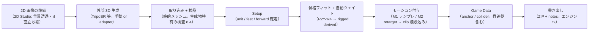

# 3D Interop / VRM / VR / Creation Spec（主要ツール連携・VRM・VR・ボーン・テクスチャ編集・画像→3D）

状態: **draft / human review required**
最終更新日: 2026-07-20（第2改訂: リグ作成 R2〜R4・モーション付与 M1〜M2・生成物特有検品・整合リスク参照を追加）
調査基準commit: 第2改訂 `3dd4dd4`（PR #131 マージ後の main。第1改訂は `96d63c5`、初版は `7018984`）
外部情報の確認日: 2026-07-20（9 章・11 章の表に個別記載）
上位文書: `README.md`（本ディレクトリ）, `3D_COMPLETE_PRODUCT_SPEC.md`
関連文書: `3D_FOUR_STAGE_IMPLEMENTATION_PLAN.md`（対応 work package）, `3D_IMPORT_INSPECTION_SETUP_EXPORT_SPEC.md`, `3D_ASSET_DATA_CONTRACT.md`, `3D_DECISION_LOG_AND_OPEN_ITEMS.md`

> **この文書は 3D 実装開始の承認ではない。** 2D Pro Gate（`../2D_COMPLETION_ROADMAP.md` 8 章）の人間承認前に、ここに書いた機能・依存関係を実装してはいけない。本書は初版計画（11 文書）に対する 2026-07-20 の改訂で追加された観点（主要ツール連携 / VRM / VR / 他ツールとの差分 / ボーン設定 / テクスチャ編集 / 画像→3D）の正本である。

---

## 1. 目的と責任範囲

この文書は、次の 7 観点を 1 か所で定義する。

1. 主要ツールとの連携（どのツールへ・どのレベルで持ち込めるか / どのツールから受け取るか）
2. 他の 3D・ゲーム作成ツールとの差分（Chameleon が持つもの / あえて持たないもの）
3. VRM（人型アバター形式）への対応レベル
4. VR（VR 向け素材準備と VR での確認）
5. ボーン設定（スケルトン検査・humanoid 対応付け・**骨格作成・ウェイト割り当て**）とモーション付与（**テンプレート・retarget**）
6. テクスチャ編集（既存 2D 編集機能の再利用による、3D テクスチャの修正）
7. 画像から 3D モデルを作る外部生成との接続詳細（2D 前処理・生成物特有の検品を含む）

各機能の「どの段階で実装するか」は `3D_FOUR_STAGE_IMPLEMENTATION_PLAN.md` の work package（`3D-STAGE2-11` / `3D-STAGE3-11` / `3D-STAGE3-12` / `3D-STAGE4-09` ほか）を正とする。データ構造の正本は `3D_ASSET_DATA_CONTRACT.md`、検査 ID の正本は `3D_IMPORT_INSPECTION_SETUP_EXPORT_SPEC.md` である。

---

## 2. 他ツールとの差分分析（gap analysis）

「Chameleon 3D は何であって何でないか」を、主要ツールとの重なりで定義する。**持たない機能は欠陥ではなく分担**であり、各行の「Chameleon の役割」がすみ分けを示す。

| ツール | 分類 | 重なる機能 | Chameleon が持たない機能（理由） | Chameleon の役割・差別化 |
|---|---|---|---|---|
| Blender | 総合 DCC（モデリング） | GLB 入出力、簡易検査 | モデリング・sculpt・UV 編集・リグ作成（非目標。ブラウザで再実装する価値がない） | 修正が必要な箇所を**警告と数値で特定**し、Blender で直すべき点を import notes で往復させる |
| Unity / Godot / Unreal | ゲームエンジン | モデル取り込み・collider 設定 | シーン構築・ゲームロジック・本番ビルド（エンジンの仕事） | エンジンに入れる**前**の検品・原点/スケール正規化・anchor/collider 等の metadata 付与 |
| VRoid Studio | 人型アバター作成 | VRM の閲覧 | アバターの作成・髪/衣装編集（VRoid の仕事。非目標） | VRoid 等が出力した VRM を**ゲーム素材として検品・整備**する受け側 |
| gltf.report / glTF-Transform CLI | glTF 検査・最適化 | 統計表示・prune/圧縮 | CLI・コード前提の操作性（対象利用者が違う） | 同等の検査・最適化を**日本語 UI + ゲーム影響の説明 + preset** で提供し、anchor/collider/ゲーム属性まで一体で扱う |
| three.js editor / Babylon Sandbox | ビューア・簡易編集 | 表示・material 確認 | 保存・プロジェクト管理なし（使い捨てビューア） | 保存（`.cas3dproj`）・検査履歴・書き出し記録・2D と同じ操作感を持つ**作業場** |
| Substance 3D Painter 等 | テクスチャペイント | テクスチャの変更 | 本格的な 3D ペイント（非目標） | 既存 2D 編集（背景透過・色調整・パレット置換）を**テクスチャ単位で再利用**する軽い修正（7 章） |
| Mixamo | 自動リグ・アニメ付与 | ボーン・animation の供給元 | 自動リグ生成（外部の仕事） | Mixamo 出力（FBX）を Blender 経由で GLB 化して持ち込む**手順書**を提供（4.2） |
| RapidPipeline 等の商用最適化 SaaS | アセット最適化サービス | 軽量化・LOD | クラウド処理・課金（ローカル方針に反する） | 完全ローカル・元モデル不変・検査履歴つきの軽量化 |

結論: Chameleon 3D の固有価値は「**作る**」でも「**動かす**」でもなく、外部で作られたモデルを**検品し、ゲーム用情報を付け、確実に持ち込める形へ整える**中間工程の完成度に置く（`3D_COMPLETE_PRODUCT_SPEC.md` 1 章の再確認）。

---

## 3. 主要ツール連携マトリクス

### 3.1 出力先（Chameleon → ツール）

区分の定義は `3D_IMPORT_INSPECTION_SETUP_EXPORT_SPEC.md` 8.6（verified / candidate / import notes only / unsupported）。**証拠なしに verified を名乗らない**規則は全対象共通。

| 出力先 | 初期区分（第二段階） | 完成時の目標区分 | notes に必ず書く内容 |
|---|---|---|---|
| Three.js | import notes only | verified（第四段階 `3D-STAGE4-03` で自動検証） | 変換不要（glTF ネイティブ）、anchor/collider の読み方、decoder 要件（圧縮時） |
| Babylon.js | import notes only | verified（同上） | 右手系モードの指定、その他同上 |
| Godot 4 | import notes only | verified（手動証拠が揃った場合のみ昇格） | -Z forward の読み替え、collider 変換（Shape3D 対応表） |
| Unity | import notes only | verified（同上） | glTF importer（UnityGLTF / glTFast）の選択、左手系変換、capsule の全高解釈 |
| Unreal Engine | **import notes only（第二段階で追加）** | import notes only のまま（昇格は証拠が揃った場合のみ） | glTF importer / Interchange の有効化手順、単位（UE は cm）とスケール換算、座標系（左手系 Z-up）の読み替え |
| Blender | **import notes only（第二段階で追加）** | import notes only | GLB 取り込み手順、修正して再出力する時の設定（+Y up / 単位 m / apply transform）、再取り込み時の注意（4.3） |
| Unity + UniVRM | import notes only（VRM 素材の場合のみ。第三段階以降） | import notes only | VRM 版（0.x / 1.0）と UniVRM 版の対応、meta ライセンスの尊重 |

- Unreal / Blender の追加は `3D-STAGE2-08`（import notes 生成）の対象を 4 → 6 に拡大して行う。
- エンジン向け座標系のバイト列自動変換は引き続き行わない（`3D-OPEN-19` の既定を維持。notes と数値補助のみ）。

### 3.2 供給元（ツール → Chameleon）

| 供給元 | 受け取り形式 | 状態 | 注意 |
|---|---|---|---|
| Blender | GLB / glTF bundle | 第一〜第二段階で対応済み範囲 | 出力設定（+Y up / meter）を notes で案内 |
| VRoid Studio | VRM（= glTF + VRM 拡張） | 第二段階の VRM 検出から（5 章） | VRM meta の利用条件を必ず表示 |
| Mixamo | FBX / DAE のみ（GLB 出力なし） | **直接読み込みは unsupported を維持** | 「Mixamo → Blender で GLB 化 → Chameleon」の手順書を supply notes として提供（Mixamo の利用規約確認は利用者の責任と明記。`3D-OPEN-27`） |
| 画像→3D 生成ツール（TripoSR 等） | GLB / glTF | 手動持ち込みは常時可能。自動接続は第四段階（8 章） | provenance 申告・検品必須 |
| アセットストア購入素材 | GLB / glTF / VRM | 対応形式なら可能 | license.declared の記録を促す |

---

## 4. ボーン設定とモーション付与（skeleton / humanoid / rig / motion）

> **2026-07-20 第2改訂**: 本章は「既にあるボーンの検査・対応付け」（B0〜B3）に加えて、**ボーンが無い静的モデルへの骨格作成（R2〜R4）とモーション付与（M1〜M2）**を含むよう拡張された。画像→3D 生成モデルは静的で出力されるため、この経路が無いと主要動線が完結しない。

### 4.1 対応レベル

| レベル | 内容 | 段階 |
|---|---|---|
| B0: 検出 | skin / joint 数 / skeleton 有無の表示（実装済み計画: `3D-CHK-SKIN-001`） | 第二段階（既存計画） |
| B1: 検査 | joint 階層ツリー表示、bind pose の整合検査、初期姿勢の T-pose / A-pose 推定表示、ウェイト異常（合計≠1、影響ボーン数超過）の警告 | 第二段階（`3D-STAGE2-05` の拡張 + 検査 ID `3D-CHK-BONE-001〜003`） |
| B2: humanoid 対応付け | glTF の node を標準 humanoid スロット（hips / spine / chest / neck / head / 左右の shoulder・upperArm・lowerArm・hand・upperLeg・lowerLeg・foot 等）へ対応付ける。名前からの自動推定 + 手動修正 UI。結果は `asset3d.json` の `humanoidMap` に保存（非破壊 metadata） | 第三段階（`3D-STAGE3-11`） |
| B3: 利用 | humanoid スロットを使った anchor 追加補助（「右手に anchor」ワンクリック）、エンジン retarget notes への反映、VRM humanoid 完全性検査（5 章） | 第三段階（同 WP 内） |
| **R2: 骨格の作成**（2026-07-20 第2改訂で追加） | **ボーンが無い静的モデル**（画像→3D 生成物の標準状態）に、humanoid テンプレート骨格を配置・フィットする。bounds / feet / 左右対称からの初期自動配置 + ギズモ・数値によるボーン端点調整（対称編集つき） | 第三段階（`3D-STAGE3-13`） |
| **R3: ウェイト割り当て** | 各頂点がどのボーンにどれだけ追従するか（skin weight）を自動計算（距離ベース envelope 方式）し、ヒートマップ表示で確認・ボーン単位の影響半径で調整する | 第三段階（`3D-STAGE3-14`） |
| **R4: rigged derived 生成** | 骨格 + ウェイトを焼き込んだ **rigged モデルを derived として生成**（source 不変。`DerivedModel.kind: "rigged"`）。以後のモーション付与・node 追従はこの rigged derived を対象にする | 第三段階（同 WP 内） |
| 対象外（変更なし） | 頂点単位のウェイトペイント（`3D-OPEN-29`）、ボーンの個別追加/削除による自由骨格編集、物理（揺れもの）ボーン作成、Blender 級の本格リグ作成 | 外部ツールの仕事 |

> **設計判断（2026-07-20 第2改訂）**: 初版〜第1改訂は「リグ作成は外部の仕事」としていたが、**主対象である画像→3D 生成モデルは静的（ボーン無し）で出力される**ため、それではキャラクターを動かす動線がツール内で完結しない。ボーンはモーションの主軸であり、「テンプレート骨格 + 自動ウェイト」という限定形でツール内に持つ（完全なリグ作成は引き続き非目標）。旧決定の変更として追跡表・決定記録に記録した（`3D-DEC-RIG-01`）。

### 4.2 humanoid スロットの語彙

- VRM 1.0 の humanoid ボーン一覧（必須 + 任意）を基準語彙として採用する（Unity Humanoid とほぼ相互対応でき、VRM 検査・テンプレート骨格・モーション retarget で共用できるため）。独自語彙は作らない。
- 対応付けは node index を正、node 名を表示・再検証用とする（anchor の `nodeRef` と同じ規則。`3D_ASSET_DATA_CONTRACT.md` 7.1）。
- 自動推定は「候補の提示」までとし、確定は必ず利用者操作にする（推定精度の合格基準は `3D-OPEN-25`）。

### 4.3 骨格作成（R2）の設計

- **前提条件（動線順序の強制）**: Setup 完了（feet / forward / unitScale の確定）を骨格フィット開始の前提にする。正立・足元接地・正面向きが決まっていないと自動配置が成立しないため、未完了なら「先に Setup を完了してください」と誘導する。⚠️ 整合注意（`3D-RISK-12`）
- テンプレートは humanoid 1 種から始める（四足・非人型の汎用カスタム骨格は `3D-OPEN-28`。既定: 対象外）。
- 初期配置: bounds と feet から身長を推定し、標準比率で各ボーン端点を置く。左右対称は既定 ON。
- 調整: viewer のギズモ + 数値入力（両対応。UI 仕様の規則どおり）。ボーン端点は model space で保存し、表示変換（rotationOffset 等）と混同しない。⚠️ 整合注意（`3D-RISK-09`）
- 骨格定義は適用（R4）までは asset3d.json 内の一時的な編集データ（`rigDraft`。optional）として保存し、Undo / Redo に載せる。

### 4.4 ウェイト割り当て（R3）の設計と制限

- 方式: 距離ベースの envelope（各ボーンのカプセル状影響範囲と減衰）。heat diffusion 等の高品質方式は初期対象外（品質が必要な素材は外部ツールへ、と明記する）。
- 計算は Worker で実行（`3D-STAGE3-10` の進捗・中断基盤に乗せる）。
- **頂点あたり影響ボーン数は最大 4 を既定**とする（主要エンジン・glTF の一般的制約に合わせる。`3D-CHK-BONE-003` と整合）。⚠️ 整合注意（`3D-RISK-11`）
- 確認手段: ウェイトのヒートマップ表示（ボーン選択で該当頂点が色づく）+ テストポーズ（各関節を軽く曲げた確認用ポーズ）での目視確認 + ウェイト検査（合計≠1・孤立頂点の警告）。
- 調整はボーン単位の影響半径・減衰の変更 → 再計算まで。頂点単位ペイントはしない（`3D-OPEN-29`）。

### 4.5 rigged derived（R4）と node 参照の再バインド

- 適用すると、glTF-Transform で skeleton node 群 + skin + weights を書き込んだ **rigged derived** を生成する（`DerivedModel.kind: "rigged"`、recipe に骨格定義とウェイト設定を記録 = 再現可能）。
- **⚠️ 最重要の整合注意（`3D-RISK-02`）**: rigged derived は node 構成が source と異なる（ボーン node が増える）。`nodeRef` / `humanoidMap` の node index は**どのバイト列に対する index か**を必ず `nodeBinding`（契約 7.3）で明示し、rigged derived 生成時に humanoidMap・node 追従 anchor / collider を rigged derived の index へ**再バインド**する。source 基準の記録を rigged derived に対して解釈してはいけない（実装時の最頻出バグ想定箇所）。
- rigged derived 生成後も source は不変で、リグをやり直す場合は rigDraft から再生成する（rigged derived の直接編集はしない）。

### 4.6 モーション付与（M0〜M3。2026-07-20 第2改訂で追加）

静的モデルにボーンを付けただけではゲーム素材として未完である。「動かして初めて完成」まで計画に含める。

| レベル | 内容 | 段階 |
|---|---|---|
| M0: 再生・検査 | 既存クリップの再生・保持チェック（既存計画: `3D-STAGE2-05` / `3D-STAGE3-07`） | 第二〜第三段階（既存） |
| M1: モーションテンプレート | idle / walk / run / jump / attack / damage / dead 等の**手続き生成モーション**を、humanoid 対応付け済み骨格へ適用し、glTF animation clip として焼き込む（2D の「モーションテンプレート → フレーム焼き込み」の 3D 版。焼き込み先は rigged derived または `motion-baked` derived） | 第三段階（`3D-STAGE3-15`） |
| M2: retarget | humanoid 対応付け済みの**別モデルのクリップ**（例: Mixamo→Blender→GLB 化した歩行モーション）を、対象モデルの骨格へ流し込む。骨長差はスロット単位の回転リターゲット + hips 位置スケールで吸収。必ずプレビュー → 承認 → 焼き込み | 第三段階（`3D-STAGE3-16`） |
| M3: キーフレーム編集 | ボーンポーズの手付けキーフレーム編集 | 対象外候補（`3D-OPEN-30`。既定: 実装しない。テンプレート + retarget で不足する場合に再検討） |
| 対象外 | 本格的なアニメーション制作（カーブエディタ・IK リグ・レイヤー合成）、物理シミュレーション | 外部ツールの仕事（非目標のまま） |

- クリップ名は 2D の `ANIMATION_NAME_SUGGESTIONS`（idle / walk / run / jump / attack / damage / dead / win / lose）と同じ語彙を使い、2D / 3D で「ゲームに載せる動きの語彙」を揃える。⚠️ 整合注意（`3D-RISK-06`: 2D モーションテンプレートとは**名前が同じだけの別実装**。実装・テストを流用しない）
- モーションテンプレートの中身は Chameleon 自作の手続き生成（外部モーションデータを同梱しない。同梱する場合はライセンス確認 = `3D-OPEN-31`）。
- 焼き込み結果は通常の animation clip なので、既存の再生・保持チェック・書き出し・engine notes がそのまま適用される。

### 4.7 外部リグ付け・外部モーションとの往復

- 高品質が必要な場合の外部経路（Mixamo / RigAnything / UniRig / Blender）は引き続き有効。**内蔵リグは「速く・それなり」、外部は「時間をかけて高品質」**という分担を UI とガイドに明記する。
- 外部でリグ付けした GLB は新規アセットとして取り込む（revision 再取り込みは `3D-OPEN-24` のまま）。
- Mixamo クリップの持ち込み（FBX→Blender→GLB）は M2 retarget の主要な供給経路として supply notes に記載する（`3D-OPEN-27`）。

---

## 5. VRM 対応

VRM は glTF の拡張として定義された人型アバター形式である（VRM 0.x = 拡張名 `VRM` / VRM 1.0 = `VRMC_vrm` ほか）。**VRM ファイルは構造上そのまま GLB として読める**ため、source 不変の原則（拡張データをバイト列ごと保持）と相性が良い。

### 5.1 対応レベル（`3D-DEC-VRM-01` で人間承認）

| レベル | 内容 | 依存 | 段階 |
|---|---|---|---|
| V0: 素通し | VRM を通常の GLB として読み込み・書き出し（拡張は未知データとして保持） | なし | 第一段階（追加実装なしで成立） |
| V1: 検出と meta 表示（**推奨最低ライン**） | `VRM` / `VRMC_vrm` 拡張の検出、VRM 版の表示、**meta（タイトル・作者・利用許諾: 商用可否 / 改変可否 / 再配布可否 / アバター使用条件）の読み取りと表示**、humanoid ボーン一覧の表示、expression / spring bone の有無表示 | なし（JSON 読取のみ） | 第二段階（`3D-STAGE2-11`） |
| V2: VRM 検査 | humanoid 必須ボーンの欠落検査（`3D-CHK-VRM-002`）、meta 未記入の警告、Chameleon の license.declared との突合（VRM meta が商用不可なのに declared が商用可の場合に警告） | なし | 第二段階（同 WP） |
| V3: VRM 描画 | spring bone（揺れもの）・expression を反映した preview（`@pixiv/three-vrm` を 3D chunk 内で任意ロード） | three-vrm（MIT。2026-07-20 一次確認済み） | 第四段階の候補（`3D-OPEN-22`。既定: 通常 glTF として表示できれば完成条件は満たす） |
| 対象外 | VRM の作成・変換（glTF→VRM 化）、spring bone / expression / look-at の編集、VRM meta の書き換え | - | VRoid 等の仕事。非目標 |

### 5.2 VRM meta と利用条件の扱い

- VRM meta の利用許諾フラグは、**Chameleon の provenance / license 記録（契約 9〜10 章）へ自動転記**し、export ZIP の README にも表示する。VRM は形式自体が利用条件を内包する点で、本計画の「利用条件を記録し注意喚起する」方針と一致する。
- meta の内容を Chameleon が検証・保証はしない（記録と表示のみ。2D の ADR-0013 と同じ境界）。
- VRM を書き出す場合は source 素通し（バイト列不変）のみとし、meta を変更した派生は作らない。

---

## 6. VR 対応

### 6.1 VR 向け素材の準備（主目的）

- 検品プリセットに **`vr` プリセットを追加**する（`3D-STAGE2-06` の対象に含める）。VR は 72〜90fps 常時 + 両眼描画のため、mobile より厳しい暫定しきい値から開始する（例: 三角形 50,000 / texture 最大辺 2048 / material 数 4。**すべて暫定**、fixture 実測で確定）。
- import notes に VR 利用時の注意（片目あたり描画負荷、透過 material のコスト）を追記する。
- VRChat 等プラットフォーム固有のアップロード要件対応は対象外（プラットフォーム側の検証ツールの仕事）。

### 6.2 VR での確認（WebXR preview。条件付き）

- 「実寸で見る」価値（1.8m のキャラクターを VR で実寸確認）に限定した WebXR immersive preview を、**第四段階の条件付き work package**（`3D-STAGE4-09`）として定義する。
- 前提: WebXR 対応環境（PC + 対応 HMD、対応ブラウザ）でのみ有効化する feature detection。**iPhone / iPad Safari は WebXR 非対応のため、VR preview を完成条件に含めない**（`3D-OPEN-23`。既定: 不採用でも完成）。
- 実装する場合も閲覧専用（VR 内での編集はしない）。motion sickness 配慮（スナップ移動のみ・視界揺れなし）を要件にする。

---

## 7. テクスチャ編集（2D 編集資産の再利用）

Chameleon には 2D で実証済みの画像編集基盤（トリミング・背景透過・消しゴム・HSL 色調整・パレット置換・輪郭線。`src/core/images` + Worker、Phase 6）がある。これを**テクスチャ単位の軽い修正**として 3D に再利用する。これは本計画の中で最も Chameleon らしい差別化機能である（2 章の Substance 行参照）。

### 7.1 機能定義（`3D-STAGE3-12`）

1. Materials / Scene からテクスチャを選び「このテクスチャを編集」を実行する。
2. テクスチャ画像を取り出し、2D と同じ操作感の編集ビューで修正する（背景透過・色調整・パレット置換・消しゴム。**UV 展開線のオーバーレイ表示**付きで、どこがモデルのどこかを確認できる）。
3. 適用すると、**テクスチャを差し替えた derived model を生成**する（glTF-Transform でテクスチャ置換。source は不変。契約 8 章の `DerivedModel.kind` に `texture-replaced` を追加）。
4. Compare 画面で before / after を確認してから書き出し対象に選ぶ（既存の派生フローに乗る）。

### 7.2 制限（安全側の既定）

- 初期対象は **baseColor テクスチャのみ**。normal / metallic-roughness / occlusion / emissive は「見た目が壊れやすく色空間の意味が異なる」ため編集対象外とし、選択時に理由を表示する（対象拡大は `3D-OPEN-26`）。
- 色空間: baseColor は sRGB として扱い、書き戻し時に色空間指定を変更しない。
- 4096px 超のテクスチャは編集前に縮小を促す（2D の取り込み上限と整合）。
- 実装境界: `src/core/images` の**純関数を読み取り専用で import して再利用**する（2D 側ファイルは変更しない。変更が必要になったら core3d 側にラップ/コピーする。`3D_ARCHITECTURE_AND_BOUNDARIES.md` 3 章の規則に追記済み）。

### 7.3 material の簡易調整（旧 `3D-OPEN-14` の再定義）

- baseColor factor / metallic factor / roughness factor / emissive factor の数値調整を、テクスチャ編集と同じ「derived 生成」方式で第三段階の**任意拡張**として再定義する（`3D-STAGE3-12` の追加スコープ候補。採否は段階開始時に判断）。
- material の構造変更（シェーダー変更・テクスチャスロット追加）は対象外のまま。

---

## 8. 画像から 3D モデルを作る（外部生成の接続詳細）

原則は不変: **生成はブラウザ本体に入れない**。Python / GPU / モデル重みは外部。Chameleon は「入口（画像の用意）と出口（検品・整備）」を担う。初版計画の `3D-STAGE4-01/-02` を次のとおり詳細化する。

### 8.0 端から端までの標準動線（2026-07-20 第2改訂で明文化）

「画像 1 枚から、ゲーム内で歩くキャラクター」までの標準動線を次に固定する。各工程は既存 / 新設の work package に対応しており、**この動線のどこにも行き止まりがない**ことを完成条件に含める（10 章）。



- ボーン付きで入ってきたモデル（VRM・購入素材等）は E を「humanoid 対応付け（B2）」に読み替えて同じ動線に乗る。
- 静止物（prop / environment）は D から H へ直行してよい（E〜G は任意）。

### 8.1 2D→3D ブリッジ（Chameleon 内の入口）

- 3D プロジェクトの Import 画面に「画像から作る（外部生成）」入口を置き、**既存 2D プロジェクトのアセット画像（edit テクスチャ）または任意の画像ファイル**を生成用入力として選べるようにする。
- 2D 側データへは**読み取り専用**でアクセスする（2D の store を変更しない。参照のみ）。
- 選んだ画像・生成先・日時は provenance の生成元記録として保存する。
- **2D 前処理ガイド**（生成品質は入力画像で決まるため、2D Studio で行う推奨前処理を UI 内ガイドとして提供する）:
  1. 背景透過（2D の背景透過機能。生成器の背景誤認を防ぐ最重要処理）
  2. 正面または 3/4 視点の全身立ち絵にする（切れ・重なりを避ける）
  3. 輪郭を明瞭に（2D の輪郭線機能が使える）
  4. 1 枚あたり 1 体（複数体・小物同居は分離する）
- 複数視点入力（正面 + 側面 + 背面）に対応する生成器のため、adapter の `input` は画像**配列** + 視点ラベル（front / side / back / other）を許容する形に拡張する（対応可否は provider ごと）。

### 8.2 adapter プロトコル（ローカル外部処理。`3D-DEC-EXTGEN-01` の承認範囲）

```jsonc
// 送信（Chameleon → local processor。毎回の明示承認後）
{ "protocol": "chameleon-3d-generate/1", "requestId": "…",
  "input": { "kind": "image", "mimeType": "image/png", "bytesBase64またはmultipart": "…" },
  "options": { "provider": "triposr", "quality": "draft" } }
// 応答（processor → Chameleon）
{ "requestId": "…", "status": "succeeded",
  "model": { "mimeType": "model/gltf-binary", "bytes": "…" },
  "provider": { "name": "TripoSR", "version": "…", "license": "MIT" },
  "log": "…" }
```

- job 状態は created → approved（利用者承認）→ running → succeeded / failed / cancelled。失敗しても入力画像と既存アセットは失われない。
- 受領 GLB は**通常の検証パイプライン（入出力仕様 3 章）を必ず通す**。provenance は `origin: external-generator` + provider 情報を自動記録する。
- 外部 API（クラウド）接続は、送信データの扱い・保存期間・学習利用の有無を provider 規約で確認できた場合のみ個別承認する（既定: 接続しない）。

### 8.2b 生成物特有の検品（ポリゴン・テクスチャ観点の増強。2026-07-20 第2改訂）

画像→3D 生成モデルには定型的な品質問題がある。次を前提知識として検品・ガイドに組み込む（検査 ID は入出力仕様 4.3）。

| 生成物の典型問題 | 対応する検査 / 機能 |
|---|---|
| ボーン・アニメーションが無い（静的） | `3D-CHK-ANIM-001`（info）→ 骨格フィット（R2）への導線を警告文の fix に記載 |
| 原点・向き・スケールが不定 | 既存 `3D-CHK-ORG/BND` + Setup |
| 非多様体・退化三角形・穴 | **`3D-CHK-GEO-003`（新設）**: 非多様体エッジ / 退化三角形 / 未閉合の検出。ウェイト計算・簡略化の品質低下要因として警告 |
| 重複頂点・未結合頂点 | **`3D-CHK-GEO-004`（新設）**: weld（`3D-STAGE3-03`）推奨の根拠として表示 |
| テクスチャ無し（頂点カラーのみ） | **`3D-CHK-TEX-004`（新設）**: info。テクスチャ編集対象が無い旨を表示 |
| 自動 UV の重なり・密度ムラ・巨大 atlas 1 枚 | **`3D-CHK-UV-003`（新設）**: UV 重なり率・texel 密度の偏りを参考値表示。焼き込み済み陰影（baked lighting）は自動判定せず、ガイド文で注意喚起 |
| ポリゴン数過剰 / 過少 | 既存 `3D-CHK-TRI-001` + 簡略化（過少 = シルエット破綻は目視。Compare で確認） |

### 8.3 provider 候補の現状（2026-07-20 時点）

| provider | コードのライセンス | 重み / 商用条件 | 現在の扱い |
|---|---|---|---|
| TripoSR | **MIT（2026-07-20 一次確認済み）** | 重みのモデルカードは未確認 | 最初の実験候補（ローカル） |
| TRELLIS | **MIT（2026-07-20 一次確認済み）** | 重み・依存モデルの条件は未確認 | 高品質候補（要 GPU） |
| Stable Fast 3D / SPAR3D | 未確認（Stability AI community license 系と報告されるが一次未確認） | 売上条件の確認必須 | 確認待ち |
| Hunyuan3D 系 | **未確認**（2026-07-20 に GitHub の LICENSE 取得を試行したが 404。リポジトリ所在含め要再調査） | 地域・MAU 条件の報告あり（未検証） | 確認待ち |
| その他（Step1X-3D 等） | 未確認 | - | 研究追跡のみ（既定変更なし） |

---

## 9. 新規依存関係候補（この改訂で追加）

install は従来どおり Gate 承認後のみ。確認日はいずれも 2026-07-20（一次情報 = 公式リポジトリ LICENSE）。

| 候補 | 用途 | 必須/任意 | 導入段階 | ライセンス | 削除方法 |
|---|---|---|---|---|---|
| @pixiv/three-vrm | VRM の spring bone / expression 反映 preview（V3） | 任意 | 第四段階候補（`3D-OPEN-22` 採用時のみ） | MIT（確認済み） | 3D chunk 内の任意ロードのため単独削除可 |

- VRM V1/V2（検出・meta・humanoid 検査）は **JSON 読取のみで依存追加なし**。WebXR も描画ライブラリ標準機能で依存追加なし（Three.js の WebXRManager / Babylon の WebXR 対応。Gate-02 の評価項目に「WebXR 対応の成熟度」を追加する）。

---

## 10. 完成条件への影響

- 第1改訂（2026-07-20 前半）は完成条件を変更しなかったが、**第2改訂で完成条件 1（一続きの体験）の範囲を拡張した**: 「画像→（外部生成）→静的モデル→骨格フィット→自動ウェイト→モーション付与→書き出し」の動線（8.0）が実機で完了できることを、完成条件 1 の確認内容に含める（`3D_COMPLETE_PRODUCT_SPEC.md` 3・8 章を同時更新済み）。
- 完成必須に含めるもの: vr プリセット、VRM V1/V2、B1〜B3、**R2〜R4（骨格フィット・自動ウェイト・rigged derived）**、**M1〜M2（モーションテンプレート・retarget）**、テクスチャ編集（baseColor）、Blender / Unreal import notes、手動持ち込み + provenance、生成物特有の検査（8.2b）。
- 条件付き（無くても完成）: VRM V3 描画、WebXR preview、外部処理の実接続、material factor 調整、revision 再取り込み、非人型カスタム骨格、キーフレーム編集。

## 11. 未決定事項（この文書の範囲）

`3D_DECISION_LOG_AND_OPEN_ITEMS.md` に登録済み: `3D-DEC-VRM-01`（VRM 対応レベル）、`3D-DEC-RIG-01`（リグ作成の採用レベル）、`3D-OPEN-22`（VRM V3 描画）、`3D-OPEN-23`（WebXR preview）、`3D-OPEN-24`（revision 再取り込み）、`3D-OPEN-25`（humanoid 自動推定の合格基準）、`3D-OPEN-26`（テクスチャ編集の対象 map 拡大）、`3D-OPEN-27`（Mixamo 手順書の扱い）、`3D-OPEN-28`（非人型カスタム骨格）、`3D-OPEN-29`（頂点単位ウェイトペイント）、`3D-OPEN-30`（キーフレーム編集）、`3D-OPEN-31`（モーションデータ同梱のライセンス）。8.3 の未確認ライセンス全件。

整合リスク（⚠️ 3D-RISK-xx）の台帳は `3D_DECISION_LOG_AND_OPEN_ITEMS.md` 7 章を正本とする。
