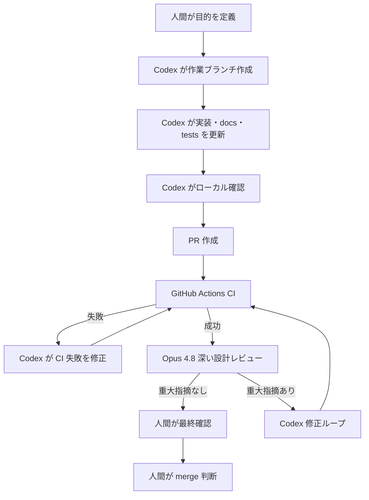

# Codex / Opus Automation Workflow

最終更新日: 2026-07-07  
対象リポジトリ: `chameleonjp-lab/chameleonassetstudio`  
文書種別: Codex 実装、CI、Claude Code Opus 4.8 レビュー、Codex 修正の PR 運用設計  
上位文書: `docs/REQUIREMENTS_SPECIFICATION.md`, `docs/IMPLEMENTATION_PLAN.md`, `docs/future/FABLELESS_DEVELOPMENT_GUIDE.md`

---

## 1. 目的

この文書は、Chameleon Asset Studio の PR 運用を次の流れで半自動化するための設計を定義する。

1. Codex が 1 目的の実装ブランチを作る。
2. Pull Request を作成する。
3. GitHub Actions の CI を実行する。
4. CI が成功した PR だけ、Claude Code Opus 4.8 による深い設計レビューを実行する。
5. Opus 4.8 の重大指摘がある場合は、Codex 修正に戻す。
6. 修正後に再 CI と再レビューを行う。
7. 最終 merge は人間が判断する。

この運用は `docs/future/FABLELESS_DEVELOPMENT_GUIDE.md` の `claude-fable-5` 非依存方針に従う。`claude-fable-5` は使わず、高難度レビューは `claude-opus-4-8`、実装修正は Codex、最終判断は人間が担う。

---

## 2. 絶対ルール

- `main` へ直接 push しない。
- 1 PR 1 目的を守る。
- CI が失敗している PR には、Opus 4.8 の深い設計レビューを走らせない。
- Opus 4.8 レビューは CI 成功後だけ実行する。
- Opus 4.8 の重大指摘は自動 merge 条件にしない。Codex 修正または人間確認へ戻す。
- merge は完全自動化しない。最終 merge は人間が判断する。
- Claude / Codex / その他サービスの API キー値を docs、workflow、ログに書かない。
- dependencies は、この運用文書だけを根拠に追加しない。

---

## 3. 標準フロー



### 3.1 Codex 実装

Codex は PR 作成前に次を確認する。

- 今回の目的が 1 つに絞られている。
- `docs/REQUIREMENTS_SPECIFICATION.md` と `docs/IMPLEMENTATION_PLAN.md` に反していない。
- Phase 18 以降、または `asset.json` / `.casproj` / export ZIP / 座標系 / 原点 / アンカー / 当たり判定 / リグ / アニメーション / 3D 関連へ触れる場合は、`docs/future/FABLELESS_DEVELOPMENT_GUIDE.md` と `docs/future/POST_PHASE17_IMPLEMENTATION_PLAN.md` も確認している。
- 仕様変更が必要な場合は、コードより先に docs の差分を作る。
- 既存アプリ機能と既存データ形式を不要に変更していない。

### 3.2 CI

既存 CI は `.github/workflows/ci.yml` を正とし、pull request で次を実行する。

- `npm run lint`
- `npm run format:check`
- `npm run build`
- `npm run test`
- `npm run e2e`

CI が失敗した場合、Opus 4.8 の深い設計レビューは実行しない。まず Codex が format / lint / type error / test failure を修正する。

### 3.3 Opus 4.8 レビュー

Opus 4.8 レビューは、CI 成功後にだけ実行する。主な確認対象は次の通り。

- docs と実装の矛盾。
- 要件仕様書・実装計画書・将来計画との矛盾。
- `asset.json` / `.casproj` / export ZIP の互換性破壊。
- 座標系、原点、アンカー、当たり判定、リグ、アニメーションの意味の破壊。
- 3D 関連の範囲逸脱。
- 1 PR 1 目的を超える変更。
- 次の実装者が誤解する docs / コード構造。

format / lint / type error / test failure のように CI で拾えるものは、Opus 4.8 レビューの主指摘にしない。これらは CI 失敗として Codex が先に直す。

### 3.4 Codex 修正ループ

Opus 4.8 が重大指摘を出した場合、Codex は指摘を分類して修正する。

- docs 矛盾: docs または実装のどちらが正かを明確にし、必要なら人間確認へ戻す。
- 互換性破壊: 自動確定せず、破壊しない実装へ戻す。判断が必要な場合は人間確認へ戻す。
- 設計破壊: 変更範囲を縮小し、1 PR 1 目的へ戻す。
- CI で拾える問題: Codex が修正し、再 CI へ戻す。

Codex 自動修正ループは最大 2 回までとする。2 回修正しても Opus 4.8 の重大指摘が残る場合、その PR は自動修正を止め、人間確認へ戻す。

---

## 4. 自動化してよい範囲

次は自動化してよい。

- PR 作成後の CI 実行。
- CI 失敗時のログ収集と分類。
- format / lint / type error / unit test failure の Codex 修正。
- docs の誤字、リンク、表記ゆれの修正。
- 既存仕様に沿ったテスト追加。
- CI 成功後の Opus 4.8 レビュー起動。
- Opus 4.8 レビュー結果の PR コメント化。
- 重大指摘がない場合に、人間へ merge 判断を依頼する通知。

---

## 5. 人間確認に戻す範囲

次は自動修正だけで確定してはいけない。Opus 4.8 が妥当そうな提案を出しても、最終判断は人間確認へ戻す。

- `asset.json` の仕様変更、version 変更、既存フィールド意味変更。
- `.casproj` の構造変更、既存 `.casproj` の読み込み互換性に影響する変更。
- export ZIP の構成変更、既存ファイルの削除・移動・名前変更。
- 座標系の定義変更。
- 原点の意味または初期値の変更。
- アンカーの意味、用途、座標解釈の変更。
- 当たり判定の形状、座標、用途、書き出し仕様の変更。
- リグ、bind pose、rotation limit、rig bake の座標変換変更。
- アニメーション、frame、fps、loop、timeline の意味変更。
- 3D 関連の要件、ファイル形式、メタデータ、軽量化、外部 3D 生成連携。
- dependencies 追加、ライセンス未確認ライブラリの採用。
- WebGPU 必須化、クラウド必須化、アカウント必須化、課金前提化。

---

## 6. GitHub Actions 設計

### 6.1 推奨構成

既存の `CI` workflow はそのまま維持する。Opus 4.8 レビューは別 workflow とし、CI workflow の成功を条件に起動する。

推奨イベント:

```yaml
on:
  workflow_run:
    workflows: ["CI"]
    types: [completed]
```

推奨条件:

```yaml
if: >
  github.event.workflow_run.event == 'pull_request' &&
  github.event.workflow_run.conclusion == 'success'
```

この条件により、CI が失敗・キャンセル・スキップした PR では Opus 4.8 レビューを実行しない。

### 6.2 実装時の注意

- 既存 `.github/workflows/ci.yml` の job 名や実行内容を壊さない。
- API キー値は GitHub Secrets に置き、workflow や docs に値を書かない。
- fork PR から secrets を使う設計は慎重に扱う。必要なら `pull_request_target` ではなく、権限を絞った `workflow_run` + 明示的なチェックアウトにする。
- Opus 4.8 レビュー job は PR 差分と関連 docs だけを読ませる。
- レビュー結果は PR コメントまたは `REVIEW.md` 形式の artifact として残す。
- レビューに失敗した場合も自動 merge しない。人間が確認できる状態で停止する。

### 6.3 workflow 追加案

実際に GitHub Actions を追加する場合は、次のような別ファイルを検討する。

```yaml
name: Opus Review

on:
  workflow_run:
    workflows: ["CI"]
    types: [completed]

permissions:
  contents: read
  pull-requests: write

jobs:
  opus-review:
    if: >
      github.event.workflow_run.event == 'pull_request' &&
      github.event.workflow_run.conclusion == 'success'
    runs-on: ubuntu-latest
    steps:
      - name: Resolve pull request
        run: echo "Resolve PR number from workflow_run payload"
      - name: Checkout reviewed head
        uses: actions/checkout@v4
      - name: Run Opus 4.8 review
        env:
          CLAUDE_API_KEY: ${{ secrets.CLAUDE_API_KEY }}
        run: echo "Run claude-opus-4-8 review without printing secrets"
      - name: Comment review result
        run: echo "Post design review result to PR"
```

上記は設計案であり、そのまま有効な API 呼び出し実装ではない。採用する Claude Code / GitHub 連携方式が確定してから、別 PR で追加する。

---

## 7. Opus 4.8 レビュー入力

レビューに渡す入力は最小限にする。

- PR title / body。
- 変更ファイル一覧。
- diff。
- `README.md`。
- `docs/REQUIREMENTS_SPECIFICATION.md`。
- `docs/IMPLEMENTATION_PLAN.md`。
- Phase 18 以降または将来領域に触れる場合は `docs/future/FABLELESS_DEVELOPMENT_GUIDE.md`, `docs/future/POST_PHASE17_IMPLEMENTATION_PLAN.md`, `docs/future/OPEN_ITEMS.md`。
- データ形式や export に触れる場合は関連する format docs と schema / model files。

---

## 8. REVIEW.md との関係

`REVIEW.md` は Opus 4.8 レビューの観点を固定するためのリポジトリ内ガイドである。Opus 4.8 は CI で検出できる format / lint / type error を主指摘にせず、設計破壊、互換性破壊、docs 矛盾を優先して確認する。
