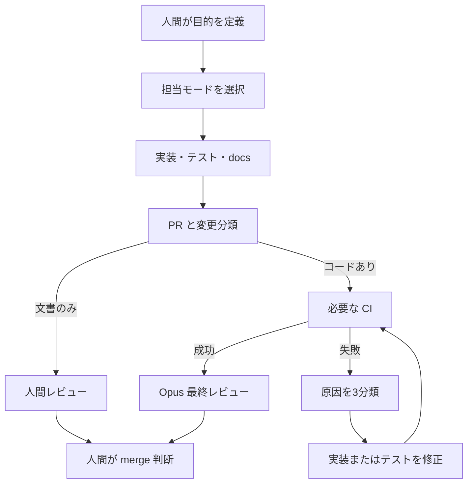

# Claude Code / Codex / Opus Workflow

最終更新日: 2026-07-10
対象リポジトリ: `chameleonjp-lab/chameleonassetstudio`  
文書種別: 実装、CI、診断レビュー、最終レビュー、PR 運用の設計
上位文書: `CLAUDE.md`, `AGENTS.md`, `docs/REQUIREMENTS_SPECIFICATION.md`, `docs/IMPLEMENTATION_PLAN.md`

---

> **現状:** `.github/workflows/ci.yml` には変更内容に応じて検査を分ける仕組みを実装している。Opus 4.8 を自動起動する workflow は未実装であり、8 章は将来設計である。

## 1. 目的

この文書は、必要な更新を不必要な検査で止めず、実装変更には必要な安全確認を残すための運用を定義する。

標準の流れ:

1. 作業に応じて Claude Code Primary Mode、Hybrid Roadmap Mode、Codex Fallback Mode を選ぶ。2D 完成計画は Hybrid Roadmap Mode を既定にする。
2. 1 つの目的を完成させる実装、テスト、docs、CI 安定化を同じ PR にまとめる。
3. CI が変更ファイルを分類する。
4. 変更内容に必要な検査だけを実行する。
5. CI が失敗した場合は、実装、テスト、環境のどこに原因があるかを調べる。
6. 最終承認のための Opus 4.8 レビューは、必要な CI が成功した後に行う。
7. 最終 merge は人間が判断する。

---

## 2. 運用ルール

- 原則として `main` へ直接 push せず、作業ブランチと PR を使う。
- 1 PR 1 目的とするが、同じ目的の実装、テスト、docs を過度に分割しない。
- 同じ目的の open PR がある場合は、まず既存 PR を更新する。再利用できない場合は close 理由を残してから作り直す。
- Markdown 文書だけの変更を、コード用の整形、build、unit、E2E で止めない。
- コードや設定を変更した場合は、その影響に応じた検査を実行する。
- CI の失敗は実装不具合と決めつけず、テスト不具合と環境不具合も調べる。
- 最終レビューは CI 成功後に行う。ただし、失敗原因を調べる診断レビューは CI 失敗中でも行ってよい。
- 自動 merge は行わない。最終判断は人間が行う。
- API キーや秘密情報を docs、workflow、ログへ書かない。

---

## 3. 標準フロー



### 3.1 担当モード

- Claude Code Primary Mode: Fable5 が使える間の主運用。Sonnet5 が実装、Opus 4.8 が高難度レビュー、Haiku が探索を担当する。
- Hybrid Roadmap Mode: Fable5 が段階開始時の判断、Codex が実装と CI 修正、Opus 4.8 が CI 成功後の review-only を担当する。
- Codex Fallback Mode: Fable5 の制限中、またはユーザーが指定した場合の退避運用。Codex が既存設計に沿う実装を担当する。

どのモードでも、仕様や互換性の重大判断を独断で確定しない。

### 3.2 1 PR 1 目的の意味

1 PR 1 目的は、1 ファイルや 1 テストごとに PR を分ける意味ではない。

同じ PR に含めてよいもの:

- 目的を達成する実装。
- その実装を確認する unit / E2E。
- 実装に追従する docs。
- その PR で判明したテストの待機・準備・読み取り不具合の修正。

別 PR にするもの:

- JSON Schema / `asset.json` version。
- `.casproj` 構造。
- export ZIP 構造。
- dependencies 追加。
- 3D 関連。
- 外部ツール向け出力形式。

---

## 4. CI の段階

`.github/workflows/ci.yml` は、変更されたファイルを最初に分類する。

### 4.1 Markdown 文書だけの変更

対象例:

- `README.md`。
- `CLAUDE.md`。
- `AGENTS.md`。
- `docs/**/*.md`。

実行:

- 変更分類。
- GitHub 上の差分確認。

省略してよいもの:

- `npm run lint`。
- `npm run format:check`。
- `npm run build`。
- `npm run test`。
- `npm run e2e`。

Markdown の文章は、Prettier の折り返しと一致しないことだけを理由に失敗させない。

### 4.2 コードまたは設定の変更

実行:

- `npm run lint`。
- `npm run format:check`。
- `npm run build`。
- `npm run test`。

### 4.3 ブラウザ動作に関わる変更

`src/`、`e2e/`、`public/`、`index.html`、依存関係、Playwright、Vite、CI workflow に触れる場合は、4.2 に加えて `npm run e2e` を実行する。

---

## 5. テストの扱い

テストは変更禁止の仕様書ではなく、現在の仕様を確認する手段として扱う。

テストを修正または置き換えてよい場合:

- 仕様や UI を意図して変更した。
- テスト準備が必要な状態を作れていない。
- 自動保存を待たずに IndexedDB を読んでいる。
- Canvas 座標、画面倍率、実行順、時間待ちへ不必要に依存している。
- テストの期待値が現在の正しい仕様と食い違っている。

必要な記録:

- 旧テストが正しくない理由。
- 正しい仕様または期待値。
- 新しい検証方法。
- 残る未検証範囲。

失敗を隠すだけの削除、期待値緩和、skip は行わない。一時的に skip する場合は、原因、復帰条件、未検証範囲を PR に書く。

### 5.1 CI 失敗の分類

| 分類 | 対応 |
| --- | --- |
| 実装不具合 | 実装を修正し、関係テストを再実行する |
| テスト不具合 | 準備、待機、読み取り、期待値を修正する |
| 環境不具合 | エラー、未検証範囲、CI に委ねる範囲を記録する |

同じ直し方を 2 回試しても解決しない場合は、同じ修正を繰り返さず診断レビューへ切り替える。

---

## 6. Opus 4.8 レビュー

### 6.1 診断レビュー

CI 失敗中でも実行してよい。目的は、実装不具合、テスト不具合、環境不具合を見分けることに限る。

### 6.2 最終レビュー

必要な CI が成功した後に実行する。

確認対象:

- docs と実装の矛盾。
- 要件仕様書・実装計画書との矛盾。
- `asset.json` / `.casproj` / export ZIP の互換性破壊。
- 座標系、原点、アンカー、当たり判定、リグ、アニメーションの意味の破壊。
- Phase の範囲逸脱。
- 次の実装者が誤解する説明。

format や単純な lint だけを理由に、設計レビューそのものを永久に止めない。

---

## 7. 自動化と人間確認

自動化してよいもの:

- 変更分類と必要な CI。
- CI ログの収集と原因分類。
- format / lint / type / unit の機械的修正。
- 根拠が明確なテスト安定化。
- docs の誤字、リンク、表記ゆれ修正。
- レビュー結果の PR コメント化。

人間確認に戻すもの:

- `asset.json` version または既存フィールドの意味変更。
- `.casproj` の互換性変更。
- export ZIP の削除、移動、名前変更。
- 座標系、原点、アンカー、当たり判定、リグ、アニメーションの意味変更。
- dependencies 追加とライセンス判断。
- 3D 生成 AI、WebGPU 必須化、クラウド、アカウント、課金。
- 最終 merge。

---

## 8. Opus 自動レビューの将来設計

Opus 4.8 の自動レビューを追加する場合は、CI workflow と別にする。

```yaml
name: Opus Review

on:
  workflow_run:
    workflows: ["CI"]
    types: [completed]

permissions:
  contents: read
  pull-requests: write

jobs:
  opus-review:
    if: >
      github.event.workflow_run.event == 'pull_request' &&
      github.event.workflow_run.conclusion == 'success'
    runs-on: ubuntu-latest
    steps:
      - name: Resolve pull request
        run: echo "Resolve PR number from workflow_run payload"
      - name: Checkout reviewed head
        uses: actions/checkout@v4
      - name: Run Opus 4.8 review
        env:
          CLAUDE_API_KEY: ${{ secrets.CLAUDE_API_KEY }}
        run: echo "Run review without printing secrets"
      - name: Comment review result
        run: echo "Post review result to PR"
```

これは設計例であり、そのまま使える API 実装ではない。fork PR の secrets、権限、対象 SHA を確認してから別 PR で実装する。

診断レビューは自動最終レビューとは分け、人間または Claude Code から必要時に起動する。

---

## 9. レビュー入力

レビューへ渡す情報は必要な範囲に絞る。

- PR title / body。
- 変更ファイル一覧と diff。
- 失敗した job、step、エラー周辺ログ。
- `README.md`。
- `docs/REQUIREMENTS_SPECIFICATION.md`。
- `docs/IMPLEMENTATION_PLAN.md`。
- 変更領域に関係する `docs/future/` と format docs。

---

## 10. まとめ

文書変更は文章の自動整形で止めない。実装変更には必要な検査を残す。テスト自体が誤っている可能性も調べ、最終 merge は人間が判断する。
