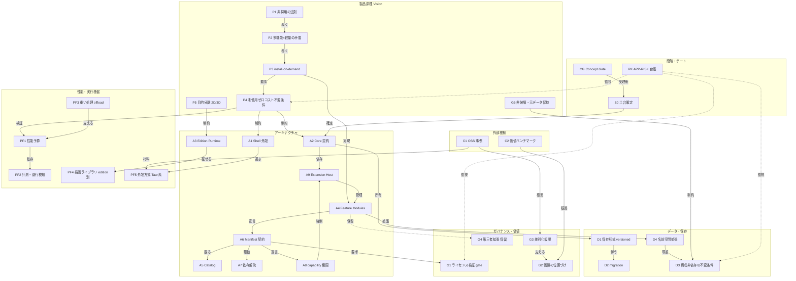

# Chameleon Asset Studio App — Relationship Map（仕様関係マップ・詳細化の中枢）

状態: **draft / concept only / living document**（詳細化フェーズ中は継続更新する）
最終更新日: 2026-07-21
対象リポジトリ: `chameleonjp-lab/chameleonassetstudio`
文書種別: 将来コンセプト（仕様関係マップ／traceability hub）
入口文書: `docs/future/app/README.md`
被参照: `APP_PRODUCT_VISION.md`, `APP_MODULAR_ARCHITECTURE.md`, `APP_COMPETITIVE_LANDSCAPE.md`, `APP_ROADMAP_DECISIONS_OPEN_ITEMS.md`

---

> **この文書の役割（最初に読む）**
>
> これは計画書の各仕様が **何と何に影響し合うか** を可視化する関係マップである。Obsidian のグラフビューに相当する役割を、GitHub でも読めるかたちで担う。
>
> 目的は 2 つ。
> 1. **可視化**: 概念（ノード）と影響関係（エッジ）を一望し、設計判断が波及する先を見失わないようにする。
> 2. **もれのない詳細化**: 各ノードの詳細化状況を追跡し、「まだ具体化していない仕様」と「詳細化で守るべき整合制約（エッジ）」を常に見えるようにする。
>
> **この文書は living document。** app/ のどれかを詳細化したら、必ずこのマップを更新する（ノードの粒度、新規ノード／エッジ、カバレッジ表）。更新規則は 8 章。

---

## 1. 読み方（凡例）

### 1.1 ノード種別（ID 接頭辞）

| 接頭辞 | 領域 | 主な所在 |
|---|---|---|
| `P` | 製品原理（Principle） | `APP_PRODUCT_VISION.md` |
| `A` | アーキテクチャ（Architecture） | `APP_MODULAR_ARCHITECTURE.md` |
| `D` | データ／保存（Data） | `APP_MODULAR_ARCHITECTURE.md` 5 章 |
| `PF` | 性能・実行基盤（Performance/Foundation） | `APP_MODULAR_ARCHITECTURE.md` 6–7 章 |
| `G` | ガバナンス・価値（Governance/Value） | Vision 5・7 章／Arch 3 章 |
| `C` | 外部根拠（Competitive evidence） | `APP_COMPETITIVE_LANDSCAPE.md` |
| `S` | 段階・ゲート（Stage/Gate） | `APP_ROADMAP_DECISIONS_OPEN_ITEMS.md` |
| `F` | 機能（Feature 単位の仕様・要件） | `features/`（`features/README.md` が入口） |

### 1.2 エッジ（関係）種別

| 関係 | 意味 |
|---|---|
| 導く | 前者が後者の必要性を生む |
| 依存 | 後者は前者が無いと成立しない |
| 制約 | 前者が後者の設計を縛る／形を決める |
| 実現 | 前者は後者を達成する手段である |
| 検証 | 前者は後者によって測定・証明される |
| トレードオフ | 両者は互いに引っ張り合う（設計で釣り合わせる） |
| 強制 | 前者が後者を仕組みとして強制する |
| 尊重 | 前者は後者を壊さず保たねばならない |
| 根拠 | 前者（外部事例）が後者の判断を裏づける |

---

## 2. マスター関係マップ

> このマスター図は「載っている＝すべて」ではなく、可読性のため主要な負荷のかかる関係だけを描く。**完全なエッジ一覧は 4 章の関係レジストリを正本**とする。

---

## 3. ノードレジストリ（詳細化の対象一覧）

粒度: 粗 = 枠だけ / 中 = 一部具体化 / 詳 = 詳細確定。詳細化の受け皿となる将来文書は「詳細化先」に示す（未作成は *(予定)*）。

| ID | ノード | 所在（現在） | 粒度 | 詳細化先（予定） |
|---|---|---|---|---|
| P1 | 非採用の法則（使われない理由） | Vision 3 章 | 粗 | Vision（確定寄り） |
| P2 | 多機能×軽量の矛盾 | Vision 3 章 / Arch 1 章 | 粗 | Arch（確定寄り） |
| P3 | install-on-demand | Arch 1・4 章 | 詳 | `APP_MODULE_CATALOG.md` *(予定)*（F-MOD-01 発見＋F-MOD-02 導入で中核確定） |
| P4 | 未使用ゼロコスト不変条件 | Arch 1・7 章 | 粗 | `APP_PERFORMANCE_AND_SHELL.md` *(予定)* |
| P5 | 目的分離 2D/3D | Vision 4 章 | 粗 | `APP_2D_EDITION_SPEC.md` / `APP_3D_EDITION_SPEC.md` *(予定)* |
| G5 | 非破壊・元データ保持 | Vision 6 章 / Arch 5 章 | 詳 | `APP_DATA_CONTRACT.md` *(予定)*（F-CORE-03 で正本化） |
| A1 | Shell 外殻 | Arch 2・6 章 | 粗 | `APP_PERFORMANCE_AND_SHELL.md` *(予定)* |
| A2 | Core 契約 | Arch 2 章 | 中 | `APP_CORE_CONTRACT.md` *(予定)*（F-CORE-01 で一部具体化） |
| A3 | Edition Runtime | Arch 2 章 | 粗 | `APP_2D_EDITION_SPEC.md` / `APP_3D_EDITION_SPEC.md` *(予定)* |
| A4 | Feature Modules | Arch 2 章 | 粗 | `APP_MODULE_CATALOG.md` *(予定)* |
| A5 | Catalog | Arch 2 章 | 詳 | `APP_MODULE_CATALOG.md` *(予定)*（F-MOD-01 で正本化） |
| A6 | Manifest 契約 | Arch 3 章 | 粗 | `APP_MODULE_MANIFEST_SPEC.md` *(予定)* |
| A7 | 依存解決 | Arch 3・4 章 | 粗 | `APP_MODULE_MANIFEST_SPEC.md` *(予定)* |
| A8 | capability 権限 | Arch 3 章 | 粗 | `APP_CORE_CONTRACT.md` *(予定)* |
| A9 | Extension Host | Arch 2 章 | 中 | `APP_CORE_CONTRACT.md` *(予定)*（F-CORE-04 履歴登録＋F-MOD-02 有効化/無効化の要件が集約） |
| D1 | 保存形式 versioned | Arch 5 章 | 詳 | `APP_DATA_CONTRACT.md` *(予定)*（F-CORE-05 で正本化） |
| D2 | migration | Arch 5 章 | 詳 | `APP_DATA_CONTRACT.md` *(予定)*（F-CORE-05 で正本化） |
| D3 | 構成非依存の不変条件 | Arch 5 章 | 中 | `APP_DATA_CONTRACT.md` *(予定)*（F-CORE-01/05 で具体化） |
| D4 | 名前空間拡張 | Arch 5 章 | 中 | `APP_DATA_CONTRACT.md` *(予定)*（F-CORE-05 で境界規則） |
| PF1 | 性能予算 | Arch 7 章 | 粗 | `APP_PERFORMANCE_AND_SHELL.md` *(予定)* |
| PF2 | 計測・退行検知 | Arch 7 章 | 粗 | `APP_PERFORMANCE_AND_SHELL.md` *(予定)* |
| PF3 | 重い処理 offload | Arch 6 章 | 粗 | `APP_PERFORMANCE_AND_SHELL.md` *(予定)* |
| PF4 | 描画ライブラリ edition別 | Arch 6 章 / Comp 2-D | 粗 | `APP_2D_EDITION_SPEC.md` / `APP_3D_EDITION_SPEC.md` *(予定)* |
| PF5 | 外殻方式 Tauri系 | Arch 6 章 / Comp 2-G | 粗 | `APP_PERFORMANCE_AND_SHELL.md` *(予定)* |
| G1 | ライセンス検証 gate | Arch 3 章 | 粗 | 各採用評価記録 *(予定)* |
| G2 | 価値の位置づけ | Vision 5 章 / Comp 5 章 | 粗 | Vision（確定寄り） |
| G3 | 差別化仮説 | Comp 4 章 | 粗 | Comp（更新継続） |
| G4 | 第三者拡張（保留） | Arch 8 章 / Roadmap 4 章 | 粗 | Stage 4 判断 *(予定)* |
| C1 | OSS 事例 | Comp 2 章 | 中 | Comp（更新継続） |
| C2 | 価値ベンチマーク | Comp 5 章 | 中 | Comp（更新継続） |
| CG | Concept Gate | Roadmap 2 章 | 粗 | Roadmap |
| S0–S5 | 段階 | Roadmap 1 章 | 粗 | Roadmap |
| RK | APP-RISK 台帳 | Roadmap 5 章 | 中 | Roadmap（更新継続） |
| F-CORE-01 | Project & Document ライフサイクル | `features/F-CORE-01-project-lifecycle.md` | 詳 | —（第 1 号の worked example） |
| F-CORE-05 | 保存形式・バージョニング・migration | `features/F-CORE-05-save-format-versioning-migration.md` | 詳 | —（D1/D2/D4 の正本） |
| F-CORE-03 | 非破壊編集モデル（source 保持・派生分離） | `features/F-CORE-03-non-destructive-edit-model.md` | 詳 | —（G5 の正本） |
| F-CORE-04 | Undo/Redo & 履歴 | `features/F-CORE-04-undo-redo-history.md` | 詳 | —（非破壊派生の上を航法） |
| F-MOD-01 | モジュールカタログ & 発見 | `features/F-MOD-01-module-catalog-discovery.md` | 詳 | —（A5 の正本） |
| F-MOD-02 | インストール/アンインストール（可逆・コスト戻り） | `features/F-MOD-02-install-uninstall.md` | 詳 | —（P3 導入半分） |

---

## 4. 関係レジストリ（エッジの正本・もれなく維持する対象）

各行は「詳細化で壊してはいけない整合制約」でもある。詳細化のたびに、関係する行を確認する。

| # | 起点 | 関係 | 終点 | 意味（詳細化で守ること） |
|---|---|---|---|---|
| E01 | P1 | 導く | P2 | 「使われない理由」を全部避けると、多機能かつ軽量が同時に要る |
| E02 | P2 | 導く | P3 | 多機能×軽量の矛盾は install-on-demand でしか解けない |
| E03 | P3 | 要請 | P4 | 入れていない機能は起動・常駐・サイズに 1 バイトも乗らない |
| E04 | P3 | 実現 | A4 | モジュール化が install-on-demand の実体 |
| E05 | P4 | 制約 | A2 | Core は痩せた契約に留め、機能を足さない |
| E06 | P4 | 制約 | A1 | Shell に機能を足さない |
| E07 | P5 | 制約 | A3 | 2D/3D は別 Runtime。片方の重い依存を他方に載せない |
| E08 | A2 | 依存 | A9 | Extension Host は Core 契約の一部 |
| E09 | A9 | 管理 | A4 | モジュールの登録・権限・ライフサイクルを Host が握る |
| E10 | A4 | 宣言 | A6 | 各モジュールは manifest 契約を持つ |
| E11 | A6 | 載る | A5 | Catalog は manifest の軽量メタだけを持つ（実体と分離） |
| E12 | A6 | 駆動 | A7 | dependsOn による依存自動解決 |
| E13 | A6 | 宣言 | A8 | capabilities による最小権限宣言 |
| E14 | A8 | 強制 | A9 | 権限境界を Host が強制する |
| E15 | A4 | 拡張 | D4 | モジュールは名前空間つき拡張領域にのみ書く |
| E16 | D4 | 尊重 | D3 | 拡張データは未インストール環境でも保持・非破壊 |
| E17 | A2 | 所有 | D1 | 保存形式と migration は Core が持つ |
| E18 | D1 | 伴う | D2 | バージョン付き形式は migration を伴う |
| E19 | G5 | 制約 | D3 | 元データ非破壊が構成非依存の不変条件を支える |
| E20 | P4 | 検証 | PF1 | ゼロコスト原則は性能予算で測る |
| E21 | PF1 | 依存 | PF2 | 予算は継続計測・退行検知で守られる |
| E22 | PF3 | 支える | PF1 | 重い処理の offload が UI 応答・予算を支える |
| E23 | A3 | 載せる | PF4 | 描画ライブラリは Edition Runtime ロード時のみ持ち込む |
| E24 | A1 | 選ぶ | PF5 | 外殻方式は Shell の選定事項（実測後確定） |
| E25 | A6 | 要求 | G1 | verified=false のモジュールは導入導線を出さない |
| E26 | G3 | 支える | G2 | 差別化仮説が価値の位置づけを裏づける |
| E27 | C1 | 根拠 | G3 | OSS 事例が差別化仮説の根拠 |
| E28 | C2 | 根拠 | G2 | 価値ベンチマークが価値帯の根拠 |
| E29 | C1 | 材料 | PF5 | Tauri 系実測が外殻方向の材料 |
| E30 | A4 | 保留 | G4 | 第三者拡張の開放は Stage 4 判断（まず公式モジュール） |
| E31 | CG | 受理後 | S0 | Concept Gate 受理後に Stage 0 の実測・調査へ |
| E32 | S0 | 確定 | A2 | Stage 0 で Core 契約・保存方針・性能予算の骨格を確定 |
| E33 | RK | 監視 | P4 | APP-RISK-02/03 がゼロコスト原則の崩れを監視 |
| E34 | RK | 監視 | D3 | APP-RISK-04 が構成差のデータ破壊を監視 |
| E35 | RK | 監視 | G1 | APP-RISK-05 がライセンス未確認採用を監視 |
| E36 | P5 | トレードオフ | A2 | 2D/3D 別最適化と Core 共通化の釣り合い（共通しすぎず・分断しすぎず） |
| E37 | F-CORE-01 | 実現 | A2 | プロジェクトのライフサイクル契約が Core 契約の一部を具体化 |
| E38 | F-CORE-01 | 依存 | D1 | 保存の器の形式に依存（正本は F-CORE-05） |
| E39 | F-CORE-01 | 尊重 | D3 | 構成非依存・未知データ非破壊を満たす |
| E40 | F-CORE-01 | 尊重 | G5 | 元素材を上書きしない |
| E41 | F-CORE-05 | 実現 | D1 | 保存形式の正本を定義 |
| E42 | F-CORE-05 | 実現 | D2 | migration（段階・非破壊・決定的）の正本を定義 |
| E43 | F-CORE-05 | 尊重 | D3 | 未知データ往復・構成非依存を満たす |
| E44 | F-CORE-05 | 制約 | D4 | 名前空間拡張の境界規則を定義 |
| E45 | F-CORE-05 | 依存 | A2 | 形式・移行は Core 契約が所有 |
| E46 | F-CORE-01 | 依存 | F-CORE-05 | ライフサイクルは本器の正本に依存（E38 の機能間依存を明示） |
| E47 | F-CORE-03 | 実現 | G5 | 非破壊・元データ保持の原則を編集モデルとして実体化 |
| E48 | F-CORE-03 | 依存 | F-CORE-05 | Source + 派生を versioned 器へ永続化（名前空間分離） |
| E49 | F-CORE-03 | 尊重 | D4 | 派生は Source を参照し、名前空間境界に従う |
| E50 | F-CORE-04 | 依存 | F-CORE-03 | 履歴は非破壊派生の上を航法する |
| E51 | F-CORE-04 | 尊重 | G5 | Undo/Redo は Source を変更しない |
| E52 | F-CORE-04 | 依存 | A9 | モジュール操作の履歴登録を Extension Host が保証 |
| E53 | F-MOD-01 | 実現 | A5 | 軽量メタの Catalog を正本化 |
| E54 | F-MOD-01 | 依存 | A6 | 一覧するメタは manifest 契約に由来 |
| E55 | F-MOD-01 | 実現 | P3 | install-on-demand の「発見」半分を担う |
| E56 | F-MOD-01 | 尊重 | P4 | カタログ閲覧は実体を読まずゼロコスト |
| E57 | F-MOD-01 | 尊重 | G1 | 未検証は表示のみ・インストール導線を出さない |
| E58 | F-MOD-02 | 実現 | P3 | install-on-demand の導入/撤去半分を担う |
| E59 | F-MOD-02 | 尊重 | P4 | 撤去でコストが戻り、残渣を残さない |
| E60 | F-MOD-02 | 依存 | F-MOD-01 | カタログを入口・導入状態の反映先とする |
| E61 | F-MOD-02 | 尊重 | D3 | 撤去してもプロジェクトデータを保持（往復） |
| E62 | F-MOD-02 | 依存 | A9 | 有効化/無効化ライフサイクルを Extension Host が担う |
| E63 | F-MOD-02 | 尊重 | G1 | verified のみ導入可 |

---

## 5. カバレッジ／ギャップ追跡（もれなく具体化するための表）

「粗」のノードは未詳細＝残タスク。詳細化の推奨順は依存の上流から。

| 詳細化ブロック（将来文書） | カバーするノード | 前提（先に要るもの） | 状態 |
|---|---|---|---|
| `APP_MODULE_CATALOG.md` *(予定)* | P3, A4, A5 | A6/A2 の骨格 | 未着手 |
| `APP_MODULE_MANIFEST_SPEC.md` *(予定)* | A6, A7 | A2, A8 | 未着手 |
| `APP_CORE_CONTRACT.md` *(予定)* | A2, A8, A9 | P4（ゼロコスト） | 未着手 |
| `APP_DATA_CONTRACT.md` *(予定)* | D1, D2, D3, D4, G5 | A2 | 一部（F-CORE-05 で D1/D2/D4 の規則を具体化。物理形式は未決 `APP-O-01`） |
| `APP_2D_EDITION_SPEC.md` *(予定)* | A3(2D), PF4(2D), P5 | A4, A2 | 未着手 |
| `APP_3D_EDITION_SPEC.md` *(予定)* | A3(3D), PF4(3D), P5 | A4, A2 | 未着手 |
| `APP_PERFORMANCE_AND_SHELL.md` *(予定)* | P4, PF1, PF2, PF3, PF5, A1 | 実測材料 C1 | 未着手 |
| ライセンス評価記録群 *(予定)* | G1 | 採用候補確定 | 未着手 |

> 詳細化の順序自体は `APP_ROADMAP_DECISIONS_OPEN_ITEMS.md` の Stage と整合させる。表の「前提」列は、上流を先に固めるための依存である。
>
> 機能レイヤーの詳細化は `features/` で **1 機能ずつ**進める（`features/README.md` の機能インベントリが queue）。各機能は完成系（D-DONE / T-DONE / S-DONE）から逆算して仕様・要件を洗い出し、末尾で本マップへ linkage を昇格する。着手済み: **F-CORE-01**, **F-CORE-05**, **F-CORE-03**, **F-CORE-04**, **F-MOD-01**, **F-MOD-02**。

---

## 6. 主要な波及経路（詳細化で特に注意する連鎖）

- **ゼロコスト連鎖**: `P4 → A1/A2（痩せ維持）→ PF1 → PF2`。Core/Shell に機能を足す判断は、必ず PF1/PF2 に跳ね返る。
- **モジュール契約連鎖**: `A4 → A6 → A5/A7/A8 → A9`。manifest の 1 項目を変えると Catalog 表示・依存解決・権限・Host が連動する。
- **データ非破壊連鎖**: `G5 → D3 ← D4 ← A4`。モジュールが付けるデータは、未インストール環境での非破壊保持を必ず満たす。
- **根拠連鎖**: `C1/C2 → G3/G2/PF5`。外部事例の更新は差別化仮説・価値帯・外殻方向の再確認を促す。

---

## 7. Obsidian / GitHub での見え方

- **GitHub**: 上の `mermaid` ブロックがそのまま図として描画される。関係レジストリ（4 章）が完全な正本。
- **Obsidian**: mermaid はプラグイン無しで描画される。加えて Obsidian のグラフビューは、各文書間の Markdown リンク（`[...](FILE.md)`）を辺として自動で拾うため、`app/` フォルダを vault として開けば **文書レベルの関係グラフ**が得られる。本マップはそれを **概念（仕様内）レベル**へ拡張する役割を持つ。
- 概念ノードを Obsidian グラフにも出したい場合は、将来 `[[wikilink]]` 形式のノート分割を検討できる（未決。現状は GitHub 互換を優先し、標準リンク＋mermaid＋レジストリで表現する）。

---

## 8. 更新規則（living document 契約）

1. app/ のいずれかの文書に詳細を足したら、**同じ PR でこのマップを更新する**（ノードの粒度、新規ノード／エッジ、カバレッジ表の状態）。
2. 新しい仕様概念を導入したら **ノードを追加**し、少なくとも 1 本の関係（エッジ）を 4 章に登録する。孤立ノードを残さない。
3. 既存エッジの意味を変える判断は、`APP_ROADMAP_DECISIONS_OPEN_ITEMS.md` の Decision Log にも記録する。
4. ノードが「詳」になったら、カバレッジ表（5 章）の状態を更新し、残ギャップを可視化し続ける。
5. マスター図（2 章）は可読性優先で主要エッジのみ。増えすぎたら領域別のサブ図に分割してよいが、**4 章のレジストリは常に完全**に保つ。
6. 最終更新日を必ず更新する。
7. `features/` の各機能仕様は末尾に「関係マップ linkage」を持ち、touch する node / edge を宣言する。新しい影響は 4 章へ昇格登録し、孤立させない。
