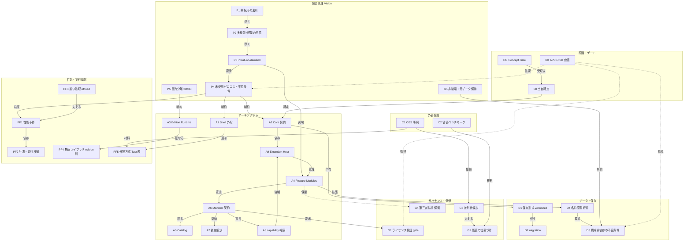

# Chameleon Asset Studio App — Relationship Map（仕様関係マップ・詳細化の中枢）

状態: **draft / concept only / living document**（詳細化フェーズ中は継続更新する）
最終更新日: 2026-07-25
対象リポジトリ: `chameleonjp-lab/chameleonassetstudio`
文書種別: 将来コンセプト（仕様関係マップ／traceability hub）
入口文書: `docs/future/app/README.md`
被参照: `APP_PRODUCT_VISION.md`, `APP_MODULAR_ARCHITECTURE.md`, `APP_COMPETITIVE_LANDSCAPE.md`, `APP_ROADMAP_DECISIONS_OPEN_ITEMS.md`

---

> **この文書の役割（最初に読む）**
>
> これは計画書の各仕様が **何と何に影響し合うか** を可視化する関係マップである。Obsidian のグラフビューに相当する役割を、GitHub でも読めるかたちで担う。
>
> 目的は 2 つ。
> 1. **可視化**: 概念（ノード）と影響関係（エッジ）を一望し、設計判断が波及する先を見失わないようにする。
> 2. **もれのない詳細化**: 各ノードの詳細化状況を追跡し、「まだ具体化していない仕様」と「詳細化で守るべき整合制約（エッジ）」を常に見えるようにする。
>
> **この文書は living document。** app/ のどれかを詳細化したら、必ずこのマップを更新する（ノードの粒度、新規ノード／エッジ、カバレッジ表）。更新規則は 8 章。

---

## 1. 読み方（凡例）

### 1.1 ノード種別（ID 接頭辞）

| 接頭辞 | 領域 | 主な所在 |
|---|---|---|
| `P` | 製品原理（Principle） | `APP_PRODUCT_VISION.md` |
| `A` | アーキテクチャ（Architecture） | `APP_MODULAR_ARCHITECTURE.md` |
| `D` | データ／保存（Data） | `APP_MODULAR_ARCHITECTURE.md` 5 章 |
| `PF` | 性能・実行基盤（Performance/Foundation） | `APP_MODULAR_ARCHITECTURE.md` 6–7 章 |
| `G` | ガバナンス・価値（Governance/Value） | Vision 5・7 章／Arch 3 章 |
| `C` | 外部根拠（Competitive evidence） | `APP_COMPETITIVE_LANDSCAPE.md` |
| `S` | 段階・ゲート（Stage/Gate） | `APP_ROADMAP_DECISIONS_OPEN_ITEMS.md` |
| `F` | 機能（Feature 単位の仕様・要件） | `features/`（`features/README.md` が入口） |

### 1.2 エッジ（関係）種別

| 関係 | 意味 |
|---|---|
| 導く | 前者が後者の必要性を生む |
| 依存 | 後者は前者が無いと成立しない |
| 制約 | 前者が後者の設計を縛る／形を決める |
| 実現 | 前者は後者を達成する手段である |
| 検証 | 前者は後者によって測定・証明される |
| トレードオフ | 両者は互いに引っ張り合う（設計で釣り合わせる） |
| 強制 | 前者が後者を仕組みとして強制する |
| 尊重 | 前者は後者を壊さず保たねばならない |
| 根拠 | 前者（外部事例）が後者の判断を裏づける |

---

## 2. マスター関係マップ

```mermaid
flowchart TB
  subgraph PR["製品原理 Vision"]
    P1["P1 非採用の法則"]
    P2["P2 多機能×軽量の矛盾"]
    P3["P3 install-on-demand"]
    P4["P4 未使用ゼロコスト不変条件"]
    P5["P5 目的分離 2D/3D"]
    G5["G5 非破壊・元データ保持"]
  end
  subgraph AR["アーキテクチャ"]
    A1["A1 Shell 外殻"]
    A2["A2 Core 契約"]
    A3["A3 Edition Runtime"]
    A4["A4 Feature Modules"]
    A5["A5 Catalog"]
    A6["A6 Manifest 契約"]
    A7["A7 依存解決"]
    A8["A8 capability 権限"]
    A9["A9 Extension Host"]
  end
  subgraph DA["データ・保存"]
    D1["D1 保存形式 versioned"]
    D2["D2 migration"]
    D3["D3 構成非依存の不変条件"]
    D4["D4 名前空間拡張"]
  end
  subgraph PFG["性能・実行基盤"]
    PF1["PF1 性能予算"]
    PF2["PF2 計測・退行検知"]
    PF3["PF3 重い処理 offload"]
    PF4["PF4 描画ライブラリ edition別"]
    PF5["PF5 外殻方式 Tauri系"]
  end
  subgraph GV["ガバナンス・価値"]
    G1["G1 ライセンス検証 gate"]
    G2["G2 価値の位置づけ"]
    G3["G3 差別化仮説"]
    G4["G4 第三者拡張 保留"]
  end
  subgraph PCG["外部根拠"]
    C1["C1 OSS 事例"]
    C2["C2 価値ベンチマーク"]
  end
  subgraph SG["段階・ゲート"]
    CG["CG Concept Gate"]
    S0["S0 土台確定"]
    RK["RK APP-RISK 台帳"]
  end

  P1 -->|導く| P2
  P2 -->|導く| P3
  P3 -->|要請| P4
  P3 -->|実現| A4
  P5 -->|制約| A3
  P4 -->|制約| A2
  P4 -->|制約| A1
  A2 -->|依存| A9
  A9 -->|管理| A4
  A4 -->|宣言| A6
  A6 -->|載る| A5
  A6 -->|駆動| A7
  A6 -->|宣言| A8
  A8 -->|強制| A9
  A4 -->|拡張| D4
  D4 -->|尊重| D3
  A2 -->|所有| D1
  D1 -->|伴う| D2
  G5 -->|制約| D3
  P4 -->|検証| PF1
  PF1 -->|依存| PF2
  PF3 -->|支える| PF1
  A3 -->|載せる| PF4
  A1 -->|選ぶ| PF5
  A6 -->|要求| G1
  G3 -->|支える| G2
  C1 -->|根拠| G3
  C2 -->|根拠| G2
  C1 -->|材料| PF5
  A4 -.保留.-> G4
  CG -->|受理後| S0
  S0 -->|確定| A2
  RK -.監視.-> P4
  RK -.監視.-> D3
  RK -.監視.-> G1
```

> このマスター図は「載っている＝すべて」ではなく、可読性のため主要な負荷のかかる関係だけを描く。**完全なエッジ一覧は 4 章の関係レジストリを正本**とする。

---

## 3. ノードレジストリ（詳細化の対象一覧）

粒度: 粗 = 枠だけ / 中 = 一部具体化 / 詳 = 詳細確定。詳細化の受け皿となる将来文書は「詳細化先」に示す（未作成は *(予定)*）。

| ID | ノード | 所在（現在） | 粒度 | 詳細化先（予定） |
|---|---|---|---|---|
| P1 | 非採用の法則（使われない理由） | Vision 3 章 | 粗 | Vision（確定寄り） |
| P2 | 多機能×軽量の矛盾 | Vision 3 章 / Arch 1 章 | 粗 | Arch（確定寄り） |
| P3 | install-on-demand | Arch 1・4 章 | 詳 | `APP_MODULE_CATALOG.md` *(予定)*（F-MOD-01 発見＋F-MOD-02 導入で中核確定） |
| P4 | 未使用ゼロコスト不変条件 | Arch 1・7 章 | 粗 | `APP_PERFORMANCE_AND_SHELL.md` *(予定)* |
| P5 | 目的分離 2D/3D | Vision 4 章 | 粗 | `APP_2D_EDITION_SPEC.md` / `APP_3D_EDITION_SPEC.md` *(予定)* |
| G5 | 非破壊・元データ保持 | Vision 6 章 / Arch 5 章 | 詳 | `APP_DATA_CONTRACT.md` *(予定)*（F-CORE-03 で正本化） |
| A1 | Shell 外殻 | Arch 2・6 章 | 詳 | `APP_PERFORMANCE_AND_SHELL.md` *(予定)*（F-PLT-01 で責務境界を正本化） |
| A2 | Core 契約 | Arch 2 章 | 詳 | `APP_CORE_CONTRACT.md` *(予定)*（F-CORE-01 保存/03 非破壊/04 履歴/05 形式/06 検品/07 書き出し/09 Host/10 権限で全要素が揃った） |
| A3 | Edition Runtime | Arch 2 章 | 中 | `APP_2D_EDITION_SPEC.md` / `APP_3D_EDITION_SPEC.md` *(予定)*（F-2D-01 で 2D 側の制作起点を具体化） |
| A4 | Feature Modules | Arch 2 章 | 粗 | `APP_MODULE_CATALOG.md` *(予定)* |
| A5 | Catalog | Arch 2 章 | 詳 | `APP_MODULE_CATALOG.md` *(予定)*（F-MOD-01 で正本化） |
| A6 | Manifest 契約 | Arch 3 章 | 中 | `APP_MODULE_MANIFEST_SPEC.md` *(予定)*（F-MOD-01/02/03 が参照する項目は確定） |
| A7 | 依存解決 | Arch 3・4 章 | 詳 | `APP_MODULE_MANIFEST_SPEC.md` *(予定)*（F-MOD-03 で正本化） |
| A8 | capability 権限 | Arch 3 章 | 詳 | `APP_CORE_CONTRACT.md` *(予定)*（F-CORE-10 で正本化） |
| A9 | Extension Host | Arch 2 章 | 詳 | `APP_CORE_CONTRACT.md` *(予定)*（F-CORE-09 で正本化） |
| D1 | 保存形式 versioned | Arch 5 章 | 詳 | `APP_DATA_CONTRACT.md` *(予定)*（F-CORE-05 で正本化） |
| D2 | migration | Arch 5 章 | 詳 | `APP_DATA_CONTRACT.md` *(予定)*（F-CORE-05 で正本化） |
| D3 | 構成非依存の不変条件 | Arch 5 章 | 中 | `APP_DATA_CONTRACT.md` *(予定)*（F-CORE-01/05 で具体化） |
| D4 | 名前空間拡張 | Arch 5 章 | 中 | `APP_DATA_CONTRACT.md` *(予定)*（F-CORE-05 で境界規則） |
| PF1 | 性能予算 | Arch 7 章 | 中 | `APP_PERFORMANCE_AND_SHELL.md` *(予定)*（数値は未決のまま、F-PLT-04 が実測で置換する経路を確定） |
| PF2 | 計測・退行検知 | Arch 7 章 | 詳 | `APP_PERFORMANCE_AND_SHELL.md` *(予定)*（F-PLT-04 で正本化。上流 `2D_3_H3_MEASUREMENT_PROTOCOL.md` の進め方を継承） |
| PF3 | 重い処理 offload | Arch 6 章 | 詳 | `APP_PERFORMANCE_AND_SHELL.md` *(予定)*（F-PLT-03 で正本化。8 機能が依存する応答性の土台） |
| PF4 | 描画ライブラリ edition別 | Arch 6 章 / Comp 2-D | 中 | `APP_2D_EDITION_SPEC.md` / `APP_3D_EDITION_SPEC.md` *(予定)*（F-PLT-05 で**ロード規則と選定基準は確定**。**採用は未決** = `APP-O-03`） |
| PF5 | 外殻方式 Tauri系 | Arch 6 章 / Comp 2-G | 中 | `APP_PERFORMANCE_AND_SHELL.md` *(予定)*（F-PLT-01 で**選定基準は確定**。**採用は未決** = `APP-R-01` の実測 + 人間承認待ち） |
| G1 | ライセンス検証 gate | Arch 3 章 | 詳 | 各採用評価記録 *(予定)*（F-MOD-04 で正本化） |
| G2 | 価値の位置づけ | Vision 5 章 / Comp 5 章 | 粗 | Vision（確定寄り） |
| G3 | 差別化仮説 | Comp 4 章 | 粗 | Comp（更新継続） |
| G4 | 第三者拡張（保留） | Arch 8 章 / Roadmap 4 章 | 粗 | Stage 4 判断 *(予定)* |
| C1 | OSS 事例 | Comp 2 章 | 中 | Comp（更新継続。上流 `EXTERNAL_GITHUB_REFERENCE_CATALOG.md` との突き合わせ結果は Comp 6 章） |
| C2 | 価値ベンチマーク | Comp 5 章 | 中 | Comp（更新継続） |
| CG | Concept Gate | Roadmap 2 章 | 粗 | Roadmap |
| S0–S5 | 段階 | Roadmap 1 章 | 粗 | Roadmap |
| RK | APP-RISK 台帳 | Roadmap 5 章 | 中 | Roadmap（更新継続） |
| F-CORE-01 | Project & Document ライフサイクル | `features/F-CORE-01-project-lifecycle.md` | 詳 | —（第 1 号の worked example） |
| F-CORE-05 | 保存形式・バージョニング・migration | `features/F-CORE-05-save-format-versioning-migration.md` | 詳 | —（D1/D2/D4 の正本） |
| F-CORE-03 | 非破壊編集モデル（source 保持・派生分離） | `features/F-CORE-03-non-destructive-edit-model.md` | 詳 | —（G5 の正本） |
| F-CORE-04 | Undo/Redo & 履歴 | `features/F-CORE-04-undo-redo-history.md` | 詳 | —（非破壊派生の上を航法） |
| F-MOD-01 | モジュールカタログ & 発見 | `features/F-MOD-01-module-catalog-discovery.md` | 詳 | —（A5 の正本） |
| F-MOD-02 | インストール/アンインストール（可逆・コスト戻り） | `features/F-MOD-02-install-uninstall.md` | 詳 | —（P3 導入半分） |
| F-MOD-03 | 依存解決 & footprint 開示 | `features/F-MOD-03-dependency-resolution-footprint.md` | 詳 | —（A7 の正本） |
| F-MOD-04 | ライセンス検証ゲート | `features/F-MOD-04-license-verification-gate.md` | 詳 | —（G1 の正本） |
| F-CORE-09 | Extension Host & ライフサイクル | `features/F-CORE-09-extension-host-lifecycle.md` | 詳 | —（A9 の正本） |
| F-CORE-10 | capability / 権限の強制 | `features/F-CORE-10-capability-permission-enforcement.md` | 詳 | —（A8 の正本） |
| F-PLT-04 | 性能予算の計測 & 退行検知 | `features/F-PLT-04-performance-measurement-regression.md` | 詳 | —（PF2 の正本。外殻評価の物差し） |
| F-PLT-01 | ネイティブ外殻 & ウィンドウ/OS 連携 | `features/F-PLT-01-native-shell-os-integration.md` | 詳 | —（A1 の正本。PF5 の選定基準） |
| F-PLT-03 | 重い処理の offload | `features/F-PLT-03-heavy-work-offload.md` | 詳 | —（PF3 の正本。応答性の土台） |
| F-PLT-02 | ネイティブ ファイル I/O & ダイアログ | `features/F-PLT-02-native-file-io-dialogs.md` | 詳 | —（原子的保存の実行層） |
| F-PLT-05 | エディション別レンダラのロード | `features/F-PLT-05-edition-renderer-loading.md` | 詳 | —（P5 と P4 が交わる実行層） |
| F-CORE-07 | 書き出しフレーム | `features/F-CORE-07-export-frame.md` | 詳 | —（制作物が外へ出る唯一の出口） |
| F-CORE-06 | 検品 / Inspection フレーム | `features/F-CORE-06-inspection-validation-frame.md` | 詳 | —（三段検証。A2 の最後の要素） |
| F-CORE-08 | Home / Project Dashboard | `features/F-CORE-08-home-project-dashboard.md` | 詳 | —（入口。エディションの分岐点） |
| F-CORE-02 | 自動保存 & クラッシュ復旧 | `features/F-CORE-02-autosave-crash-recovery.md` | 詳 | —（作業を失わせない安全網。Core 群の最後） |
| F-2D-01 | 新規作成（空/テンプレート/画像/図形/パーツ） | `features/F-2D-01-project-creation.md` | 詳 | —（2D パイプラインの起点） |
| F-2D-02 | 画像取り込み & 修復 | `features/F-2D-02-image-import.md` | 詳 | —（信頼しない入力の唯一の入口。原本 verbatim・原子性・loss 開示） |
| F-2D-03 | Canvas & ビューポート（2D） | `features/F-2D-03-canvas-viewport.md` | 詳 | —（全 2D 編集が載る面。座標の正本を守る） |
| F-2D-04 | レイヤー & パーツ | `features/F-2D-04-layers-parts.md` | 詳 | —（「何に対する操作か」を定義する構造） |
| F-2D-05 | ラスタ編集ツール | `features/F-2D-05-raster-editing.md` | 詳 | —（1px 精度・1 ストローク = 1 履歴） |
| F-2D-06 | ベクタ / 図形 | `features/F-2D-06-vector-shapes.md` | 詳 | —（解像度非依存・ラスタ化は派生） |
| F-2D-07 | フレーム & フレームアニメーション | `features/F-2D-07-frames-animation.md` | 詳 | —（可変時間・event・loss 時の拒否） |
| F-2D-08 | 簡易リグ焼き込み（bake） | `features/F-2D-08-rig-bake.md` | 詳 | —（反転規則・parity 検証・失敗が壊さない） |
| F-2D-09 | 原点 / アンカー付与（2D） | `features/F-2D-09-origin-anchors.md` | 詳 | —（絵をゲーム素材に変える最初の一歩） |
| F-2D-10 | 当たり判定付与（2D） | `features/F-2D-10-collider-authoring.md` | 詳 | —（上書き単位と polygon チェックリストを継承） |
| F-2D-11 | tileset / sprite sheet 整理 | `features/F-2D-11-tileset-spritesheet.md` | 詳 | —（切り分け。読み直しは「元に戻す操作ではない」） |
| F-2D-12 | Atlas パッキング | `features/F-2D-12-atlas-packing.md` | 詳 | —（詰め直し。出力層は保存座標を変えない） |
| F-2D-13 | パレット / ディザ（モジュール） | `features/F-2D-13-palette-dither.md` | 詳 | —（`P4`/`A4` を具体で試す最初のモジュール実例） |
| F-2D-14 | バッチ & バリアント | `features/F-2D-14-batch-variants.md` | 詳 | —（勝手に更新しない・手作業を守る・全件原子的） |
| F-2D-15 | 2D 検品（エンジン適合チェック） | `features/F-2D-15-inspection-engine-fit.md` | 詳 | —（出す前に見る。read-only・修正案を自動確定しない） |
| F-2D-16 | 2D 書き出し preset & import notes | `features/F-2D-16-export-presets-import-notes.md` | 詳 | —（「対応」を曖昧にしない。記録の無いものを verified と呼ばない） |
| F-3D-01 | GLB / glTF 安全読み込み | `features/F-3D-01-glb-gltf-safe-loading.md` | 詳 | —（3D の入口。付随ファイル参照の範囲限定・元を絶対に上書きしない） |
| F-3D-03 | 3D ビューポート & 検品表示 | `features/F-3D-03-viewport-inspection-display.md` | 詳 | —（3D の価値は生成でなく検品。read-only・対象別しきい値） |
| F-3D-05 | 原点 / 足元 / 向き / スケール整備 | `features/F-3D-05-origin-orientation-scale.md` | 詳 | —（判らないものを判らないまま扱う。整備は解釈で元を書き換えない） |
| F-3D-06 | 3D アンカー付与 | `features/F-3D-06-anchors.md` | 詳 | —（形からは判らない意味を与える。自動生成しない） |
| F-3D-07 | 3D 当たり判定付与（box / sphere / capsule） | `features/F-3D-07-colliders.md` | 詳 | —（mesh collider を作らない。重さとエンジン差が理由） |
| F-3D-10 | 軽量化: mesh 簡略化 | `features/F-3D-10-mesh-simplification.md` | 詳 | —（置き換えでなく別モデル。既定で強く削らない） |
| F-3D-11 | 軽量化: テクスチャ圧縮 | `features/F-3D-11-texture-compression.md` | 詳 | —（軽量化の二本目の軸。対応状況を曖昧にしない） |
| F-3D-12 | 前後比較 | `features/F-3D-12-before-after-comparison.md` | 詳 | —（比較は read-only。自動で最良を選ばない・選ばない自由） |

---

## 4. 関係レジストリ（エッジの正本・もれなく維持する対象）

各行は「詳細化で壊してはいけない整合制約」でもある。詳細化のたびに、関係する行を確認する。

| # | 起点 | 関係 | 終点 | 意味（詳細化で守ること） |
|---|---|---|---|---|
| E01 | P1 | 導く | P2 | 「使われない理由」を全部避けると、多機能かつ軽量が同時に要る |
| E02 | P2 | 導く | P3 | 多機能×軽量の矛盾は install-on-demand でしか解けない |
| E03 | P3 | 要請 | P4 | 入れていない機能は起動・常駐・サイズに 1 バイトも乗らない |
| E04 | P3 | 実現 | A4 | モジュール化が install-on-demand の実体 |
| E05 | P4 | 制約 | A2 | Core は痩せた契約に留め、機能を足さない |
| E06 | P4 | 制約 | A1 | Shell に機能を足さない |
| E07 | P5 | 制約 | A3 | 2D/3D は別 Runtime。片方の重い依存を他方に載せない |
| E08 | A2 | 依存 | A9 | Extension Host は Core 契約の一部 |
| E09 | A9 | 管理 | A4 | モジュールの登録・権限・ライフサイクルを Host が握る |
| E10 | A4 | 宣言 | A6 | 各モジュールは manifest 契約を持つ |
| E11 | A6 | 載る | A5 | Catalog は manifest の軽量メタだけを持つ（実体と分離） |
| E12 | A6 | 駆動 | A7 | dependsOn による依存自動解決 |
| E13 | A6 | 宣言 | A8 | capabilities による最小権限宣言 |
| E14 | A8 | 強制 | A9 | 権限境界を Host が強制する |
| E15 | A4 | 拡張 | D4 | モジュールは名前空間つき拡張領域にのみ書く |
| E16 | D4 | 尊重 | D3 | 拡張データは未インストール環境でも保持・非破壊 |
| E17 | A2 | 所有 | D1 | 保存形式と migration は Core が持つ |
| E18 | D1 | 伴う | D2 | バージョン付き形式は migration を伴う |
| E19 | G5 | 制約 | D3 | 元データ非破壊が構成非依存の不変条件を支える |
| E20 | P4 | 検証 | PF1 | ゼロコスト原則は性能予算で測る |
| E21 | PF1 | 依存 | PF2 | 予算は継続計測・退行検知で守られる |
| E22 | PF3 | 支える | PF1 | 重い処理の offload が UI 応答・予算を支える |
| E23 | A3 | 載せる | PF4 | 描画ライブラリは Edition Runtime ロード時のみ持ち込む |
| E24 | A1 | 選ぶ | PF5 | 外殻方式は Shell の選定事項（実測後確定） |
| E25 | A6 | 要求 | G1 | verified=false のモジュールは導入導線を出さない |
| E26 | G3 | 支える | G2 | 差別化仮説が価値の位置づけを裏づける |
| E27 | C1 | 根拠 | G3 | OSS 事例が差別化仮説の根拠 |
| E28 | C2 | 根拠 | G2 | 価値ベンチマークが価値帯の根拠 |
| E29 | C1 | 材料 | PF5 | Tauri 系実測が外殻方向の材料 |
| E30 | A4 | 保留 | G4 | 第三者拡張の開放は Stage 4 判断（まず公式モジュール） |
| E31 | CG | 受理後 | S0 | Concept Gate 受理後に Stage 0 の実測・調査へ |
| E32 | S0 | 確定 | A2 | Stage 0 で Core 契約・保存方針・性能予算の骨格を確定 |
| E33 | RK | 監視 | P4 | APP-RISK-02/03 がゼロコスト原則の崩れを監視 |
| E34 | RK | 監視 | D3 | APP-RISK-04 が構成差のデータ破壊を監視 |
| E35 | RK | 監視 | G1 | APP-RISK-05 がライセンス未確認採用を監視 |
| E36 | P5 | トレードオフ | A2 | 2D/3D 別最適化と Core 共通化の釣り合い（共通しすぎず・分断しすぎず） |
| E37 | F-CORE-01 | 実現 | A2 | プロジェクトのライフサイクル契約が Core 契約の一部を具体化 |
| E38 | F-CORE-01 | 依存 | D1 | 保存の器の形式に依存（正本は F-CORE-05） |
| E39 | F-CORE-01 | 尊重 | D3 | 構成非依存・未知データ非破壊を満たす |
| E40 | F-CORE-01 | 尊重 | G5 | 元素材を上書きしない |
| E41 | F-CORE-05 | 実現 | D1 | 保存形式の正本を定義 |
| E42 | F-CORE-05 | 実現 | D2 | migration（段階・非破壊・決定的）の正本を定義 |
| E43 | F-CORE-05 | 尊重 | D3 | 未知データ往復・構成非依存を満たす |
| E44 | F-CORE-05 | 制約 | D4 | 名前空間拡張の境界規則を定義 |
| E45 | F-CORE-05 | 依存 | A2 | 形式・移行は Core 契約が所有 |
| E46 | F-CORE-01 | 依存 | F-CORE-05 | ライフサイクルは本器の正本に依存（E38 の機能間依存を明示） |
| E47 | F-CORE-03 | 実現 | G5 | 非破壊・元データ保持の原則を編集モデルとして実体化 |
| E48 | F-CORE-03 | 依存 | F-CORE-05 | Source + 派生を versioned 器へ永続化（名前空間分離） |
| E49 | F-CORE-03 | 尊重 | D4 | 派生は Source を参照し、名前空間境界に従う |
| E50 | F-CORE-04 | 依存 | F-CORE-03 | 履歴は非破壊派生の上を航法する |
| E51 | F-CORE-04 | 尊重 | G5 | Undo/Redo は Source を変更しない |
| E52 | F-CORE-04 | 依存 | A9 | モジュール操作の履歴登録を Extension Host が保証 |
| E53 | F-MOD-01 | 実現 | A5 | 軽量メタの Catalog を正本化 |
| E54 | F-MOD-01 | 依存 | A6 | 一覧するメタは manifest 契約に由来 |
| E55 | F-MOD-01 | 実現 | P3 | install-on-demand の「発見」半分を担う |
| E56 | F-MOD-01 | 尊重 | P4 | カタログ閲覧は実体を読まずゼロコスト |
| E57 | F-MOD-01 | 尊重 | G1 | 未検証は表示のみ・インストール導線を出さない |
| E58 | F-MOD-02 | 実現 | P3 | install-on-demand の導入/撤去半分を担う |
| E59 | F-MOD-02 | 尊重 | P4 | 撤去でコストが戻り、残渣を残さない |
| E60 | F-MOD-02 | 依存 | F-MOD-01 | カタログを入口・導入状態の反映先とする |
| E61 | F-MOD-02 | 尊重 | D3 | 撤去してもプロジェクトデータを保持（往復） |
| E62 | F-MOD-02 | 依存 | A9 | 有効化/無効化ライフサイクルを Extension Host が担う |
| E63 | F-MOD-02 | 尊重 | G1 | verified のみ導入可 |
| E64 | F-MOD-03 | 実現 | A7 | 推移的依存解決・衝突検出の正本 |
| E65 | F-MOD-03 | 依存 | A6 | dependsOn / footprint / coreContract / capabilities を manifest から得る |
| E66 | F-MOD-03 | 支える | F-MOD-02 | 導入の合計コストと撤去の逆依存判断を供給 |
| E67 | F-MOD-03 | 尊重 | P4 | 増分計上と orphan 回収でコスト戻りを保つ |
| E68 | F-MOD-03 | 検証 | PF2 | 宣言 footprint を実測と突き合わせる |
| E69 | F-MOD-03 | 尊重 | G1 | 依存込みで verified を確認する |
| E70 | F-MOD-04 | 実現 | G1 | ライセンス検証ゲートの正本（人間確認 + 記録） |
| E71 | F-MOD-04 | 制約 | F-MOD-02 | 導入可否の最終判定を与える |
| E72 | F-MOD-04 | 依存 | A6 | license メタを manifest から得る |
| E73 | F-MOD-04 | 依存 | F-MOD-03 | 依存込み集約の結果を検証対象にする |
| E74 | F-MOD-04 | 支える | F-CORE-07 | 帰属表示を書き出しの器へ載せる |
| E75 | F-CORE-09 | 実現 | A9 | Extension Host とライフサイクルの正本 |
| E76 | F-CORE-09 | 依存 | A2 | Host は Core 契約の一部として提供される |
| E77 | F-CORE-09 | 支える | F-MOD-02 | 有効化/無効化と提供物撤去の受け皿 |
| E78 | F-CORE-09 | 支える | F-CORE-04 | モジュール操作の履歴登録の受け皿 |
| E79 | F-CORE-09 | 強制 | D4 | 名前空間の外への書き込みを実行時に拒否 |
| E80 | F-CORE-09 | 尊重 | D3 | 未導入・無効でもプロジェクトを開けデータを保持 |
| E81 | F-CORE-10 | 実現 | A8 | capability / 最小権限の正本 |
| E82 | F-CORE-10 | 依存 | A9 | 強制の実行主体は Extension Host |
| E83 | F-CORE-10 | 尊重 | G5 | いかなる権限でも Source を書き換えられない |
| E84 | F-CORE-10 | 強制 | A4 | モジュールの能力境界を実行時に強制する |
| E85 | F-CORE-10 | 支える | F-MOD-02 | 導入前の要求権限開示の材料を与える |
| E86 | F-PLT-04 | 実現 | PF2 | 計測・退行検知の正本（手順と停止条件） |
| E87 | F-PLT-04 | 検証 | P4 | 未使用ゼロコストを 3 状態測定で示す |
| E88 | F-PLT-04 | 支える | PF1 | 仮値を実測で置換する経路を与える |
| E89 | F-PLT-04 | 検証 | F-MOD-02 | 撤去でコストが戻る（残渣ゼロ）ことを示す |
| E90 | F-PLT-04 | 支える | F-MOD-03 | 宣言 footprint と実測の突き合わせを供給 |
| E91 | F-PLT-04 | 制約 | PF5 | 外殻候補の評価基準を先に定める（実測後に確定するため） |
| E92 | F-PLT-01 | 実現 | A1 | 外殻の責務境界（担うこと / 担わないこと）を定める |
| E93 | F-PLT-01 | 制約 | PF5 | 外殻方式の選定基準と確認項目を固定（採用は人間承認） |
| E94 | F-PLT-01 | 依存 | F-PLT-04 | 候補比較は同一の計測手順に依る |
| E95 | F-PLT-01 | 尊重 | P4 | Shell に機能を足さず、常駐を最小に保つ |
| E96 | F-PLT-01 | 支える | F-CORE-10 | OS 権限を capability へ対応付ける土台を提供 |
| E97 | F-PLT-03 | 実現 | PF3 | 重い処理 offload の正本 |
| E98 | F-PLT-03 | 依存 | F-PLT-01 | プロセス / スレッド構成の土台に載る |
| E99 | F-PLT-03 | 支える | PF1 | 応答性の予算を実現手段の側から支える |
| E100 | F-PLT-03 | 尊重 | G5 | 中断・失敗で Source と Document を壊さない |
| E101 | F-PLT-03 | 制約 | A4 | モジュールの重い処理も同じ仕組みに乗せる（独自スレッド乱立を許さない） |
| E102 | F-PLT-03 | 依存 | F-CORE-04 | 重い処理を 1 つの履歴単位として扱う |
| E103 | F-PLT-02 | 支える | D1 | 保存の器を安全に書き・読む実行層 |
| E104 | F-PLT-02 | 尊重 | G5 | 取り込んだ元ファイルを上書きしない |
| E105 | F-PLT-02 | 依存 | F-PLT-01 | I/O とダイアログの実行主体は外殻 |
| E106 | F-PLT-02 | 依存 | F-PLT-03 | 大きな I/O を UI から逃がす |
| E107 | F-PLT-02 | 支える | F-CORE-01 | 原子的保存（FR-8）の実現手段を提供 |
| E108 | F-PLT-02 | 尊重 | A8 | 利用者が選んだ範囲の外へ触れない |
| E109 | F-PLT-05 | 実現 | PF4 | エディション別レンダラのロード規則と選定基準の正本 |
| E110 | F-PLT-05 | 支える | A3 | Edition Runtime に一方だけを載せる実行層 |
| E111 | F-PLT-05 | 尊重 | P5 | 2D/3D の目的分離を描画依存の面から守る |
| E112 | F-PLT-05 | 尊重 | P4 | 使わないエディションの依存を常駐させない |
| E113 | F-PLT-05 | 依存 | F-PLT-04 | 分離効果の実測と候補比較を同一手順で行う |
| E114 | F-PLT-05 | 尊重 | G1 | 描画ライブラリもライセンス確認を経て採用する |
| E115 | F-CORE-07 | 実現 | A2 | Core 契約の export フレームを具体化 |
| E116 | F-CORE-07 | 依存 | F-PLT-02 | 原子的な成果物生成に依る |
| E117 | F-CORE-07 | 尊重 | G5 | 書き出しは派生であり Source を変更しない |
| E118 | F-CORE-07 | 支える | G3 | 「外部エンジンで確実に使える」差別化仮説を器として支える |
| E119 | F-CORE-07 | 制約 | A4 | モジュールは preset を足せるが器の原則を壊せない |
| E120 | F-CORE-07 | 尊重 | G1 | attribution 同梱と、未検証を `verified` と名乗らない規律 |
| E121 | F-CORE-06 | 実現 | A2 | Core 契約の Validation / Inspection フレームを具体化（A2 の最後の要素） |
| E122 | F-CORE-06 | 支える | F-CORE-07 | inspection report と preflight を供給 |
| E123 | F-CORE-06 | 尊重 | G5 | 検証は read-only でデータを書き換えない |
| E124 | F-CORE-06 | 制約 | A4 | モジュール由来のルールも同じ三段・重大度に従う |
| E125 | F-CORE-06 | 支える | G3 | 「検品の確かさ」を差別化として成立させる |
| E126 | F-CORE-06 | 依存 | F-PLT-03 | 重い検証を UI から逃がす |
| E127 | F-CORE-08 | 支える | F-CORE-01 | 作成・開く・再開の入口を提供 |
| E128 | F-CORE-08 | 支える | F-PLT-05 | エディション判定を供給し、載せる一方を決める |
| E129 | F-CORE-08 | 尊重 | P4 | レンダラ・モジュール実体を読まずに機能する |
| E130 | F-CORE-08 | 尊重 | P5 | 入口は共有し、編集画面は分ける |
| E131 | F-CORE-08 | 検証 | P1 | 起動の軽さ・迷わなさが最初に評価される場所 |
| E132 | F-CORE-08 | 依存 | F-CORE-02 | クラッシュ復旧候補の提示元に依る |
| E133 | F-CORE-02 | 支える | F-CORE-01 | FR-13（復旧候補の提示）の実体を供給 |
| E134 | F-CORE-02 | 支える | F-CORE-08 | Dashboard に復旧候補を供給 |
| E135 | F-CORE-02 | 尊重 | G5 | 自動保存が可搬正本と Source を汚さない |
| E136 | F-CORE-02 | 依存 | F-PLT-02 | 原子的書き込みに依る |
| E137 | F-CORE-02 | 依存 | F-PLT-03 | 自動保存を UI から逃がす |
| E138 | F-CORE-02 | 依存 | F-CORE-05 | 復旧領域は器の形式に従い、移行時退避と整合する |
| E139 | F-2D-01 | 依存 | F-CORE-01 | Project 生成の受け皿に乗る（独自保存経路を作らない） |
| E140 | F-2D-01 | 支える | A3 | 2D Edition Runtime の制作起点を定義 |
| E141 | F-2D-01 | 尊重 | G5 | 画像・既存アセット起点でも元を書き換えない |
| E142 | F-2D-01 | 尊重 | P5 | エディションは 2D で固定し、3D へ変換しない |
| E143 | F-2D-01 | 制約 | A4 | モジュールはテンプレートを足せるが器の作法を壊さない |
| E144 | F-2D-03 | 依存 | PF4 | 2D 描画ライブラリを利用する |
| E145 | F-2D-03 | 依存 | F-PLT-05 | レンダラのロード規則（2D のみ）に乗る |
| E146 | F-2D-03 | 尊重 | G5 | 表示・snap・overlay がデータを変更しない |
| E147 | F-2D-03 | 支える | A3 | 2D Edition Runtime の編集面を提供 |
| E148 | F-2D-03 | 制約 | A4 | モジュール overlay は表示に留まり Document を変えない |
| E149 | F-2D-03 | 依存 | F-PLT-03 | 重い再描画を UI から逃がす |
| E150 | F-2D-04 | 依存 | F-2D-03 | canvas の選択・ハンドル基盤に乗る |
| E151 | F-2D-04 | 依存 | F-CORE-04 | 構造操作は履歴に乗り、確定は 1 履歴操作 |
| E152 | F-2D-04 | 尊重 | G5 | 構造操作が Source を書き換えない |
| E153 | F-2D-04 | 支える | A3 | 2D の構造（レイヤー / パーツ）を定義 |
| E154 | F-2D-04 | 依存 | F-CORE-06 | 参照の存在・一意性・循環を意味検証に委ねる |
| E155 | F-2D-04 | 尊重 | D1 | 書き込み範囲を限定し、対象外の領域を変更しない |
| E156 | F-2D-09 | 依存 | F-2D-03 | 共通アセット座標と配置操作に依る |
| E157 | F-2D-09 | 支える | G3 | 「外部で確実に使える」を基準情報の面から支える |
| E158 | F-2D-09 | 依存 | F-CORE-06 | 一意性・妥当性・未設定の検証に委ねる |
| E159 | F-2D-10 | 依存 | F-2D-03 | 共通アセット座標と描画操作に依る |
| E160 | F-2D-10 | 依存 | F-2D-04 | 付与先の構造単位に依る |
| E161 | F-2D-10 | 依存 | F-CORE-06 | 不正検出と出力検証（未対応形状の警告）に委ねる |
| E162 | F-2D-10 | 尊重 | D3 | 上書きは additive で、未対応環境でも正本が成立する |
| E163 | F-2D-10 | 支える | G3 | 「外部で確実に使える」を判定情報の面から支える |
| E164 | F-2D-07 | 依存 | F-2D-04 | フレームは構造（レイヤー / パーツ）を参照する |
| E165 | F-2D-07 | 支える | F-2D-10 | フレーム上書きの単位を提供する |
| E166 | F-2D-07 | 尊重 | G5 | 複製・取り込みで遡及的な書き換え・復元をしない |
| E167 | F-2D-07 | 制約 | F-CORE-07 | loss のある派生成果物を理由つきで拒否させる |
| E168 | F-2D-07 | 依存 | F-CORE-06 | dangling event 検出と出力検証に委ねる |
| E169 | F-2D-07 | 依存 | F-CORE-04 | 編集操作は履歴に乗る |
| E170 | F-2D-08 | 依存 | F-2D-04 | Part の親子・姿勢の上に載る |
| E171 | F-2D-08 | 依存 | F-2D-07 | bake 先のフレームと時間の規範に依る |
| E172 | F-2D-08 | 尊重 | G5 | bake は派生であり、リグ定義と Source を失わない |
| E173 | F-2D-08 | 依存 | F-CORE-06 | bake 前の構造 preflight を検品フレームに委ねる |
| E174 | F-2D-08 | 依存 | F-PLT-03 | 重い bake を UI から逃がし、キャンセルで中途生成物を残さない |
| E175 | F-2D-08 | 依存 | F-PLT-04 | 生成量の上限値を実測で決める |
| E176 | F-2D-02 | 支える | F-2D-01 | 起点「画像取り込み」の実体を提供 |
| E177 | F-2D-02 | 依存 | F-PLT-02 | 信頼しないファイルの安全な読み込みに依る |
| E178 | F-2D-02 | 尊重 | G5 | 原本を書き換えず verbatim 保持する |
| E179 | F-2D-02 | 依存 | F-2D-07 | コマ列をフレーム／アニメーションへ写す |
| E180 | F-2D-02 | 依存 | F-CORE-06 | loss の提示と report を検品フレームに委ねる |
| E181 | F-2D-02 | 尊重 | G1 | 外部 parser の採用はライセンス評価を要する |
| E182 | F-2D-05 | 依存 | F-2D-03 | 座標規範と操作面に依る |
| E183 | F-2D-05 | 尊重 | G5 | 編集は派生に対して行い Source を書き換えない |
| E184 | F-2D-05 | 依存 | F-CORE-04 | 1 ストローク = 1 履歴単位として扱う |
| E185 | F-2D-05 | 制約 | A4 | モジュール提供ツールも同じ非破壊・履歴の規律に従う |
| E186 | F-2D-06 | 支える | F-2D-01 | 起点「図形から作る」の実体を提供 |
| E187 | F-2D-06 | 尊重 | G5 | ラスタ化・焼き込みで図形定義を失わない |
| E188 | F-2D-06 | 依存 | F-2D-03 | 共通アセット座標と操作基盤に依る |
| E189 | F-2D-06 | 制約 | F-CORE-07 | 出力倍率・trim は図形定義と保存座標を変えない |
| E190 | F-2D-11 | 依存 | F-2D-02 | シート画像の安全な取り込みに依る |
| E191 | F-2D-11 | 尊重 | G5 | 元画像を verbatim 保持し切り分けは非破壊 |
| E192 | F-2D-11 | 依存 | F-CORE-06 | 名前一意性・構成検証・loss 提示に委ねる |
| E193 | F-2D-11 | 支える | F-2D-12 | 詰め直しの入力（整理済みコマ）を提供 |
| E194 | F-2D-12 | 制約 | F-CORE-07 | atlas 化・trim・出力倍率は出力層の操作で、保存座標を変えない |
| E195 | F-2D-12 | 依存 | F-2D-09 | 原点 / アンカーを変換せずパススルーする |
| E196 | F-2D-12 | 依存 | F-2D-10 | 当たり判定を変換せずパススルーし、出力都合で作り直さない |
| E197 | F-2D-12 | 依存 | F-CORE-06 | 配置の妥当性・参照解決・収まらない場合の拒否を出力検証に委ねる |
| E198 | F-2D-12 | 支える | G3 | 決定的で自己記述的な配置により「外部で確実に使える」を支える |
| E199 | F-2D-13 | 実現 | A4 | 「モジュールとして足す機能」の最初の実例を与える |
| E200 | F-2D-13 | 尊重 | P4 | 未導入ならコストがゼロ、撤去でコストが戻る |
| E201 | F-2D-13 | 尊重 | D3 | 撤去・未導入環境でもプロジェクトデータが往復で壊れない |
| E202 | F-2D-13 | 依存 | F-2D-05 | ラスタ編集の非破壊・履歴の規律の上に載る |
| E203 | F-2D-13 | 依存 | F-PLT-03 | 抽出・量子化・ディザを UI から逃がす |
| E204 | F-2D-14 | 尊重 | G5 | 一括処理でも元素材（Source）を変更しない |
| E205 | F-2D-14 | 依存 | F-CORE-04 | 一括確定を 1 履歴単位として扱い、取り消しも同じ原子経路を使う |
| E206 | F-2D-14 | 依存 | F-CORE-06 | 実行前の対象分類と理由提示を検品フレームに委ねる |
| E207 | F-2D-14 | 制約 | F-CORE-07 | 制作上の関係情報を出力成果物へ持ち出さない |
| E208 | F-2D-14 | 尊重 | D3 | 関係情報は optional / additive で、無くても各アセットが単独で成立する |
| E209 | F-2D-14 | 依存 | F-2D-13 | 色置換を一括対象の代表操作として使う |
| E210 | F-2D-15 | 実現 | F-CORE-06 | 三段検証の 2D 具体（出力前の適合チェック）を与える |
| E211 | F-2D-15 | 依存 | F-2D-10 | 判定・原点・アンカーを可視化と検査の対象にする |
| E212 | F-2D-15 | 尊重 | G5 | 検査は read-only で、修正案を自動確定しない |
| E213 | F-2D-15 | 支える | G3 | 「外部で確実に使える」を出力前確認の面から支える |
| E214 | F-2D-15 | 制約 | F-2D-16 | 記録の無い出力を `verified` として表示させない |
| E215 | F-2D-16 | 実現 | F-CORE-07 | 対象別 preset と import notes として書き出しフレームを 2D で具体化 |
| E216 | F-2D-16 | 尊重 | G3 | 記録の無い出力を `verified` と呼ばず、「対応」を曖昧にしない |
| E217 | F-2D-16 | 依存 | F-2D-15 | 適合チェックの記録を `verified` の根拠として受け取る |
| E218 | F-2D-16 | 制約 | F-2D-03 | 出力先の Y 軸・pivot 差はキャンバスで吸収せず書き出し側が担う |
| E219 | F-2D-16 | 尊重 | D1 | preset の追加・変更が保存データと既存出力の意味を変えない |
| E220 | F-3D-01 | 依存 | F-CORE-03 | 元モデルと付随ファイルを Source として verbatim 保持する |
| E221 | F-3D-01 | 尊重 | G5 | 取り込み・整備で元の 3D ファイルを上書きしない |
| E222 | F-3D-01 | 依存 | F-CORE-06 | 構造検証・理由付き拒否・loss 提示に委ねる |
| E223 | F-3D-01 | 依存 | F-PLT-02 | 付随ファイル群の読み取り範囲をネイティブ I/O の権限境界に委ねる |
| E224 | F-3D-01 | 尊重 | G1 | 外部 loader / parser の採用はライセンス検証ゲートを要する |
| E225 | F-3D-03 | 支える | A3 | 3D Edition Runtime の確認面（全 3D 作業が載る面）を提供 |
| E226 | F-3D-03 | 依存 | F-PLT-05 | 3D 描画基盤のロード規則（3D のみ）に乗る |
| E227 | F-3D-03 | 尊重 | G5 | 表示・視点操作・計測がモデルデータを変更しない |
| E228 | F-3D-03 | 実現 | F-CORE-06 | 検品フレームの 3D 具体（重さと妥当性の提示）を与える |
| E229 | F-3D-03 | 尊重 | P4 | 3D 描画基盤は 3D エディション / モジュールにのみ載る |
| E230 | F-3D-05 | 依存 | F-3D-03 | 3D の確認面の上で基準を重ね表示しながら整える |
| E231 | F-3D-05 | 尊重 | G5 | 整備は解釈として保持し、元モデルのジオメトリを書き換えない |
| E232 | F-3D-05 | 支える | G3 | 「外部で確実に使える」を基準情報の面から支える |
| E233 | F-3D-05 | 制約 | F-3D-15 | 対象ごとの up 軸・前方向・単位の差は書き出し側が担う |
| E234 | F-3D-06 | 依存 | F-3D-05 | 原点・向き・スケールの基準の上に位置を置く |
| E235 | F-3D-06 | 依存 | F-CORE-06 | 名前の一意性・妥当性・未設定の検証に委ねる |
| E236 | F-3D-06 | 尊重 | G5 | 推測でアンカーを自動生成せず、元モデルを変更しない |
| E237 | F-3D-07 | 依存 | F-3D-05 | 判定の座標は整備後の基準に従う |
| E238 | F-3D-07 | 尊重 | D3 | 判定は additive で、未対応環境でも正本が成立する |
| E239 | F-3D-07 | 依存 | F-CORE-06 | 未対応形状の警告と妥当性検証に委ねる |
| E240 | F-3D-07 | 支える | G3 | 「外部で確実に使える」を判定情報の面から支える |
| E241 | F-3D-10 | 尊重 | G5 | 軽量化は別モデルを作り、元モデルを置き換えない |
| E242 | F-3D-10 | 依存 | F-PLT-03 | 重い簡略化処理を UI から逃がす |
| E243 | F-3D-10 | 制約 | F-3D-07 | 限定形状の判定は簡略化後も保持され、作り直しを要さない |
| E244 | F-3D-10 | 依存 | F-3D-12 | 採用の可否を前後比較に委ねる |
| E245 | F-3D-11 | 尊重 | G5 | 元テクスチャを保持し、圧縮結果を派生として持つ |
| E246 | F-3D-11 | 制約 | F-3D-15 | 対応状況の記録がない圧縮形式を「対応」と表示させない |
| E247 | F-3D-11 | 依存 | F-PLT-03 | 圧縮・解像度削減の処理を UI から逃がす |
| E248 | F-3D-12 | 依存 | F-3D-03 | 検品数値と表示面を比較の土台として使う |
| E249 | F-3D-12 | 尊重 | G5 | 比較は read-only で、採用の操作まで何も変えない |
| E250 | F-3D-12 | 支える | G3 | 「外部で確実に使える」を軽量化の選択面から支える |
| E251 | F-CORE-08 | 尊重 | PF1 | 一覧は軽い縮小画像で、実体・描画基盤・重い復号器を起動しない |
| E252 | F-PLT-04 | 検証 | PF1 | 分布と引っかかりの原因所在で体感を測り、代表値だけで合否を決めない |
| E253 | F-3D-12 | 制約 | F-3D-10 | 説明できない出力差を伴う軽量化を採用させない |
| E254 | C1 | 材料 | G1 | 上流カタログの再確認項目がライセンス検証ゲートの確認範囲を具体化する |

---

## 5. カバレッジ／ギャップ追跡（もれなく具体化するための表）

「粗」のノードは未詳細＝残タスク。詳細化の推奨順は依存の上流から。

| 詳細化ブロック（将来文書） | カバーするノード | 前提（先に要るもの） | 状態 |
|---|---|---|---|
| `APP_MODULE_CATALOG.md` *(予定)* | P3, A4, A5 | A6/A2 の骨格 | 未着手 |
| `APP_MODULE_MANIFEST_SPEC.md` *(予定)* | A6, A7 | A2, A8 | 未着手 |
| `APP_CORE_CONTRACT.md` *(予定)* | A2, A8, A9 | P4（ゼロコスト） | 未着手 |
| `APP_DATA_CONTRACT.md` *(予定)* | D1, D2, D3, D4, G5 | A2 | 一部（F-CORE-05 で D1/D2/D4 の規則を具体化。物理形式は未決 `APP-O-01`） |
| `APP_2D_EDITION_SPEC.md` *(予定)* | A3(2D), PF4(2D), P5 | A4, A2 | 一部（`features/F-2D-01`〜`16` で **2D パイプライン全 16 機能を具体化済み**。エディション文書としての統合は未着手） |
| `APP_3D_EDITION_SPEC.md` *(予定)* | A3(3D), PF4(3D), P5 | A4, A2 | 一部（`features/F-3D-01`/`03`/`05`〜`07`/`10`〜`12` で入口・確認面・`T-DONE-4`・`T-DONE-6` を具体化。残り 7 機能とエディション文書の統合は未着手） |
| `APP_PERFORMANCE_AND_SHELL.md` *(予定)* | P4, PF1, PF2, PF3, PF5, A1 | 実測材料 C1 | 未着手 |
| ライセンス評価記録群 *(予定)* | G1 | 採用候補確定 | 未着手 |

> 詳細化の順序自体は `APP_ROADMAP_DECISIONS_OPEN_ITEMS.md` の Stage と整合させる。表の「前提」列は、上流を先に固めるための依存である。
>
> 機能レイヤーの詳細化は `features/` で **1 機能ずつ**進める（`features/README.md` の機能インベントリが queue）。各機能は完成系（D-DONE / T-DONE / S-DONE）から逆算して仕様・要件を洗い出し、末尾で本マップへ linkage を昇格する。着手済み: **F-CORE-01 / 03 / 04 / 05**（Core 土台）、**F-MOD-01 / 02 / 03 / 04**（install-on-demand の中核）、**F-CORE-09 / 10**（Extension Host と権限の Core 受け皿）、**F-PLT-04**（計測・退行検知）、**F-PLT-01**（ネイティブ外殻）、**F-PLT-03**（重い処理 offload）、**F-PLT-02**（ファイル I/O）、**F-PLT-05**（レンダラのロード）。**F-PLT 群（プラットフォーム基盤）が揃った。** さらに共通フレームとして **F-CORE-07**（書き出し）・**F-CORE-06**（検品）・**F-CORE-08**（Dashboard）・**F-CORE-02**（自動保存/復旧）を確定し、**`A2`（Core 契約）の全要素と Core 群（F-CORE-01〜10）が完了した**。以降は 2D / 3D パイプラインと UX 横断へ進む。**モジュール機構は宣言・発見・導入・依存・検証・登録・権限強制まで一巡し、その約束を実測で確かめる物差しと、載せる土台の要件・選定基準も定まった（外殻の採用自体は `APP-R-01` のとおり人間承認待ち）。** **2D エディション（F-2D-01〜16）が完了した。** **起点 → 取り込み → 編集面 → 構造 → 描画/図形 → フレーム/リグ → ゲーム情報付与 → 整理/詰め直し → 色の制約（モジュール）/ 量への適用 → 検品 → 対象別書き出し**まで通り、**`D-DONE-1`〜`D-DONE-7` のすべてに担当機能が付いた**。**`F-2D-13` はモジュール実装の最初の実例として `P4`（未使用ゼロコスト）と `D3`（撤去してもデータが往復する）を機能単位で検証可能な形に落とした最初の機能でもある。** **3D パイプラインへ着手した**（`F-3D-01` 安全読み込み / `F-3D-03` ビューポート & 検品表示）。3D は **「生成」ではなく「検品と軽量化」から入る**（上流 `THREE_D_ASSET_PREPARATION_REQUIREMENTS.md` §15 の結論を継承）。上流が「工夫」として書いた **3D を 2D の負荷にしない（lazy load）** は、本コンセプトでは **エディション + install-on-demand の構造で満たす**（`P4`）。続いて **`T-DONE-4`（基準整備・アンカー・当たり判定）が揃った**（`F-3D-05`/`06`/`07`）。ここでは **判らないものを判らないまま扱う**（単位・軸に `unknown` を許し推測で埋めない）ことと、**mesh collider を作らない**（重さとエンジン差を避ける。2D の polygon 境界と同じ判断構造）が中心になった。さらに **`T-DONE-6`（軽量化）が揃った**（`F-3D-10`/`11`/`12`）。**軽量化は置き換えではなく選択肢を増やす操作**とし、**既定で強く削らない**・**見た目が変わる処理はプレビューしてから**・**自動で最良を選ばない**・**採用しない自由**を要件化した。これにより **3D の価値の両輪（検品と軽量化）が機能単位で揃った**。以降は残りの `F-3D` 群（`04` scene graph 検査、`13/14/15` metadata・report・書き出し、`02` 多形式、`08/09` 骨格・VRM）と UX 横断（`F-UX` 群）へ進む。
>
> 上流（現行ブラウザ版）の ADR / 実測 docs から「再導出しなくてよい知見」を引き継ぐ対応表は、`features/README.md` 6 章「系譜マップ」を正本とする。

---

## 6. 主要な波及経路（詳細化で特に注意する連鎖）

- **ゼロコスト連鎖**: `P4 → A1/A2（痩せ維持）→ PF1 → PF2`。Core/Shell に機能を足す判断は、必ず PF1/PF2 に跳ね返る。
- **モジュール契約連鎖**: `A4 → A6 → A5/A7/A8 → A9`。manifest の 1 項目を変えると Catalog 表示・依存解決・権限・Host が連動する。
- **データ非破壊連鎖**: `G5 → D3 ← D4 ← A4`。モジュールが付けるデータは、未インストール環境での非破壊保持を必ず満たす。
- **根拠連鎖**: `C1/C2 → G3/G2/PF5`。外部事例の更新は差別化仮説・価値帯・外殻方向の再確認を促す。

---

## 7. Obsidian / GitHub での見え方

- **GitHub**: 上の `mermaid` ブロックがそのまま図として描画される。関係レジストリ（4 章）が完全な正本。
- **Obsidian**: mermaid はプラグイン無しで描画される。加えて Obsidian のグラフビューは、各文書間の Markdown リンク（`[...](FILE.md)`）を辺として自動で拾うため、`app/` フォルダを vault として開けば **文書レベルの関係グラフ**が得られる。本マップはそれを **概念（仕様内）レベル**へ拡張する役割を持つ。
- 概念ノードを Obsidian グラフにも出したい場合は、将来 `[[wikilink]]` 形式のノート分割を検討できる（未決。現状は GitHub 互換を優先し、標準リンク＋mermaid＋レジストリで表現する）。

---

## 8. 更新規則（living document 契約）

1. app/ のいずれかの文書に詳細を足したら、**同じ PR でこのマップを更新する**（ノードの粒度、新規ノード／エッジ、カバレッジ表の状態）。
2. 新しい仕様概念を導入したら **ノードを追加**し、少なくとも 1 本の関係（エッジ）を 4 章に登録する。孤立ノードを残さない。
3. 既存エッジの意味を変える判断は、`APP_ROADMAP_DECISIONS_OPEN_ITEMS.md` の Decision Log にも記録する。
4. ノードが「詳」になったら、カバレッジ表（5 章）の状態を更新し、残ギャップを可視化し続ける。
5. マスター図（2 章）は可読性優先で主要エッジのみ。増えすぎたら領域別のサブ図に分割してよいが、**4 章のレジストリは常に完全**に保つ。
6. 最終更新日を必ず更新する。
7. `features/` の各機能仕様は末尾に「関係マップ linkage」を持ち、touch する node / edge を宣言する。新しい影響は 4 章へ昇格登録し、孤立させない。
